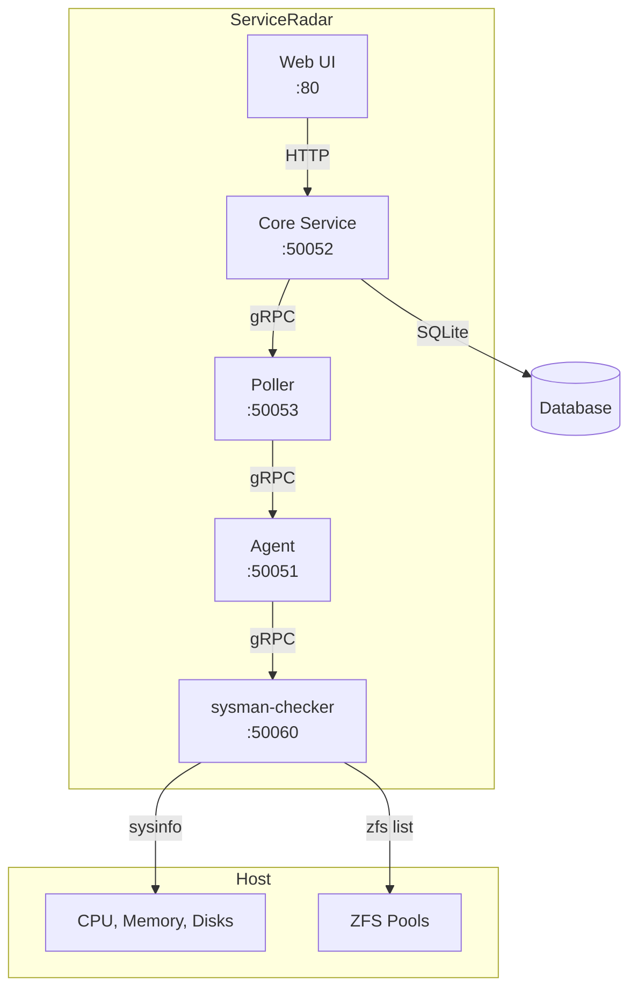

# Product Requirements Document: ServiceRadar System Monitor Checker

**Document Status**: Draft  
**Author**: [mfreeman]  
**Date**: April 12, 2025  
**Version**: 1.0

## 1. Introduction

### 1.1 Purpose
This PRD outlines the requirements for a new ServiceRadar plugin, `serviceradar-sysman-checker`, to monitor system resources (filesystem usage, CPU, and memory) on Linux hosts, with a focus on ZFS pools for Proxmox users. The plugin integrates with ServiceRadar's gRPC-based architecture, collecting metrics for storage in SQLite and visualization in the web UI with 6, 12, and 24-hour charting windows. It addresses scalability for up to 100,000 collectors while optimizing storage and resource usage.

### 1.2 Scope
The plugin will:
- Collect filesystem usage (used, total bytes) for ZFS pools/datasets and other filesystems (e.g., ext4).
- Collect CPU usage percentages per core.
- Collect memory usage (used, total bytes).
- Send metrics via gRPC to the ServiceRadar core for SQLite storage.
- Support Linux hosts (primary) with potential Windows expansion.
- Optimize for low storage (~24 GB/day for 100,000 hosts) and minimal agent resource usage.

### 1.3 Background
ServiceRadar is a distributed monitoring system with agents, pollers, a core service, and a web UI. The existing checker plugins demonstrate a Rust-based, gRPC-driven approach for various monitoring needs. Prior discussions highlighted:
- Preference for `sysinfo` for system metrics, supplemented by native ZFS libraries (`libzetta`) for reliable ZFS pool monitoring.
- Avoidance of raw CPU ticks to save storage and reduce data overhead.
- 30-second polling with no in-memory arrays for scalability.
- Data pruning (24-hour retention, hourly aggregates) to manage storage growth.
- SQLite sharding for large-scale deployments supporting up to 100,000 hosts.

## 2. Goals and Objectives

### 2.1 Goals
- Enable Proxmox users to monitor ZFS pool/dataset usage alongside general filesystems.
- Provide CPU and memory metrics for holistic system health.
- Ensure scalability to 100,000 collectors without database overload.
- Minimize agent resource usage (CPU, memory, disk).
- Support flexible 6, 12, 24-hour charting in the web UI.

### 2.2 Objectives
- Collect metrics every 30 seconds, sending ~80 bytes/host/batch.
- Achieve ~24 GB/day storage for 100,000 hosts with pruning.
- Use Rust libraries (`sysinfo`, `execute`, `serde`) for reliability.
- Integrate seamlessly with ServiceRadar's gRPC and SQLite architecture.
- Allow configuration via JSON, similar to other ServiceRadar checkers.

## 3. Requirements

### 3.1 Functional Requirements

#### 3.1.1 Metric Collection
- **Filesystem Usage**:
  - Collect `used_bytes` and `total_bytes` for mounted filesystems (ext4, etc.) using `sysinfo::Disks`.
  - Collect ZFS pool/dataset stats (used, available bytes) using `libzetta` crate for direct programmatic access.
  - Support Proxmox ZFS setups (e.g., `rpool`, `rpool/ROOT/pve-1`) through native ZFS library access.
- **CPU Usage**:
  - Collect usage percentages per core using `sysinfo::System::refresh_cpu()` and `Cpu::cpu_usage()`.
  - Do not collect raw ticks to save storage.
- **Memory Usage**:
  - Collect `used_bytes` and `total_bytes` using `sysinfo::System::used_memory()`, `total_memory()`.
- **Frequency**: Collect one sample every 30 seconds, triggered by poller request (no in-memory buffering).

#### 3.1.2 gRPC Integration
- Expose a gRPC service on `:50060` (configurable) for the ServiceRadar agent to query.
- Implement `AgentService::GetStatus` (per `monitoring.proto`) to return metrics in JSON format.
- Send metrics in a `MetricSample` message:
  ```protobuf
  message MetricSample {
      int64 timestamp = 1;
      string host_id = 2;
      message Cpu {
          int32 core_id = 1;
          float usage_percent = 2;
      }
      message Disk {
          string mount_point = 1;
          uint64 used_bytes = 2;
          uint64 total_bytes = 3;
      }
      message Memory {
          uint64 used_bytes = 1;
          uint64 total_bytes = 2;
      }
      repeated Cpu cpus = 3;
      repeated Disk disks = 4;
      Memory memory = 5;
  }
  ```
- Support `StatusRequest` with `service_name` (e.g., `sysman`) and `details` (e.g., `localhost:50060`).

#### 3.1.3 Configuration
- Load settings from `/etc/serviceradar/checkers/sysman.json`:
  ```json
  {
      "listen_addr": "0.0.0.0:50060",
      "security": {
          "tls_enabled": false,
          "cert_file": null,
          "key_file": null,
          "ca_file": null
      },
      "poll_interval": 30,
      "zfs": {
          "enabled": true,
          "pools": ["rpool"],
          "include_datasets": true,
          "use_libzetta": true
      },
      "filesystems": [
          {
              "name": "/mnt/data",
              "type": "ext4",
              "monitor": true
          }
      ]
  }
  ```
- Validate config (non-empty `listen_addr`, valid `poll_interval` ≥ 10 seconds).
- Allow optional TLS (cert, key, CA files) for mTLS, mirroring existing checker implementations.

#### 3.1.4 Agent Integration
- Register with ServiceRadar agent via `/etc/serviceradar/poller.json`:
  ```json
  {
      "agents": {
          "local-agent": {
              "address": "localhost:50051",
              "checks": [
                  {
                      "service_type": "grpc",
                      "service_name": "sysman",
                      "details": "localhost:50060"
                  }
              ]
          }
      }
  }
  ```
- Add ZFS-specific configuration during installation if ZFS pools are detected:
  ```json
  "filesystems": [
      {
          "name": "rpool",
          "type": "zfs",
          "monitor_pool": true,
          "datasets": ["ROOT/pve-1", "data/vm-storage"]
      }
  ]
  ```
- Return JSON metrics in `StatusResponse.message`, e.g.:
  ```json
  {
      "timestamp": "2025-04-12T12:00:00Z",
      "cpus": [
          {"core_id": 0, "usage_percent": 42.5},
          {"core_id": 1, "usage_percent": 33.2}
      ],
      "disks": [
          {"mount_point": "rpool", "used_bytes": 4940000000, "total_bytes": 7680000000000},
          {"mount_point": "/mnt/data", "used_bytes": 1000000000, "total_bytes": 2000000000}
      ],
      "memory": {
          "used_bytes": 8000000000,
          "total_bytes": 16000000000
      }
  }
  ```

#### 3.1.5 SQLite Storage
- Core service stores metrics in SQLite tables:
  ```sql
  CREATE TABLE cpu_metrics (
      id INTEGER PRIMARY KEY,
      host_id TEXT,
      timestamp INTEGER, -- Unix ms
      core_id INTEGER,
      usage_percent REAL
  );
  CREATE TABLE disk_metrics (
      id INTEGER PRIMARY KEY,
      host_id TEXT,
      timestamp INTEGER,
      mount_point TEXT,
      used_bytes INTEGER,
      total_bytes INTEGER
  );
  CREATE TABLE memory_metrics (
      id INTEGER PRIMARY KEY,
      host_id TEXT,
      timestamp INTEGER,
      used_bytes INTEGER,
      total_bytes INTEGER
  );
  ```
- Index `host_id` and `timestamp` for fast queries.
- Estimated storage: ~80 bytes/batch (16 bytes CPU, 32 bytes disk, 16 bytes ZFS, 16 bytes memory).

#### 3.1.6 Web UI Charting
- Support 6, 12, 24-hour windows with:
  - CPU: Line chart of `usage_percent` per core (720, 1,440, 2,880 points).
  - Disk: Bar/area chart of `used_bytes` vs. `total_bytes` or `used_percent` (computed as `used_bytes / total_bytes * 100`).
  - Memory: Line chart of `used_bytes` vs. `total_bytes`.
- API queries:
  - CPU: `SELECT timestamp, usage_percent FROM cpu_metrics WHERE host_id = ? AND core_id = ? AND timestamp BETWEEN ? AND ?`.
  - Disk: `SELECT timestamp, used_bytes, total_bytes FROM disk_metrics WHERE host_id = ? AND mount_point = ?`.
- Downsample for display (e.g., 1-minute bins = 360 points for 6 hours).

### 3.2 Non-Functional Requirements

#### 3.2.1 Scalability
- Support 100,000 collectors:
  - Storage: ~0.96 GB/hour, ~23 GB/day for 24-hour retention.
  - Network: ~80 MB/s gRPC traffic (compressed).
- Shard SQLite by `host_id` (e.g., 10,000 hosts/DB = ~2.4 GB/day/DB).
- Optional queue (e.g., NATS JetStream) for write buffering.

#### 3.2.2 Storage Optimization
- Store percentages (CPU) and bytes (disk, memory), not ticks.
- Sample every 30 seconds (1 sample/batch).
- Prune data after 24 hours, storing hourly aggregates:
  ```sql
  CREATE TABLE cpu_metrics_hourly (
      host_id TEXT,
      timestamp INTEGER, -- Start of hour
      core_id INTEGER,
      avg_usage_percent REAL
  );
  ```
- Aggregates: ~0.2 GB/day for 100,000 hosts.
- Total: ~24 GB/day.

#### 3.2.3 Performance
- Agent CPU usage: <1% on a 4-core Proxmox host during collection.
- Memory usage: <1 MB (transient buffers only, no arrays).
- gRPC latency: <100 ms per batch for 99th percentile.

#### 3.2.4 Reliability
- Handle `sysinfo` failures (e.g., disk unmounted) with fallback to last known value.
- Retry `zfs list` up to 3 times on error.
- Log errors (e.g., `log::error`) without crashing.

#### 3.2.5 Security
- Support mTLS (optional, per config).
- Run as non-root user (`serviceradar`) with systemd.
- Restrict gRPC port (e.g., `:50060`) via firewall (e.g., `ufw allow from <agent-ip>`).

### 3.3 Technical Requirements

#### 3.3.1 Libraries
- **Rust Crates**:
  - `sysinfo` (~5K downloads/month): CPU percentages, standard filesystem metrics, memory bytes.
  - `libzetta` (~500 downloads/month): Native ZFS pool and dataset access.
  - `serde` (~15M downloads/month): JSON configuration parsing and serialization.
  - `tonic` (~0.9): gRPC server implementation.
  - `tokio` (~1.44, full): Async runtime for non-blocking operations.
  - `log`, `env_logger`: Standardized logging framework.
  - `anyhow`: Error handling and propagation.
  - `clap` (~2.33): Command line argument parsing.
- **Build**:
  - `tonic-build` (~0.9): Compile `.proto` files.
- **System Dependencies**:
  - `libzfs_core`: C library required by `libzetta` (typically pre-installed on ZFS-enabled systems).

#### 3.3.2 Protobuf Definitions
- Extend `monitoring.proto` (or create `sysman.proto`):
  ```protobuf
  syntax = "proto3";
  package sysman;
  import "monitoring.proto";
  service SysManService {
      rpc GetStatus(monitoring.StatusRequest) returns (monitoring.StatusResponse) {}
  }
  ```
- Reuse `monitoring.StatusResponse` with JSON metrics.

#### 3.3.3 Architecture
- **Similar to existing checkers**:
  - gRPC server (`SysManService`).
  - JSON config parsing (`config.rs`) with validation.
  - Async poller (`poller.rs`) to collect metrics on demand.
  - Systemd service (`serviceradar-sysman-checker.service`).
- **Differences**:
  - No periodic tests (metrics collected on poller request).
  - Simpler data model (percentages, bytes vs. test results).
  - Higher scale (100,000 vs. fewer hosts).

#### 3.3.4 Directory Structure
```
serviceradar-sysman-checker/
├── Cargo.toml
├── build.rs
├── src/
│   ├── main.rs
│   ├── config.rs
│   ├── poller.rs
│   ├── server.rs
│   ├── lib.rs
│   ├── proto/
│   │   ├── monitoring.proto
│   │   ├── sysman.proto
├── README.md
```

### 3.4 Constraints
- Linux focus (Windows later, using `sysinfo`'s cross-platform support).
- SQLite storage (no immediate time-series DB unless sharding fails).
- No in-memory arrays to minimize agent memory usage.
- `libzfs_core` system libraries required for ZFS pool monitoring.

## 4. User Stories

1. **As a Proxmox admin**, I want to see ZFS pool usage (`rpool`, `rpool/data`) in 6, 12, 24-hour charts, so I can plan storage upgrades.
2. **As a sysadmin**, I want CPU and memory metrics per host, so I can identify performance bottlenecks.
3. **As a ServiceRadar operator**, I want the plugin to handle 100,000 hosts without crashing SQLite, so monitoring scales with my infrastructure.
4. **As a developer**, I want JSON configuration and gRPC integration, so the plugin feels native to ServiceRadar.
5. **As a security officer**, I want optional mTLS and non-root execution, so the plugin is secure by default.

## 5. Success Metrics

- **Storage**: ≤25 GB/day for 100,000 hosts with 24-hour retention.
- **Performance**: Agent CPU <1%, memory <1 MB on 4-core Proxmox host.
- **ZFS Integration**: Successfully collect metrics from all ZFS pools and datasets without using external commands.
- **Reliability**: 99.9% metric delivery rate (excluding network failures).
- **Charting**: 6, 12, 24-hour charts render in <2 seconds with 720-2,880 points.
- **Adoption**: Deployed on 1,000 Proxmox hosts within 3 months.

## 6. Assumptions

- Hosts have `zfs` binary for ZFS stats.
- ServiceRadar agent runs on each monitored host.
- SQLite sharding or queuing is feasible for scale.
- 30-second polling suffices for charting granularity.
- Users prioritize Proxmox ZFS over other filesystems.

## 7. Risks and Mitigations

- **Risk**: SQLite bottlenecks at 100,000 hosts.
  - **Mitigation**: Shard by `host_id`, test with 10,000 hosts/DB. Explore Kafka or InfluxDB if needed.
- **Risk**: `libzetta` API changes in future ZFS versions.
  - **Mitigation**: Focus on stable zpool APIs, implement fallback to `sysinfo` for mounted datasets if ZFS library access fails.
- **Risk**: `libzfs_core` dependency availability issues on some systems.
  - **Mitigation**: Verify installation state on major Proxmox versions, provide installation instructions, auto-detect presence and gracefully handle missing dependency.
- **Risk**: Agent resource usage spikes on low-end hosts.
  - **Mitigation**: Test on 1 GB RAM Proxmox VMs, cap `sysinfo` refresh scope.
- **Risk**: Elevated privileges required for ZFS access.
  - **Mitigation**: Document minimal required permissions, implement privilege dropping, consider optional `sudo` configuration.
- **Risk**: Charting needs finer granularity (<30 seconds).
  - **Mitigation**: Validate with users; allow 10-second polling as config option if required.

## 8. Implementation Plan

### 8.1 Milestones
1. **Prototype (2 weeks)**:
  - Build agent with `sysinfo` (CPU, disk, memory) and `execute` (ZFS).
  - Implement gRPC `GetStatus` returning JSON metrics.
  - Test on single Proxmox host.
2. **Alpha (4 weeks)**:
  - Add config parsing, systemd integration.
  - Store metrics in SQLite via core service.
  - Render 6-hour charts in web UI.
  - Test with 10 hosts.
3. **Beta (4 weeks)**:
  - Optimize storage (pruning, aggregates).
  - Implement sharding for 1,000 hosts.
  - Support 12, 24-hour charts.
  - Test with 100 hosts.
4. **Release (2 weeks)**:
  - Finalize security (mTLS, non-root).
  - Package as `.deb`/`.rpm`.
  - Deploy to 1,000 hosts.
  - Document in ServiceRadar guides.

### 8.2 Dependencies
- Rust 1.56+.
- `libzfs_core` and related ZFS libraries on Proxmox hosts.
- ServiceRadar agent, poller, core (existing).
- SQLite 3.x in core service.

## 9. Testing Plan

- **Unit Tests**:
  - Config validation (empty `listen_addr`, invalid `poll_interval`).
  - ZFS metric collection (`libzetta` integration, handle missing pools).
  - gRPC response formatting.
- **Integration Tests**:
  - Agent-to-core metric flow with mock poller.
  - SQLite storage and pruning.
  - Web UI chart rendering.
- **Scale Tests**:
  - Simulate 1,000 hosts (~96 MB/hour) for storage and latency.
  - Stress test SQLite with 10,000 hosts/DB.
- **Proxmox Tests**:
  - Verify ZFS pool/dataset metrics (`rpool`, `rpool/data`).
  - Check CPU/memory on 4-core, 4 GB RAM host.
  - Test permission requirements for accessing ZFS pools.

## 10. Documentation

- **README.md**:
  - Installation (`deb`/`rpm`), configuration, prerequisites.
  - System dependencies for ZFS monitoring (`libzfs_core` installation instructions).
  - Example `/etc/serviceradar/checkers/sysman.json`.
  - Firewall rules (e.g., `ufw allow from <agent-ip> to any port 50060`).
  - Permission requirements for ZFS monitoring.
- **ServiceRadar Docs**:
  - Add to "Architecture" and "Installation" pages.
  - Guide: "Monitoring ZFS and System Resources with sysman-checker".
  - Detailed ZFS monitoring section for Proxmox users.
  - Troubleshooting guide for common ZFS library access issues.
- **API Reference**:
  - Document `SysManService` and JSON metric format.
  - Document ZFS pool integration with `libzetta`.

## 11. Appendix

### 11.1 Storage Estimate
- **Per Batch (30 seconds)**:
  - CPU: 4 cores × 4 bytes = 16 bytes.
  - Disk: 2 filesystems × 2 fields × 8 bytes = 32 bytes.
  - ZFS: 1 pool × 2 fields × 8 bytes = 16 bytes.
  - Memory: 2 fields × 8 bytes = 16 bytes.
  - Total: 80 bytes.
- **Per Host**: 80 bytes × 120 batches/hour = 9.6 KB/hour.
- **100,000 Hosts**:
  - Hourly: 0.96 GB.
  - Daily: 23 GB (24 hours).
  - Aggregates: 0.2 GB/day.
  - Total: ~24 GB/day.

### 11.2 Architecture Diagram

