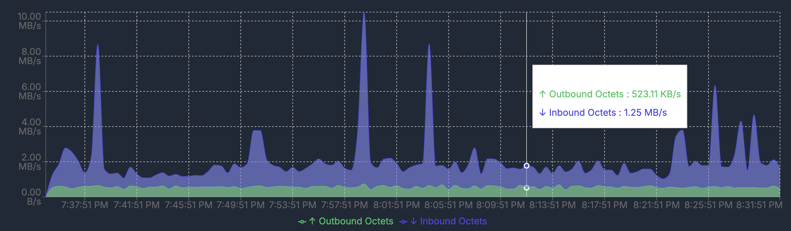
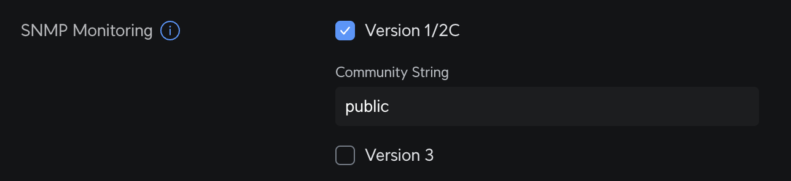

Network monitoring doesn't have to be complicated—especially when you're managing devices like the Ubiquiti UniFi Dream Machine Pro (UDM-Pro). With ServiceRadar's SNMP Poller feature, you can easily keep tabs on your router's performance, like tracking bandwidth on your primary WAN interface, without breaking a sweat. In this post, we'll walk you through enabling SNMP on your UDM-Pro, finding the right OID for your WAN interface using a handy open-source tool, and setting it up in ServiceRadar. Whether you're a seasoned network admin or just getting started, this guide will show you how simple it can be to gain real-time visibility into your network.

Let's dive in and see how ServiceRadar makes monitoring your Ubiquiti gear a breeze!

<!-- truncate -->

## Why Monitor Your UDM-Pro with SNMP?

The Ubiquiti UniFi Dream Machine Pro is a powerful all-in-one router and network management device, popular for its sleek interface and robust feature set. But while the UniFi dashboard gives you a great overview, it doesn't always provide the granular, real-time data you might need—like detailed WAN interface stats for troubleshooting or capacity planning. That's where SNMP (Simple Network Management Protocol) comes in, and ServiceRadar's SNMP Poller takes it to the next level.



With ServiceRadar, you can:
- Track interface metrics like inbound/outbound octets (bandwidth usage) on your WAN port.
- Set up alerts for anomalies, like sudden traffic spikes or drops. (Planned)
- Integrate UDM-Pro data into a broader monitoring ecosystem alongside servers, services, and other network gear.

Best of all? ServiceRadar's distributed architecture means this data is collected securely and efficiently, even in remote or constrained environments. Let's get started.

## Step 1: Enable SNMP on Your Ubiquiti Dream Machine Pro

1. **Log in to Your UDM-Pro**:
   - Access the UniFi Network Management Controller via your browser (typically at `https://<UDM-Pro-IP>`)
   - Sign in with your administrator credentials

2. **Navigate to SNMP Settings**:
   - Click on **Network** in the top navigation bar
   - Go to **Settings** (gear icon in the left sidebar)
   - Select **System**
   - Click on the **Traffic Logging** tab

3. **Enable SNMP Monitoring**:
   - Scroll down to the "SNMP Monitoring" section
   - Check the box for **Version 1/2C**
   - Enter your desired **Community String** (the example shows "public" but you should use something more secure for production)



## Step 2: Find the WAN Interface OID with an SNMP Walk

SNMP uses Object Identifiers (OIDs) to pinpoint specific metrics—like the number of bytes flowing through your WAN interface. For the UDM-Pro, the primary WAN port is typically `eth8` or `eth9` (depending on your setup), and we'll use an open-source tool called `snmpwalk` to find its OID.

### Install snmpwalk

On a Linux system (Ubuntu/Debian):

```bash
sudo apt update
sudo apt install -y snmp snmp-mibs-downloader
```

On macOS (using Homebrew):

```bash
brew install net-snmp
```

### Run an SNMP Walk
* Use snmpwalk to query the UDM-Pro's interface table:
```bash
snmpwalk -v2c -c <your-community-string> <UDM-Pro-IP> .1.3.6.1.2.1.2.2
```

* This OID (ifTable) lists all network interfaces. Look for the WAN interface by matching the description or index:

```
IF-MIB::ifInOctets.1 = Counter32: 2973357339
IF-MIB::ifInOctets.2 = Counter32: 0
IF-MIB::ifInOctets.3 = Counter32: 0
IF-MIB::ifInOctets.4 = Counter32: 765010189
IF-MIB::ifInOctets.5 = Counter32: 3983110857
IF-MIB::ifInOctets.6 = Counter32: 0
```

* If eth8 or eth9 is your WAN port (check your UniFi config), note its index (e.g., 8 or 9).

## Get the OIDs for Traffic Monitoring

### Inbound Octets (Download)
* The OID for inbound octets is `.1.3.6.1.2.1.2.2.1.10.<index>`. So, if your WAN is eth4 (index 4):
   * OID = `.1.3.6.1.2.1.2.2.1.10.4`
* Test it:
  ```bash
  snmpget -v2c -c public 192.168.1.1 .1.3.6.1.2.1.2.2.1.10.4
  ```
  Should return something like:
  ```
  IF-MIB::ifInOctets.4 = Counter32: 826260892
  ```

### Outbound Octets (Upload)
* The OID for outbound octets is `.1.3.6.1.2.1.2.2.1.16.<index>`. Using the same example:
   * OID = `.1.3.6.1.2.1.2.2.1.16.4`
* Test it:
  ```bash
  snmpget -v2c -c public 192.168.1.1 .1.3.6.1.2.1.2.2.1.16.4
  ```
  Should return something like:
  ```
  IF-MIB::ifOutOctets.4 = Counter32: 198726543
  ```

**Pro Tip:** If you're unsure which interface is your WAN, compare ifInOctets and ifOutOctets values over time (snmpget twice with a delay) to spot the active one. The interface with changing values is likely your active WAN.

## Step 3: Configure ServiceRadar's SNMP Poller

Now that SNMP is enabled and you've got your OIDs, let's plug them into ServiceRadar. The SNMP Checker runs alongside the Agent and polls your UDM-Pro for you.

## Install the SNMP Checker

If you haven't already:

```bash
curl -LO https://github.com/carverauto/serviceradar/releases/download/1.0.33/serviceradar-snmp-checker_1.0.33.deb
sudo dpkg -i serviceradar-snmp-checker_1.0.33.deb
```

## Edit the Configuration

Update `/etc/serviceradar/checkers/snmp.json`:

```json
{
  "node_address": "localhost:50051",
  "listen_addr": ":50054",
  "security": {
    "mode": "none",
    "role": "checker",
    "cert_dir": "/etc/serviceradar/certs"
  },
  "timeout": "30s",
  "targets": [
    {
      "name": "udm-pro-wan",
      "host": "<UDM-Pro-IP>",
      "port": 161,
      "community": "<your-community-string>",
      "version": "v2c",
      "interval": "30s",
      "retries": 2,
      "oids": [
        {
          "oid": ".1.3.6.1.2.1.2.2.1.10.4",
          "name": "ifInOctets_4",
          "type": "counter",
          "scale": 1.0,
          "delta": true
        },
        {
           "oid": ".1.3.6.1.2.1.2.2.1.16.4",
           "name": "ifOutOctets_4",
           "type": "counter",
           "scale": 1.0,
           "delta": true  
        }
      ]
    }
  ]
}
```

* Replace \<UDM-Pro-IP\> and \<your-community-string\> with your values.
* Adjust the OID if your WAN index differs.

## Restart and Verify

```bash
sudo systemctl restart serviceradar-snmp-checker
sudo systemctl status serviceradar-snmp-checker
```

## Step 4: See It in Action

With everything set up, your ServiceRadar dashboard (at http://\<your-server-ip\>/) will start showing WAN bandwidth data from your UDM-Pro. The Core Service aggregates this info from the Poller, which queries the Agent and SNMP Checker—delivering a clean, real-time view of your network.

## Why ServiceRadar Shines Here

This setup showcases what makes ServiceRadar special:

* **Ease of Use**: No complex scripting—just a JSON config and you're monitoring.
* **Flexibility**: Add more OIDs or devices as needed, from routers to switches.
* **Security**: Pair it with mTLS (see our TLS Security guide) for end-to-end encryption.
* **Scalability**: Monitor one UDM-Pro or a whole fleet—it's up to you.