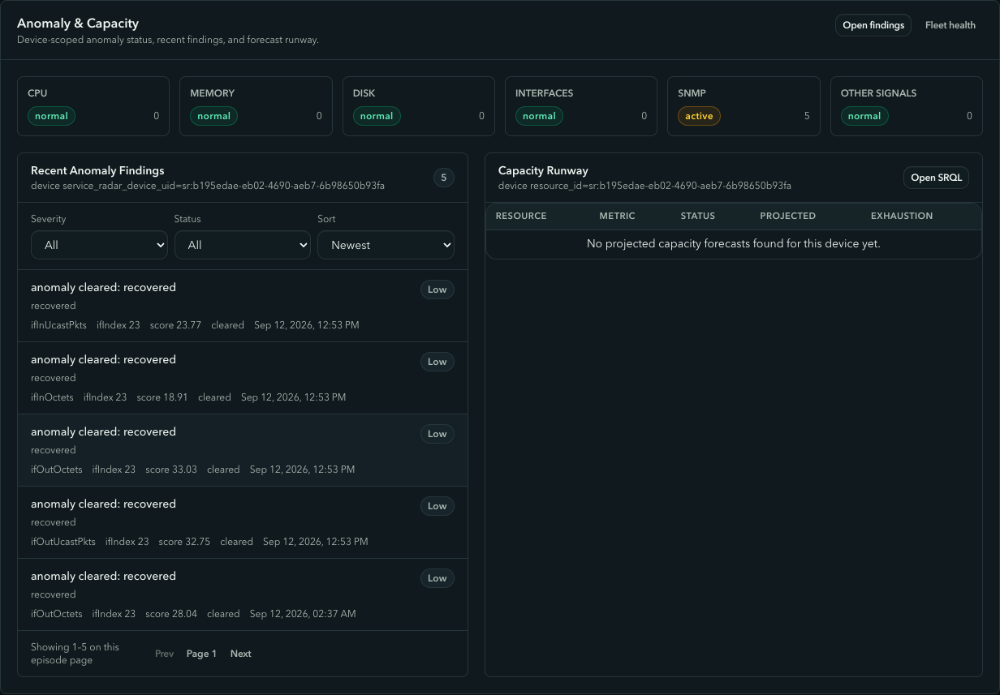
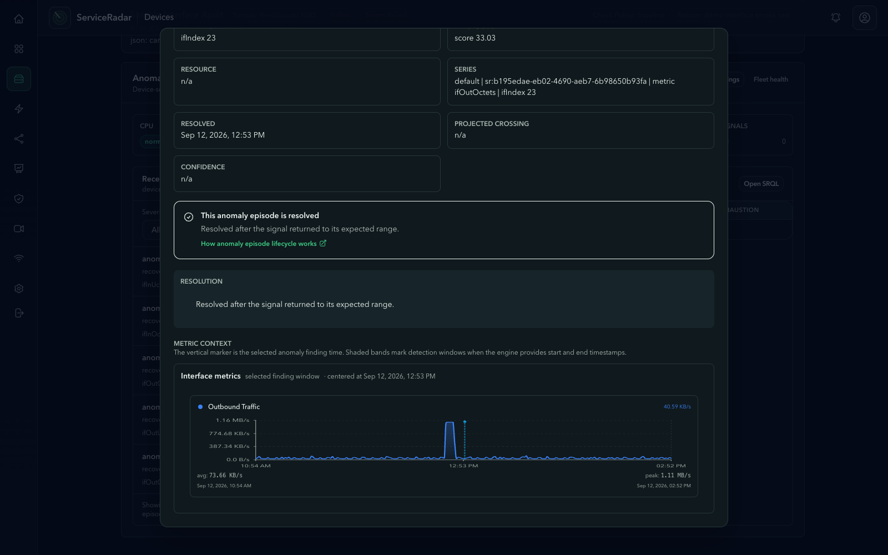
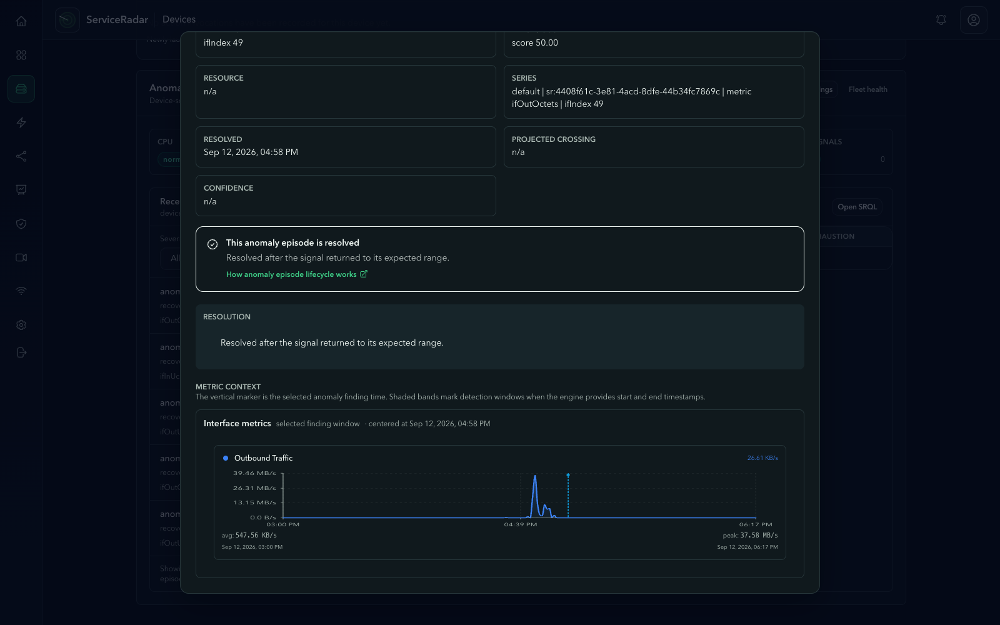
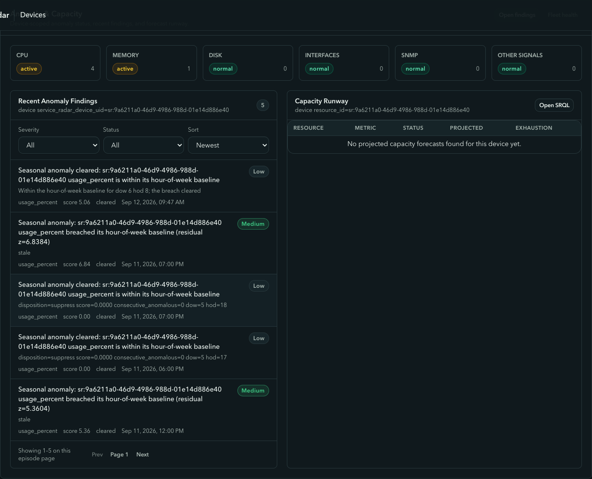
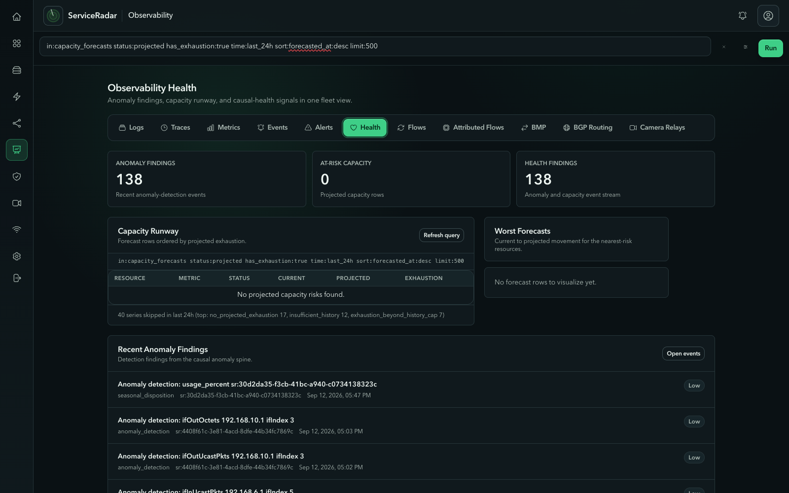
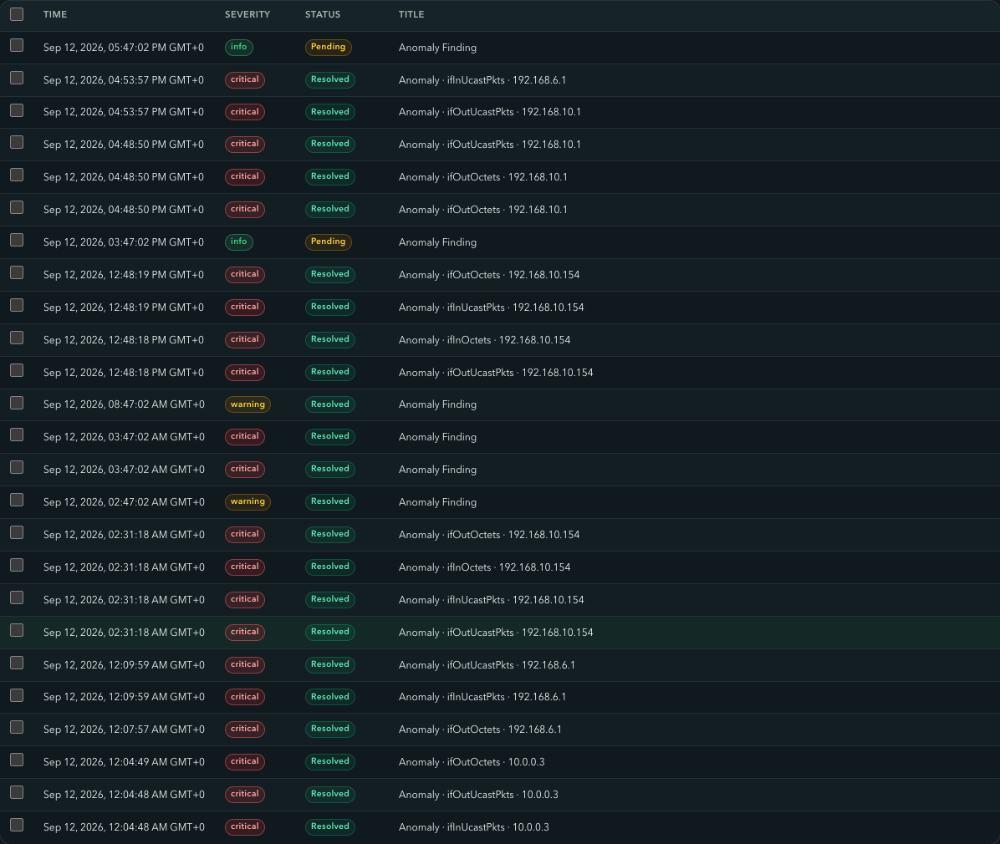

An anomaly detector that nobody trusts is worse than no detector at all. It
trains people to ignore a whole class of alert, and the one real event of the
month lands in the same pile as the noise. Two weeks ago our own engine was in
that state: one router produced most of the fleet's anomaly alerts every day,
every seasonal finding was closed as "stale" before anyone looked at it, and
the capacity page listed forecast rows from June. This post is about what the
engine looks like now that the causes are fixed, told through three findings
from one Saturday on our demo fleet. Every number in it can be checked against
the raw counters.

<!-- truncate -->

## The shape of a finding

ServiceRadar detects anomalies at the edge. The agent runs the anomaly add-on,
which scores every metric series it collects with the
`serviceradar-anomaly-core` crate, built on
[DeepCausality](https://deepcausality.com). Each series gets a small
stateful detector:

- a **rolling robust z-score** against a 300-sample window, using the median
  and median absolute deviation so one spike does not poison the baseline;
- a **seasonal z-score** against an hour-of-week baseline that core computes
  from the hourly rollups and delivers to the agent, so Monday 09:00 is
  compared with other Monday 09:00s;
- a **CUSUM drift** signal for slow, sustained shifts;
- a **burst envelope** that learns the shape of a series' own periodic bursts,
  so a counter that surges every twenty minutes is not "anomalous" twenty
  times a day.

A breach on consecutive slots opens an **episode**. The episode stays open
while the series is breaching, clears when every ready signal is clean again,
and each transition is published as an OCSF finding that carries its evidence:
the value, every signal's mean, spread, score and sample count, and a
one-sentence reason. That evidence is what makes a finding checkable. Here is
the clear event from the first example below, abridged:

```json
{
  "state": "anomaly_clear",
  "value": 37037.88,
  "reason": "all ready signals are clean; consecutive anomalous slots reset",
  "signals": [
    {"name": "rolling",  "mean": 39374.17, "stddev": 4122.93, "score": 0.07,
     "reason": "rolling z-score 0.071 is below 3.000", "sample_count": 300},
    {"name": "seasonal", "mean": 19849.87, "stddev": 1115.85, "score": 0.52,
     "reason": "seasonal z-score 0.525 is below 3.000", "sample_count": 32}
  ],
  "episode_peak_value": 1108392.05,
  "clear_reason": "recovered",
  "producer_version": "0.3.7"
}
```

Read it as a sentence: the port normally pushes about 39 KB/s, it peaked at
1.1 MB/s during the episode, it is back to 37 KB/s, and both the rolling and
the seasonal view agree that is normal.

## Finding one: a switch port doing 25x its usual rate

At 12:43 UTC the access switch `aruba-24g-02` opened four episodes at once,
all on port 23: inbound and outbound octets, inbound and outbound packets.



Opening the outbound octets finding shows the metric context the engine used.
The chart is the interface's own outbound rate with the finding window marked:
a flat 40 KB/s, a five-minute plateau at 1.1 MB/s, and a return to 40 KB/s.



All four episodes cleared as `recovered` at 12:53, when the rate had been back
at its baseline long enough for the rolling z-score to fall below 3. The four
alerts they raised resolved in the same minute, without anyone touching them.
The raw `ifOutOctets` counter agrees to the byte: it advanced about 66 MB in
each of the five minutes from 12:43 to 12:47 and 2 to 4 MB per minute before
and after. The same port did the same thing at 02:26 that morning, so
something behind it moves roughly 330 MB twice a day. That is the kind of
finding an operator can look at, nod, and decide whether they care about.

## Finding two: the router, and what it did not report

At 16:44 UTC the edge router `tonka01` moved about 2 GB per minute out of two
interfaces for eight minutes, with the inbound side of the transfer visible on
a third. Five episodes opened, five alerts fired, and all of them cleared and
resolved by 17:03 when the transfer ended.



The more important part of this story is what the router did **not** report.
Interface 4 on this device carries a burst of roughly 700 KB/s for a few
minutes every twenty minutes, against a rolling median near 14 KB/s. Two weeks
ago that pattern produced about twenty episodes per day per counter and 148 of
the fleet's 206 anomaly alerts in one 24-hour window. Since the add-on update
it has produced zero episodes, while a real multi-interface event on the same
device still got through.

That is the burst envelope at work. When a series first breaches, the envelope
freezes its history at the start of the run and asks a simple question: is
this burst inside the envelope of the bursts this series has already produced?
A surge that matches the series' own recent behaviour is not news. A surge
that does not, like a 37 MB/s transfer on a link that usually idles, is. The
freeze matters: without it a sustained surge would train the envelope on
itself after a few minutes and clear as "recovered" instead of staying open.

## Finding three: the job that did not run

The third finding is a different kind. `k8s-cp3-worker1` is a Kubernetes node
whose 07:00 UTC hour has carried a job that pushes CPU to between 70 and 100
percent every day for the last five weeks. On this Saturday the same hour
peaked at 5 percent.

| Day | Weekday | Avg CPU 07:00 UTC | Peak CPU 07:00 UTC |
|-----|---------|-------------------|--------------------|
| 2026-09-05 | Sat | 26.0 % | 100.0 % |
| 2026-09-06 | Sun | 13.2 % | 74.9 % |
| 2026-09-07 | Mon | 11.2 % | 56.3 % |
| 2026-09-08 | Tue | 2.5 % | 31.3 % |
| 2026-09-09 | Wed | 5.0 % | 99.9 % |
| 2026-09-11 | Fri | 10.2 % | 95.9 % |
| **2026-09-12** | **Sat** | **1.5 %** | **5.1 %** |

A rolling z-score cannot see this: nothing spiked, the hour was quiet. The
hour-of-week baseline can. The seasonal worker in core compares each hourly
bucket with the median and MAD of the same weekday and hour over the
baseline window, and it opened an episode at 08:47 with a score of 5.06. When
the next hour matched its baseline it cleared, with a reason a person can
read.



Absence of expected load is one of the most useful things a monitoring system
can notice and one of the hardest to threshold by hand. It is also exactly the
kind of finding the old code lost, which brings us to what was broken.

## What we fixed

The three findings above work because four defects were fixed in v1.4.60
through v1.4.62. None of them were tuning problems.

1. **Seasonal baselines were never delivered.** The producer that builds
   hour-of-week baselines batched every host into one SRQL statement, which
   hit the database's 30-second statement timeout on every run for two
   months. One failed source aborted delivery for all sources, so the edge
   never received a baseline for anything and reported "no baselines
   configured" on every finding. Baselines are now built per device, a
   failed source no longer blocks the others, and the producer records a
   health heartbeat that a seeded alert rule watches.
2. **A delivered baseline could not suppress a periodic burst.** The detector
   breached on any single signal, so a seasonal view that said "this is
   normal for this hour" changed nothing. The burst envelope is that missing
   veto.
3. **Every central seasonal episode was closed as stale.** Verdicts were
   stamped with the end of the hourly bucket they evaluated rather than the
   time of evaluation, so the stale-close sweeper retired each episode
   before the next hourly run, and the next run inserted a phantom
   zero-length "cleared" episode. Seven days of history contained 697
   episodes, none of which had cleared for a real reason. Verdicts now carry
   their evaluation time, the sweeper knows each detector's cadence, and the
   UI shows the reason sentence instead of the raw disposition string.
4. **Capacity forecasting hid the one disk that mattered.** The runway page
   had no time bound, so June's rows sorted first, and the forecaster
   dropped any crossing further out than twice the observed history without
   saying why. The page now shows the newest forecast per resource from the
   last 24 hours, and a series whose trend crosses the threshold beyond what
   its history supports is recorded as `exhaustion_beyond_history_cap` with
   the projected date, distinct from "no crossing".

The last item explains a page that can look wrong at first glance.

## Why the capacity page is empty



"No projected capacity risks found" is the correct answer for this fleet. The
17:41 run evaluated 40 series: 17 show no crossing at all, 12 have less than
a day of history, 4 are flat, and 7 have a real upward trend whose crossing is
further out than twice their history. Six of those seven cross in 2027 or
2028. The seventh is an agent's checker volume with 25 days of history and a
projected crossing of the 80 percent line on 2026-11-11. The forecaster will
put it on the runway table once its history covers half the distance to the
crossing, around 2026-09-16, and will then show about 55 days of runway.

The gate exists because a linear fit through three days of data will happily
project a crossing in 2031, and a runway table full of 2031 is a runway table
nobody reads. Growth trends that are held back are counted in the skip line
under the table rather than shown as risks. v1.4.62 also forecasts disk usage
per mount point instead of per device, so a data volume filling toward 100
percent is no longer averaged into a flat root filesystem on the same host.

## Alerts you can leave alone



In the six hours after the add-on rollout the whole demo fleet raised twelve
anomaly alerts across three devices. Every one of them, except two seasonal
episodes that were still being evaluated, resolved on its own within 5 to 15
minutes because the episode behind it cleared. The alert follows the episode:
it opens on the open transition, resolves on the clear, and never needs a
human to close it.

The pipeline also watches itself now. The baseline producer, the seasonal
worker and the capacity worker each record a health check, and a seeded rule
raises a critical alert if any of them stops being healthy. The two-month
baseline outage above was visible in the health table the whole time; it just
had no alert attached to it. Now it would page.

## Check it yourself

Everything in this post came out of SRQL queries against the same data the
UI reads. A few to start with:

```text
in:events event_type:(anomaly,anomaly_detection) time:last_24h sort:time:desc limit:50
in:timeseries_metric_interface_hourly device_id:"<device uid>" if_index:23 time:last_7d sort:bucket:asc
in:timeseries_metric_disk_hourly metric_name:"disk.used_percent" device_id:"<device uid>" time:last_30d
in:capacity_forecasts time:last_24h sort:forecasted_at:desc limit:100
```

The detector's design and every tunable are documented in
[Anomaly Detection](/docs/anomaly-detection) and the
[Anomaly Engine](/docs/anomaly-engine) reference. If you run ServiceRadar and
a finding does not match what the counters say, that is a bug, and we want to
hear about it.
