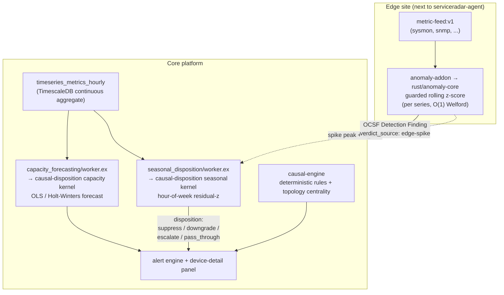
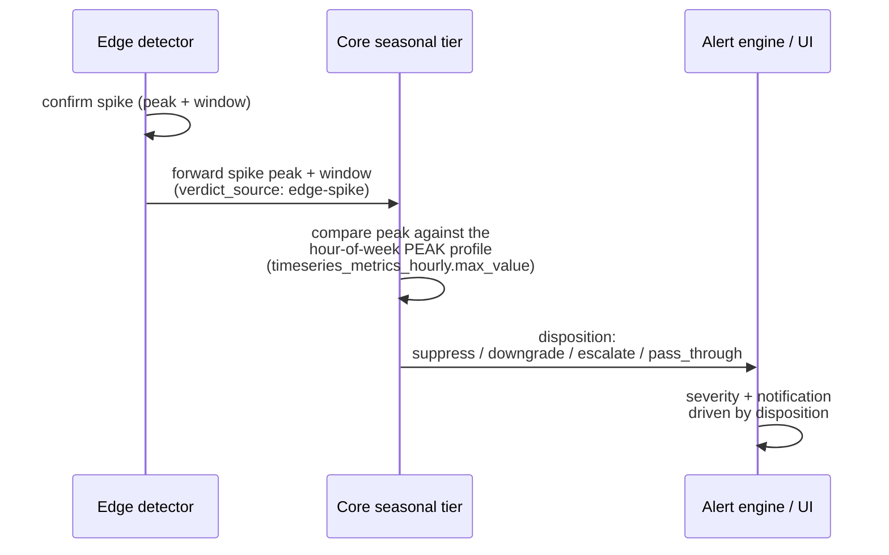

# Anomaly Engine

This is the single source of truth for how ServiceRadar detects metric anomalies
and forecasts capacity, end to end. It documents the **actual** statistics the
engine runs, the data contract it depends on, the honest scope of its naming, and
how to prove every behavioral claim on real code with the proof harness.

:::note What this engine is — and is not
ServiceRadar's anomaly engine is **sound statistics across two tiers plus a
deterministic dependency expert system**. It is **not** causal inference. Parts of
the codebase historically carried "causal" branding (crate names, a
`signal_type: "causal"` field, DeepCausality `CausalFlow` hosting). That branding
is cosmetic and is being renamed honestly. See
[Honest naming: what is and is not causal](#honest-naming-what-is-and-is-not-causal).
:::

## Overview & two-tier architecture

Detection is split across an **edge tier** and a **core tier**, with a
**deterministic dependency expert system** layered on top for topology-aware
reasoning.

1. **Edge spike detector** — runs in the native `anomaly-addon`, co-located with
   `serviceradar-agent`, using the `rust/anomaly-core` detector. A per-series
   guarded rolling z-score that catches short-term spikes with high recall and low
   latency, node-local, before samples are even published upstream.
2. **Core seasonal disposition** — the `rust/causal-disposition` seasonal kernel
   (driven by `seasonal_disposition/worker.ex`). An hour-of-week residual z-score
   that answers *"is this abnormal for a Tuesday 9am?"* — high precision. It
   suppresses recurring patterns (e.g. a nightly backup spike) that the edge tier
   over-alerts on.
3. **Core capacity forecast** — the `rust/causal-disposition` capacity kernel
   (driven by `capacity_forecasting/worker.ex`). A trend forecast (least-squares
   linear or additive Holt-Winters) projecting time-to-exhaustion, with a valid
   prediction interval.
4. **Deterministic dependency expert system** — `rust/causal-engine`. ~13
   hand-coded if-then rules plus ultragraph centrality/reachability over the
   topology graph. Legitimate dependency reasoning — **not** causal inference.



The two detection tiers play complementary roles: the **edge** is fast and
high-recall (catch everything that looks like a spike), and the **core** is
high-precision (decide whether a given spike is actually abnormal *for this hour of
the week*). They are wired into a closed loop where the core **disposes** each edge
finding — see [The disposition loop](#the-disposition-loop).

## Data contract

The detector is **value-agnostic**: it scores whatever number you hand it. That
makes the input contract load-bearing — feeding the wrong shape of data produces
garbage, not anomalies.

### Gauges vs. monotonic counters

- **Gauges** (CPU / memory / disk `used_percent`, and similar bounded or
  free-ranging instantaneous values) are scored **directly**. The current value is
  the quantity of interest.
- **Monotonic counters** (e.g. SNMP `ifHCInOctets`, `ifHCOutOctets`) **MUST be
  rate-normalized to a per-second rate by the caller before scoring**. A raw
  counter only ever increases, so its z-score is meaningless. The proof harness
  makes this concrete: feeding a raw SNMP counter produces **6,956 false alarms**,
  while the same series correctly rate-normalized scores **precision 1.0**.

### Rate normalization (counters)

The caller converts a counter to a rate with `delta / elapsed`, with three salvage
rules so the rate stays sane across real-world counter behavior:

- **32-bit wrap salvage** — when a 32-bit counter rolls over, the negative delta is
  corrected for the wrap instead of being read as a huge negative rate.
- **Reset-anchor drop** — when a counter resets (e.g. device reboot, agent
  restart), the sample is dropped rather than emitting a spurious spike.
- **>2h gap drop** — when the elapsed time between samples exceeds two hours, the
  rate is dropped rather than averaging across a long, uninformative gap.

### The directional saturation gate

Bounded percent gauges (CPU / memory / disk `used_percent`) get a **directional
saturation gate**: only an **upward** excursion that clears an absolute floor can
breach. The default floors are:

| Class | `min_value` floor |
|---|---|
| CPU `used_percent` | 80 |
| Memory `used_percent` | 80 |
| Disk `used_percent` | 85 |

This is why a disk sitting at, say, 40% full does **not** alert even if it wobbles
statistically — there is no operational risk below the floor. The gate is **by
design, not a removal**: disk (and CPU/mem) are still collected and scored; the
gate simply prevents a low, harmless level from ever breaching. The harness proves
this: with the gate off the disk series fires 11 sub-80% false alarms; with the
gate on, those drop to **0** while all 11 genuine >80% fills are still caught.

### Series keying

Every series is keyed by a **canonical `(device, metric_name, if_index)`**. The
same key is used at the edge and in the core so a finding can be matched to its
seasonal profile and to the disposition that judges it. (Key alignment across the
two tiers is a precondition for the disposition loop; a mismatched key silently
no-ops the join.)

## The statistics

### Edge: guarded rolling z-score

The edge detector maintains a **per-series sliding window** and computes the
rolling mean and standard deviation with **Welford's O(1) algorithm**. A sample
breaches when:

```
|(x - mean) / effective_stddev| >= n_sigma
```

On top of that core z-score sit the guard rails that make it trustworthy in
production:

- **Confirm-slot hysteresis** — a breach must persist for `confirm_slots`
  consecutive samples before it is *confirmed*. A single blip does not create a
  finding. (Harness: a single-blip injection is correctly **not** confirmed.)
- **Withhold-breach-from-baseline** — samples that are breaching are **withheld
  from the rolling baseline**, so a sustained surge cannot quietly raise the mean
  and mask itself.
- **Dispersion floors** — an absolute standard-deviation floor and a
  coefficient-of-variation (CV) floor prevent a near-constant series from
  manufacturing huge z-scores out of numerical noise.
- **Directional saturation gate** — as described in the data contract, for bounded
  percent gauges.

Defaults: `n_sigma = 3.0`, `window = 300`, `min_samples = 30`, `confirm_slots = 5`.

On an Open/Clear transition the detector emits an **OCSF Detection Finding**
(`class_uid 2004`) with `verdict_source = edge-spike`.

:::note Roadmap (Phase 2)
The current edge dispersion estimator is **mean/std**, which can self-mask (a very
large spike inflates its own baseline) and is blind to slow drift. Under
`refactor-anomaly-engine-rigor` the edge is being upgraded to a robust
**median/MAD (Hampel)** identifier and a two-sided **CUSUM** drift detector, with
the dispersion floors, saturation gate, and confirm-slot hysteresis **retained**.
This page documents the **current** design; the upgrade is gated behind the proof
harness. The harness already pins the targets: slow drift/leak currently scores
**recall 0/1** (no edge drift detection), which the CUSUM addition closes.
:::

### Core seasonal: hour-of-week residual z-score

The core seasonal tier answers *"is this value abnormal **for this hour of the
week**?"* It builds a **168-bucket profile** (7 days-of-week × 24 hours-of-day) and
scores the latest completed bucket's deseasonalized residual against the historical
profile for that same hour.

- The 168-bucket profile is aggregated **in SQL** by the SRQL `profile_hour_of_week`
  verb over the **`timeseries_metrics_hourly`** TimescaleDB continuous aggregate.
- The kernel **excludes the latest bucket from its own baseline**, so a drift cannot
  self-mask.
- The default robust statistic is **median/MAD** (resistant to outliers in the
  history), and the default `confirm_slots` is **2** (light hysteresis so a single
  off-baseline bucket cannot flip a disposition).

A finding here carries `verdict_source = central-seasonal`. The seasonal worker is
Oban-scheduled and runs against the continuous aggregate, never the raw hot path.
Its defining strength is **suppressing recurring patterns** — e.g. a nightly backup
spike the edge flags every single night (the harness flags it 21/21) is recognized
as normal-for-that-hour and suppressed (z ≈ 0).

### Core capacity: trend forecast with a valid prediction interval

The capacity tier projects **time-to-exhaustion** by fitting a trend over the
hourly continuous aggregates:

- **Least-squares linear** trend, or
- **Additive Holt-Winters** trend (for series with a repeatable seasonal shape and
  enough history).

The forecast surfaces a **valid prediction interval**, not a constant-width band:

- **Linear (OLS):** a closed-form OLS prediction interval whose half-width is
  `t · s · sqrt(1 + 1/n + (x0 - x̄)² / Sxx)`. Critically, this **widens with the
  forecast horizon** — the further out the projection, the wider the band, which is
  exactly what a capacity-planning interval should do.
- **Holt-Winters:** a **residual-bootstrap** prediction interval (resample the
  model's one-step residuals, roll the recursion forward many times, take empirical
  quantiles). This runs off the hot path inside the periodic capacity Oban job, so
  the extra compute is acceptable.

:::caution `confidence` is a coverage level, not a fit-quality probability
The surfaced `confidence` field carries the prediction interval's **nominal
coverage level (0.95)** — the probability the interval is *designed* to contain the
true future value. web-ng labels it **"PI coverage"**. It is **not** a goodness-of-fit
probability and must not be read as "the model is 95% sure exhaustion will happen."
The earlier heuristic `confidence = clamp(1 - rmse/scale)` was removed precisely
because it was being misread that way.
:::

## Honest naming: what is and is not causal

This is the most important section to get right, because the entire point of the
documentation rewrite is to remove a causal-inference overclaim.

**What the engine IS:**

- A **robust statistical spike detector** at the edge (a guarded rolling z-score).
- A **seasonal residual-z disposition** at the core (hour-of-week median/MAD).
- A **trend/forecast capacity model** at the core (OLS / Holt-Winters with a valid
  prediction interval).
- A **deterministic dependency / expert system** (`rust/causal-engine`): ~13
  hand-coded if-then rules plus ultragraph centrality and reachability over the
  topology graph. This is legitimate, useful dependency reasoning.

**What the engine is NOT:**

- It performs **no causal inference**. There is no structural causal model (SCM),
  no do-calculus, no counterfactuals, and no interventions anywhere in the
  detector, the disposition tiers, or the dependency expert system.
- The DeepCausality `CausalFlow` type is used **only as a pipeline / state-machine
  combinator** — it *hosts* the statistics; it does not *perform* causal inference.
- The historical "causal" branding — the OCSF `signal_type: "causal"` stamp, the
  NATS `signals.causal.*` subjects, and crate/module names — is **cosmetic** and is
  being renamed to honest signal naming under `refactor-anomaly-engine-rigor`. The
  `causal-engine` component is kept (the dependency reasoning is real and useful);
  only the *inference* claim and the `causal` label are wrong.

In short: this is **robust statistics + a seasonal/forecast disposition engine + a
deterministic dependency expert system**. Describe it that way.

## The disposition loop

The two detection tiers are wired into a **closed loop**: the core **disposes** each
edge finding rather than emitting a parallel, unrelated verdict.



The key design point is **matched resolution**. The edge fires on a sub-minute
**spike peak**; a naive join against the hourly **mean** would be statistically
unsound (different physical quantities). So:

- The edge **forwards the spike peak and its window** alongside the finding.
- The core builds a **peak profile** from the existing
  `timeseries_metrics_hourly.max_value` column (the per-`(series, hour)` maximum —
  no schema change) and compares **spike-peak against spike-peak history** for that
  hour of the week.
- The disposition is one of **suppress / downgrade / escalate / pass_through**, and
  the alert engine and device-detail panel consume it.
- The seasonal worker emits a verdict for **every** evaluated series, so a finding
  always has a partner to be judged against.
- **Raw edge findings are retained for audit** even when suppressed.

:::note In progress
Loop closure is being delivered under `refactor-anomaly-engine-rigor`. Suppression
ships **report-only** behind a **per-class stability gate**: a class stays in
pass-through (so nothing is hidden) until its own peak profile has enough trustworthy
history to earn suppression. The cardinal error to avoid is a **false-suppress** (it
would hide a real anomaly), so every uncertain path resolves to pass-through or
escalate.
:::

## Operations & tuning knobs

Tuning is intentionally split across two ownership surfaces:

- **Edge spike detector knobs** live in the native `anomaly` add-on
  **profile/assignment params** (delivered next to the agent).
- **Central seasonal / capacity defaults** live in **Settings → Anomaly Detection**.
  These feed the core tiers and do **not** rewrite already-created edge add-on
  assignments.

Changing Anomaly Detection settings requires the `observability.alerts.manage`
permission. The detailed operator workflow — ownership split, metric-class
overrides, rollout/runback, and troubleshooting — lives in
[Anomaly Detection (tuning & operations)](./anomaly-detection.md).

### Edge spike detector

| Knob | Default | Effect |
|---|---|---|
| `n_sigma` | `3.0` | How many standard deviations from the rolling mean before a slot is anomalous. Higher = quieter, may miss small changes. |
| `window` (`window_size`) | `300` | Samples retained for the rolling baseline. Count-based, not wall-clock. Larger = steadier baseline; smaller = adapts faster. |
| `min_samples` | `30` | Clean baseline samples required before any finding may emit. Raise for sparse/new metric classes. |
| `confirm_slots` | `5` | Consecutive anomalous slots required before a finding is confirmed. Raise first for bursty classes (before raising `n_sigma`). |
| Saturation-gate `min_value` | CPU 80 / mem 80 / disk 85 | Floor a bounded percent gauge must clear (upward) before it can breach. |

For noisy or bursty metrics, prefer raising `confirm_slots` before raising
`n_sigma`: that keeps sustained deviations visible while filtering one-off spikes.

### Core seasonal

| Knob | Default | Effect |
|---|---|---|
| Robust statistic | `median/MAD` | The robust dispersion estimator for the hour-of-week residual. Resistant to outliers in the history. |
| `confirm_slots` | `2` | Light hysteresis so a single off-baseline bucket cannot flip a disposition. |
| `seasonal_enabled` | per-class | Enable only after a class has enough history to distinguish a daily/weekly pattern from a real incident. |

### Core capacity

| Knob | Effect |
|---|---|
| Forecast horizon | How far ahead the model projects (the OLS interval widens with this). |
| Warning horizon | How soon projected exhaustion must occur before a warning emits. |
| Warning threshold | Utilization treated as exhaustion (e.g. `80.0`). |
| Model | `linear` (OLS) for steady trends; `holt_winters` only with a repeatable pattern and enough history. |
| Minimum history points | Aggregate samples required before a forecast emits. Raise for sparse series / seasonal models. |

## How to run the proof harness

The engine is verified by a reproducible harness at `tools/anomaly-proof/` that
runs the **real** detector and disposition kernels over **synthetic labeled** data,
so detection is *measured* (precision / recall / latency), not asserted. Nothing
here touches a production database. This is the anti-hallucination gate for
`refactor-anomaly-engine-rigor`: every behavioral claim on this page should have a
scenario here that proves it on shipping code.

### Edge backtest (no DB)

```bash
# build the real detector binary once
cargo build --manifest-path rust/anomaly-core/Cargo.toml --bin anomaly-backtest

O=tools/anomaly-proof/out
python3 tools/anomaly-proof/gen.py --weeks 3
./target/debug/anomaly-backtest --input $O/samples.jsonl --emit all > $O/verdicts.jsonl
python3 tools/anomaly-proof/plot.py   # -> $O/anomaly_proof.png + $O/scorecard.json
```

Saturation-gate proof (same data, gate off vs on):

```bash
grep '"disk.usage_percent"' $O/samples.jsonl > $O/disk.jsonl
./target/debug/anomaly-backtest --input $O/disk.jsonl --emit anomalies                          # fires sub-80 false alarms
./target/debug/anomaly-backtest --input $O/disk.jsonl --saturation-gate-min 80 --emit anomalies # gate suppresses them
```

### Core disposition kernels (no DB)

```bash
cargo build --manifest-path rust/causal-disposition/Cargo.toml --bin disposition-backtest

# seasonal: does the core tier suppress seasonal-normal and flag real deviations?
python3 tools/anomaly-proof/gen_seasonal.py
./target/debug/disposition-backtest --kind seasonal --input $O/seasonal_rows.csv > $O/seasonal_out.csv
python3 tools/anomaly-proof/plot_seasonal.py

# capacity: forecast / ETA behavior and the prediction-interval band vs horizon
python3 tools/anomaly-proof/gen_capacity.py
./target/debug/disposition-backtest --kind capacity --input $O/capacity_points.csv \
    --threshold 100 --model linear --horizon-seconds 7776000
```

### End-to-end DB feed (TimescaleDB)

```bash
# raw metrics -> real hourly CAGG -> real profile_hour_of_week verb -> real kernel
# (creates + drops its own srql-fixtures scratch DB; reads the CNPG admin secret)
tools/anomaly-proof/run_db_feed.sh
```

### Scorecard (current rolling z-score baseline)

This is the baseline against which the Phase 2 upgrades are measured.

| Series / class | What it proves | Result |
|---|---|---|
| CPU / SNMP spike, step, burst | the z-score's strength | recall **1/1**, ~4-sample latency, precision **1.0** |
| CPU nightly backup | the **seasonal** gap | flagged **21/21 nights** (the dispose target) |
| CPU single-blip | hysteresis (`confirm_slots`) | **0/1** — correctly not confirmed |
| CPU / mem slow drift & leak | the **drift blind spot** | **0/1 recall** — Phase 2 CUSUM target |
| SNMP `counter_raw` | the data contract | **6,956 false alarms** vs rate-normalized **precision 1.0** |
| disk gate off → on | the 80% saturation gate | sub-80 false alarms 11 → **0**, real >80 kept 11 → 11 |
| core seasonal: nightly-normal | the open-loop fix target | **suppressed** (z ≈ 0) — the spike the edge flags 21/21 |
| core seasonal: 7 labeled cases | the seasonal kernel is sound | **7/7** match the expected disposition |
| core capacity: band vs horizon | the band overclaim | the legacy band is **constant width** at 7d/30d/90d (= 2·1.96·RMSE); the valid PI that replaces it widens with horizon |
| core DB feed: verb → kernel | the F15 feed end to end | over a real CAGG: dev-anomaly **breach** z≈8.3 / dev-normal **suppress** z≈0 |

See `tools/anomaly-proof/README.md` for the full harness reference and file layout.
