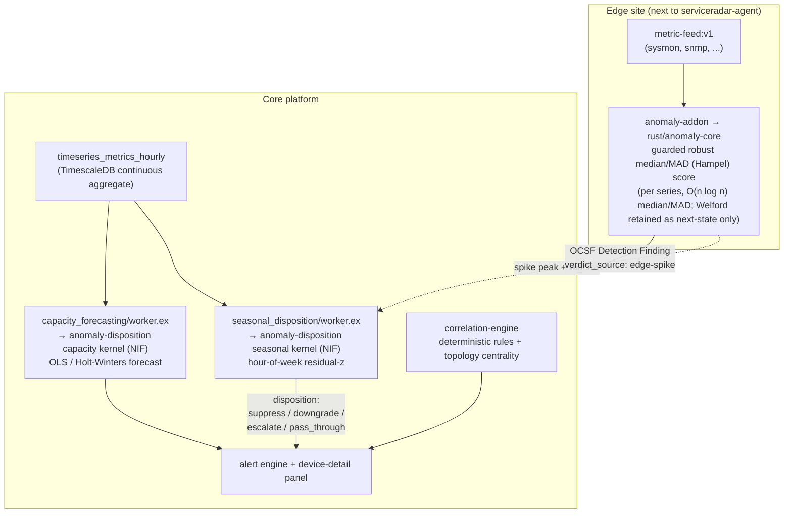
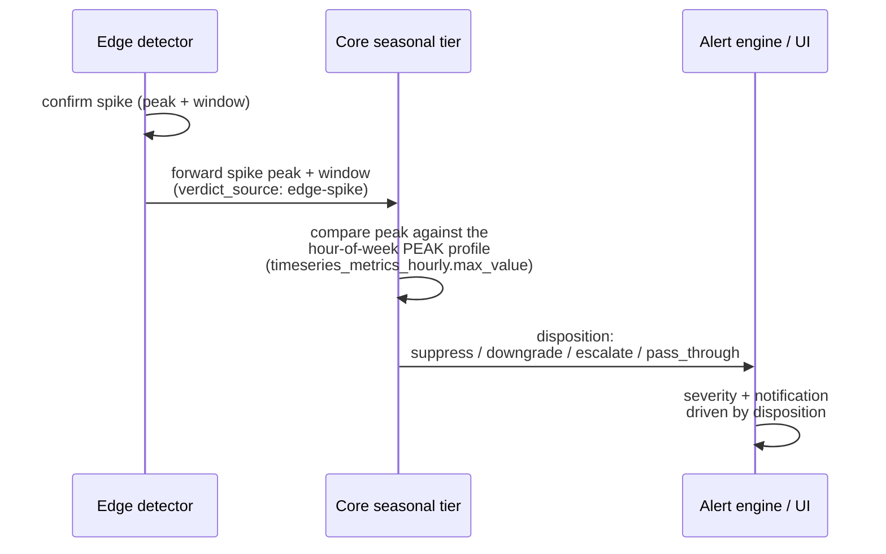

# Anomaly Engine

This is the single source of truth for how ServiceRadar detects metric anomalies
and forecasts capacity, end to end. It documents the statistics the engine runs,
the data contract it depends on, and how to prove every behavioral claim on real
code with the proof harness.

## Overview & two-tier architecture

Detection is split across an **edge tier** and a **core tier**, with a
**deterministic dependency expert system** layered on top for topology-aware
reasoning. The engine runs robust statistics (rolling robust median/MAD,
seasonal/capacity z-scores, OLS/Holt-Winters, and CUSUM) plus deterministic
rule/dependency-graph correlation. (S-H-ESD and RPCA ship as reference-tested
`anomaly-core` primitives but are not yet wired into the live detector path.)

1. **Edge spike detector** — runs in the native `anomaly-addon`, co-located with
   `serviceradar-agent`, using the `rust/anomaly-core` detector. A per-series
   guarded robust median/MAD (Hampel) deviation that catches short-term spikes with
   high recall and low latency, node-local, before samples are even published
   upstream.
2. **Core seasonal disposition** — the `rust/anomaly-disposition` seasonal kernel
   (driven via the `anomaly_disposition_nif` from `seasonal_disposition/worker.ex`).
   An hour-of-week residual z-score that answers *"is this abnormal for a Tuesday
   9am?"* — high precision. It suppresses recurring patterns (e.g. a nightly backup
   spike) that the edge tier over-alerts on.
3. **Core capacity forecast** — the `rust/anomaly-disposition` capacity kernel
   (driven via the NIF from `capacity_forecasting/worker.ex`). A trend forecast
   (least-squares linear or additive Holt-Winters) projecting time-to-exhaustion,
   with a valid prediction interval.
4. **Deterministic correlation expert system** — `rust/correlation-engine`. ~13
   hand-coded if-then rules plus ultragraph centrality/reachability over the
   topology graph — rule/dependency-graph **correlation** that follows the wired
   dependency graph.



The two detection tiers play complementary roles: the **edge** is fast and
high-recall (catch everything that looks like a spike), and the **core** is
high-precision (decide whether a given spike is actually abnormal *for this hour of
the week*). They are wired into a closed loop where the core **disposes** each edge
finding — see [The disposition loop](#the-disposition-loop).

## Data contract

The detector is **value-agnostic**: it scores whatever number you hand it. That
makes the input contract load-bearing — feeding the wrong shape of data produces
garbage, not anomalies.

### Gauges vs. monotonic counters

- **Gauges** (CPU / memory / disk `used_percent`, and similar bounded or
  free-ranging instantaneous values) are scored **directly**. The current value is
  the quantity of interest.
- **Monotonic counters** (e.g. SNMP `ifHCInOctets`, `ifHCOutOctets`) **MUST be
  rate-normalized to a per-second rate by the caller before scoring**. A raw
  counter only ever increases, so its z-score is meaningless. The proof harness
  makes this concrete: feeding a raw SNMP counter produces a flood of false alarms,
  while the same series correctly rate-normalized scores **precision 1.0**.

### Rate normalization (counters)

The caller converts a counter to a rate with `delta / elapsed`, with three salvage
rules so the rate stays sane across real-world counter behavior:

- **32-bit wrap salvage** — when a 32-bit counter rolls over, the negative delta is
  corrected for the wrap instead of being read as a huge negative rate.
- **Reset-anchor drop** — when a counter resets (e.g. device reboot, agent
  restart), the sample is dropped rather than emitting a spurious spike.
- **>2h gap drop** — when the elapsed time between samples exceeds two hours, the
  rate is dropped rather than averaging across a long, uninformative gap.

### The directional saturation gate

Bounded percent gauges (CPU / memory / disk `used_percent`) get a **directional
saturation gate**: only an **upward** excursion that clears an absolute floor can
breach. The default floors are:

| Class | `min_value` floor |
|---|---|
| CPU `used_percent` | 85 |
| Memory `used_percent` | 80 |
| Disk `used_percent` | 80 |

This is why a disk sitting at, say, 40% full does **not** alert even if it wobbles
statistically — there is no operational risk below the floor. The gate is **by
design, not a removal**: disk (and CPU/mem) are still collected and scored; the
gate simply prevents a low, harmless level from ever breaching. The harness proves
this: with the gate off the disk series fires 11 sub-80% false alarms; with the
gate on, those drop to **0** while all 11 genuine >80% fills are still caught.

### Series keying

Every series is keyed by a **canonical `(device, metric_name, if_index)`**. The
same key is used at the edge and in the core so a finding can be matched to its
seasonal profile and to the disposition that judges it. (Key alignment across the
two tiers is a precondition for the disposition loop; a mismatched key silently
no-ops the join.)

## The statistics

### Edge: guarded robust median/MAD (Hampel) score

The edge detector maintains a **per-series sliding window** and rebuilds a robust
**median/MAD (Hampel)** baseline over the clean window (an `O(window log window)`
sort). A sample breaches when:

```
|(x - median) / effective_MAD_scale| >= n_sigma
```

The effective scale is the floored `MAD * 1.4826` (so the threshold stays
sigma-comparable), and the dispersion floors prevent a divide-by-zero on a
near-constant series. Median/MAD has a **50% breakdown point**, so a spike cannot
inflate its own center or scale. Welford's O(1) mean/std is still computed, but it
is retained only as the persisted next-state summary and no longer drives the
score.

On top of that core robust median/MAD score sit the guard rails that make it
trustworthy in production:

- **Confirm-slot hysteresis** — a breach must persist for `confirm_slots`
  consecutive samples before it is *confirmed*. A single blip does not create a
  finding. (Harness: a single-blip injection is correctly **not** confirmed.)
- **Withhold-breach-from-baseline** — samples that are breaching are **withheld
  from the rolling baseline**, so a sustained surge cannot quietly raise the
  center/median and mask itself. (With median/MAD this is defense-in-depth — a 50%
  breakdown point already resists self-masking by construction.)
- **Dispersion floors** — an absolute standard-deviation floor and a
  coefficient-of-variation (CV) floor prevent a near-constant series from
  manufacturing huge z-scores out of numerical noise.
- **Directional saturation gate** — as described in the data contract, for bounded
  percent gauges.

Defaults: `n_sigma = 3.0`, `window = 300`, `min_samples = 30`, `confirm_slots = 5`.

On an Open/Clear transition the detector emits an **OCSF Detection Finding**
(`class_uid 2004`) with `verdict_source = edge-spike`.

Alongside the rolling score, the edge add-on runs a **two-sided CUSUM drift
detector** (on by default) that catches sustained drift the point score misses.
When CUSUM alarms and the point score did **not** breach, it emits a distinct
finding (`detector_method = cusum_drift`, `verdict_source = edge-drift`,
`anomaly.state = anomaly_drift`).

:::note Edge robustness (shipped)
The edge dispersion estimator is a robust **median/MAD (Hampel)** identifier:
median/MAD has a 50% breakdown point, so a very large spike cannot inflate its own
baseline or self-mask. Alongside it, a two-sided **CUSUM** drift detector (on by
default) catches the slow drift the point score misses, with the dispersion floors,
saturation gate, and confirm-slot hysteresis **retained**. Both shipped under
`refactor-anomaly-engine-rigor`. The harness pins the result: the edge now detects
slow drift (cpu drift recall **1/1**), and the only remaining edge blind spot is the
slow memory leak (**0/1**), which still needs the core hour-of-week profile — see
task 2.6.
:::

### Core seasonal: hour-of-week residual z-score

The core seasonal tier answers *"is this value abnormal **for this hour of the
week**?"* It builds a **168-bucket profile** (7 days-of-week × 24 hours-of-day) and
scores the latest completed bucket's deseasonalized residual against the historical
profile for that same hour.

- The 168-bucket profile is aggregated **in SQL** by the SRQL `profile_hour_of_week`
  verb over the **`timeseries_metrics_hourly`** TimescaleDB continuous aggregate.
- The kernel **excludes the latest bucket from its own baseline**, so a drift cannot
  self-mask.
- The default robust statistic is **median/MAD** (resistant to outliers in the
  history), and the default `confirm_slots` is **2** (light hysteresis so a single
  off-baseline bucket cannot flip a disposition).

A finding here carries `verdict_source = central-seasonal`. The seasonal worker is
Oban-scheduled and runs against the continuous aggregate, never the raw hot path.
Its defining strength is **suppressing recurring patterns** — e.g. a nightly backup
spike the edge flags every single night (the harness flags it 21/21) is recognized
as normal-for-that-hour and suppressed (z ≈ 0).

### Core capacity: trend forecast with a valid prediction interval

The capacity tier projects **time-to-exhaustion** by fitting a trend over the
hourly continuous aggregates:

- **Least-squares linear** trend, or
- **Additive Holt-Winters** trend (for series with a repeatable seasonal shape and
  enough history).

The forecast surfaces a **valid prediction interval**, not a constant-width band:

- **Linear (OLS):** a closed-form OLS prediction interval whose half-width is
  `t · s · sqrt(1 + 1/n + (x0 - x̄)² / Sxx)`. Critically, this **widens with the
  forecast horizon** — the further out the projection, the wider the band, which is
  exactly what a capacity-planning interval should do.
- **Holt-Winters:** a **residual-bootstrap** prediction interval (resample the
  model's one-step residuals, roll the recursion forward many times, take empirical
  quantiles). This runs off the hot path inside the periodic capacity Oban job, so
  the extra compute is acceptable.

:::caution `confidence` is a coverage level, not a fit-quality probability
The surfaced `confidence` field carries the prediction interval's **nominal
coverage level (0.95)** — the probability the interval is *designed* to contain the
true future value. web-ng labels it **"PI coverage"**. It is **not** a goodness-of-fit
probability and must not be read as "the model is 95% sure exhaustion will happen."
The earlier heuristic `confidence = clamp(1 - rmse/scale)` was removed precisely
because it was being misread that way.
:::

## The disposition loop

The two detection tiers are wired into a **closed loop**: the core **disposes** each
edge finding rather than emitting a parallel, unrelated verdict.



The key design point is **matched resolution**. The edge fires on a sub-minute
**spike peak**; a naive join against the hourly **mean** would be statistically
unsound (different physical quantities). So:

- The edge **forwards the spike peak and its window** alongside the finding.
- The core builds a **peak profile** from the existing
  `timeseries_metrics_hourly.max_value` column (the per-`(series, hour)` maximum —
  no schema change) and compares **spike-peak against spike-peak history** for that
  hour of the week.
- The disposition is one of **suppress / downgrade / escalate / pass_through**, and
  the alert engine and device-detail panel consume it.
- The seasonal worker emits a verdict for **every** evaluated series, so a finding
  always has a partner to be judged against.
- **Raw edge findings are retained for audit** even when suppressed.

The matched-resolution disposition runs **out-of-band in the live system** via
`AnomalyDispositionReporter` — an Oban-driven consumer of OCSF Detection Findings
(`class_uid 2004`) that records a disposition alongside each finding. It **never
mutates an alert**: the disposition is **report-only by default** (`actionable?`
returns `false` unless `suppression_enabled` is set for the class).

:::note In progress
Loop closure ships **report-only** behind a **per-class stability gate**: a class
stays in pass-through (so nothing is hidden) until its own peak profile has enough
trustworthy history to earn suppression. The cardinal error to avoid is a
**false-suppress** (it would hide a real anomaly), so every uncertain path resolves
to pass-through or escalate. A related **core→edge hour-of-week baseline push**
(task 2.6) is wired end to end: the core builds a 180-day hour-of-week profile and
pushes it to the edge (`EdgeBaselineProducer` → the add-on profile → `configure`) so
the edge detector **deseasonalizes** against it locally. The consumption path, the
profile builder, the **delivery**, and the **series-key alignment** are all done and
proven against a real database — the add-on keys the seasonal lookup by
`<device_uid>|<metric_name>` (matching the central `series:uid`) while the rolling
detector keeps its finer per-core key, and the edge baseline is bucketed in UTC to
match the edge clock. The one remaining follow-up is per-agent delivery scoping
(today the baseline set is profile-wide — harmless, since the add-on only resolves
keys for series it actually scores).
:::

## Operations & tuning knobs

Tuning is intentionally split across two ownership surfaces:

- **Edge spike detector knobs** live in the native `anomaly` add-on
  **profile/assignment params** (delivered next to the agent).
- **Central seasonal / capacity defaults** live in **Settings → Anomaly Detection**.
  These feed the core tiers and do **not** rewrite already-created edge add-on
  assignments.

Changing Anomaly Detection settings requires the `observability.alerts.manage`
permission. The detailed operator workflow — ownership split, metric-class
overrides, rollout/runback, and troubleshooting — lives in
[Anomaly Detection (tuning & operations)](./anomaly-detection.md).

### Edge spike detector

| Knob | Default | Effect |
|---|---|---|
| `n_sigma` | `3.0` | Threshold on the robust deviation from the rolling **median**, scaled by `MAD * 1.4826` so it stays sigma-comparable: a slot is anomalous when `|(x - median) / (MAD * 1.4826, floored)| >= n_sigma`. Higher = quieter, may miss small changes. |
| `window` (`window_size`) | `300` | Samples retained for the rolling baseline. Count-based, not wall-clock. Larger = steadier baseline; smaller = adapts faster. |
| `min_samples` | `30` | Clean baseline samples required before any finding may emit. Raise for sparse/new metric classes. |
| `confirm_slots` | `5` | Consecutive anomalous slots required before a finding is confirmed. Raise first for bursty classes (before raising `n_sigma`). |
| Saturation-gate `min_value` | CPU 85 / mem 80 / disk 80 | Floor a bounded percent gauge must clear (upward) before it can breach. |
| `cusum_enabled` | `true` | Enables the two-sided CUSUM drift detector (on by default), which catches sustained drift the point score misses. |
| `cusum_k` | `0.5` | CUSUM slack `k` in sigma units — the per-sample allowance before drift accumulates. |
| `cusum_h` | `5.0` | CUSUM decision interval / alarm threshold — accumulated drift at which a `cusum_drift` finding fires. |

For noisy or bursty metrics, prefer raising `confirm_slots` before raising
`n_sigma`: that keeps sustained deviations visible while filtering one-off spikes.

### Core seasonal

| Knob | Default | Effect |
|---|---|---|
| Robust statistic | `median/MAD` | The robust dispersion estimator for the hour-of-week residual. Resistant to outliers in the history. |
| `confirm_slots` | `2` | Light hysteresis so a single off-baseline bucket cannot flip a disposition. |
| `seasonal_enabled` | per-class | Enable only after a class has enough history to distinguish a daily/weekly pattern from a real incident. |

### Core capacity

| Knob | Effect |
|---|---|
| Forecast horizon | How far ahead the model projects (the OLS interval widens with this). |
| Warning horizon | How soon projected exhaustion must occur before a warning emits. |
| Warning threshold | Utilization treated as exhaustion (e.g. `80.0`). |
| Model | `linear` (OLS) for steady trends; `holt_winters` only with a repeatable pattern and enough history. |
| Minimum history points | Aggregate samples required before a forecast emits. Raise for sparse series / seasonal models. |

## How to run the proof harness

The engine is verified by a reproducible harness at `tools/anomaly-proof/` that
runs the **real** detector and disposition kernels over **synthetic labeled** data,
so detection is *measured* (precision / recall / latency), not asserted. Nothing
here touches a production database. This is the anti-hallucination gate for
`refactor-anomaly-engine-rigor`: every behavioral claim on this page should have a
scenario here that proves it on shipping code.

### Edge backtest (no DB)

```bash
# build the real detector binary once
cargo build --manifest-path rust/anomaly-core/Cargo.toml --bin anomaly-backtest

O=tools/anomaly-proof/out
python3 tools/anomaly-proof/gen.py --weeks 3
./target/debug/anomaly-backtest --input $O/samples.jsonl --emit all > $O/verdicts.jsonl
python3 tools/anomaly-proof/plot.py   # -> $O/anomaly_proof.png + $O/scorecard.json
```

Saturation-gate proof (same data, gate off vs on):

```bash
grep '"disk.usage_percent"' $O/samples.jsonl > $O/disk.jsonl
./target/debug/anomaly-backtest --input $O/disk.jsonl --emit anomalies                          # fires sub-80 false alarms
./target/debug/anomaly-backtest --input $O/disk.jsonl --saturation-gate-min 80 --emit anomalies # gate suppresses them
```

### Core disposition kernels (no DB)

```bash
cargo build --manifest-path rust/anomaly-disposition/Cargo.toml --bin disposition-backtest

# seasonal: does the core tier suppress seasonal-normal and flag real deviations?
python3 tools/anomaly-proof/gen_seasonal.py
./target/debug/disposition-backtest --kind seasonal --input $O/seasonal_rows.csv > $O/seasonal_out.csv
python3 tools/anomaly-proof/plot_seasonal.py

# capacity: forecast / ETA behavior and the prediction-interval band vs horizon
python3 tools/anomaly-proof/gen_capacity.py
./target/debug/disposition-backtest --kind capacity --input $O/capacity_points.csv \
    --threshold 100 --model linear --horizon-seconds 7776000
```

### End-to-end DB feed (TimescaleDB)

```bash
# raw metrics -> real hourly CAGG -> real profile_hour_of_week verb -> real kernel
# (creates + drops its own srql-fixtures scratch DB; reads the CNPG admin secret)
tools/anomaly-proof/run_db_feed.sh
```

### Scorecard (fresh harness run, 2026-06-29)

The rows below are from a **fresh proof-harness run and the test suites on
2026-06-29** — every figure is measured on shipping code, not asserted. The robust
**median/MAD** edge is the current baseline, with the two-sided **CUSUM** drift
detector now wired into the edge add-on (on by default). The seasonal kernel is the
core-tier work measured against the baseline; **S-H-ESD** and **RPCA** are
reference-tested `anomaly-core` primitives verified by their own unit tests, not yet
wired into the detector path.

| Series / class | What it proves | Result (2026-06-29) |
|---|---|---|
| Edge spike (`anomaly-core`) | the robust median/MAD score's strength | recall **1/1**, median detection latency **4 samples**, precision **1.0** (**692 TP / 0 FP**) |
| Edge step | step recall + hysteresis | recall **1/1** (latency 4); a single blip is correctly **not confirmed** (`confirm_slots` hysteresis) |
| Slow drift / slow leak | edge drift now caught | cpu drift **1/1** (median latency **68 samples**, 0 new FP — the robust median lags a slow ramp so the point score catches it); the slow memory leak (**0/1**) is still the core hour-of-week target |
| Saturation gate off → on | the 80% gate | OFF → **11** sub-80 false alarms (precision 0.5); ON (`min 80`) → sub-80 FP **11 → 0**, real >80 fills kept **11 → 11** |
| CUSUM drift kernel (live edge, default-on) | the shipped edge drift detector | cpu drift **9/300** (z) → **230/300** (CUSUM), ~**0.6% FP** on clean; memory leak **0/1500** → **742/1500**, **38% FP** — the short-history caveat that needs the core 180-day hour-of-week profile (why task 2.6 exists) |
| Core seasonal disposition (residual-z) kernel | seasonal suppression | **7/7** — recurring nightly/daytime/weekend load **suppressed at z=0.00** (the same load the naive edge over-flags **21/21**); off-pattern breaches flagged (z=**9.01 / 7.42 / 16.15**); insufficient-baseline gated |
| RPCA / GESD reference | the robust kernels are correct | **8/8** — GESD finds injected outliers at exact indices **[40,41,42]** and nothing on clean; SVD reconstructs and is orthonormal; `norm_ppf` / `t_ppf` match reference quantiles |
| Capacity kernel | the horizon-widening band | PI band **widens with horizon** (7d **5.89** / 30d **5.93** / 90d **6.15**), replacing the old constant-width band; exhaustion ETA emitted at 30d/90d (projected **73.7% / 102.5%**), none at 7d (**62.6%**) |
| Disposition (matched-resolution, real DB) | the peak-vs-peak loop | hour-of-week PEAK profile center=**55**, scale=**4**, n=**8** → suppress@peak 56 (z≈0.25), downgrade@peak 63 (z=2.0), escalate@peak 90 (novel); a zero-variance profile escalates **any** above-center peak; **report-only by default** (`actionable?` false unless `suppression_enabled`) |

Test suites green on 2026-06-28 (pass/fail):

- **Rust** — `anomaly-core` **49/0**, `anomaly-addon` **92/0**, `anomaly-disposition`
  **43/0**, `correlation-engine` **65/0**.
- **Elixir** — disposition **17/0**, reporter **7/0**, peak_profile **6/0**,
  series_key **11/0**, stateful_alert_engine **13/0**.

See `tools/anomaly-proof/README.md` for the full harness reference and file layout.
