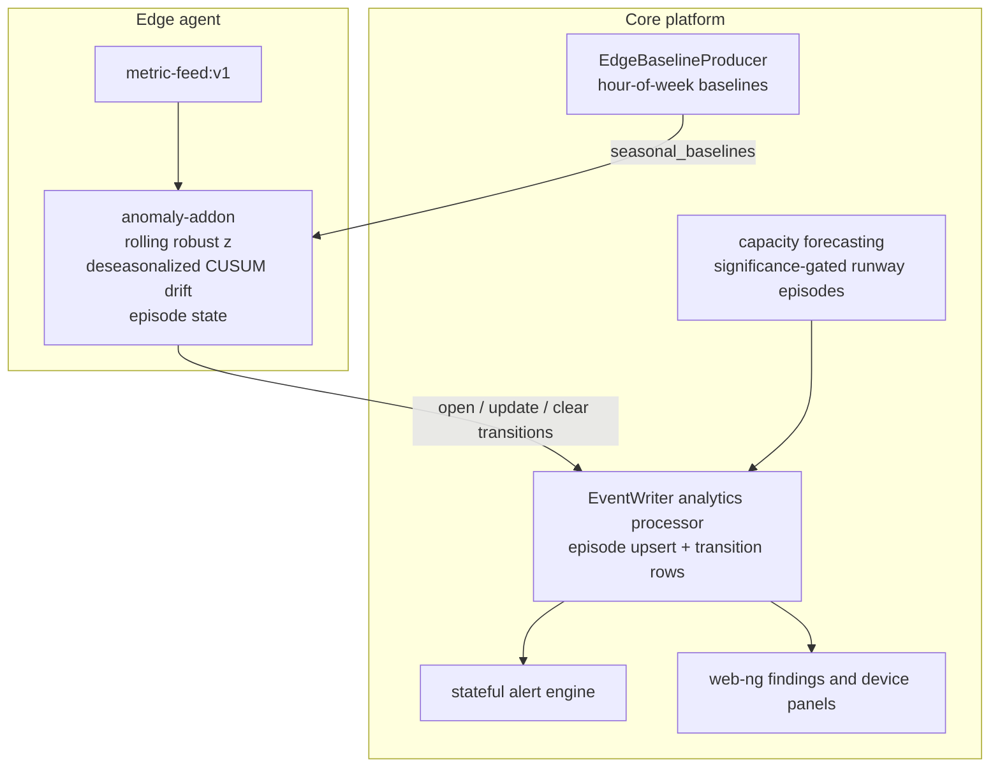

# Anomaly Engine

This page is the technical reference for ServiceRadar anomaly detection. It
documents the data contract, the statistics, the episode lifecycle, severity,
configuration delivery, and the verification gates that protect the engine from
regressing into noisy per-sample alarms.

## Architecture

Anomaly detection is split across edge and core responsibilities.



The edge tier is responsible for low-latency detection. Core is responsible for
long-horizon baselines, durable episode state, alert evaluation, capacity
forecasting, and operator presentation.

## Data Contract

The detector is value-agnostic. It scores whatever numeric series it receives,
so upstream normalization is load-bearing.

- Gauges such as CPU and memory utilization are scored directly.
- Monotonic counters must be converted to rates exactly once before scoring.
- SNMP interface counters should use 64-bit ifHC OIDs when discovery says the
  interface supports them.
- Rate aggregation must partition deltas per polling series, not only by metric
  name.
- Metrics must enter ServiceRadar through NATS JetStream before CNPG
  persistence, so real-time consumers and storage see the same stream.

Counter drops must be attributable. Wrap salvage, resets, gaps, and nonmonotonic
samples should increment counted reasons instead of silently creating missing
chart segments or bogus rates.

## Series Identity

Edge and core use the same logical series identity. The v2 detector key shape is:

```text
v2|partition|identity|metric|interface_uid|if_index|tag_*
```

Volatile process keys such as `pid`, `process_id`, `start_time`, and
`start_time_unix_nano` are excluded. Seasonal baseline lookup uses a coarser
key:

```text
<device_uid>|<metric_name>|<if_index>
```

The two-segment `<device_uid>|<metric_name>` form remains as a compatibility
fallback for host baselines.

## Edge Spike Detection

The spike path uses a rolling robust median/MAD baseline. A breach is admitted
at the decision boundary (winsorized to `center +/- n_sigma * effective_scale`)
instead of being withheld, so every sample ages the window while an extreme surge
cannot train itself in unboundedly. A continuous, non-saturated new regime is
adopted after `spike_adopt_after_samples`; it emits one `adopted` clear instead
of alerting indefinitely. A slot breaches when robust-z evidence exceeds the
configured threshold and any class-specific gate passes.

Important guards:

- `min_samples`: baseline warmup before findings can emit.
- `confirm_slots`: consecutive breaching slots before opening.
- dispersion floors: absolute and coefficient-of-variation floors.
- saturation gates: bounded percent gauges require meaningful absolute load.
- host aggregate CPU: host-level CPU is the Critical-eligible alerting unit;
  per-core series are context and are capped below Critical.
- recent-burst envelope: for interface counter rates, an upward sample no
  taller than `multiplier x quantile(lagged raw history)` does not breach.
  The add-on computes the level from the series' raw tail, lagged by at least
  twice `confirm_slots` so a sustained surge's confirming samples cannot vouch
  for themselves; the core applies it once to the combined signal set (a
  sub-hour burst breaches the hourly seasonal signal too) and names the
  suppression on each signal's reason. Downward moves and drift are untouched.

## CUSUM Drift Detection

CUSUM detects sustained level shifts that a rolling point detector may absorb.
The defect in the old path was not CUSUM itself; it was anchoring and emission.

The production drift contract is:

- Seasonal classes default to `deseasonalized_only`.
- A series without a delivered seasonal baseline has drift inactive.
- Scale floors use the same near-zero protection as the z path.
- Entry uses latch-and-confirm plus practical effect-size gates.
- Open drift episodes do not emit every poll cycle.
- A stable non-saturated new level is adopted as baseline and cleared.

Default drift knobs include `cusum_k = 0.5`, `cusum_h = 8.0`,
`h_confirm_mult = 1.5`, `drift_confirm_window = 30`,
`drift_min_effect = 2.0`, `drift_clear_slots = 30`,
`drift_adopt_after_samples = 600`, and
`drift_escalate_after_secs = 3600`.

## Seasonal Baselines

Core builds hour-of-week baselines from Timescale continuous aggregates and
delivers them through anomaly add-on params.

The producer first discovers series using the latest-bucket profile, then fetches
full profiles one device per statement (the statement cost grows non-linearly
with the device count and a fleet-wide statement exceeds the database
statement timeout). Interface queries additionally select disjoint
interface-index groups within each device, including wide devices. A failed
chunk fails that source fetch rather than delivering a partial profile; the
other sources are still delivered, and the run's heartbeat is recorded
unhealthy naming the failed sources so the freshness tripwire fires with a
reason.
Profile pagination follows the [SRQL pagination contract](srql-language-reference.md#sorting-and-pagination).

- Host baselines are safe to write on the AddonProfile.
- Interface baselines are scoped to AddonAssignments for every agent that the
  SNMP polling resolver confirms polls the target. A collection partition is
  never treated as an agent identity.
- Interface baselines are keyed by device, metric name, and if_index.
- Delivery is governed by at least four samples per delivered bucket, 60 percent
  hour-of-week coverage, top-K interfaces per device, compact arrays, and a hard
  per-agent cap.

If payload governance truncates a baseline, that series degrades to no drift.
It never falls back to raw unseasonalized CUSUM.

## Episode Model

An OCSF event row represents a lifecycle transition, not a detector evaluation.

- `open`: create the episode.
- `update`: severity-band escalation or a flap-window re-open (`flapping`).
- `clear`: close the episode.

Every emitted row carries deterministic identity:

- `finding_uid`: stable per finding series.
- `episode_uid`: stable per open lifecycle.
- `transition`: `open`, `update`, or `clear`.
- `producer_version`: anomaly add-on version.

Still-open heartbeats update the episode row (`last_seen_at`, peak fields,
occurrence count) and do not create new OCSF rows. A re-open inside the flap
window reuses the prior episode UID and an eventual clear carries `flap_merged`.
Core also folds independent producers for one canonical finding: it remains open
while any fresh producer reports open and clears only when all are clean or stale.
Stale close sweeps prevent producer crashes from leaving permanent open episodes.
Central seasonal episodes are stamped with the evaluation time (the bucket
window rides in the `seasonal_disposition` payload) and are swept with a
producer-cadence window (at least 150 minutes) instead of the edge heartbeat
window. A clear that resolves no open episode is not persisted as an episode.

Episode folding in the event writer is enabled by default.
`EVENT_WRITER_ANOMALY_EPISODES` is a kill switch: set it to `false`, `0`, `no`,
or `off` to disable episode state and write every anomaly row through to
`ocsf_events`. The stale-close sweep derives its threshold from the emission
settings as `max(2 × episode heartbeat, 30 minutes)`, so a single delayed
heartbeat cannot stale-close a live episode.

## Severity And Scores

Severity is intentionally not a direct mapping from an unbounded accumulator.

- Spike evidence is robust z on floored scale.
- Drift evidence is a bounded shift estimator.
- Stored scores are capped.
- Drift is capped at High on the edge.
- Interface statistical changes are capped at High unless explicit semantics
  such as link-down or static thresholds say otherwise.
- Critical requires High evidence, an impact test, and minimum duration.

For CPU and memory, the impact test is saturation on the host aggregate. A
single hot core may still be detected, but it is not Critical by itself.

## Emission Governance

The add-on enforces per-series cooldown and a per-tick budget. Clears always
pass because downstream state machines need them. When budget is exhausted, the
add-on enters storm handling:

- clears and High+ opens have priority.
- new series reserve a sub-budget so novel signal still escapes.
- queued transitions compact latest-state-wins per series.
- overflow is represented by `anomaly_emission_shed` rollups.

The invariant is:

```text
detected transitions = emitted transitions + folded episode updates + shed-accounted transitions
```

Core also emits an operational tripwire when anomaly upserts exceed expected
rate, so a stale or regressed add-on is visible quickly. The inverse failure,
a silently dead pipeline, is covered by the scheduled tripwires in
[Liveness Tripwires](#liveness-tripwires).

## Capacity Forecasting

Capacity forecasting emits runway episodes only for sound targets by default:
monotone consumable resources such as disk usage and memory working set. CPU
and interface utilization are bursty mean-reverting gauges and are excluded by
default.

A projected finding requires:

- enough history relative to the projection horizon.
- robust slope confidence excluding zero.
- persistence across consecutive runs.
- bounded extrapolation relative to observed history.
- ETA gated on the prediction-interval lower-bound crossing.

Findings emit on state transitions (`projected` to `cleared` and back), not once
per series per hourly run. The kernel reports the uncapped crossing alongside
the capped ETA: a crossing inside the horizon but beyond twice the observed
history is recorded as `exhaustion_beyond_history_cap` with the crossing time,
the history span, and the cap in its diagnostics.

The excluded bursty sources are explicit opt-ins. Set
`SERVICERADAR_CAPACITY_FORECASTING_SOURCE_OPT_INS` (comma-separated:
`cpu_usage`, `interface_rate`, `flow_bytes_per_hour`) or select sources in
**Settings > Anomaly Detection**. A non-empty Settings selection overrides the
env list; an untouched Settings value leaves the env opt-ins in effect. Unknown
names are logged and ignored, and the valid subset still runs. Series the
worker declines to forecast are recorded with a skip reason and summarized on
the Observability health page, so "no forecasts" is explainable in-product.

## Configuration Delivery

Settings are projected to edge through add-on params.

```text
Settings singleton
  -> AnomalyAddonConfigProjector
  -> AddonProfile.params["managed"]
  -> AddonProfileReconciler
  -> AddonAssignment params
  -> agent configure()
```

Merge order in the add-on is:

```text
managed defaults < operator-explicit top-level profile/assignment params
```

The baseline producer writes `seasonal_baselines`; the config projector writes
`managed`. The writers are intentionally disjoint.

The projector is enabled by default and its cron ships in the production
release (default `57 * * * *`), so operator Settings reach the edge without
extra deployment config. The projector writes only the reserved `managed`
sub-key; operator-explicit top-level profile or assignment params still win.

Kill switches exist at multiple layers:

- per-class `enabled=false`.
- per-class `drift_mode=off`.
- projector env flag `SERVICERADAR_ANOMALY_EDGE_CONFIG_PROJECTION` (default
  `true`; set `false` to stop projecting Settings to the edge).
- event-writer episode kill switch `EVENT_WRITER_ANOMALY_EPISODES` (default
  on; set `false` to fall back to per-row anomaly ingest).

## Alert Pipeline

The alert engine consumes episode transitions. Rules should fire on opens,
escalation updates, and clears, not every detector evaluation. A post-deploy
liveness check injects a synthetic confirmed episode and verifies:

1. the seeded rule fires.
2. a row exists in `platform.alerts`.
3. the alert recovers on clear.

This protects against silent subject or schema cutovers in the event stream.

Seeded alert rules are version-reconciled at boot: rules the seeder created
carry a `managed` marker and a `template_version`, and managed rules behind the
current template are upgraded in place. Operator-modified rules are skipped and
logged; clearing `managed` permanently detaches a rule from the seeder. A
one-time repair migration also fixes pre-cutover seeded rules whose
`subject_prefix` still pointed at the legacy `signals.causal.predictions`
subject.

## Liveness Tripwires

Silence is monitored in both directions: the over-rate tripwire catches a
flooding add-on, and three coordinator-scheduled tripwires catch the opposite
failure, a silently dead pipeline. Each emits an operational health event on
failure:

- **Alert-path liveness**: replays a synthetic episode open and clear through
  the rule engine and asserts the seeded rule contract.
  `SERVICERADAR_ANOMALY_LIVENESS_ENABLED` (default `true`),
  `SERVICERADAR_ANOMALY_LIVENESS_CRON` (default `23 */6 * * *`).
- **Ingest silence**: fires when zero anomaly upserts arrive for
  `SERVICERADAR_ANOMALY_SILENCE_HOURS` (default `6`) while
  `timeseries_metrics` ingest is alive.
  `SERVICERADAR_ANOMALY_SILENCE_TRIPWIRE_ENABLED` (default `true`),
  `SERVICERADAR_ANOMALY_SILENCE_TRIPWIRE_CRON` (default `7 * * * *`).
- **Baseline-delivery liveness**: the edge-baseline producer records a
  `seasonal-baseline-producer` heartbeat health event on every successful
  delivery run; this fires when no heartbeat landed within
  `SERVICERADAR_SEASONAL_BASELINE_FRESHNESS_HOURS` (default `26`).
  `SERVICERADAR_SEASONAL_BASELINE_TRIPWIRE_ENABLED` (default `true`),
  `SERVICERADAR_SEASONAL_BASELINE_TRIPWIRE_CRON` (default `37 * * * *`).

The add-on side `drift_inactive_no_baseline` and `clamped_samples_total` counters
are surfaced on the health page. Seasonal evidence distinguishes no baselines
configured, no bucket for this hour, and a bucket below the trust threshold.

## Verification Gates

The proof harness and demo soak gates are part of the contract.

Harness scenarios include:

- clean diurnal series without delivered baseline: no drift rows.
- diurnal interface series without a delivered baseline: rolling spikes adopt a
  stable regime and stay episode-bounded.
- quiet near-zero interface: no astronomical scores.
- seasonal interface with delivered baseline: one drift open for a real shift.
- benign regime change: one open and one clear by adoption.
- restart storm: checkpointed state does not fork episodes.
- emission storm: every suppressed transition is rollup-accounted.
- severity corpus: Critical share and score bounds stay inside limits.

Demo gates include:

- total anomaly rows under phase ceilings.
- Critical share below the configured limit.
- no series above the daily row bound.
- zero alert queue overflow.
- zero class-1008 anomaly rows after ingest migration.
- synthetic alert liveness passing after deployment.

## Operational Interpretation

An anomaly finding means the detector observed a statistically and operationally
meaningful transition. It does not automatically mean remediation should run.
Automated throttling, restart, resize, and policy mutation are outside this
release.
