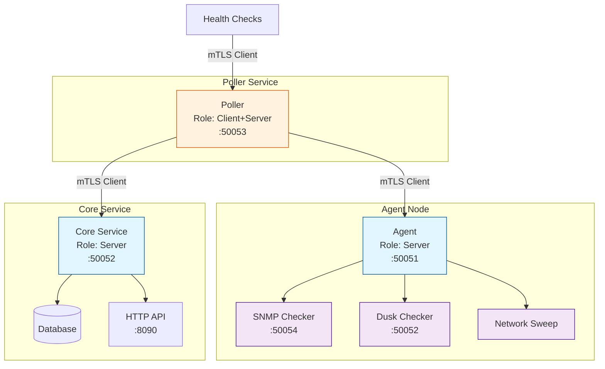
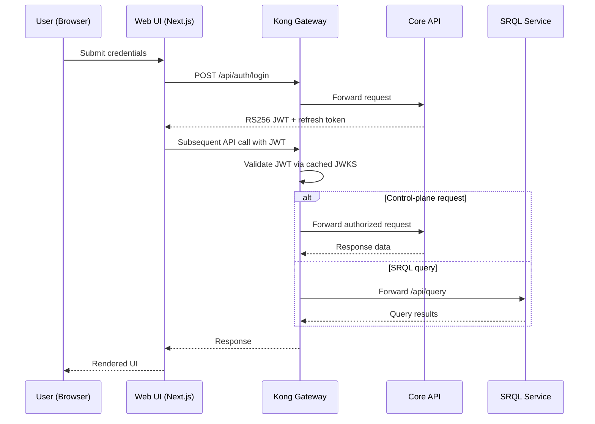
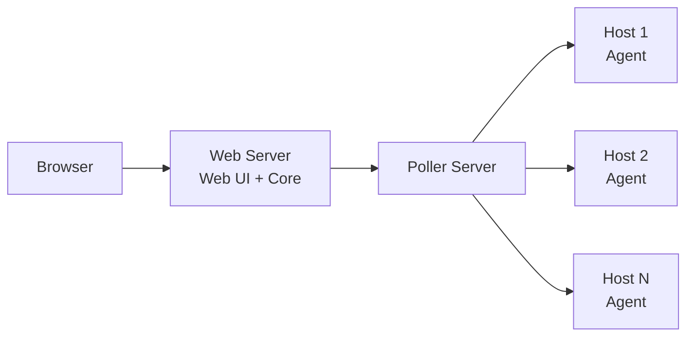
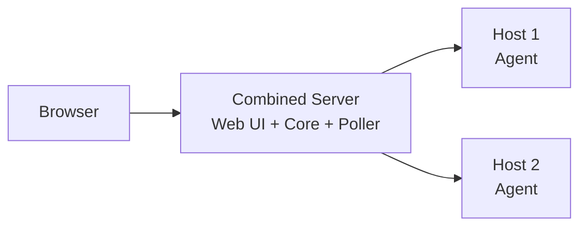
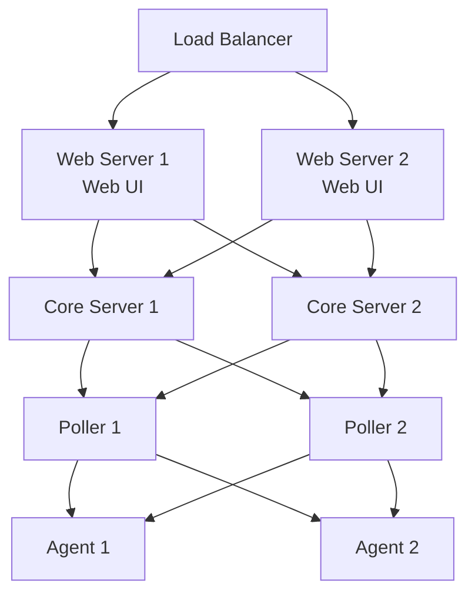

# ServiceRadar Architecture

ServiceRadar uses a distributed, multi-layered architecture designed for flexibility, reliability, and security. This page explains how the different components work together to provide robust monitoring capabilities.

## Architecture Overview

```mermaid
graph TD
    subgraph "User Edge"
        Browser[Web Browser]
        WebUI[Web UI<br/>Next.js + Nginx]
        Kong[Kong API Gateway<br/>:9080]
        JWKS[Core JWKS<br/>/auth/jwks.json]

        Browser -->|HTTPS| WebUI
        WebUI -->|REST + JWT| Kong
        Kong -->|Fetch keys| JWKS
    end

    subgraph "Service Layer"
        CoreAPI[Core Service<br/>:8090/:50052]
        SRQL[SRQL Service<br/>:8080/:api/query]
        Datasvc[Datasvc<br/>:50057]
        Kong -->|Validated request| CoreAPI
        Kong -->|Validated request| SRQL
        Datasvc -->|KV API| CoreAPI
    end

    subgraph "Monitoring Layer"
        Poller1[Poller 1<br/>:50053]
        Poller2[Poller 2<br/>:50053]
        CoreAPI ---|gRPC<br/>bidirectional| Poller1
        CoreAPI ---|gRPC<br/>bidirectional| Poller2
    end

    subgraph "Target Infrastructure"
        Agent1[Agent 1<br/>:50051]
        Agent2[Agent 2<br/>:50051]
        Agent3[Agent 3<br/>:50051]

        Poller1 ---|gRPC<br/>checks| Agent1
        Poller1 ---|gRPC<br/>checks| Agent2
        Poller2 ---|gRPC<br/>checks| Agent3

        Agent1 --- Service1[Services<br/>Processes<br/>Ports]
        Agent2 --- Service2[Services<br/>Processes<br/>Ports]
        Agent3 --- Service3[Services<br/>Processes<br/>Ports]
    end

    subgraph "Identity Plane"
        SPIREServer[SPIRE Server
(StatefulSet)]
        SPIREController[Controller Manager
Sidecar]
        SPIREWorkloadAgent[SPIRE Workload Agent
(DaemonSet)]

        SPIREController --- SPIREServer
        SPIREServer --- SPIREWorkloadAgent
    end

    subgraph "Data Layer"
        Proton[Proton / Timeplus]
        CoreAPI -->|Ingest + Queries| Proton
        SRQL -->|SQL Translation| Proton
    end

    subgraph "Alerting"
        CoreAPI -->|Webhooks| Discord[Discord]
        CoreAPI -->|Webhooks| Other[Other<br/>Services]
    end

    CoreAPI -. |Workload API| -> SPIREWorkloadAgent
    Poller1 -. |Workload API| -> SPIREWorkloadAgent
    Datasvc -. |Workload API| -> SPIREWorkloadAgent
    Agent1 -. |Workload API| -> SPIREWorkloadAgent

    style Browser fill:#f9f,stroke:#333,stroke-width:1px
    style WebUI fill:#b9c,stroke:#333,stroke-width:1px
    style Kong fill:#f5b,stroke:#333,stroke-width:1px
    style JWKS fill:#ffd,stroke:#333,stroke-width:1px
    style CoreAPI fill:#9bc,stroke:#333,stroke-width:2px
    style SRQL fill:#9bc,stroke:#333,stroke-width:1px
    style Datasvc fill:#9bc,stroke:#333,stroke-width:1px
    style Poller1 fill:#adb,stroke:#333,stroke-width:1px
    style Poller2 fill:#adb,stroke:#333,stroke-width:1px
    style Agent1 fill:#fd9,stroke:#333,stroke-width:1px
    style Agent2 fill:#fd9,stroke:#333,stroke-width:1px
    style Agent3 fill:#fd9,stroke:#333,stroke-width:1px
    style SPIREServer fill:#d6c9ff,stroke:#333,stroke-width:1px
    style SPIREController fill:#d6c9ff,stroke:#333,stroke-width:1px
    style SPIREWorkloadAgent fill:#d6c9ff,stroke:#333,stroke-width:1px
    style Proton fill:#cfc,stroke:#333,stroke-width:1px
    style Discord fill:#c9d,stroke:#333,stroke-width:1px
    style Other fill:#c9d,stroke:#333,stroke-width:1px
```

Kong now sits between the Web UI and the backend APIs as the policy enforcement point. It validates RS256-signed JWTs against the Core’s JWKS endpoint before forwarding traffic to either the Core service or the dedicated SRQL microservice. Downstream, SRQL translates `/api/query` requests into Proton SQL while the Core continues handling control-plane APIs. Pollers and agents still rely on mTLS for gRPC communication, keeping user traffic, edge policy, and service-to-service links cleanly separated.

## Key Components

### Agent (Monitored Host)

The Agent runs on each host you want to monitor and is responsible for:

- Collecting service status information (process status, port availability, etc.)
- Exposing a gRPC service on port 50051 for Pollers to query
- Supporting various checker types (process, port, SNMP, etc.)
- Running with minimal privileges for security

**Technical Details:**
- Written in Go for performance and minimal dependencies
- Uses gRPC for efficient, language-agnostic communication
- Supports dynamic loading of checker plugins
- Can run on constrained hardware with minimal resource usage

### Poller (Monitoring Coordinator)

The Poller coordinates monitoring activities and is responsible for:

- Querying multiple Agents at configurable intervals
- Aggregating status data from Agents
- Reporting status to the Core Service
- Performing direct checks (HTTP, ICMP, etc.)
- Supporting network sweeps and discovery

**Technical Details:**
- Runs on port 50053 for gRPC communications
- Stateless design allows multiple Pollers for high availability
- Configurable polling intervals for different check types
- Supports both pull-based (query) and push-based (events) monitoring

### Core Service (API & Processing)

The Core Service is the central component that:

- Receives and processes reports from Pollers
- Provides an API for the Web UI on port 8090
- Triggers alerts based on configurable thresholds
- Stores historical monitoring data
- Manages webhook notifications

**Technical Details:**
- Exposes a gRPC service on port 50052 for Poller connections
- Provides a RESTful API on port 8090 for the Web UI
- Uses role-based security model
- Implements webhook templating for flexible notifications

### Web UI (User Interface)

The Web UI provides a modern dashboard interface that:

- Visualizes the status of monitored services
- Displays historical performance data
- Provides configuration management
- Proxies all authenticated API calls through the Kong gateway

**Technical Details:**
- Built with Next.js in SSR mode for security and performance
- Uses Nginx as a reverse proxy on port 80
- Exchanges JWTs with Kong, which validates them against the Core JWKS endpoint
- Supports responsive design for mobile and desktop

### API Gateway (Kong)

The Kong API gateway enforces edge security and traffic policy:

- Terminates incoming Web UI API traffic on port 9080 (HTTP) or 9443 (HTTPS)
- Validates RS256-signed JWTs using the Core service’s JWKS published at `/auth/jwks.json`
- Applies rate limits, request shaping, and header normalization before forwarding to the Core API
- Caches JWKS responses and refreshes keys automatically when the Core rotates signing material

### SPIFFE Identity Plane

Core, Poller, Datasvc, and Agent rely on SPIFFE identities issued by the SPIRE
stack that ships with the demo kustomization and Helm chart. The SPIRE server
StatefulSet now embeds the upstream controller manager to reconcile
`ClusterSPIFFEID` resources and keep workload certificates synchronized. For a
deep dive into the manifests, controller configuration, and operational
workflow see [SPIFFE / SPIRE Identity Platform](spiffe-identity.md).

### SRQL Service (Query Engine)

The SRQL microservice executes ServiceRadar Query Language requests:

- Exposes `/api/query` (HTTP) and `/api/stream` (WebSocket) for bounded and streaming query execution
- Runs as an OCaml/Dream application that translates SRQL to Proton SQL before dispatching the query
- Shares Kong’s JWT policy; validated user tokens grant access to query endpoints without additional secrets
- Streams results back to the Web UI, which renders them in explorers and dashboards

## Device Identity Canonicalization

Modern environments discover the same device from multiple angles—Armis inventory pushes metadata, KV sweep configurations create synthetic device IDs per partition, and Pollers learn about live status through TCP/ICMP sweeps. Because Timeplus streams are versioned and append-only, every new IP address or partition shuffle historically produced a brand-new `device_id`. That broke history stitching and created duplicate monitors whenever DHCP reassigned an address.

To fix this, the Device Registry now picks a canonical identity per real-world device and keeps all telemetry flowing into that record:

- **Canonical selection**: When Armis or NetBox provide a strong identifier, the registry prefers the most recent `_tp_time` entry for that identifier and treats it as the source of truth (the canonical `device_id`).
- **Sweep normalization**: Any sweep-only alias (`partition:ip`) is merged into the canonical record so Poller results land on the device the UI already knows about.
- **Metadata hints**: `_merged_into` markers are written on non-canonical rows so downstream consumers can recognise historical merges.

JetStream key/value buckets disallow characters such as `:` in key segments, so the canonical map encodes each identity value using an `=<HEX>` escape sequence for any disallowed rune (for example, the MAC `AA:BB` is stored as `AA=3ABB`). Clients call into the shared helper in `pkg/identitymap` before hitting the KV service, ensuring lookups and publishes stay consistent regardless of the original identifier format.

### Why the backfill exists

Before the canonicalization rules were introduced, the database already contained duplicate `device_id`s—some with long-running poller history. The new registry logic keeps things clean going forward, but we still need to reconcile the backlog so reporting and alerting stay accurate. The one-off backfill job walks the existing Timeplus tables, identifies duplicate identities, and emits tombstone `DeviceUpdate` messages to fold the old IDs into their canonical equivalents.

Run the backfill from the `serviceradar-core` binary when you are ready to migrate historical data:

```bash
serviceradar-core --config /etc/serviceradar/core.json --backfill-identities
```

Key CLI flags:

- `--backfill-identities` runs the identity de-duplication and exits without starting gRPC/HTTP services.
- `--backfill-ips` (default `true`) also merges sweep-generated aliases that only differ by IP.
- `--backfill-dry-run` prints what would merge without publishing tombstones—use this on staging first to validate cardinality.
- `--seed-kv-only` seeds the canonical map in NATS KV without emitting tombstones. Pair this with `--backfill-dry-run` during staged rollouts so you can warm caches before mutating historic device rows.

### Monitoring the canonical identity map

The registry and backfill jobs now emit OpenTelemetry metrics so operators can see how the identity map behaves in real time:

- `identitymap_kv_publish_total` (labels: `outcome=created|updated|unchanged|dry_run`) counts the number of KV writes attempted for identity keys.
- `identitymap_conflict_total` (labels: `reason=aborted|already_exists|retry_exhausted`) tracks CAS contention or retries that exceeded their budget.
- `identitymap_lookup_latency_seconds` (labels: `resolved_via=kv|db|miss|error`, `found=true|false`) measures end-to-end latency for resolving canonical devices.

Conflicts are also logged with the key path and gRPC status code whenever JetStream rejects an optimistic update. Feed these metrics into the OTEL collector (`cmd/otel`) to populate the Prometheus dashboards used during rollout.

### Exporting canonical identity metrics

1. Enable OTEL metrics in the core configuration. The same block that controls OTEL logging now wires the metric exporter:

   ```jsonc
   {
     "logging": {
       "level": "info",
       "otel": {
         "enabled": true,
         "endpoint": "otel-collector.default.svc.cluster.local:4317",
         "insecure": true
       }
     }
   }
   ```

   The endpoint should point at the OTLP gRPC listener exposed by `cmd/otel` (or any compatible collector).

2. Update the OTEL collector to expose a Prometheus scrape endpoint. The stock `cmd/otel/otel.toml` now includes:

   ```toml
   [server.metrics]
   bind_address = "0.0.0.0"
   port = 9464
   ```

   With this block in place the collector serves the aggregated counters at `http://<collector-host>:9464/metrics`.

3. Add the new time series to Grafana or Alertmanager. Common queries include:

   - `rate(identitymap_kv_publish_total{outcome="created"}[5m])` – confirms new canonical entries are still flowing.
   - `identitymap_conflict_total{reason="retry_exhausted"}` – fires when CAS contention needs investigation.
   - `histogram_quantile(0.95, rate(identitymap_lookup_latency_seconds_bucket[5m]))` – watches the p95 lookup latency across the fleet.

4. During feature rollout, chart the metrics alongside the backfill jobs. Pair the Prometheus dashboard with the staging commands in the next section to verify seeding runs beforehand.

### Rollout checklist

1. **Staging seed:** run `serviceradar-core --config /etc/serviceradar/core.json --backfill-identities --seed-kv-only --backfill-dry-run` to pre-populate NATS KV without mutating history. Watch `identitymap_kv_publish_total{outcome="dry_run"}` to confirm keys are enumerated.
2. **Validate signals:** scrape `identitymap_lookup_latency_seconds` and `identitymap_conflict_total` for at least one sweep interval. Conflicts should stay at zero and keep lookup latency below the alert threshold (p95 under 250 ms).
3. **Commit the backfill:** rerun the job without `--backfill-dry-run` (and optionally with `--seed-kv-only=false`) to emit the tombstones and fold historical rows.
4. **Flip the feature flag:** deploy the updated core configuration so the registry publishes canonical IDs by default (keeping the legacy tombstone path as a safety net). Repeat the same sequence in production once staging metrics hold steady.
5. **Post-rollout watch:** leave the Prometheus alerts in place for at least one week; any sustained rise in `identitymap_conflict_total{reason="retry_exhausted"}` should trigger an incident to investigate duplicate identifiers.

When the backfill finishes it logs the totals and exits. After that, the Device Registry enforces the same canonicalization rules for all future DeviceUpdate events flowing from Armis, KV sweeps, and Poller results.

## Security Architecture

ServiceRadar implements multiple layers of security:

### mTLS Security

For network communication between components, ServiceRadar supports mutual TLS (mTLS):



### API Gateway Authentication Flow

Kong validates every user-facing API call before it reaches the Core service:



- The Core publishes its signing keys at `https://<core-host>/auth/jwks.json`. Kong’s JWT plugin fetches and caches those keys, refreshing when it sees a new `kid`.
- JWTs are issued with short expirations; the Web UI rotates them server-side using the refresh token flow.
- Downstream services (pollers, sync workers) continue to use mTLS and service credentials, while end-user requests are always funneled through Kong.

For deployment specifics, pair this section with the [Authentication Configuration](./auth-configuration.md) and [TLS Security](./tls-security.md) guides.

## Deployment Models

ServiceRadar supports multiple deployment models:

### Standard Deployment

All components installed on separate machines for optimal security and reliability:



### Minimal Deployment

For smaller environments, components can be co-located:



### High Availability Deployment

For mission-critical environments:



## Network Requirements

ServiceRadar uses the following network ports:

| Component | Port | Protocol | Purpose |
|-----------|------|----------|---------|
| Agent | 50051 | gRPC/TCP | Service status queries |
| Poller | 50053 | gRPC/TCP | Health checks |
| Core | 50052 | gRPC/TCP | Poller connections |
| Core | 8090 | HTTP/TCP | API (internal) |
| Web UI | 80/443 | HTTP(S)/TCP | User interface |
| SNMP Checker | 50054 | gRPC/TCP | SNMP status queries |
| Dusk Checker | 50052 | gRPC/TCP | Dusk node monitoring |

For more information on deploying ServiceRadar, see the [Installation Guide](./installation.md).
