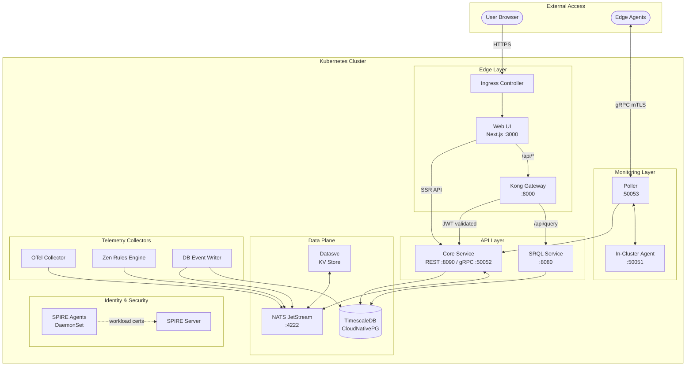
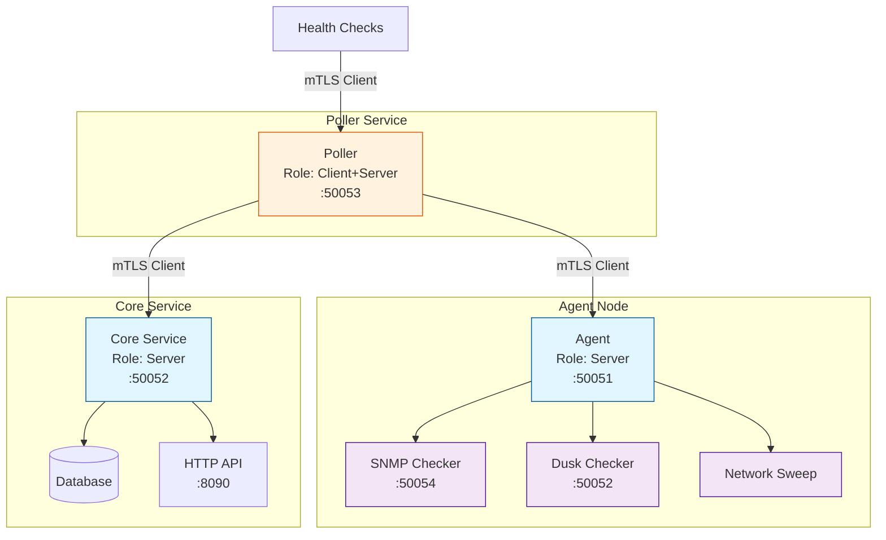
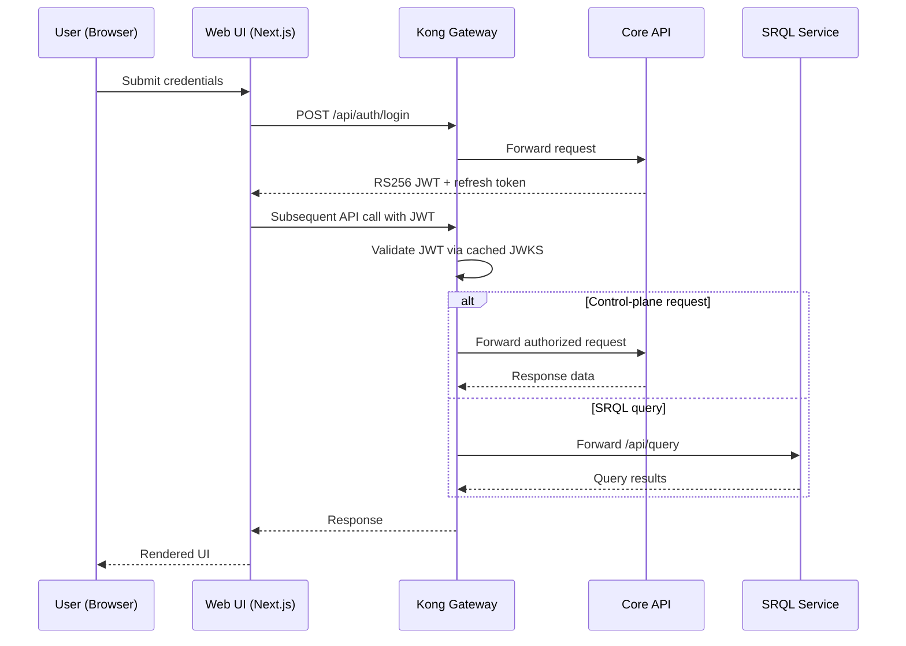
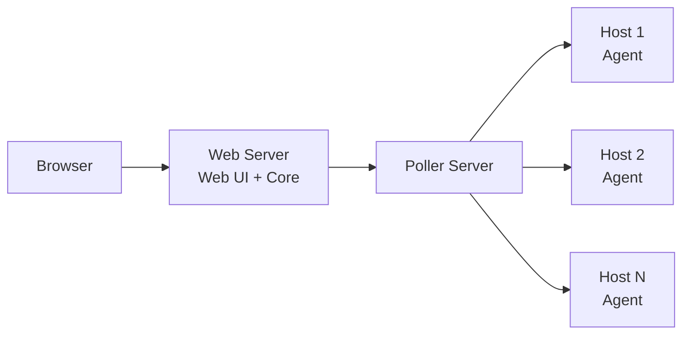
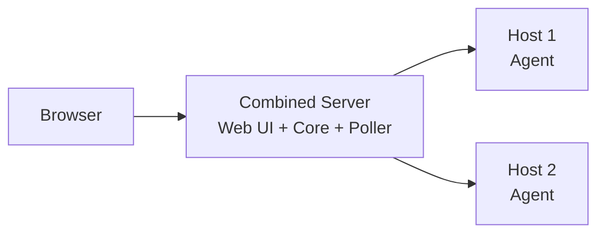
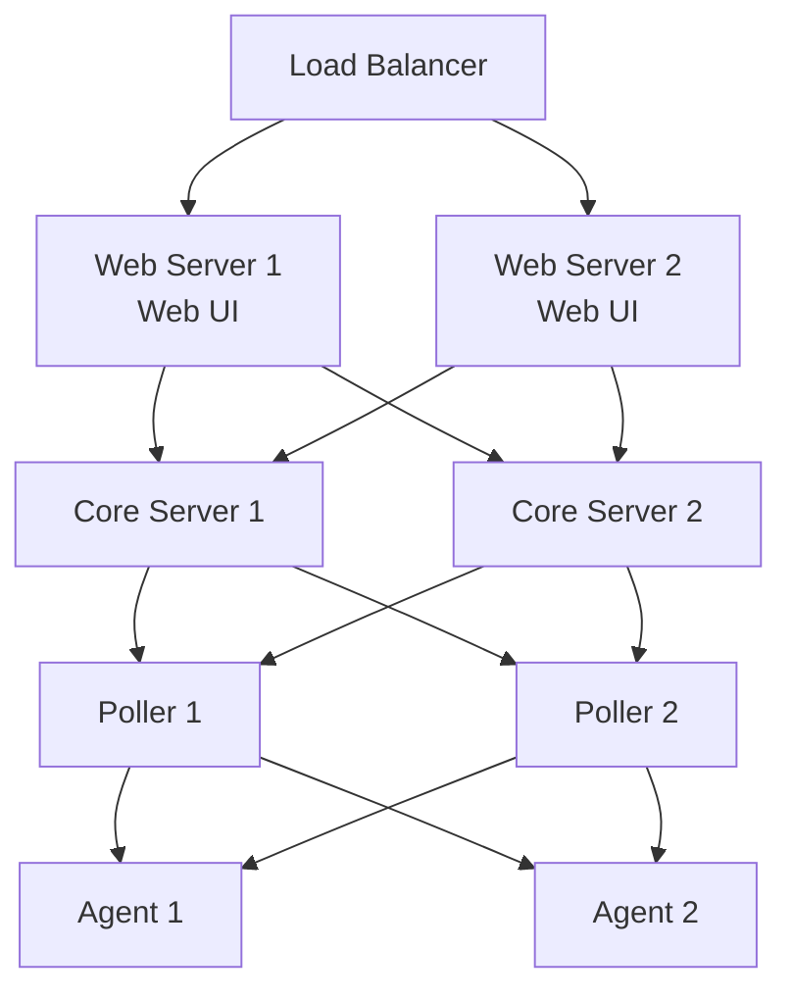

# ServiceRadar Architecture

ServiceRadar uses a distributed, multi-layered architecture designed for flexibility, reliability, and security. This page explains how the different components work together to provide robust monitoring capabilities.

## Architecture Overview



**Traffic flow summary:**
- **User requests** → Ingress → Web UI (static/SSR) or Kong (API)
- **Kong** validates JWTs and routes to Core (control plane) or SRQL (queries)
- **Edge agents** connect via gRPC mTLS to the Poller
- **NATS JetStream** provides pub/sub messaging and KV storage for all services
- **SPIRE** issues X.509 certificates to all workloads via DaemonSet agents

### Cluster requirements

- **Ingress**: Required for the web UI and API. Default host/class/TLS come from `helm/serviceradar/values.yaml` (`ingress.enabled=true`, `host=demo.serviceradar.cloud`, `className=nginx`, `tls.secretName=serviceradar-prod-tls`, `tls.clusterIssuer=carverauto-issuer`). If you use nginx, mirror the demo annotations (`nginx.ingress.kubernetes.io/proxy-body-size: 100m`, `proxy-buffer-size: 128k`, `proxy-buffers-number: 4`, `proxy-busy-buffers-size: 256k`, `proxy-read-timeout: 86400`, `proxy-send-timeout: 86400`, `proxy-connect-timeout: 60`) to keep SRQL streams and large asset uploads stable (`k8s/demo/prod/ingress.yaml`).

- **Persistent storage (~150GiB/node baseline)**: CNPG consumes the majority (3×100Gi PVCs from `k8s/demo/base/spire/cnpg-cluster.yaml`). JetStream adds 30Gi (`k8s/demo/base/serviceradar-nats.yaml`), OTEL 10Gi (`k8s/demo/base/serviceradar-otel.yaml`), and several 5Gi claims for Core, Datasvc, Mapper, Zen, DB event writer, plus 1Gi claims for Faker/Flowgger/Cert jobs. Spread the CNPG replicas across at least three nodes with SSD-class volumes; the extra PVCs lift per-node needs to roughly 150Gi of usable capacity when co-scheduled with CNPG.

- **CPU / memory (requested)**: Core 1 CPU / 4Gi, Poller 0.5 CPU / 2Gi (`k8s/demo/base/serviceradar-core.yaml`, `serviceradar-poller.yaml`); Kong 0.5 CPU / 1Gi; Web 0.2 CPU / 512Mi; Datasvc 0.5 CPU / 128Mi; SRQL 0.1 CPU / 128Mi; NATS 1 CPU / 8Gi; OTEL 0.2 CPU / 256Mi. The steady-state floor is ~4 vCPU and ~16 GiB for the core path, before adding optional sync/checker pods or horizontal scaling.

- **Identity plane**: SPIRE server (StatefulSet) and daemonset agents must be running; services expect the workload socket at `/run/spire/sockets/agent.sock` and SPIFFE IDs derived from `spire.trustDomain` in `values.yaml`.

- **TLS artifacts**: Pods mount `serviceradar-cert-data` for inter-service TLS and `cnpg-ca` for database verification; ensure these secrets/PVCs are provisioned before rolling workloads.

## Key Components

### Agent (Monitored Host)

The Agent runs on each host you want to monitor and is responsible for:

- Collecting service status information (process status, port availability, etc.)
- Exposing a gRPC service on port 50051 for Pollers to query
- Supporting various checker types (process, port, SNMP, etc.)
- Running with minimal privileges for security

**Technical Details:**
- Written in Go for performance and minimal dependencies
- Uses gRPC for efficient, language-agnostic communication
- Supports dynamic loading of checker plugins
- Can run on constrained hardware with minimal resource usage

### Poller (Monitoring Coordinator)

The Poller coordinates monitoring activities and is responsible for:

- Querying multiple Agents at configurable intervals
- Aggregating status data from Agents
- Reporting status to the Core Service
- Performing direct checks (HTTP, ICMP, etc.)
- Supporting network sweeps and discovery

**Technical Details:**
- Runs on port 50053 for gRPC communications
- Stateless design allows multiple Pollers for high availability
- Configurable polling intervals for different check types
- Supports both pull-based (query) and push-based (events) monitoring

### Core Service (API & Processing)

The Core Service is the central component that:

- Receives and processes reports from Pollers
- Provides an API for the Web UI on port 8090
- Triggers alerts based on configurable thresholds
- Stores historical monitoring data
- Manages webhook notifications

**Technical Details:**
- Exposes a gRPC service on port 50052 for Poller connections
- Provides a RESTful API on port 8090 for the Web UI
- Uses role-based security model
- Implements webhook templating for flexible notifications

### Web UI (User Interface)

The Web UI provides a modern dashboard interface that:

- Visualizes the status of monitored services
- Displays historical performance data
- Provides configuration management
- Proxies all authenticated API calls through the Kong gateway

**Technical Details:**
- Built with Next.js in SSR mode for security and performance
- Exposed through the cluster ingress to `serviceradar-web` (port 3000)
- Exchanges JWTs with Kong, which validates them against the Core JWKS endpoint
- Supports responsive design for mobile and desktop

### API Gateway (Kong)

The Kong API gateway enforces edge security and traffic policy:

- Terminates incoming Web UI API traffic on port 9080 (HTTP) or 9443 (HTTPS)
- Validates RS256-signed JWTs using the Core service’s JWKS published at `/auth/jwks.json`
- Applies rate limits, request shaping, and header normalization before forwarding to the Core API
- Caches JWKS responses and refreshes keys automatically when the Core rotates signing material

### SPIFFE Identity Plane

Core, Poller, Datasvc, and Agent rely on SPIFFE identities issued by the SPIRE
stack that ships with the demo kustomization and Helm chart. The SPIRE server
StatefulSet now embeds the upstream controller manager to reconcile
`ClusterSPIFFEID` resources and keep workload certificates synchronized. For a
deep dive into the manifests, controller configuration, and operational
workflow see [SPIFFE / SPIRE Identity Platform](spiffe-identity.md).

### SRQL Service (Query Engine)

The SRQL microservice executes ServiceRadar Query Language requests:

- Exposes `/api/query` (HTTP) and `/api/stream` (WebSocket) for bounded and streaming query execution
- Runs as an OCaml/Dream application that translates SRQL to Timescale-compatible SQL before dispatching the query
- Shares Kong’s JWT policy; validated user tokens grant access to query endpoints without additional secrets
- Streams results back to the Web UI, which renders them in explorers and dashboards

## Device Identity Canonicalization

Modern environments discover the same device from multiple angles—Armis inventory pushes metadata, KV sweep configurations create synthetic device IDs per partition, and Pollers learn about live status through TCP/ICMP sweeps. Because the Timescale hypertables are append-only, every new IP address or partition shuffle historically produced a brand-new `device_id`. That broke history stitching and created duplicate monitors whenever DHCP reassigned an address.

To fix this, the Device Registry now picks a canonical identity per real-world device and keeps all telemetry flowing into that record:

- **Canonical selection**: When Armis or NetBox provide a strong identifier, the registry prefers the most recent `_tp_time` entry for that identifier and treats it as the source of truth (the canonical `device_id`).
- **Sweep normalization**: Any sweep-only alias (`partition:ip`) is merged into the canonical record so Poller results land on the device the UI already knows about.
- **Metadata hints**: `_merged_into` markers are written on non-canonical rows so downstream consumers can recognise historical merges.

**Note:** KV is NOT used for device identity resolution. CNPG (PostgreSQL) is the authoritative source for identity via the `device_identifiers` table. The IdentityEngine in `pkg/registry` uses strong identifiers (Armis ID, MAC, etc.) to generate deterministic `sr:` UUIDs and stores mappings in CNPG with an in-memory cache for performance.

### Monitoring identity lookups

The core lookup path emits OpenTelemetry metrics so operators can see how identity resolution behaves in real time:

- `identitymap_lookup_latency_seconds` (labels: `resolved_via=db|miss|error`, `found=true|false`) measures end-to-end latency for resolving canonical devices via CNPG.

Feed these metrics into the OTEL collector (`cmd/otel`) to populate Prometheus dashboards.

### Legacy KV cleanup

If upgrading from a previous deployment that used KV for identity caching, use the `kv-sweep` tool to remove any orphaned `device_canonical_map/*` entries:

```bash
kv-sweep --bucket serviceradar-datasvc --prefix device_canonical_map/ --delete
```

## Security Architecture

ServiceRadar implements multiple layers of security:

### mTLS Security

For network communication between components, ServiceRadar supports mutual TLS (mTLS):



### API Gateway Authentication Flow

Kong validates every user-facing API call before it reaches the Core service:



- The Core publishes its signing keys at `https://<core-host>/auth/jwks.json`. Kong’s JWT plugin fetches and caches those keys, refreshing when it sees a new `kid`.
- JWTs are issued with short expirations; the Web UI rotates them server-side using the refresh token flow.
- Downstream services (pollers, sync workers) continue to use mTLS and service credentials, while end-user requests are always funneled through Kong.

For deployment specifics, pair this section with the [Authentication Configuration](./auth-configuration.md) and [TLS Security](./tls-security.md) guides.

## Deployment Models

ServiceRadar supports multiple deployment models:

### Standard Deployment

All components installed on separate machines for optimal security and reliability:



### Minimal Deployment

For smaller environments, components can be co-located:



### High Availability Deployment

For mission-critical environments:



## Network Requirements

ServiceRadar uses the following network ports:

| Component | Port | Protocol | Purpose |
|-----------|------|----------|---------|
| Agent | 50051 | gRPC/TCP | Service status queries |
| Poller | 50053 | gRPC/TCP | Health checks |
| Core | 50052 | gRPC/TCP | Poller connections |
| Core | 8090 | HTTP/TCP | API (internal) |
| Web UI | 80/443 | HTTP(S)/TCP | User interface |
| SNMP Checker | 50054 | gRPC/TCP | SNMP status queries |
| Dusk Checker | 50052 | gRPC/TCP | Dusk node monitoring |

For more information on deploying ServiceRadar, see the [Installation Guide](./installation.md).
