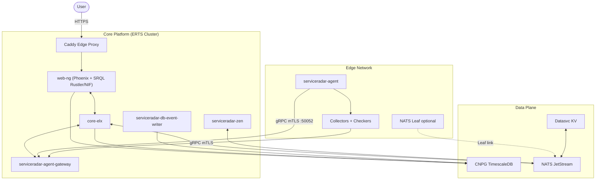
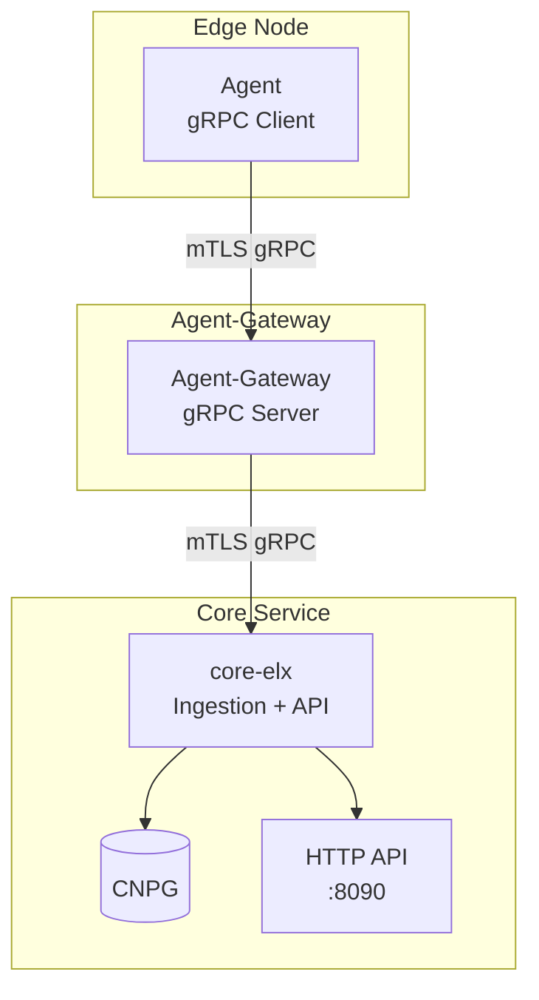
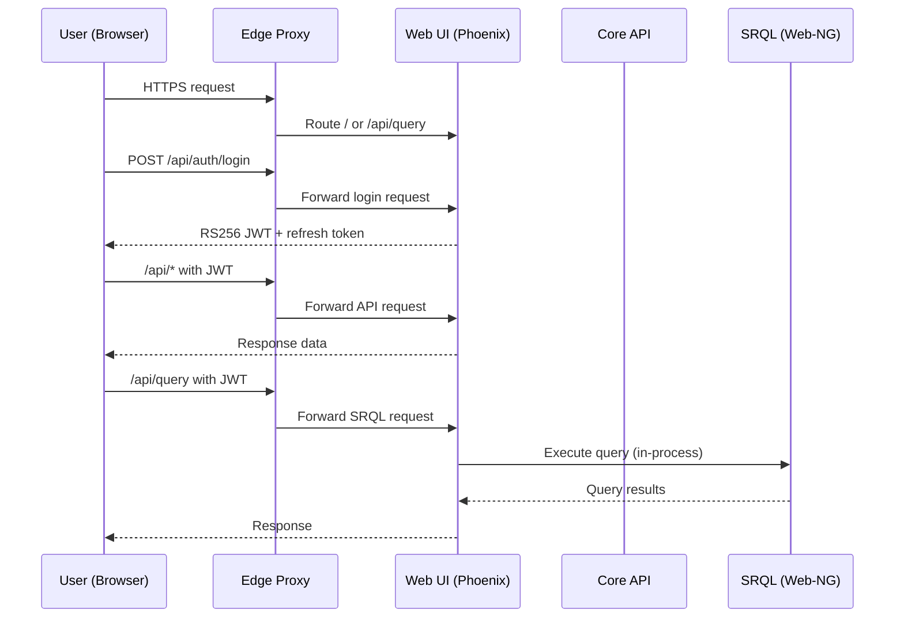
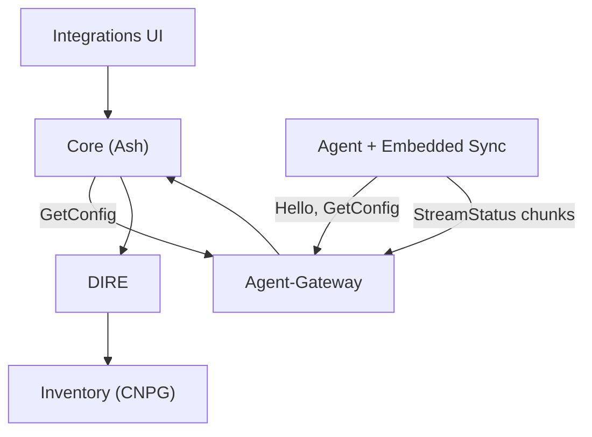
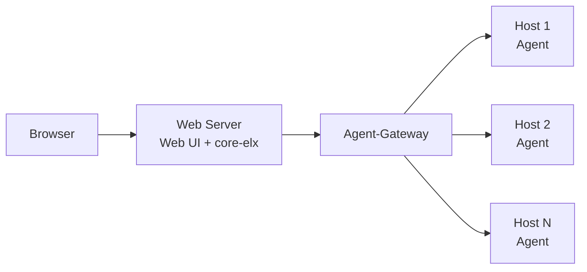
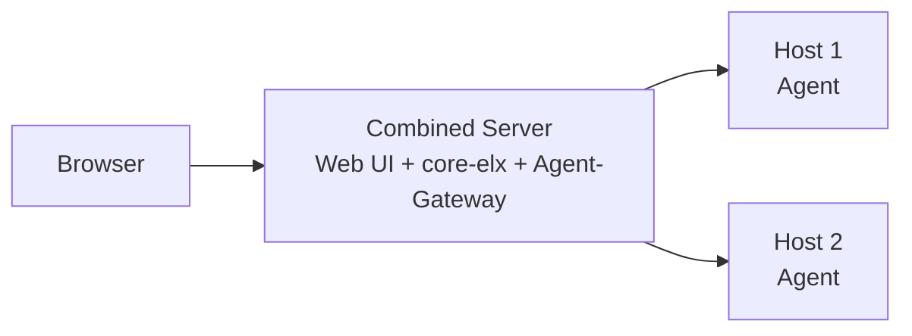
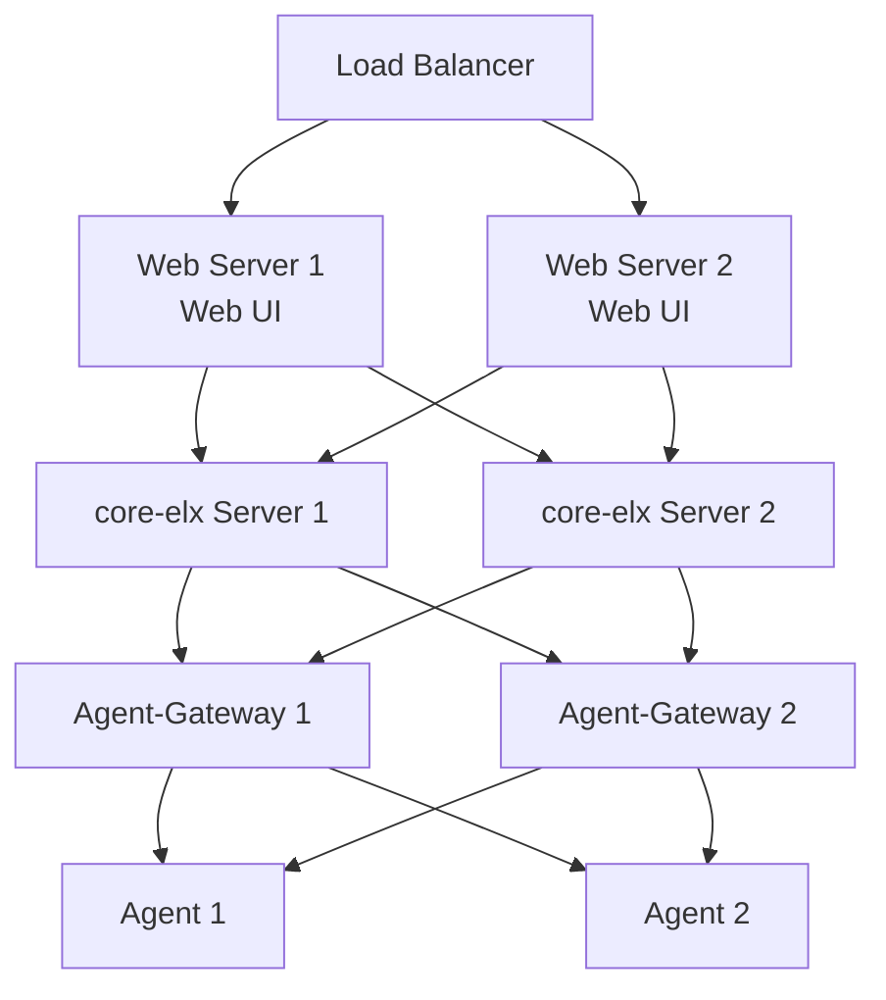

# ServiceRadar Architecture

ServiceRadar uses a distributed, multi-layered architecture designed for flexibility, reliability, and security. This page explains how the different components work together to provide robust monitoring capabilities.

## Architecture Overview

```mermaid
flowchart TB
    subgraph EdgeZone["Edge Network"]
        Agent["serviceradar-agent"]
        Collectors["Collectors + Checkers"]
        Leaf["NATS Leaf optional"]
        Agent --> Collectors
    end

    subgraph Core["Core Platform (ERTS Cluster)"]
        Caddy["Caddy Edge Proxy"]
        Web["web-ng (Phoenix + SRQL Rustler/NIF)"]
        CoreElx["core-elx"]
        Gateway["serviceradar-agent-gateway"]
        Zen["serviceradar-zen"]
        DBWriter["serviceradar-db-event-writer"]
        Caddy --> Web
        Web <--> CoreElx
        CoreElx <--> Gateway
    end

    subgraph DataPlane["Data Plane"]
        CNPG["CNPG TimescaleDB"]
        NATS["NATS JetStream"]
        DATASVC["Datasvc KV"]
    end

    User([User]) -->|HTTPS| Caddy
    Agent -->|gRPC mTLS :50052| Gateway
    Collectors -->|gRPC mTLS| Gateway
    Leaf -.->|Leaf link| NATS

    Web --> CNPG
    CoreElx --> CNPG
    DBWriter --> CNPG
    CoreElx <--> NATS
    Zen <--> NATS
    DATASVC <--> NATS
```

**Traffic flow summary:**
- **User requests** -> Caddy/Ingress -> Web-NG
- **Web-NG** serves `/`, `/api/*`, `/api/query`, and `/api/stream` and hosts SRQL via Rustler/NIF
- **Core-elx, Web-NG, and Agent-Gateway** form the internal ERTS cluster over mTLS
- **Edge agents** (Go binaries) connect via gRPC mTLS to the Agent-Gateway on port 50052
- **Edge deployments** run the agent with collectors/checkers and optionally a NATS leaf server
- **NATS JetStream + Datasvc** provide platform messaging and KV storage for platform services
- **CNPG/Timescale** is the system of record for telemetry and inventory
- **SPIRE** issues X.509 certificates to all workloads via DaemonSet agents

### Edge Agent Architecture

Edge agents are **Go binaries** that run on monitored hosts outside the Kubernetes cluster. They communicate exclusively via gRPC with mTLS:

| Property | Value |
|----------|-------|
| **Runtime** | Go binary (not Erlang/BEAM) |
| **Protocol** | gRPC with mTLS only |
| **Port** | 50052 (outbound to Agent-Gateway) |
| **Identity** | Workload-scoped X.509 certificates |
| **ERTS Access** | None (cannot join ERTS cluster) |

**Security boundaries:**
- Edge agents **cannot** join the ERTS cluster (they are not Erlang nodes)
- Edge agents **cannot** execute RPC calls on Core or Agent-Gateway nodes
- Edge agents **cannot** access Horde registries or enumerate cluster members
- Edge agents **cannot** connect to the database directly

For detailed edge agent deployment, see [Edge Agents](./edge-agents.md). For security properties, see [Security Architecture](./security-architecture.md).

### Cluster requirements

- **Ingress / edge proxy**: Docker Compose uses Caddy. Kubernetes uses your ingress controller (configured in `helm/serviceradar/values.yaml`). Ensure WebSocket support and large body sizes so LiveView and SRQL streams remain stable.

- **Persistent storage (~150GiB/node baseline)**: CNPG consumes the majority (3x100Gi PVCs from `k8s/demo/base/spire/cnpg-cluster.yaml`). JetStream adds 30Gi (`k8s/demo/base/serviceradar-nats.yaml`), OTEL 10Gi (`k8s/demo/base/serviceradar-otel.yaml`), and several 5Gi claims for Core, Datasvc, Mapper, Zen, DB event writer, plus 1Gi claims for Faker/Flowgger/Cert jobs. Spread the CNPG replicas across at least three nodes with SSD-class volumes; the extra PVCs lift per-node needs to roughly 150Gi of usable capacity when co-scheduled with CNPG.

- **CPU / memory (requested)**: Core 1 CPU / 4Gi, Agent-Gateway 0.5 CPU / 2Gi, Web 0.2 CPU / 512Mi; Datasvc 0.5 CPU / 128Mi; NATS 1 CPU / 8Gi; OTEL 0.2 CPU / 256Mi. The steady-state floor is ~4 vCPU and ~16 GiB for the core path, before adding optional sync/checker pods or horizontal scaling.

- **Identity plane**: SPIRE server (StatefulSet) and daemonset agents must be running; services expect the workload socket at `/run/spire/sockets/agent.sock` and SPIFFE IDs derived from `spire.trustDomain` in `values.yaml`.

- **TLS artifacts**: Pods mount `serviceradar-cert-data` for inter-service TLS and `cnpg-ca` for database verification; ensure these secrets/PVCs are provisioned before rolling workloads.

## Key Components

### Agent (Monitored Host)

The Agent runs on each host you want to monitor and is responsible for:

- Collecting service status information (process status, port availability, etc.)
- Running embedded checkers (SNMP, sweeps, sysmon, discovery, sync, and mapper)
- Pushing status and collection results to the Agent-Gateway over gRPC
- Running with minimal privileges for security

**Technical Details:**
- Written in Go for performance and minimal dependencies
- Uses gRPC for efficient, language-agnostic communication
- Fetches configuration via gRPC from the control plane
- Can run on constrained hardware with minimal resource usage

### Agent-Gateway (Edge Ingress)

The Agent-Gateway coordinates edge ingestion and is responsible for:

- Accepting agent connections for status updates and collection results
- Forwarding payloads to core-elx for ingestion and routing
- Supporting unary status pushes and streaming/chunked payloads
- Acting as the edge ingress for agent and collector traffic

**Technical Details:**
- Runs on port 50052 for gRPC communications
- Stateless design allows multiple Gateways for high availability
- Supports PushStatus and StreamStatus ingestion modes

### Core Service (core-elx)

The core-elx service is the central component that:

- Receives and processes reports from Agent-Gateway
- Provides an internal control-plane API on port 8090
- Triggers alerts and routes internal events
- Stores monitoring data and inventory changes
- Manages webhook notifications and platform coordination

**Technical Details:**
- Provides a RESTful API on port 8090 for internal services
- Participates in the ERTS cluster with Web-NG and Agent-Gateway

### Zen Rules Engine (serviceradar-zen)

The Zen rules engine evaluates rule sets and streams decisions through the platform:

- Consumes rule inputs from NATS JetStream
- Executes rule logic and emits events for downstream processing
- Works alongside core-elx for alert routing and automation

### DB Event Writer (serviceradar-db-event-writer)

The DB event writer persists high-volume events into CNPG:

- Reads event streams from NATS JetStream
- Writes logs, events, and telemetry rollups into CNPG/Timescale
- Scales independently of core-elx

### Data Plane (CNPG + NATS)

- **CNPG / TimescaleDB** stores telemetry, inventory, and analytics data
- **NATS JetStream** provides messaging and stream persistence for platform services
- **Datasvc (KV)** exposes configuration and object storage for platform consumers

### Web UI (web-ng)

The Web UI provides a modern dashboard interface that:

- Visualizes the status of monitored services
- Displays historical performance data
- Provides configuration management
- Calls core-elx APIs via the edge proxy and serves SRQL queries in-process

**Technical Details:**
- Built with Phoenix LiveView for server-rendered, stateful dashboards
- Exposed through the cluster ingress to `serviceradar-web-ng` (port 4000)
- Exchanges JWTs directly with the Core API; the edge proxy only terminates TLS
- Supports responsive design for mobile and desktop

### Edge Proxy (Caddy / Ingress)

The edge proxy terminates TLS and routes user traffic:

- Routes `/` and `/api/*` to `serviceradar-web-ng`
- Preserves WebSocket headers for LiveView and SRQL streaming
- Uses Caddy in Docker Compose and your ingress controller in Kubernetes

### SPIFFE Identity Plane

Core-elx, Agent-Gateway, Datasvc, and Agent rely on SPIFFE identities issued by the SPIRE
stack that ships with the demo kustomization and Helm chart. The SPIRE server
StatefulSet now embeds the upstream controller manager to reconcile
`ClusterSPIFFEID` resources and keep workload certificates synchronized. For a
deep dive into the manifests, controller configuration, and operational
workflow see [SPIFFE / SPIRE Identity Platform](spiffe-identity.md).

### SRQL (Query Engine)

SRQL runs inside Web-NG via Rustler/NIFs and executes ServiceRadar Query Language requests:

- Exposes `/api/query` (HTTP) and `/api/stream` (WebSocket) for bounded and streaming query execution
- Translates SRQL to Timescale-compatible SQL before dispatching the query
- Honors SRQL auth configuration (API key or core-issued JWTs) while relying on the edge proxy for TLS
- Streams results back to the Web UI, which renders them in explorers and dashboards

## Device Identity Canonicalization

Modern environments discover the same device from multiple angles - Armis inventory pushes metadata, KV sweep configurations create synthetic device IDs per partition, and Gateways learn about live status through TCP/ICMP sweeps. Because the Timescale hypertables are append-only, every new IP address or partition shuffle historically produced a brand-new `device_id`. That broke history stitching and created duplicate monitors whenever DHCP reassigned an address.

To fix this, the Device Registry now picks a canonical identity per real-world device and keeps all telemetry flowing into that record:

- **Canonical selection**: When Armis or NetBox provide a strong identifier, the registry prefers the most recent `_tp_time` entry for that identifier and treats it as the source of truth (the canonical `device_id`).
- **Sweep normalization**: Any sweep-only alias (`partition:ip`) is merged into the canonical record so Gateway results land on the device the UI already knows about.
- **Metadata hints**: `_merged_into` markers are written on non-canonical rows so downstream consumers can recognise historical merges.

**Note:** KV is NOT used for device identity resolution. CNPG (PostgreSQL) is the authoritative source for identity via the `device_identifiers` table. The IdentityEngine in `pkg/registry` uses strong identifiers (Armis ID, MAC, etc.) to generate deterministic `sr:` UUIDs and stores mappings in CNPG with an in-memory cache for performance.

### Monitoring identity lookups

The core lookup path emits OpenTelemetry metrics so operators can see how identity resolution behaves in real time:

- `identitymap_lookup_latency_seconds` (labels: `resolved_via=db|miss|error`, `found=true|false`) measures end-to-end latency for resolving canonical devices via CNPG.

Feed these metrics into the OTEL collector (`cmd/otel`) to populate Prometheus dashboards.

## Security Architecture

ServiceRadar implements multiple layers of security:

### mTLS Security

For network communication between components, ServiceRadar supports mutual TLS (mTLS):

```mermaid
graph TB
    subgraph "Edge Node"
        AG[Agent<br/>gRPC Client]
    end

    subgraph "Agent-Gateway"
        GW[Agent-Gateway<br/>gRPC Server]
    end

    subgraph "Core Service"
        CL[core-elx<br/>Ingestion + API]
        DB[(CNPG)]
        API[HTTP API<br/>:8090]

        CL --> DB
        CL --> API
    end

    AG -->|mTLS gRPC| GW
    GW -->|mTLS gRPC| CL
```

### Web UI Authentication Flow

The edge proxy routes user traffic while the Core API validates JWTs:

```mermaid
sequenceDiagram
    participant User as User (Browser)
    participant Edge as Edge Proxy
    participant WebUI as Web UI (Phoenix)
    participant Core as Core API
    participant SRQL as SRQL (Web-NG)

    User->>Edge: HTTPS request
    Edge->>WebUI: Route / or /api/query
    User->>Edge: POST /api/auth/login
    Edge->>WebUI: Forward login request
    WebUI-->>User: RS256 JWT + refresh token
    User->>Edge: /api/* with JWT
    Edge->>WebUI: Forward API request
    WebUI-->>User: Response data
    User->>Edge: /api/query with JWT
    Edge->>WebUI: Forward SRQL request
    WebUI->>SRQL: Execute query (in-process)
    SRQL-->>WebUI: Query results
    WebUI-->>User: Response
```

- Web-NG issues and validates JWTs; expose `https://<web-host>/auth/jwks.json` when external validators need the public keys.
- JWTs are issued with short expirations; the Web UI rotates them server-side using the refresh token flow.
- Downstream agents (including the embedded sync runtime) continue to use mTLS and service credentials.

## Sync Discovery Flow (Push-First)

Sync is the primary integration runtime for IPAM/CMDB/security sources. It runs in a push-first mode inside the agent:

- Tenant-specific integration sources are configured in the Web UI and stored in Core (Ash).
- Agents enroll with agent-gateway via mTLS and fetch config via `GetConfig`.
- Embedded sync updates are streamed back to agent-gateway with ResultsChunk-compatible `StreamStatus` payloads.
- Core routes updates through DIRE before writing canonical inventory records.

```mermaid
graph TD
    UI["Integrations UI"] --> Core["Core (Ash)"]
    Core -->|GetConfig| Gateway["Agent-Gateway"]

    AgentSync["Agent + Embedded Sync"] -->|Hello, GetConfig| Gateway
    AgentSync -->|StreamStatus chunks| Gateway

    Gateway --> Core
    Core --> DIRE["DIRE"]
    DIRE --> Inventory["Inventory (CNPG)"]
```

For deployment specifics, pair this section with the [Authentication Configuration](./auth-configuration.md) and [TLS Security](./tls-security.md) guides.

## Deployment Models

ServiceRadar supports multiple deployment models:

### Standard Deployment

All components installed on separate machines for optimal security and reliability:

```mermaid
graph LR
    Browser[Browser] --> WebServer[Web Server<br/>Web UI + core-elx]
    WebServer --> GatewayServer[Agent-Gateway]
    GatewayServer --> AgentServer1[Host 1<br/>Agent]
    GatewayServer --> AgentServer2[Host 2<br/>Agent]
    GatewayServer --> AgentServerN[Host N<br/>Agent]
```

### Minimal Deployment

For smaller environments, components can be co-located:

```mermaid
graph LR
    Browser[Browser] --> CombinedServer[Combined Server<br/>Web UI + core-elx + Agent-Gateway]
    CombinedServer --> AgentServer1[Host 1<br/>Agent]
    CombinedServer --> AgentServer2[Host 2<br/>Agent]
```

### High Availability Deployment

For mission-critical environments:

```mermaid
graph TD
    LB[Load Balancer] --> WebServer1[Web Server 1<br/>Web UI]
    LB --> WebServer2[Web Server 2<br/>Web UI]
    WebServer1 --> CoreServer1[core-elx Server 1]
    WebServer2 --> CoreServer1
    WebServer1 --> CoreServer2[core-elx Server 2]
    WebServer2 --> CoreServer2
    CoreServer1 --> Gateway1[Agent-Gateway 1]
    CoreServer2 --> Gateway1
    CoreServer1 --> Gateway2[Agent-Gateway 2]
    CoreServer2 --> Gateway2
    Gateway1 --> Agent1[Agent 1]
    Gateway1 --> Agent2[Agent 2]
    Gateway2 --> Agent1
    Gateway2 --> Agent2
```

## Network Requirements

ServiceRadar uses the following network ports:

### In-Cluster Ports

| Component | Port | Protocol | Purpose |
|-----------|------|----------|---------|
| Agent-Gateway | 50052 | gRPC/TCP | Agent push ingestion (including sync results) |
| core-elx | 8090 | HTTP/TCP | API (internal) |
| Web UI | 80/443 | HTTP(S)/TCP | User interface |
| SNMP Checker | 50054 | gRPC/TCP | SNMP status queries |
| Dusk Checker | 50052 | gRPC/TCP | Dusk node monitoring |

### Edge Agent Ports

| Direction | Port | Protocol | Purpose |
|-----------|------|----------|---------|
| Edge -> Agent-Gateway | 50052 | gRPC/TCP | Status + sync results (mTLS required) |

### Firewall Requirements

**Allow from Edge Networks:**

| From | To | Port | Purpose |
|------|-----|------|---------|
| Edge Agent | Agent-Gateway | 50052 | gRPC mTLS |

**Block from Edge Networks (by design):**

| Port | Protocol | Purpose | Why Blocked |
|------|----------|---------|-------------|
| 4369 | TCP | EPMD | ERTS cluster discovery |
| 9100-9155 | TCP | ERTS Distribution | Erlang RPC |
| 5432 | TCP | PostgreSQL | Database access |
| 8090 | TCP | Core API | Internal only |

For more information on deploying ServiceRadar, see the [Installation Guide](./installation.md). For edge agent deployment, see the [Edge Agents](./edge-agents.md) documentation.
