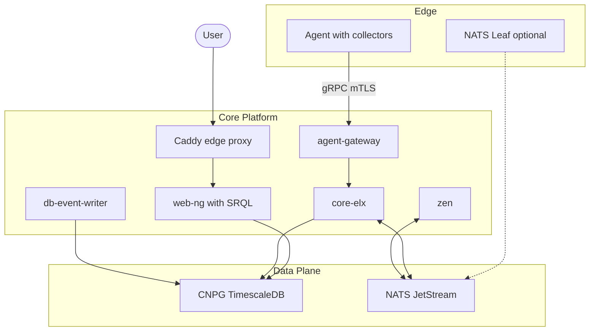
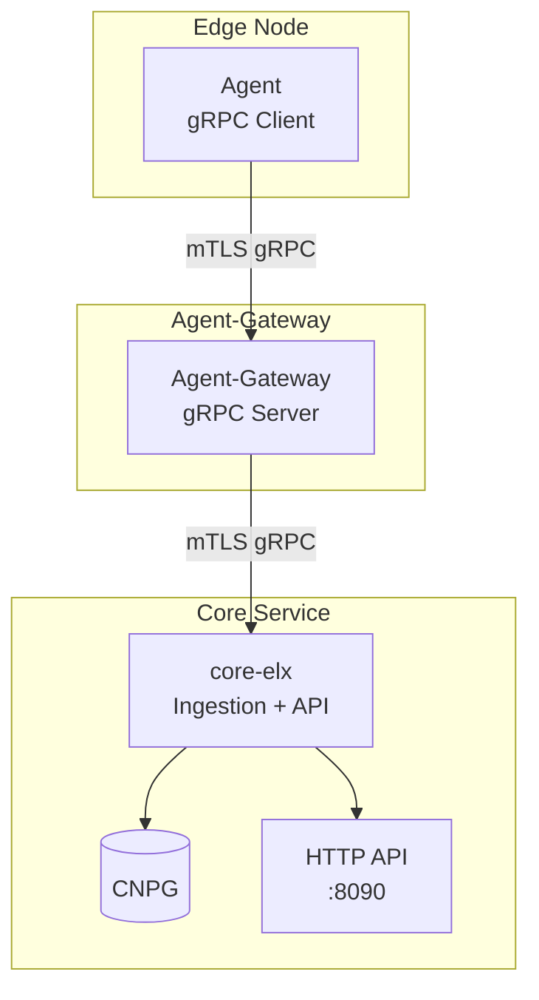
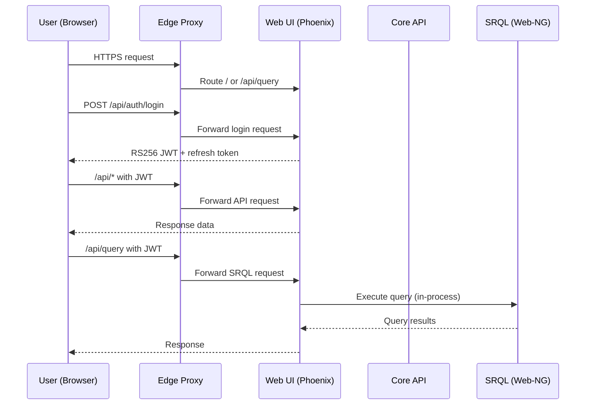
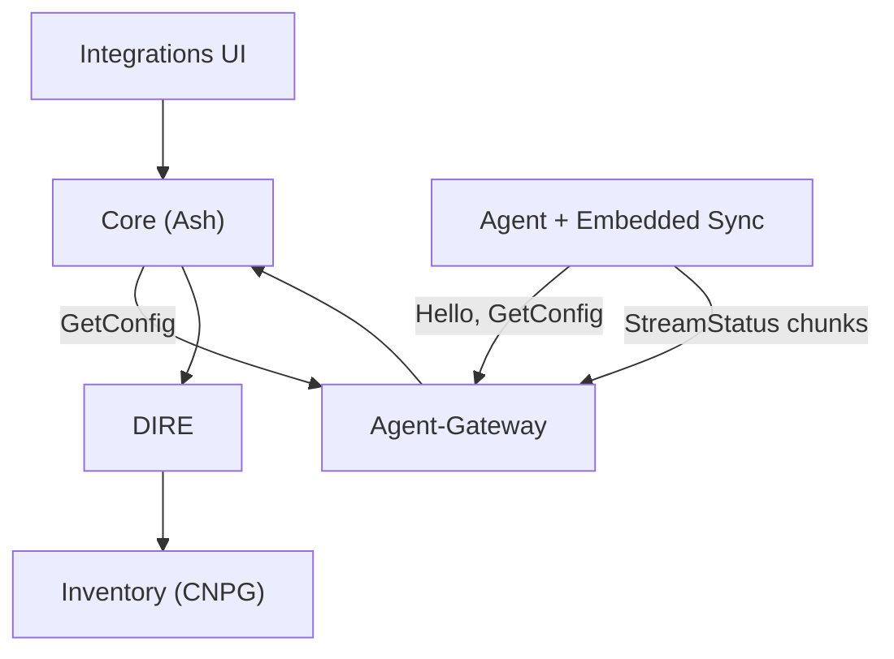

# ServiceRadar Architecture

ServiceRadar uses a distributed, multi-layered architecture designed for flexibility, reliability, and security. This page explains how the different components work together to provide robust monitoring capabilities.

## Architecture Overview

```mermaid
flowchart TB
    subgraph Edge["Edge"]
        Agent["Agent with collectors"]
        Leaf["NATS Leaf optional"]
    end

    subgraph Core["Core Platform"]
        Caddy["Caddy edge proxy"]
        Web["web-ng with SRQL"]
        Gateway["agent-gateway"]
        CoreElx["core-elx"]
        Zen["zen"]
        DBWriter["db-event-writer"]
    end

    subgraph Data["Data Plane"]
        CNPG["CNPG TimescaleDB"]
        NATS["NATS JetStream"]
    end

    User([User]) --> Caddy --> Web
    Agent -->|gRPC mTLS| Gateway --> CoreElx
    Leaf -.-> NATS

    Web --> CNPG
    CoreElx --> CNPG
    DBWriter --> CNPG
    CoreElx <--> NATS
    Zen <--> NATS
```

**Traffic flow summary:**
- **User requests** -> Caddy/Ingress -> Web-NG
- **Web-NG** serves `/`, `/api/*`, `/api/query`, and `/api/stream` and hosts SRQL via Rustler/NIF
- **Core-elx, Web-NG, and Agent-Gateway** form the internal ERTS cluster over mTLS
- **Edge agents** (Go binaries) connect via gRPC mTLS to the Agent-Gateway on port 50052
- **Edge deployments** run the agent with collectors/checkers and optionally a NATS leaf server
- **NATS JetStream + Datasvc** provide platform messaging and KV storage for platform services
- **CNPG/Timescale** is the system of record for telemetry and inventory
- **SPIRE** issues X.509 certificates to all workloads via DaemonSet agents

### Edge Agent Architecture

Edge agents are **Go binaries** that run on monitored hosts outside the Kubernetes cluster. They communicate exclusively via gRPC with mTLS:

| Property | Value |
|----------|-------|
| **Runtime** | Go binary (not Erlang/BEAM) |
| **Protocol** | gRPC with mTLS only |
| **Port** | 50052 (outbound to Agent-Gateway) |
| **Identity** | Workload-scoped X.509 certificates |
| **ERTS Access** | None (cannot join ERTS cluster) |

**Security boundaries:**
- Edge agents **cannot** join the ERTS cluster (they are not Erlang nodes)
- Edge agents **cannot** execute RPC calls on Core or Agent-Gateway nodes
- Edge agents **cannot** access Horde registries or enumerate cluster members
- Edge agents **cannot** connect to the database directly

For detailed edge agent deployment, see [Edge Agents](./edge-agents.md). For security properties, see [Security Architecture](./security-architecture.md).

### Cluster requirements

- **Ingress / edge proxy**: Docker Compose uses Caddy. Kubernetes uses your ingress controller (configured in `helm/serviceradar/values.yaml`). Ensure WebSocket support and large body sizes so LiveView and SRQL streams remain stable.

- **Persistent storage (~150GiB/node baseline)**: CNPG consumes the majority (3x100Gi PVCs from `k8s/demo/base/spire/cnpg-cluster.yaml`). JetStream adds 30Gi (`k8s/demo/base/serviceradar-nats.yaml`), OTEL 10Gi (`k8s/demo/base/serviceradar-otel.yaml`), and several 5Gi claims for Core, Datasvc, Mapper, Zen, DB event writer, plus 1Gi claims for Faker/Flowgger/Cert jobs. Spread the CNPG replicas across at least three nodes with SSD-class volumes; the extra PVCs lift per-node needs to roughly 150Gi of usable capacity when co-scheduled with CNPG.

- **CPU / memory (requested)**: Core 1 CPU / 4Gi, Agent-Gateway 0.5 CPU / 2Gi, Web 0.2 CPU / 512Mi; Datasvc 0.5 CPU / 128Mi; NATS 1 CPU / 8Gi; OTEL 0.2 CPU / 256Mi. The steady-state floor is ~4 vCPU and ~16 GiB for the core path, before adding optional sync/checker pods or horizontal scaling.

- **Identity plane**: SPIRE server (StatefulSet) and daemonset agents must be running; services expect the workload socket at `/run/spire/sockets/agent.sock` and SPIFFE IDs derived from `spire.trustDomain` in `values.yaml`.

- **TLS artifacts**: Pods mount `serviceradar-cert-data` for inter-service TLS and `cnpg-ca` for database verification; ensure these secrets/PVCs are provisioned before rolling workloads.

## Key Components

### Edge

- **Agent** runs on monitored hosts with embedded collectors and sync.
- **Agent-Gateway** is the edge ingress, receiving gRPC status/results and forwarding to core-elx.
- **Optional NATS leaf** extends JetStream to the edge when needed.

### Core Platform

- **web-ng** serves the UI and embeds SRQL via Rustler/NIF.
- **core-elx** handles control-plane APIs, DIRE, and routing.
- **zen** evaluates rule pipelines.
- **db-event-writer** persists high-volume events to CNPG.

### Data Plane

- **CNPG / TimescaleDB** stores telemetry, inventory, and analytics data.
- **NATS JetStream** provides messaging and stream persistence.
- **Datasvc (KV)** exposes configuration and object storage for platform consumers.

### Security and Identity

- **Caddy / Ingress** terminates TLS and routes `/` and `/api/*` to web-ng.
- **SPIFFE** issues workload identities for mTLS across services.

## Device Identity Canonicalization

The Device Registry reconciles identities from sync, sweeps, and external inventory sources into a canonical device record. CNPG is the source of truth for identifiers and merges.

## Security Architecture

ServiceRadar uses mTLS across internal services and JWTs for user/API access. SPIFFE/SPIRE issues workload identities and Caddy/Ingress terminates external TLS.

```mermaid
graph TB
    subgraph "Edge Node"
        AG[Agent<br/>gRPC Client]
    end

    subgraph "Agent-Gateway"
        GW[Agent-Gateway<br/>gRPC Server]
    end

    subgraph "Core Service"
        CL[core-elx<br/>Ingestion + API]
        DB[(CNPG)]
        API[HTTP API<br/>:8090]

        CL --> DB
        CL --> API
    end

    AG -->|mTLS gRPC| GW
    GW -->|mTLS gRPC| CL
```

### Web UI Authentication Flow

The edge proxy routes user traffic while the Core API validates JWTs:

```mermaid
sequenceDiagram
    participant User as User (Browser)
    participant Edge as Edge Proxy
    participant WebUI as Web UI (Phoenix)
    participant Core as Core API
    participant SRQL as SRQL (Web-NG)

    User->>Edge: HTTPS request
    Edge->>WebUI: Route / or /api/query
    User->>Edge: POST /api/auth/login
    Edge->>WebUI: Forward login request
    WebUI-->>User: RS256 JWT + refresh token
    User->>Edge: /api/* with JWT
    Edge->>WebUI: Forward API request
    WebUI-->>User: Response data
    User->>Edge: /api/query with JWT
    Edge->>WebUI: Forward SRQL request
    WebUI->>SRQL: Execute query (in-process)
    SRQL-->>WebUI: Query results
    WebUI-->>User: Response
```

- Web-NG issues and validates JWTs; expose `https://<web-host>/auth/jwks.json` when external validators need the public keys.
- JWTs are issued with short expirations; the Web UI rotates them server-side using the refresh token flow.
- Downstream agents (including the embedded sync runtime) continue to use mTLS and service credentials.

## Sync Discovery Flow (Push-First)

Sync is the primary integration runtime for IPAM/CMDB/security sources. It runs in a push-first mode inside the agent:

- Deployment-specific integration sources are configured in the Web UI and stored in Core (Ash).
- Agents enroll with agent-gateway via mTLS and fetch config via `GetConfig`.
- Embedded sync updates are streamed back to agent-gateway with ResultsChunk-compatible `StreamStatus` payloads.
- Core routes updates through DIRE before writing canonical inventory records.

```mermaid
graph TD
    UI["Integrations UI"] --> Core["Core (Ash)"]
    Core -->|GetConfig| Gateway["Agent-Gateway"]

    AgentSync["Agent + Embedded Sync"] -->|Hello, GetConfig| Gateway
    AgentSync -->|StreamStatus chunks| Gateway

    Gateway --> Core
    Core --> DIRE["DIRE"]
    DIRE --> Inventory["Inventory (CNPG)"]
```

For deployment specifics, pair this section with the [Authentication Configuration](./auth-configuration.md) and [TLS Security](./tls-security.md) guides.

## Deployment Models

ServiceRadar supports Kubernetes and Docker Compose. Agents run at the edge; the core platform runs in the cluster.

## Network Requirements

ServiceRadar uses the following network ports:

### In-Cluster Ports

| Component | Port | Protocol | Purpose |
|-----------|------|----------|---------|
| Agent-Gateway | 50052 | gRPC/TCP | Agent push ingestion (including sync results) |
| core-elx | 8090 | HTTP/TCP | API (internal) |
| Web UI | 80/443 | HTTP(S)/TCP | User interface |
| SNMP Checker | 50054 | gRPC/TCP | SNMP status queries |
| Dusk Checker | 50052 | gRPC/TCP | Dusk node monitoring |

### Edge Agent Ports

| Direction | Port | Protocol | Purpose |
|-----------|------|----------|---------|
| Edge -> Agent-Gateway | 50052 | gRPC/TCP | Status + sync results (mTLS required) |

### Firewall Requirements

**Allow from Edge Networks:**

| From | To | Port | Purpose |
|------|-----|------|---------|
| Edge Agent | Agent-Gateway | 50052 | gRPC mTLS |

**Block from Edge Networks (by design):**

| Port | Protocol | Purpose | Why Blocked |
|------|----------|---------|-------------|
| 4369 | TCP | EPMD | ERTS cluster discovery |
| 9100-9155 | TCP | ERTS Distribution | Erlang RPC |
| 5432 | TCP | PostgreSQL | Database access |
| 8090 | TCP | Core API | Internal only |

For more information on deploying ServiceRadar, see the [Installation Guide](./installation.md). For edge agent deployment, see the [Edge Agents](./edge-agents.md) documentation.
