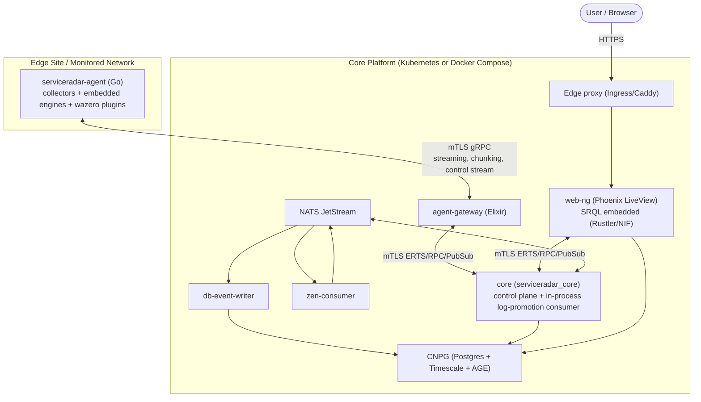

# Architecture

ServiceRadar is an IT operations and network management platform — covering network
monitoring, observability, and security analytics — built on an Elixir/ERTS control plane
and a single Go edge agent. The agent runs collectors and sandboxed Wasm plugins, then
streams results to the platform over mTLS gRPC.

This page stays high-level on purpose. It aims to give you the correct mental model before you dive into specific protocol or deployment docs.

## High-Level System Diagram

```mermaid
flowchart TB
  User([User / Browser])

  subgraph Core["Core Platform (Kubernetes or Docker Compose)"]
    Ingress["Edge proxy (Ingress/Caddy)"]
    Web["web-ng (Phoenix LiveView)<br/>SRQL embedded (Rustler/NIF)"]
    CoreSvc["core (serviceradar_core)<br/>control plane + in-process log-promotion consumer"]
    GW["agent-gateway (Elixir)"]

    NATS["NATS JetStream"]
    Zen["zen-consumer"]
    Writer["db-event-writer"]

    DB["CNPG (Postgres + Timescale + AGE)"]
  end

  subgraph Edge["Edge Site / Monitored Network"]
    Agent["serviceradar-agent (Go)<br/>collectors + embedded engines + wazero plugins"]
  end

  User -->|HTTPS| Ingress --> Web

  Agent <-->|mTLS gRPC<br/>streaming, chunking, control stream| GW
  GW <-->|mTLS ERTS/RPC/PubSub| CoreSvc
  Web <-->|mTLS ERTS/RPC/PubSub| CoreSvc

  %% Bulk ingestion
  NATS --> Zen --> NATS
  NATS <--> CoreSvc
  NATS --> Writer --> DB

  CoreSvc --> DB
  Web --> DB
```

## Control Plane (ERTS Cluster)

The core platform is an ERTS cluster of:

- `core`: APIs, orchestration, ingestion, and persistence. The control-plane OTP
  application is `serviceradar_core`; the `core` service runs it via the
  `serviceradar_core_elx` wrapper, which enables cluster mode and schedulers but
  starts no duplicate children of its own.
- `web-ng`: UI and HTTP API surface; SRQL is embedded via Rustler/NIF
- `agent-gateway`: edge ingress (agent connectivity and ingestion)

These components communicate internally over mTLS-secured Erlang distribution (ERTS), using RPC and PubSub semantics.

## Edge Agent

`serviceradar-agent` is the single edge runtime. It connects outbound to `agent-gateway` and:

- runs built-in collectors and engines (for example sync integrations, SNMP polling, discovery/mapping, mDNS)
- executes sandboxed Wasm plugins using `wazero`
- streams results using unary and streaming gRPC (chunked payloads for large datasets)
- participates in a bidirectional control stream for control-plane signaling

See [Edge Model](./edge-model.md).

## Bulk Telemetry Pipeline (NATS JetStream)

Collectors publish bulk telemetry into JetStream (commonly the `events` stream). The platform runs:

- `zen-consumer` (normalization), a standalone service
- `log-promotion`, an in-process JetStream pull consumer inside `serviceradar_core`
  that promotes matching logs into OCSF-style events
- `db-event-writer` (persistence into CNPG), a standalone service

See [Data Pipeline](./data-pipeline.md).

### Kubernetes HA Profile

The Helm chart defaults stay conservative, but a validated Kubernetes HA profile
runs the control plane and ingest workers with multiple replicas. For the
queue-backed services, the HA pattern is shared JetStream streams and shared
durable pull consumers rather than local singleton disk state. See
[Helm Configuration](./helm-configuration.md) for replica counts and JetStream
sizing.

## Identity And TLS

- Everything is mTLS by default.
- SPIFFE/SPIRE is supported in Kubernetes deployments.
- Docker Compose uses non-SPIFFE mTLS bootstrapping (cert generation + distribution via volumes).

See [TLS / mTLS](./tls-security.md).
