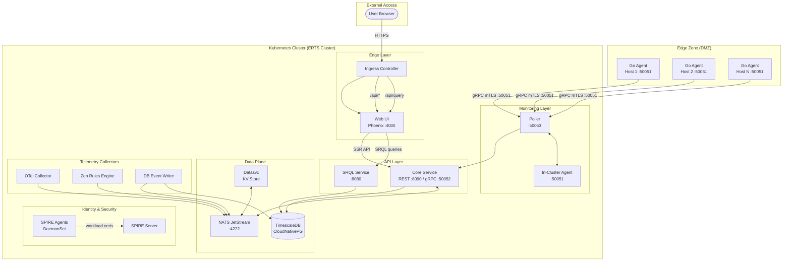
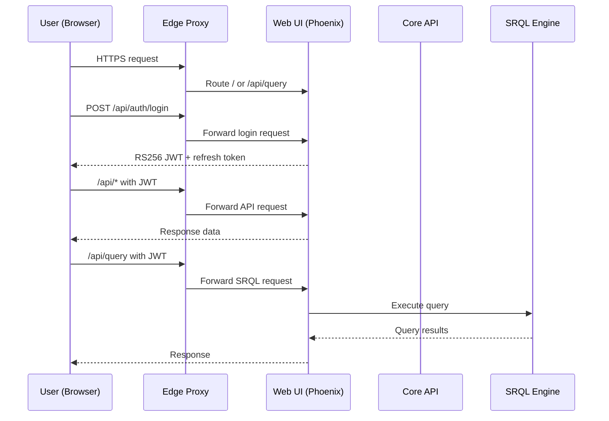

# ServiceRadar Architecture

ServiceRadar uses a distributed, multi-layered architecture designed for flexibility, reliability, and security. This page explains how the different components work together to provide robust monitoring capabilities.

## Architecture Overview

**Traffic flow summary:**
- **User requests** → Ingress → Web UI (static/SSR) and Core (API)
- **Web-NG** serves `/api/*`, `/api/query`, and `/api/stream`
- **Edge agents** (Go binaries) connect via gRPC mTLS to the Poller on port 50051
- **NATS JetStream** provides pub/sub messaging and KV storage for all services
- **SPIRE** issues X.509 certificates to all workloads via DaemonSet agents

### Edge Agent Architecture

Edge agents are **Go binaries** that run on monitored hosts outside the Kubernetes cluster. They communicate exclusively via gRPC with mTLS:

| Property | Value |
|----------|-------|
| **Runtime** | Go binary (not Erlang/BEAM) |
| **Protocol** | gRPC with mTLS only |
| **Port** | 50051 (outbound to Poller) |
| **Identity** | Tenant-specific X.509 certificates |
| **ERTS Access** | None (cannot join ERTS cluster) |

**Security boundaries:**
- Edge agents **cannot** join the ERTS cluster (they are not Erlang nodes)
- Edge agents **cannot** execute RPC calls on Core or Poller nodes
- Edge agents **cannot** access Horde registries or enumerate other tenants' agents
- Edge agents **cannot** connect to the database directly

For detailed edge agent deployment, see [Edge Agents](./edge-agents.md). For security properties, see [Security Architecture](./security-architecture.md).

### Cluster requirements

- **Ingress**: Required for the web UI and API. Default host/class/TLS come from `helm/serviceradar/values.yaml` (`ingress.enabled=true`, `host=demo.serviceradar.cloud`, `className=nginx`, `tls.secretName=serviceradar-prod-tls`, `tls.clusterIssuer=carverauto-issuer`). If you use nginx, mirror the demo annotations (`nginx.ingress.kubernetes.io/proxy-body-size: 100m`, `proxy-buffer-size: 128k`, `proxy-buffers-number: 4`, `proxy-busy-buffers-size: 256k`, `proxy-read-timeout: 86400`, `proxy-send-timeout: 86400`, `proxy-connect-timeout: 60`) to keep SRQL streams and large asset uploads stable (`k8s/demo/prod/ingress.yaml`).

- **Persistent storage (~150GiB/node baseline)**: CNPG consumes the majority (3×100Gi PVCs from `k8s/demo/base/spire/cnpg-cluster.yaml`). JetStream adds 30Gi (`k8s/demo/base/serviceradar-nats.yaml`), OTEL 10Gi (`k8s/demo/base/serviceradar-otel.yaml`), and several 5Gi claims for Core, Datasvc, Mapper, Zen, DB event writer, plus 1Gi claims for Faker/Flowgger/Cert jobs. Spread the CNPG replicas across at least three nodes with SSD-class volumes; the extra PVCs lift per-node needs to roughly 150Gi of usable capacity when co-scheduled with CNPG.

- **CPU / memory (requested)**: Core 1 CPU / 4Gi, Poller 0.5 CPU / 2Gi (`k8s/demo/base/serviceradar-core.yaml`, `serviceradar-poller.yaml`); Web 0.2 CPU / 512Mi; Datasvc 0.5 CPU / 128Mi; SRQL 0.1 CPU / 128Mi; NATS 1 CPU / 8Gi; OTEL 0.2 CPU / 256Mi. The steady-state floor is ~4 vCPU and ~16 GiB for the core path, before adding optional sync/checker pods or horizontal scaling.

- **Identity plane**: SPIRE server (StatefulSet) and daemonset agents must be running; services expect the workload socket at `/run/spire/sockets/agent.sock` and SPIFFE IDs derived from `spire.trustDomain` in `values.yaml`.

- **TLS artifacts**: Pods mount `serviceradar-cert-data` for inter-service TLS and `cnpg-ca` for database verification; ensure these secrets/PVCs are provisioned before rolling workloads.

## Key Components

### Agent (Monitored Host)

The Agent runs on each host you want to monitor and is responsible for:

- Collecting service status information (process status, port availability, etc.)
- Exposing a gRPC service on port 50051 for Pollers to query
- Supporting various checker types (process, port, SNMP, etc.)
- Running with minimal privileges for security

**Technical Details:**
- Written in Go for performance and minimal dependencies
- Uses gRPC for efficient, language-agnostic communication
- Supports dynamic loading of checker plugins
- Can run on constrained hardware with minimal resource usage

### Poller (Monitoring Coordinator)

The Poller coordinates monitoring activities and is responsible for:

- Querying multiple Agents at configurable intervals
- Aggregating status data from Agents
- Reporting status to the Core Service
- Performing direct checks (HTTP, ICMP, etc.)
- Supporting network sweeps and discovery

**Technical Details:**
- Runs on port 50053 for gRPC communications
- Stateless design allows multiple Pollers for high availability
- Configurable polling intervals for different check types
- Supports both pull-based (query) and push-based (events) monitoring

### Core Service (API & Processing)

The Core Service is the central component that:

- Receives and processes reports from Pollers
- Provides an internal control-plane API on port 8090
- Triggers alerts based on configurable thresholds
- Stores historical monitoring data
- Manages webhook notifications

**Technical Details:**
- Exposes a gRPC service on port 50052 for Poller connections
- Provides a RESTful API on port 8090 for internal services
- Uses role-based security model
- Implements webhook templating for flexible notifications

### Web UI (User Interface)

The Web UI provides a modern dashboard interface that:

- Visualizes the status of monitored services
- Displays historical performance data
- Provides configuration management
- Calls Core APIs directly via the edge proxy and serves SRQL queries

**Technical Details:**
- Built with Phoenix LiveView for server-rendered, stateful dashboards
- Exposed through the cluster ingress to `serviceradar-web-ng` (port 4000)
- Exchanges JWTs directly with the Core API; the edge proxy only terminates TLS
- Supports responsive design for mobile and desktop

### Edge Proxy (Ingress/Caddy/Nginx)

The edge proxy terminates TLS and routes user traffic:

- Routes `/` and `/api/*` to `serviceradar-web-ng`
- Preserves WebSocket headers for LiveView and SRQL streaming

### SPIFFE Identity Plane

Core, Poller, Datasvc, and Agent rely on SPIFFE identities issued by the SPIRE
stack that ships with the demo kustomization and Helm chart. The SPIRE server
StatefulSet now embeds the upstream controller manager to reconcile
`ClusterSPIFFEID` resources and keep workload certificates synchronized. For a
deep dive into the manifests, controller configuration, and operational
workflow see [SPIFFE / SPIRE Identity Platform](spiffe-identity.md).

### SRQL Service (Query Engine)

The SRQL microservice executes ServiceRadar Query Language requests:

- Exposes `/api/query` (HTTP) and `/api/stream` (WebSocket) for bounded and streaming query execution
- Runs as a Rust service (or embedded SRQL engine) that translates SRQL to Timescale-compatible SQL before dispatching the query
- Honors SRQL auth configuration (API key or core-issued JWTs) while relying on the edge proxy for TLS
- Streams results back to the Web UI, which renders them in explorers and dashboards

## Device Identity Canonicalization

Modern environments discover the same device from multiple angles—Armis inventory pushes metadata, KV sweep configurations create synthetic device IDs per partition, and Pollers learn about live status through TCP/ICMP sweeps. Because the Timescale hypertables are append-only, every new IP address or partition shuffle historically produced a brand-new `device_id`. That broke history stitching and created duplicate monitors whenever DHCP reassigned an address.

To fix this, the Device Registry now picks a canonical identity per real-world device and keeps all telemetry flowing into that record:

- **Canonical selection**: When Armis or NetBox provide a strong identifier, the registry prefers the most recent `_tp_time` entry for that identifier and treats it as the source of truth (the canonical `device_id`).
- **Sweep normalization**: Any sweep-only alias (`partition:ip`) is merged into the canonical record so Poller results land on the device the UI already knows about.
- **Metadata hints**: `_merged_into` markers are written on non-canonical rows so downstream consumers can recognise historical merges.

**Note:** KV is NOT used for device identity resolution. CNPG (PostgreSQL) is the authoritative source for identity via the `device_identifiers` table. The IdentityEngine in `pkg/registry` uses strong identifiers (Armis ID, MAC, etc.) to generate deterministic `sr:` UUIDs and stores mappings in CNPG with an in-memory cache for performance.

### Monitoring identity lookups

The core lookup path emits OpenTelemetry metrics so operators can see how identity resolution behaves in real time:

- `identitymap_lookup_latency_seconds` (labels: `resolved_via=db|miss|error`, `found=true|false`) measures end-to-end latency for resolving canonical devices via CNPG.

Feed these metrics into the OTEL collector (`cmd/otel`) to populate Prometheus dashboards.

## Security Architecture

ServiceRadar implements multiple layers of security:

### mTLS Security

For network communication between components, ServiceRadar supports mutual TLS (mTLS):

### Web UI Authentication Flow

The edge proxy routes user traffic while the Core API validates JWTs:

- Web-NG issues and validates JWTs; expose `https://<web-host>/auth/jwks.json` when external validators need the public keys.
- JWTs are issued with short expirations; the Web UI rotates them server-side using the refresh token flow.
- Downstream services (pollers, sync workers) continue to use mTLS and service credentials.

For deployment specifics, pair this section with the [Authentication Configuration](./auth-configuration.md) and [TLS Security](./tls-security.md) guides.

## Deployment Models

ServiceRadar supports multiple deployment models:

### Standard Deployment

All components installed on separate machines for optimal security and reliability:

### Minimal Deployment

For smaller environments, components can be co-located:

### High Availability Deployment

For mission-critical environments:

## Network Requirements

ServiceRadar uses the following network ports:

### In-Cluster Ports

| Component | Port | Protocol | Purpose |
|-----------|------|----------|---------|
| Agent | 50051 | gRPC/TCP | Service status queries |
| Poller | 50053 | gRPC/TCP | Health checks |
| Core | 50052 | gRPC/TCP | Poller connections |
| Core | 8090 | HTTP/TCP | API (internal) |
| Web UI | 80/443 | HTTP(S)/TCP | User interface |
| SNMP Checker | 50054 | gRPC/TCP | SNMP status queries |
| Dusk Checker | 50052 | gRPC/TCP | Dusk node monitoring |

### Edge Agent Ports

| Direction | Port | Protocol | Purpose |
|-----------|------|----------|---------|
| Edge → Poller | 50051 | gRPC/TCP | Service check results (mTLS required) |

### Firewall Requirements

**Allow from Edge Networks:**

| From | To | Port | Purpose |
|------|-----|------|---------|
| Edge Agent | Poller | 50051 | gRPC mTLS |

**Block from Edge Networks (by design):**

| Port | Protocol | Purpose | Why Blocked |
|------|----------|---------|-------------|
| 4369 | TCP | EPMD | ERTS cluster discovery |
| 9100-9155 | TCP | ERTS Distribution | Erlang RPC |
| 5432 | TCP | PostgreSQL | Database access |
| 8090 | TCP | Core API | Internal only |

For more information on deploying ServiceRadar, see the [Installation Guide](./installation.md). For edge agent deployment, see the [Edge Agents](./edge-agents.md) documentation.
