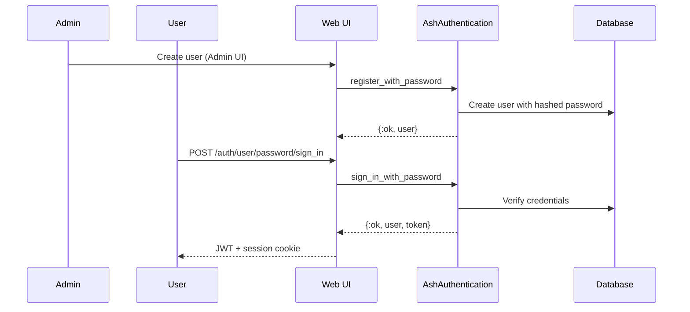
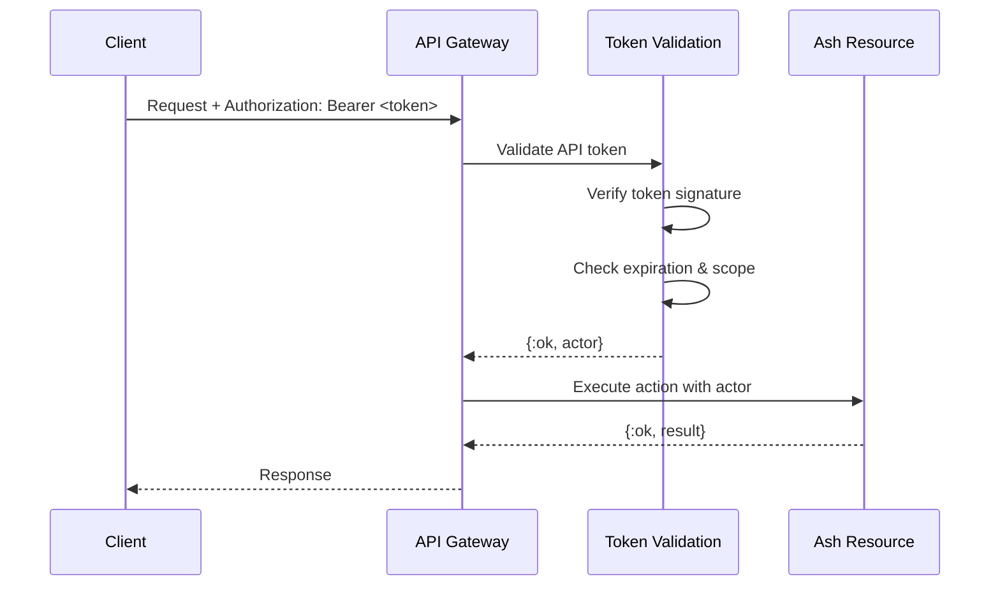

# Authentication Flows

ServiceRadar uses [AshAuthentication](https://hexdocs.pm/ash_authentication/) for user authentication with password and API token strategies.

## Authentication Strategies

### Password Authentication

Standard email/password authentication with bcrypt hashing. Self-service registration is disabled; admins create users.


```mermaid
sequenceDiagram
    participant Admin
    participant User
    participant Web as Web UI
    participant Auth as AshAuthentication
    participant DB as Database

    Admin->>Web: Create user (Admin UI)
    Web->>Auth: register_with_password
    Auth->>DB: Create user with hashed password
    Auth-->>Web: {:ok, user}

    User->>Web: POST /auth/user/password/sign_in
    Web->>Auth: sign_in_with_password
    Auth->>DB: Verify credentials
    Auth-->>Web: {:ok, user, token}
    Web-->>User: JWT + session cookie
```

**Actions:**
- `register_with_password` - Admin/system-only create user account
- `sign_in_with_password` - Authenticate existing user

### Bootstrap Admin User

On first install, web-ng bootstraps an admin user from environment credentials. The default email is
`root@localhost`, and the password is sourced from either `SERVICERADAR_ADMIN_PASSWORD` or
`SERVICERADAR_ADMIN_PASSWORD_FILE` (Compose writes the password to a volume and logs it once).

### API Token Authentication

For programmatic API access:


```mermaid
sequenceDiagram
    participant Client
    participant API as API Gateway
    participant Auth as Token Validation
    participant Resource as Ash Resource

    Client->>API: Request + Authorization: Bearer <token>
    API->>Auth: Validate API token
    Auth->>Auth: Verify token signature
    Auth->>Auth: Check expiration & scope
    Auth-->>API: {:ok, actor}
    API->>Resource: Execute action with actor
    Resource-->>API: {:ok, result}
    API-->>Client: Response
```

**Token Scopes:**
- `read_only` - Read access to resources
- `full_access` - Read and write access
- `admin` - Full administrative access

## User Resource Configuration

```elixir
defmodule ServiceRadar.Identity.User do
  use Ash.Resource,
    domain: ServiceRadar.Identity,
    extensions: [AshAuthentication]

  authentication do
    tokens do
      enabled? true
      token_resource ServiceRadar.Identity.Token
      signing_secret fn _, _ ->
        Application.fetch_env!(:serviceradar_core, :token_signing_secret)
      end
    end

    strategies do
      password :password do
        identity_field :email
        hashed_password_field :hashed_password
        registration_enabled? false

        resettable do
          sender ServiceRadar.Identity.Senders.SendPasswordResetEmail
        end
      end
    end

    add_ons do
      confirmation :confirm_email do
        monitor_fields [:email]
        sender ServiceRadar.Identity.Senders.SendConfirmationEmail
      end
    end
  end
end
```

## Role-Based Access

Users have a `role` attribute determining their permissions:

| Role | Description | Capabilities |
|------|-------------|--------------|
| `viewer` | Read-only access | View resources in the deployment |
| `operator` | Standard operator | Create, update resources |
| `admin` | Administrator | Full instance management |

**Role Assignment:**
```elixir
user
|> Ash.Changeset.for_update(:update_role, %{role: :admin})
|> Ash.update!()
```

## Session Management

### Phoenix LiveView Integration

Sessions are managed through Phoenix plugs and LiveView hooks:

```elixir
# Router pipeline
pipeline :browser do
  plug :fetch_session
  plug :fetch_current_scope_for_user
end

# LiveView mount hook
live_session :require_authenticated_user,
  on_mount: [{ServiceRadarWebNGWeb.UserAuth, :require_authenticated}] do
  live "/dashboard", DashboardLive
end
```

### Actor Context

The authenticated user is available as an actor in Ash operations:

```elixir
# In LiveView
def mount(_params, _session, socket) do
  scope = socket.assigns.current_scope

  {:ok, devices} =
    ServiceRadar.Inventory.Device
    |> Ash.Query.for_read(:list)
    |> Ash.read(scope: scope)

  {:ok, assign(socket, devices: devices)}
end
```

## Token Configuration

JWT tokens are configured in `runtime.exs`:

```elixir
config :serviceradar_core,
  token_signing_secret: System.get_env("TOKEN_SIGNING_SECRET"),
  token_lifetime: 86_400  # 24 hours
```

**Token Structure:**
```json
{
  "sub": "user_id",
  "iat": 1703520000,
  "exp": 1703606400,
  "jti": "unique_token_id",
  "purpose": "user",
  "role": "admin"
}
```

Note: In the single-deployment model, schema context is implicit from the deployment itself.
Tokens don't include deployment identifiers - PostgreSQL schema isolation (via CNPG search_path)
handles boundaries.

## API Token Management

Create and manage API tokens programmatically:

```elixir
# Create token
{:ok, token} =
  ServiceRadar.Identity.ApiToken
  |> Ash.Changeset.for_create(:create, %{
    name: "CI/CD Token",
    scope: :full_access,
    expires_at: DateTime.add(DateTime.utc_now(), 30, :day)
  })
  |> Ash.create(actor: admin_user)

# Validate token
{:ok, validated} =
  ServiceRadar.Identity.ApiToken
  |> Ash.Query.for_read(:validate, %{token: raw_token})
  |> Ash.read_one(authorize?: false)

# Revoke token
{:ok, _} =
  token
  |> Ash.Changeset.for_update(:revoke)
  |> Ash.update(actor: admin_user)
```

## Security Best Practices

1. **Token Rotation** - Refresh tokens before expiration
2. **Scope Limitation** - Use minimal required scopes
3. **Token Revocation** - Revoke tokens when no longer needed
4. **Audit Logging** - All token usage is recorded
5. **Rate Limiting** - Failed auth attempts are rate-limited
