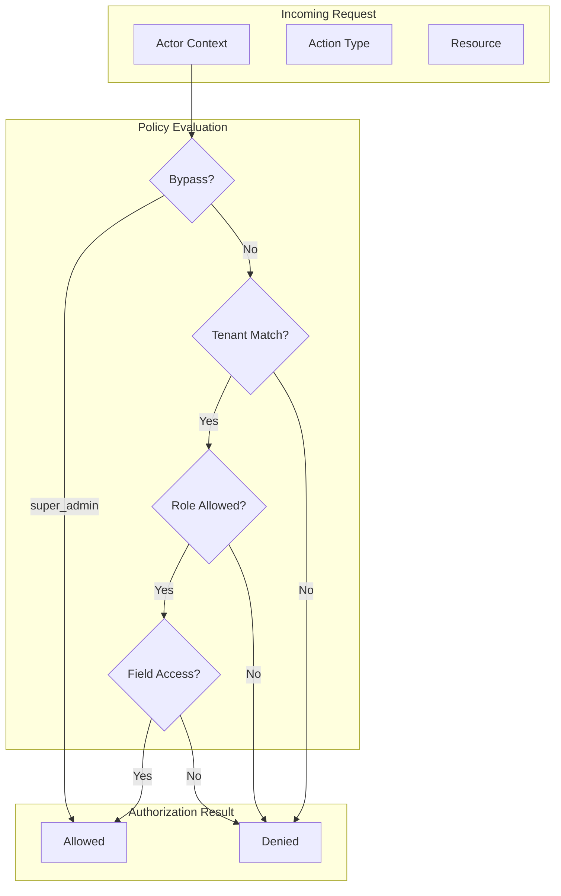

# Authorization Policies

ServiceRadar uses Ash policies for fine-grained access control with multi-tenancy enforcement.

## Policy Architecture



## Actor Structure

Every Ash operation requires an actor with these attributes:

```elixir
%{
  id: "user_uuid",
  email: "user@example.com",
  role: :admin,           # :viewer | :operator | :admin | :super_admin
  tenant_id: "tenant_uuid"
}
```

## Policy Patterns

### Super Admin Bypass

Super admins bypass all tenant and resource policies:

```elixir
policies do
  bypass always() do
    authorize_if actor_attribute_equals(:role, :super_admin)
  end
end
```

### Tenant Isolation

All tenant-scoped resources enforce tenant isolation:

```elixir
policy action_type(:read) do
  authorize_if expr(
    ^actor(:role) in [:viewer, :operator, :admin] and
    tenant_id == ^actor(:tenant_id)
  )
end
```

### Role-Based Policies

Different actions require different roles:

```elixir
# Read: Any authenticated tenant user
policy action_type(:read) do
  authorize_if actor_attribute_equals(:role, :viewer)
  authorize_if actor_attribute_equals(:role, :operator)
  authorize_if actor_attribute_equals(:role, :admin)
end

# Create/Update: Operators and admins
policy action([:create, :update]) do
  authorize_if actor_attribute_equals(:role, :operator)
  authorize_if actor_attribute_equals(:role, :admin)
end

# Destroy: Admins only
policy action(:destroy) do
  authorize_if actor_attribute_equals(:role, :admin)
end
```

## Resource Policy Examples

### Device Resource

```elixir
defmodule ServiceRadar.Inventory.Device do
  policies do
    bypass always() do
      authorize_if actor_attribute_equals(:role, :super_admin)
    end

    # Viewers, operators, admins can read devices in their tenant
    policy action_type(:read) do
      authorize_if expr(
        ^actor(:role) in [:viewer, :operator, :admin] and
        tenant_id == ^actor(:tenant_id)
      )
    end

    # Only operators and admins can modify devices
    policy action([:create, :update, :mark_available, :mark_unavailable]) do
      authorize_if expr(
        ^actor(:role) in [:operator, :admin] and
        tenant_id == ^actor(:tenant_id)
      )
    end
  end
end
```

### Alert Resource

```elixir
defmodule ServiceRadar.Monitoring.Alert do
  policies do
    bypass always() do
      authorize_if actor_attribute_equals(:role, :super_admin)
    end

    # Read access for all tenant users
    policy action_type(:read) do
      authorize_if expr(
        ^actor(:role) in [:viewer, :operator, :admin] and
        tenant_id == ^actor(:tenant_id)
      )
    end

    # Acknowledge: Operators and admins in same tenant
    policy action(:acknowledge) do
      authorize_if expr(
        ^actor(:role) in [:operator, :admin] and
        tenant_id == ^actor(:tenant_id)
      )
    end

    # Resolve: Operators and admins in same tenant
    policy action(:resolve) do
      authorize_if expr(
        ^actor(:role) in [:operator, :admin] and
        tenant_id == ^actor(:tenant_id)
      )
    end

    # AshOban triggers run without actor - allow system actions
    policy action([:auto_escalate, :send_notification]) do
      authorize_if always()
    end
  end
end
```

## Permission Matrix

| Action Type | viewer | operator | admin | super_admin |
|-------------|--------|----------|-------|-------------|
| Read (own tenant) | Yes | Yes | Yes | Yes |
| Read (other tenant) | No | No | No | Yes |
| Create | No | Yes | Yes | Yes |
| Update | No | Yes | Yes | Yes |
| Destroy | No | No | Yes | Yes |
| System Config | No | No | No | Yes |

## Sensitive Field Protection

Fields can be hidden using `public? false`:

```elixir
attributes do
  attribute :hashed_password, :string do
    public? false  # Never exposed in API/queries
  end

  attribute :tenant_id, :uuid do
    public? false  # Internal use only
  end
end
```

## Policy Testing

Test policies with multi-tenant scenarios:

```elixir
defmodule ServiceRadar.Inventory.DevicePolicyTest do
  use ServiceRadarWebNG.DataCase
  use ServiceRadarWebNG.AshTestHelpers

  describe "tenant isolation" do
    test "viewer cannot read devices from other tenant" do
      scenario = multi_tenant_scenario()
      tenant_a_device = device_fixture(scenario.tenant_a.tenant)
      tenant_b_viewer = viewer_actor(scenario.tenant_b.tenant)

      assert {:error, %Ash.Error.Forbidden{}} =
        ServiceRadar.Inventory.Device
        |> Ash.Query.for_read(:by_id, %{id: tenant_a_device.id})
        |> Ash.read_one(actor: tenant_b_viewer)
    end

    test "admin can read devices in own tenant" do
      tenant = tenant_fixture()
      device = device_fixture(tenant)
      admin = admin_actor(tenant)

      assert {:ok, read_device} =
        ServiceRadar.Inventory.Device
        |> Ash.Query.for_read(:by_id, %{id: device.id})
        |> Ash.read_one(actor: admin)

      assert read_device.id == device.id
    end
  end
end
```

## Authorization Errors

When authorization fails, Ash returns structured errors:

```elixir
{:error, %Ash.Error.Forbidden{
  errors: [
    %Ash.Error.Forbidden.Policy{
      policies: [...],
      facts: %{...},
      filter: nil,
      resource: ServiceRadar.Inventory.Device,
      action: :read
    }
  ]
}}
```

## API Authorization

JSON:API endpoints inherit resource policies:

```
GET /api/v2/devices
Authorization: Bearer <jwt>

# Returns only devices where:
# 1. User role allows read access
# 2. Device tenant_id matches user's tenant_id
```

## Authorization Tracing

Enable policy tracing for debugging:

```elixir
# In development
Ash.read(query,
  actor: actor,
  tracer: Ash.Tracer.Simple
)
```
