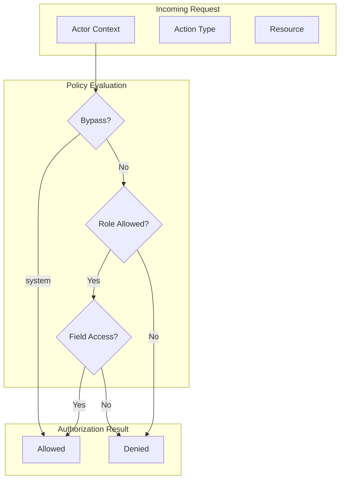

# Authorization Policies

ServiceRadar uses Ash policies for fine-grained access control with database-enforced isolation.

## Policy Architecture


```mermaid
graph TB
    subgraph Request["Incoming Request"]
        Actor[Actor Context]
        Action[Action Type]
        Resource[Resource]
    end

    subgraph PolicyEval["Policy Evaluation"]
        Bypass{Bypass?}
        RoleCheck{Role Allowed?}
        FieldPolicy{Field Access?}
    end

    subgraph Result["Authorization Result"]
        Allowed[Allowed]
        Denied[Denied]
    end

    Actor --> Bypass
    Bypass -->|system| Allowed
    Bypass -->|No| RoleCheck
    RoleCheck -->|Yes| FieldPolicy
    RoleCheck -->|No| Denied
    FieldPolicy -->|Yes| Allowed
    FieldPolicy -->|No| Denied
```

## Actor Structure

Every Ash operation requires an actor with these attributes:

```elixir
%{
  id: "user_uuid",
  email: "user@example.com",
  role: :admin           # :viewer | :operator | :admin | :system
}
```

Note: In the single-tenant-per-deployment model, tenant isolation is handled at the
infrastructure level via PostgreSQL schema isolation (CNPG search_path). Actors don't
need a tenant identifier field - the tenant is implicit from the deployment.

## Policy Patterns

### System Actor Bypass

System actors (background jobs, GenServers) bypass authorization:

```elixir
policies do
  bypass always() do
    authorize_if actor_attribute_equals(:role, :system)
  end
end
```

### Instance Isolation

Resources are isolated by PostgreSQL schema (via CNPG search_path):

```elixir
# No tenant checks needed - schema isolation is at database level
policy action_type(:read) do
  authorize_if expr(
    ^actor(:role) in [:viewer, :operator, :admin]
  )
end
```

### Role-Based Policies

Different actions require different roles:

```elixir
# Read: Any authenticated tenant user
policy action_type(:read) do
  authorize_if actor_attribute_equals(:role, :viewer)
  authorize_if actor_attribute_equals(:role, :operator)
  authorize_if actor_attribute_equals(:role, :admin)
end

# Create/Update: Operators and admins
policy action([:create, :update]) do
  authorize_if actor_attribute_equals(:role, :operator)
  authorize_if actor_attribute_equals(:role, :admin)
end

# Destroy: Admins only
policy action(:destroy) do
  authorize_if actor_attribute_equals(:role, :admin)
end
```

## Resource Policy Examples

### Device Resource

```elixir
defmodule ServiceRadar.Inventory.Device do
  policies do
    # System actors (background jobs) bypass authorization
    bypass always() do
      authorize_if actor_attribute_equals(:role, :system)
    end

    # Viewers, operators, admins can read devices
    # (tenant isolation handled by PostgreSQL schema)
    policy action_type(:read) do
      authorize_if expr(
        ^actor(:role) in [:viewer, :operator, :admin]
      )
    end

    # Only operators and admins can modify devices
    policy action([:create, :update, :mark_available, :mark_unavailable]) do
      authorize_if expr(
        ^actor(:role) in [:operator, :admin]
      )
    end
  end
end
```

### Alert Resource

```elixir
defmodule ServiceRadar.Monitoring.Alert do
  policies do
    # System actors bypass authorization
    bypass always() do
      authorize_if actor_attribute_equals(:role, :system)
    end

    # Read access for all authenticated users
    policy action_type(:read) do
      authorize_if expr(
        ^actor(:role) in [:viewer, :operator, :admin]
      )
    end

    # Acknowledge: Operators and admins
    policy action(:acknowledge) do
      authorize_if expr(
        ^actor(:role) in [:operator, :admin]
      )
    end

    # Resolve: Operators and admins
    policy action(:resolve) do
      authorize_if expr(
        ^actor(:role) in [:operator, :admin]
      )
    end

    # AshOban triggers run with system actor
    policy action([:auto_escalate, :send_notification]) do
      authorize_if actor_attribute_equals(:role, :system)
    end
  end
end
```

## Permission Matrix

| Action Type | viewer | operator | admin | system |
|-------------|--------|----------|-------|--------|
| Read | Yes | Yes | Yes | Yes |
| Create | No | Yes | Yes | Yes |
| Update | No | Yes | Yes | Yes |
| Destroy | No | No | Yes | Yes |
| System Config | No | No | No | Yes |

## Sensitive Field Protection

Fields can be hidden using `public? false`:

```elixir
attributes do
  attribute :hashed_password, :string do
    public? false  # Never exposed in API/queries
  end
end
```

## Policy Testing

Test policies with role-based scenarios:

```elixir
defmodule ServiceRadar.Inventory.DevicePolicyTest do
  use ServiceRadarWebNG.DataCase
  use ServiceRadarWebNG.AshTestHelpers

  describe "role-based access" do
    test "viewer can read devices" do
      device = device_fixture()
      viewer = viewer_actor()

      assert {:ok, read_device} =
        ServiceRadar.Inventory.Device
        |> Ash.Query.for_read(:by_id, %{id: device.id})
        |> Ash.read_one(actor: viewer)

      assert read_device.id == device.id
    end

    test "viewer cannot create devices" do
      viewer = viewer_actor()

      assert {:error, %Ash.Error.Forbidden{}} =
        ServiceRadar.Inventory.Device
        |> Ash.Changeset.for_create(:create, %{name: "test"})
        |> Ash.create(actor: viewer)
    end
  end
end
```

## Authorization Errors

When authorization fails, Ash returns structured errors:

```elixir
{:error, %Ash.Error.Forbidden{
  errors: [
    %Ash.Error.Forbidden.Policy{
      policies: [...],
      facts: %{...},
      filter: nil,
      resource: ServiceRadar.Inventory.Device,
      action: :read
    }
  ]
}}
```

## API Authorization

JSON:API endpoints inherit resource policies:

```
GET /api/v2/devices
Authorization: Bearer <jwt>

# Returns devices based on:
# 1. User role allows read access
# 2. PostgreSQL schema isolation (automatic via search_path)
```

## Authorization Tracing

Enable policy tracing for debugging:

```elixir
# In development
Ash.read(query,
  actor: actor,
  tracer: Ash.Tracer.Simple
)
```
