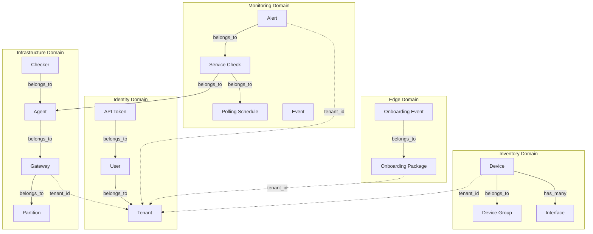

# Ash Domain Architecture

ServiceRadar uses the [Ash Framework](https://ash-hq.org/) to organize business logic into well-defined domains. Each domain encapsulates related resources with their actions, policies, and validations.

## Domain Overview



## Multi-Tenancy

Tenant-scoped resources use **schema-based multitenancy** (`strategy :context`) and are stored
under `tenant_<slug>` schemas. Platform-managed resources (tenants, users, tenant memberships,
NATS platform tables, Oban, job schedules) remain in the public schema.

```elixir
multitenancy do
  strategy :context
end
```

The `tenant` option is passed from the actor's tenant context and enforced in policies.

## Domain Modules

### ServiceRadar.Identity

User authentication and tenant management.

| Resource | Description | Key Actions |
|----------|-------------|-------------|
| `Tenant` | Organization/account | `create`, `update`, `read` |
| `User` | User accounts | `register_with_password`, `sign_in_with_password`, `update_role` |
| `ApiToken` | API access tokens | `create`, `validate`, `revoke`, `record_use` |

**Extensions:** AshAuthentication, AshCloak (PII encryption)

### ServiceRadar.Inventory

Device and network asset tracking.

| Resource | Description | Key Actions |
|----------|-------------|-------------|
| `Device` | Network devices (OCSF-aligned) | `create`, `update`, `mark_available`, `mark_unavailable` |
| `DeviceGroup` | Logical device groupings | `create`, `update`, `add_device`, `remove_device` |
| `Interface` | Network interfaces | `create`, `update` |

**Features:** MAC/IP identity resolution, external ID linking (Armis, NetBox)

### ServiceRadar.Infrastructure

Monitoring infrastructure components.

| Resource | Description | Key Actions |
|----------|-------------|-------------|
| `Partition` | Network segments (CIDR ranges) | `create`, `update`, `validate_cidr` |
| `Gateway` | Job coordinators | `register`, `heartbeat`, `mark_available` |
| `Agent` | Monitoring agents | `register`, `update_status`, `connect`, `disconnect` |
| `Checker` | Check implementations | `create`, `enable`, `disable` |

**Extensions:** AshStateMachine (Agent lifecycle states)

**Agent States:**
- `pending` → `active` → `idle` → `disconnected`
- `active` ↔ `draining` (graceful shutdown)

### ServiceRadar.Monitoring

Service checks, alerts, and events.

| Resource | Description | Key Actions |
|----------|-------------|-------------|
| `PollingSchedule` | Check scheduling | `create`, `execute`, `record_result`, `acquire_lock` |
| `ServiceCheck` | Individual checks | `create`, `execute`, `record_result`, `enable`, `disable` |
| `Alert` | Alert management | `trigger`, `acknowledge`, `resolve`, `escalate`, `suppress` |
| `Event` | System events | `record` |

**Extensions:**
- AshStateMachine (Alert states: `pending` → `acknowledged` → `resolved`/`escalated`)
- AshOban (scheduled check execution, alert escalation)

### ServiceRadar.Edge

Edge device onboarding and lifecycle.

| Resource | Description | Key Actions |
|----------|-------------|-------------|
| `OnboardingPackage` | Edge onboarding bundles | `create`, `deliver`, `activate`, `revoke`, `expire` |
| `OnboardingEvent` | Package lifecycle events | `record` |

**Extensions:**
- AshStateMachine (Package states: `issued` → `delivered` → `activated`/`expired`/`revoked`)
- AshOban (`expire_packages` trigger for automatic expiration)

## Background Jobs (AshOban)

ServiceRadar uses AshOban for scheduled background processing:

| Resource | Trigger | Queue | Cron | Description |
|----------|---------|-------|------|-------------|
| `OnboardingPackage` | `expire_packages` | `edge_packages` | `0 * * * *` | Expire stale packages |
| `ServiceCheck` | `execute_due_checks` | `service_checks` | `* * * * *` | Execute due checks |
| `PollingSchedule` | `execute_schedules` | `service_checks` | `* * * * *` | Execute due schedules |
| `Alert` | `auto_escalate` | `alert_escalation` | `*/5 * * * *` | Auto-escalate pending alerts |
| `Alert` | `send_notifications` | `alert_notifications` | `* * * * *` | Send pending notifications |

## Shared Library Architecture

Ash resources are defined in the `serviceradar_core` library (`elixir/serviceradar_core/`):

```
elixir/serviceradar_core/
├── lib/serviceradar/
│   ├── identity.ex           # Identity domain
│   ├── identity/
│   │   ├── tenant.ex
│   │   ├── user.ex
│   │   └── api_token.ex
│   ├── inventory.ex          # Inventory domain
│   ├── inventory/
│   │   └── device.ex
│   ├── infrastructure.ex     # Infrastructure domain
│   ├── infrastructure/
│   │   ├── partition.ex
│   │   ├── gateway.ex
│   │   ├── agent.ex
│   │   └── checker.ex
│   ├── monitoring.ex         # Monitoring domain
│   ├── monitoring/
│   │   ├── polling_schedule.ex
│   │   ├── service_check.ex
│   │   ├── alert.ex
│   │   └── event.ex
│   ├── edge.ex               # Edge domain
│   └── edge/
│       ├── onboarding_package.ex
│       └── onboarding_event.ex
```

The `web-ng` application (`web-ng/`) consumes these resources and provides:
- Phoenix LiveView UIs
- JSON:API endpoints
- SRQL query adapter

## Domain Configuration

Each domain is configured with authorization defaults:

```elixir
defmodule ServiceRadar.Monitoring do
  use Ash.Domain,
    otp_app: :serviceradar_core,
    extensions: [AshJsonApi.Domain]

  authorization do
    authorize :by_default
    require_actor? true
  end

  resources do
    resource ServiceRadar.Monitoring.ServiceCheck
    resource ServiceRadar.Monitoring.Alert
    resource ServiceRadar.Monitoring.Event
    resource ServiceRadar.Monitoring.PollingSchedule
  end
end
```

- `authorize :by_default` - All actions require policy authorization
- `require_actor? true` - All actions require an authenticated actor
