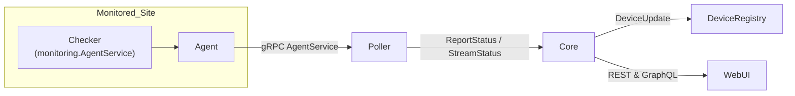
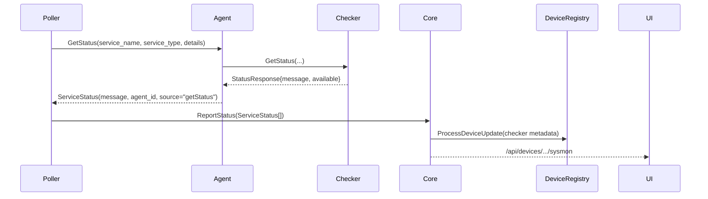

# Building Custom Checkers

ServiceRadar treats checkers as independent gRPC services that hang off an
agent. The poller asks the agent for status, the agent proxies the request to
each checker, and the poller forwards the aggregated responses to core. Core
adds device metadata automatically so the UI can light up as soon as a checker
starts returning data.

## Architecture At A Glance



- **Checker** – Collects metrics from the target system and exposes the
  `monitoring.AgentService` gRPC API (mainly `GetStatus`, optionally
  `GetResults` / `StreamResults`).
- **Agent** (`pkg/agent/server.go`) – Maintains checker connections via the
  registry in `pkg/agent/registry.go`, adds security, and returns a unified
  `StatusResponse`.
- **Poller** (`pkg/poller/poller.go`) – Reads `poller.json`, executes each
  check via `AgentService.GetStatus`, wraps the payload with poller/agent ids,
  and ships everything to core.
- **Core** (`pkg/core/pollers.go`) – Calls `processServicePayload`, which now
  invokes `ensureServiceDevice` to register devices for any checker that reports
  a host IP. Core fans out to the device registry and metrics stores so the UI
  and SRQL can query the data.

## Request/Response Sequence



> The `details` field from `poller.json` is passed verbatim to the agent and on
> to the checker. For gRPC checkers it must be `host:port`.

## Checker Responsibilities

1. **Implement the gRPC surface**  
   Use `proto/monitoring.proto` and register an `AgentService` in your `main`.
   The poller only calls `GetStatus`, but implement `GetResults`/`StreamResults`
   if you need paginated or chunked results.

2. **Respond quickly & always populate host identity**  
   `GetStatus` must return within ~30 seconds. Include the following fields in
   the JSON payload stored under `status`:

   ```json
   {
     "status": {
       "timestamp": "2025-10-12T21:16:42Z",
       "host_ip": "192.168.1.219",
       "host_id": "sysmonvm.local",
       "hostname": "sysmonvm.local",
       "...": "..."
     }
   }
   ```

   Core’s `ensureServiceDevice` (see `pkg/core/devices.go:31`) looks for
   `status.host_ip`, `host_ip`, or any field whose key contains `ip`. As soon as
   the checker reports a stable IP, core emits a `DiscoverySourceSelfReported`
   update and the device appears in the UI.

3. **Expose a health endpoint**  
   External checkers must answer gRPC health checks. If you reuse
   `monitoring.AgentService` for health, no extra work is needed—the agent
   falls back to that automatically (`pkg/agent/registry.go:52`).

4. **Return useful metadata**  
   Include fields like CPU, memory, ports, or custom measurements. Use simple
   JSON primitives—core stores the payload verbatim and higher layers render it.

## Agent & Registry Overview

- The agent loads checker configs from `CheckersDir` and/or KV (see
  `pkg/agent/server.go:1432`). For gRPC checks the poller-provided `details`
  value is sufficient—you do not need an extra config file.
- Service types are registered in `pkg/agent/registry.go`. Most new checkers can
  use the existing `"grpc"` entry. Register a new type only if you need a
  bespoke transport.
- `ExternalChecker` (`pkg/agent/external_checker.go`) manages the TLS session,
  retries, and health checks. It creates a single gRPC channel and reuses it for
  subsequent calls.

## Poller Behaviour

- `poller.json` defines agents and checks. A minimal gRPC checker entry looks
  like:

  ```json
  {
    "service_type": "grpc",
    "service_name": "sysmon-vm",
    "details": "192.168.1.219:50110"
  }
  ```

- `AgentPoller.ExecuteChecks` (`pkg/poller/agent_poller.go:52`) fans out across
  checks, calling `AgentService.GetStatus` in parallel and attaching the agent
  name when the checker does not return an `agent_id`.
- Before reporting to core, `poller.enhanceServicePayload`
  (`pkg/poller/poller.go:680`) wraps the raw checker JSON inside an envelope
  that records the poller id, agent id, and partition. Core depends on that.

## Core Ingestion Path

- `ReportStatus` (`pkg/core/pollers.go:803`) receives the batched
  `ServiceStatus` messages.
- `processServicePayload` (`pkg/core/metrics.go:797`) peels off the poller
  envelope. Right after parsing it calls `ensureServiceDevice`, which:
  - Extracts the host IP/hostname with `extractCheckerHostIdentity`.
  - Emits a `DiscoverySourceSelfReported` `DeviceUpdate` tagged with
    `checker_service`, `collector_agent_id`, and `collector_poller_id`.
  - Relies on the poller-provided agent id (the poller now fills it in
    automatically `pkg/poller/agent_poller.go:233`).
- Type-specific handlers (`processSysmonMetrics`, SNMP, ICMP, etc.) can still
  add richer metric objects; the device registration happens independently.

## Building a New gRPC Checker

1. **Bootstrap the project**
   - Depend on `proto/monitoring.proto`.
   - Register `proto.RegisterAgentServiceServer`.

2. **Implement `GetStatus`**
   - Collect metrics and marshal them into a JSON structure nested beneath
     `status`.
   - Populate `status.host_ip` and `status.hostname`.
   - Fill in the top-level `StatusResponse` fields: `available`, `service_name`,
     `service_type`, `response_time`.

3. **Optional: implement `GetResults` / `StreamResults`** if the checker needs
   to return large datasets. The poller uses `results_interval` in `poller.json`
   to schedule those calls.

4. **Provide a health probe**
   - Either implement the gRPC health service (`grpc.health.v1.Health`), or
     reuse the same `GetStatus` handler—the agent calls it with the checker’s
     name when `grpcServiceCheckName` is `monitoring.AgentService`.

5. **Wire up TLS (optional but recommended)**
   - The agent clones its `SecurityConfig` for each checker, overriding
     `server_name` with the host portion of `details`. Ship certificates under
     `/etc/serviceradar/certs`.

6. **Run the checker as a service**
   - Package it with systemd or launchd (see `tools/sysmonvm` for examples).
   - Ensure the port in `details` is reachable from the agent host.

## Configuring the Pipeline

1. **Update the poller** – Add the checker entry to each agent section in
   `poller.json`. Restart or hot-reload the poller (`systemctl reload
   serviceradar-poller`).
2. **Confirm agent connectivity** – `docker compose logs agent` or
   `journalctl -u serviceradar-agent` should show “Connecting to checker
   service” without errors.
3. **Verify poller reports** – `docker compose logs poller | grep service_name`
   should show the checker in each polling cycle.
4. **Check core ingestion** – `docker compose logs core | grep checker` should
   include “checker device through device registry” warnings only if the checker
   omits host identity.

## Testing The End-to-End Flow

- Unit tests:
  - `go test ./pkg/agent/...` exercises the registry and checker wiring.
  - `go test ./pkg/poller/...` ensures the poller packets embed metadata.
  - `go test ./pkg/core/...` covers `ensureServiceDevice` and payload parsing.
- Manual smoke test:
  1. Launch the checker locally.
  2. Run the agent with the checker configured and use `grpcurl` against
     `GetStatus`.
  3. Start the poller and core (Docker compose or binaries).
  4. Load `/api/devices/<partition:ip>` in the UI or call
     `/api/devices/<id>/sysmon/cpu`.

## Troubleshooting

- **Checker never appears** – Confirm the JSON payload includes a valid
  `host_ip`. Without it, core cannot derive the device id.
- **Agent logs invalid address** – Ensure `details` is `host:port`. The agent
  validates with `net.SplitHostPort`.
- **Health check failures** – If the checker does not implement gRPC health,
  add a case to `pkg/agent/registry.go` to set `grpcServiceCheckName` to
  `monitoring.AgentService`, or implement the health service.
- **Stale data warnings** – Poller caches checker health for a short window. If
  `GetStatus` is expensive, increase the checker’s own sampling interval and
  return cached metrics quickly.

## Extending Beyond gRPC

- To introduce a brand-new `service_type`, register it in
  `pkg/agent/registry.go` and provide a `checker.Checker` implementation.
- For long-running collectors (e.g., sweep, SNMP) leverage the existing service
  scaffolding under `pkg/agent`.
- Any checker that emits device identity will automatically take advantage of
  the new core-side device registration path—no extra integration needed.

With this flow, new checker authors can focus solely on their collector logic
and JSON payloads. The agent, poller, and core layers handle transport, device
registration, and UI surfacing without additional plumbing.
