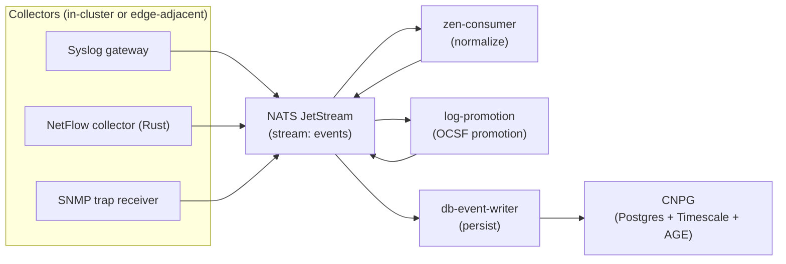

# Data Pipeline

ServiceRadar uses two primary data paths:

- Agent ingestion (edge status, discovery, sync) via mTLS gRPC to `agent-gateway`
- Bulk telemetry ingestion (logs/flows/etc.) via NATS JetStream streams into CNPG

This page is intentionally high-level. It focuses on the mental model and the moving parts you will see when debugging.

## NATS JetStream (Bulk Ingestion)

Bulk collectors publish to NATS JetStream. The most common stream is `events`.

Current `events` consumers:

- `zen-consumer`
- `log-promotion`
- `db-event-writer`

## CNPG (System Of Record)

CNPG is the system of record for inventory, telemetry, and analytics (Timescale hypertables and AGE graph features are enabled in the cluster).

Querying happens through the web UI and SRQL, which is embedded in `web-ng`.

