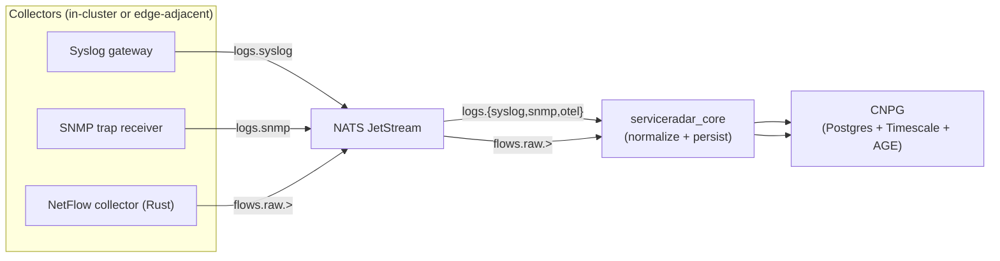

# Data Pipeline

ServiceRadar uses two primary data paths:

- Agent ingestion (edge status, discovery, sync) via mTLS gRPC to `agent-gateway`
- Bulk telemetry ingestion (logs/flows/etc.) via NATS JetStream streams into CNPG

This page is intentionally high-level. It focuses on the mental model and the moving parts you will see when debugging.

## NATS JetStream (Bulk Ingestion)

Bulk collectors publish to NATS JetStream. The most common stream is `events`.

```mermaid
flowchart LR
  subgraph Collectors["Collectors (in-cluster or edge-adjacent)"]
    Syslog["Syslog gateway"]
    Netflow["NetFlow collector (Rust)"]
    Trapd["SNMP trap receiver"]
  end

  NATS["NATS JetStream"]

  Core["serviceradar_core\n(normalize + persist)"]

  CNPG["CNPG\n(Postgres + Timescale + AGE)"]

  Syslog -->|"logs.syslog"| NATS
  Trapd -->|"logs.snmp"| NATS
  Netflow -->|"flows.raw.>"| NATS

  NATS -->|"logs.{syslog,snmp,otel}"| Core --> CNPG
  NATS -->|"flows.raw.>"| Core --> CNPG
```

`serviceradar_core` is the bulk-ingestion writer for these streams. It runs the
Zen decision rules in-process for log normalization and persists records into
CNPG. `log-promotion` is an in-process JetStream pull consumer running inside
`serviceradar_core` (not a separate deployment); it promotes matching logs into
OCSF events without depending on a separate normalize-and-republish hop.

## Data Service (datasvc)

`datasvc` is a gRPC service (port `50057`) that fronts the platform's NATS-backed
key-value and object stores. Other components use it for shared configuration and
state—for example, the KV bucket `serviceradar-datasvc` holds rule definitions
and runtime settings, and the object store carries larger payloads. Routing this
state through one service keeps NATS KV/object access consistent and avoids
components manipulating JetStream buckets directly.

## CNPG (System Of Record)

CNPG is the system of record for inventory, telemetry, and analytics (Timescale hypertables and AGE graph features are enabled in the cluster).

Querying happens through the web UI and SRQL, which is embedded in `web-ng`.
