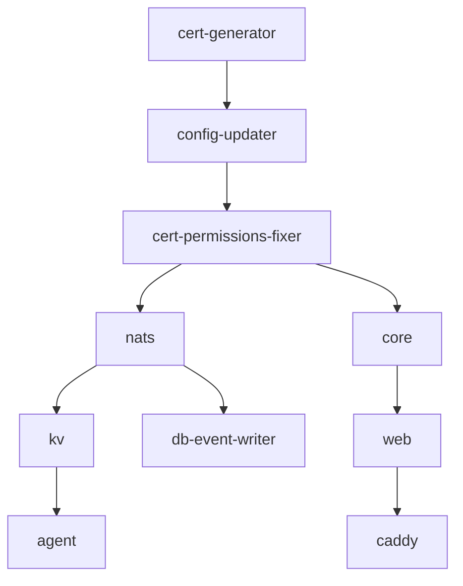

# ServiceRadar Docker Setup Guide

This guide walks you through setting up ServiceRadar using Docker Compose, including initial configuration, device setup, and troubleshooting.

## Prerequisites

- Docker Engine 20.10+
- Docker Compose 2.0+
- 8GB+ RAM recommended
- 50GB+ available disk space

## Quick Start

### 1. Initial Setup

Clone the repository and navigate to the ServiceRadar directory:

```bash
git clone https://github.com/carverauto/serviceradar.git
cd serviceradar
```

### 2. First-Time Startup

Start the ServiceRadar stack for the first time:

```bash
SERVICERADAR_VERSION=latest docker-compose up -d
```

**Important**: On first startup, ServiceRadar will:
- Generate mTLS certificates for secure communication
- Create random passwords and API keys
- Generate a bcrypt hash for the admin user
- Display the admin credentials in the `config-updater` service logs

### 3. Retrieve Admin Credentials

To see your admin credentials, check the config-updater logs:

```bash
docker-compose logs config-updater
```

Look for output like:
```
🔐 IMPORTANT: ServiceRadar Admin Credentials
=============================================
Username: admin
Password: AbC123xYz789
```

**Save this password immediately!** You'll need it to log into the ServiceRadar web interface.

### 4. Access ServiceRadar

Once all services are running, access ServiceRadar at:
- **Web Interface**: http://localhost
- **API Endpoint**: http://localhost/api
- **Direct Core API**: http://localhost:8090

Login with:
- Username: `admin`
- Password: (from step 3)

## Architecture Overview

ServiceRadar consists of these main components:

### Core Services
- **Core**: Main API and business logic service
- **Web**: Next.js web interface
- **Caddy**: Reverse proxy and TLS termination (default for Compose)
- **CNPG**: Time-series database (TimeBase fork)

### Data Collection Services
- **Gateway**: Device polling and monitoring service
- **Agent**: Network discovery and ICMP monitoring
- **Flowgger**: Syslog message collector
- **Trapd**: SNMP trap collector
- **Mapper**: Network discovery via SNMP

### Supporting Services
- **NATS**: Message bus and event streaming
- **KV**: Key-value store for configuration
- **DB Event Writer**: NATS to database bridge

### Monitoring Services
- **OTEL**: OpenTelemetry metrics collector
- **Zen**: Event processing and alerting engine

## Configuration

### Environment Variables

Create a `.env` file in the ServiceRadar directory:

```bash
# ServiceRadar Version
SERVICERADAR_VERSION=latest

# Logging Level
LOG_LEVEL=info
RUST_LOG=info

# Database Settings
PROTON_LOG_LEVEL=error
```

### Volume Mounts

ServiceRadar uses the following Docker volumes:

- `cert-data`: mTLS certificates and API keys (named `${SERVICERADAR_VOLUME_PREFIX:-serviceradar}_cert-data`)
- `credentials`: Database passwords and secrets (named `${SERVICERADAR_VOLUME_PREFIX:-serviceradar}_credentials`)
- `generated-config`: Generated configuration files (named `${SERVICERADAR_VOLUME_PREFIX:-serviceradar}_generated-config`)
- `*-data`: Service-specific data storage

### Ports

Default exposed ports:

| Service | Port | Protocol | Purpose |
|---------|------|----------|---------|
| Caddy | 80/443 | HTTP(S) | Web interface and API |
| Core | 8090 | HTTP | Direct API access |
| NATS | 4222, 8222 | TCP | Message bus |
| Flowgger | 514 | UDP | Syslog collection |
| Trapd | 162 | UDP | SNMP trap collection |

### Mapper Service Configuration

Docker Compose mounts `docker/compose/mapper.docker.json` into `/etc/serviceradar/mapper.json` for the `serviceradar-mapper` container. Update this file when you need to adjust SNMP discovery:

- Set **`workers`**, **`max_active_jobs`**, and timeouts to match how many concurrent SNMP sessions your network can handle.
- Populate **`default_credentials`** for blanket SNMP access, then add **`credentials[]`** entries for per-CIDR overrides (v2c or v3). Place the most specific subnets first.
- Extend the **`oids`** blocks if you want Mapper to gather vendor-specific identifiers during `basic`, `interfaces`, or `topology` runs.
- Use **`stream_config`** to tag events and, if needed, rename the CNPG streams used for devices (`device_stream`), interfaces, and topology discovery. The defaults align with the pipelines described in the [Discovery guide](./discovery.md#mapper-service-overview).
- Configure **`scheduled_jobs[]`** with `seeds`, discovery `type`, interval, concurrency, and retries. Jobs start immediately on boot and then honor their interval.
- Add optional **`unifi_apis[]`** entries to poll UniFi Network controllers as part of discovery. Provide `base_url`, `api_key`, and only set `insecure_skip_verify` for lab testing.

After saving changes, redeploy Mapper so it reloads the file:

```bash
docker-compose up -d mapper
```

### Verify KV Seeding (first boot)

Legacy KV-backed config watchers only run when the legacy profile is enabled. After a
`docker compose --profile legacy up -d`, confirm the datasvc bucket has defaults and
watcher snapshots:

```bash
docker run --rm --network serviceradar_serviceradar-net \
  -v "${SERVICERADAR_VOLUME_PREFIX:-serviceradar}_cert-data:/etc/serviceradar/certs" \
  ghcr.io/carverauto/serviceradar-tools:${APP_TAG:-v1.0.65} \
  nats --server tls://nats:4222 \
       --tlsca /etc/serviceradar/certs/root.pem \
       --tlscert /etc/serviceradar/certs/gateway.pem \
       --tlskey /etc/serviceradar/certs/gateway-key.pem \
       kv ls serviceradar-datasvc
```

You should see config entries for `config/core.json`, `config/gateways/docker-gateway.json`,
`config/agents/docker-agent.json`, the gateway template, and watcher snapshots under
`watchers/<service>/...json` (gateway, agent, core). If the bucket is empty, rerun
`docker compose --profile legacy up -d config-updater gateway-kv-seed` to seed defaults,
then refresh the Settings → Watcher Telemetry panel in the UI.

### SPIFFE In Docker Compose

`docker compose up -d` now launches a local SPIRE control plane automatically:

1. The `serviceradar-spire-server` container runs the standalone SPIRE server defined in `docker/compose/spire/server.conf` (SQLite datastore, exposed on port
   `8081` inside the Compose network).
2. `serviceradar-spire-bootstrap` waits for the server socket, generates a join
   token for the compose agent, and ensures that every ServiceRadar workload
   has a registration entry (`spiffe://carverauto.dev/services/<name>` keyed by
   the binary path selector like `unix:path:/usr/local/bin/serviceradar-core`).
3. `serviceradar-spire-agent` reads the generated token, dials the server, and
   exposes the Workload API at `/run/spire/sockets/agent.sock`. Each ServiceRadar
   container mounts this socket read-only and now speaks SPIFFE when dialing
   Core, datasvc, or the other internal gRPC endpoints.

There is no additional override file to apply—the default stack ships with SPIFFE
enabled and `docker-compose.spiffe.yml` is kept only for backwards compatibility.
To verify the SPIRE components:

```bash
docker compose ps spire-server spire-agent
docker logs serviceradar-spire-bootstrap
docker exec serviceradar-spire-server /opt/spire/bin/spire-server entry show
docker exec serviceradar-agent-gateway ls /run/spire/sockets/agent.sock
```

Need the full edge onboarding workflow (where a gateway runs outside Docker and
bootstraps against the demo namespace)? See the dedicated
[Secure Edge Onboarding](./edge-onboarding.md) runbook, which still relies on
the helper scripts under `docker/compose/edge-*`.

### Elixir mTLS Cluster Validation (Docker)

The default Docker Compose stack now runs the Elixir web/gateway/agent with
`ssl_dist.conf` and EPMD discovery wired in:

```bash
docker compose up -d
```

Legacy Go services (core/gateway/agent and the KV seeders) are now behind the
`legacy` profile. Use `docker compose --profile legacy up -d` if you need them.

Verify the cluster from the web node:

```bash
docker exec serviceradar-web-ng-mtls bin/serviceradar_web_ng rpc "Node.list()"
docker exec serviceradar-web-ng-mtls bin/serviceradar_web_ng rpc "ServiceRadar.GatewayRegistry.count()"
docker exec serviceradar-web-ng-mtls bin/serviceradar_web_ng rpc "ServiceRadar.AgentRegistry.count()"
```

If nodes do not appear, confirm the `RELEASE_COOKIE` and `SSL_DIST_OPTFILE`
settings for each container and ensure the service hostnames (`web-ng`,
`agent-gateway-elx`, `agent-elx`) resolve inside the compose network.

### Edge Gateway Against the Kubernetes Core

When you need to run the gateway away from the cluster (for example on an edge host) but still connect back to the demo namespace:

> Need everything reset in one shot? Run:
> ```bash
> docker/compose/edge-gateway-restart.sh
> ```
> The helper stops the stack, clears the nested SPIRE runtime volume,
> regenerates configs, refreshes the upstream join token/bundle, and restarts
> the gateway/agent pair. Use `--skip-refresh` if you want to reuse an existing
> join token or `--dry-run` to preview the steps.

1. **Collect upstream credentials from the cluster.**

   ```bash
   docker/compose/refresh-upstream-credentials.sh \
     --namespace demo \
     --spiffe-id spiffe://carverauto.dev/ns/edge/gateway-nested-spire
   ```

   The helper contacts the demo SPIRE server via `kubectl`, generates a fresh
   downstream join token, recreates the registration entry with the standard
   `unix:*` selectors, and writes the artifacts to
   `docker/compose/spire/upstream-join-token` and
   `docker/compose/spire/upstream-bundle.pem`. Use `--ttl`, `--selectors`, or
   `--no-bundle` if you need different defaults.

2. **Prime the Docker volumes with certs/config.**

   ```bash
   docker compose --env-file edge-gateway.env \
     -f docker/compose/gateway-stack.compose.yml up -d config-updater
   docker compose -f docker/compose/gateway-stack.compose.yml stop config-updater
   ```

3. **Rewrite the generated gateway configuration for the edge environment.**

   ```bash
   CORE_ADDRESS=23.138.124.18:50052 \
     GATEWAY_AGENT_ADDRESS=agent:50051 \
   docker/compose/setup-edge-gateway.sh
   ```

   The helper copies the SPIFFE template into the config volume, updates `core_address`, and stages a nested SPIRE config from `docker/compose/edge/gateway-spire/`.
   When `KV_ADDRESS` is omitted, it also removes the sample sweep/sysmon checker
   configs so the Docker agent only talks to the local services required for edge
   validation.

4. **Start the gateway (and optional agent) without re-running the config-updater.**

   ```bash
   docker compose --env-file edge-gateway.env \
     -f docker/compose/gateway-stack.compose.yml up -d --no-deps gateway agent
   ```

### Provisioning Packages from the Core API

Edge installers no longer need direct cluster access once an operator mints an
onboarding package through Core:

- **Create** packages from the admin UI at `/admin/edge-packages` or via the API
  (`POST /api/admin/edge-packages`).
- **Download** bundles securely:
  `serviceradar-cli edge-package-download --core-url https://core.example.org --id <package> --download-token <token> --output edge-package.tar.gz`
  writes a tarball containing `edge-gateway.env`, the SPIRE artifacts, and a README. Extract it on the edge host and run
  `docker/compose/edge-gateway-restart.sh --env-file edge-gateway.env` to apply the configuration.
- **Revoke** compromised or unused packages:  
  `serviceradar-cli edge-package-revoke --core-url https://core.example.org --id <package> --reason "Rotated edge host"`
  deletes the downstream SPIRE entry and blocks future agent attestations.

All `/api/admin/edge-packages` routes and the `/admin/edge-packages` UI are
RBAC-protected (admin role).

All generated nested SPIRE configuration lives under `generated-config/gateway-spire/`. Re-run the `config-updater` container whenever you change trust domains or upstream addresses so the HCL files stay in sync.

## Device Configuration

### SNMP Device Setup

To monitor devices via SNMP, configure your network devices to:

1. **Enable SNMP v2c/v3** on the device
2. **Set community string** (default: `public` for v2c)
3. **Allow SNMP access** from ServiceRadar's IP address

Example Cisco configuration:
```
snmp-server community public RO
snmp-server location "Data Center 1"
snmp-server contact "admin@company.com"
```

### Syslog Configuration

Configure devices to send syslog messages to ServiceRadar:

1. **Point syslog to ServiceRadar IP** on port 514/UDP
2. **Set appropriate log levels** (info, warning, error)

Example Cisco configuration:
```
logging host <serviceradar-ip>
logging facility local0
logging source-interface Loopback0
```

Example Linux rsyslog configuration:
```
# /etc/rsyslog.conf
*.* @<serviceradar-ip>:514
```

### SNMP Trap Configuration

Configure devices to send SNMP traps:

Example Cisco configuration:
```
snmp-server enable traps
snmp-server host <serviceradar-ip> public
```

## Adding Devices to Monitoring

### Via Web Interface

1. **Login** to the ServiceRadar web interface
2. **Navigate** to "Devices" → "Add Device"
3. **Enter device details**:
   - IP address or hostname
   - SNMP community string
   - Device type/vendor
4. **Save** the configuration

### Via API

Use the ServiceRadar API to add devices programmatically:

```bash
curl -X POST http://localhost/api/devices \
  -H "Content-Type: application/json" \
  -H "X-API-Key: <your-api-key>" \
  -d '{
    "ip": "192.168.1.1",
    "hostname": "router-01",
    "snmp_community": "public",
    "device_type": "cisco_ios"
  }'
```

### Bulk Import

For bulk device import, use the ServiceRadar CLI:

```bash
# Create a CSV file with device information
echo "ip,hostname,snmp_community,device_type" > devices.csv
echo "192.168.1.1,router-01,public,cisco_ios" >> devices.csv
echo "192.168.1.2,switch-01,public,cisco_ios" >> devices.csv

# Import devices
docker-compose exec core serviceradar-cli import-devices --file=/path/to/devices.csv
```

## Monitoring and Maintenance

### Service Health

Check service status:
```bash
docker-compose ps
```

Check service logs:
```bash
# View all logs
docker-compose logs

# View specific service logs
docker-compose logs core
docker-compose logs web
```

### Database Maintenance

Use Postgres tooling (psql/pg_dump) against CNPG (default host `cnpg-rw:5432`, database `serviceradar`). CNPG enforces mTLS + password for TCP connections. Example health check:
```bash
PGSSLMODE=verify-full \
PGSSLROOTCERT=/etc/serviceradar/certs/root.pem \
PGSSLCERT=/etc/serviceradar/certs/workstation.pem \
PGSSLKEY=/etc/serviceradar/certs/workstation-key.pem \
PGPASSWORD=<password> \
psql -h cnpg-rw -p 5432 -U serviceradar -d serviceradar -c "SELECT 1;"
```

## Security Considerations

### Default Security Features

ServiceRadar implements several security features by default:

1. **mTLS Communication**: All inter-service communication uses mutual TLS
2. **API Authentication**: JWT-based authentication for API access
3. **Network Isolation**: Services run in isolated Docker networks
4. **Credential Rotation**: Automatic generation of secure passwords and keys

### Post-Installation Security

After initial setup:

1. **Change the admin password** immediately
2. **Remove the password file**: `docker-compose exec core rm /etc/serviceradar/certs/password.txt`
3. **Restrict network access** to ServiceRadar ports
4. **Enable HTTPS** for production deployments
5. **Regular backups** of configuration and data

### Changing Admin Password

```bash
# Generate new bcrypt hash
echo 'your-new-secure-password' | docker-compose exec -T core serviceradar-cli

# Update configuration (replace <new-hash> with output from above)
docker-compose exec core serviceradar-cli update-config \
  -file=/etc/serviceradar/config/core.json \
  -admin-hash='<new-hash>'

# Restart core service
docker-compose restart core
```

## Troubleshooting

### Common Issues

#### Services Won't Start

1. **Check logs**: `docker-compose logs <service-name>`
2. **Verify prerequisites**: Docker version, available resources
3. **Check port conflicts**: Ensure required ports are available

#### Can't Access Web Interface

1. **Check caddy status**: `docker-compose ps caddy`
2. **Check caddy logs**: `docker-compose logs caddy`
3. **Verify core service**: `docker-compose ps core`
4. **Test direct access**: `curl http://localhost:8090/api/status`

#### Database Connection Issues

1. **Check CNPG status** (cluster or managed DB)
2. **Test database connection**:
   ```bash
   psql "postgres://serviceradar:<password>@cnpg-rw:5432/serviceradar?sslmode=verify-full" -c "SELECT 1;"
   ```

#### Certificate Issues

If you see certificate-related errors:

1. **Regenerate certificates**:
   ```bash
   docker-compose down
   docker volume rm "${SERVICERADAR_VOLUME_PREFIX:-serviceradar}_cert-data"
   docker-compose up cert-generator
   ```

2. **Check certificate validity**:
   ```bash
   docker-compose exec core openssl x509 -in /etc/serviceradar/certs/core.pem -text -noout
   ```

### Log Analysis

#### Service-Specific Logs

```bash
# Core service logs
docker-compose logs core | grep ERROR

# Web interface logs
docker-compose logs web | grep -E "(error|Error)"

# Network logs
docker-compose logs agent gateway mapper
```

#### Real-Time Monitoring

```bash
# Follow all logs
docker-compose logs -f

# Follow specific service
docker-compose logs -f core

# Follow multiple services
docker-compose logs -f core web
```

### Performance Tuning

#### Resource Allocation

For production deployments, consider:

```yaml
# docker-compose.override.yml
version: '3.8'
services:
  core:
    deploy:
      resources:
        limits:
          memory: 2G
          cpus: '1.0'
```

#### Database Optimization

```sql
-- Optimize CNPG database settings
ALTER SETTINGS max_memory_usage = 4000000000;
ALTER SETTINGS max_threads = 8;
```

## Scaling and High Availability

### Horizontal Scaling

ServiceRadar supports horizontal scaling of certain components:

1. **Multiple Gateways**: Deploy additional gateway instances for load distribution
2. **Multiple Agents**: Deploy agents across different network segments
3. **Database Clustering**: Configure CNPG in cluster mode (Enterprise feature)

### Load Balancing

For high availability, deploy multiple ServiceRadar instances behind a load balancer:

```yaml
# docker-compose.ha.yml
version: '3.8'
services:
  caddy:
    image: caddy:2.8.4-alpine
    ports:
      - "80:80"
      - "443:443"
    volumes:
      - ./Caddyfile:/etc/caddy/Caddyfile:ro
    depends_on:
      - serviceradar-1
      - serviceradar-2
```

Example `Caddyfile`:

```
https://example.com {
  reverse_proxy serviceradar-1:4000 serviceradar-2:4000
}
```

## Migration and Upgrades

### Version Upgrades

1. **Backup current installation**
2. **Update the Compose image tag** (the stack uses `APP_TAG`):
   ```bash
   export APP_TAG=v1.1.0
   ```
3. **Pull new images**:
   ```bash
   docker compose pull
   ```
4. **Restart services (safe upgrade)**:
   ```bash
   docker compose up -d --force-recreate
   ```

Notes:
- Compose stateful volumes are explicitly named using `${SERVICERADAR_VOLUME_PREFIX:-serviceradar}_...` so upgrades (even with a different Compose project name) reuse the same configuration/KV/certs.
- `docker/compose/update-config.sh` preserves existing configs by default; set `FORCE_REGENERATE_CONFIG=true` only if you intentionally want to overwrite generated configs.
- Equivalent one-liner: `make compose-upgrade`

Verification (optional): confirm your gateway KV entry still contains your checker after an upgrade.
```bash
docker run --rm --network serviceradar_serviceradar-net \
  -v "${SERVICERADAR_VOLUME_PREFIX:-serviceradar}_cert-data:/etc/serviceradar/certs" \
  ghcr.io/carverauto/serviceradar-tools:${APP_TAG:-v1.0.65} \
  nats --server tls://nats:4222 \
       --tlsca /etc/serviceradar/certs/root.pem \
       --tlscert /etc/serviceradar/certs/gateway.pem \
       --tlskey /etc/serviceradar/certs/gateway-key.pem \
       kv get --raw serviceradar-datasvc config/gateways/docker-gateway.json
```

### Data Migration

When migrating between major versions:

1. **Export existing data**
2. **Update configuration format** if needed
3. **Import data to new installation**
4. **Verify data integrity**

## Support and Resources

- **Documentation**: [ServiceRadar Docs](https://docs.serviceradar.com)
- **GitHub Issues**: [Report bugs and feature requests](https://github.com/carverauto/serviceradar/issues)
- **Community**: [Discord/Slack community links]
- **Enterprise Support**: [Contact information for enterprise customers]

## Appendix

### Default Configuration Files

Default configuration files are available in the `docker/compose/` directory:

- `core.docker.json`: Core service configuration
- `gateway.docker.json`: Gateway service configuration
- `web.docker.json`: Web interface configuration
- `nats.docker.conf`: NATS message bus configuration

### Service Dependencies



### API Reference

Key API endpoints:

- `GET /api/status`: Service health status
- `GET /api/devices`: List monitored devices
- `POST /api/devices`: Add new device
- `GET /api/events`: Query system events
- `POST /api/query`: Execute SRQL queries

For complete API documentation, visit `/swagger` when ServiceRadar is running.
