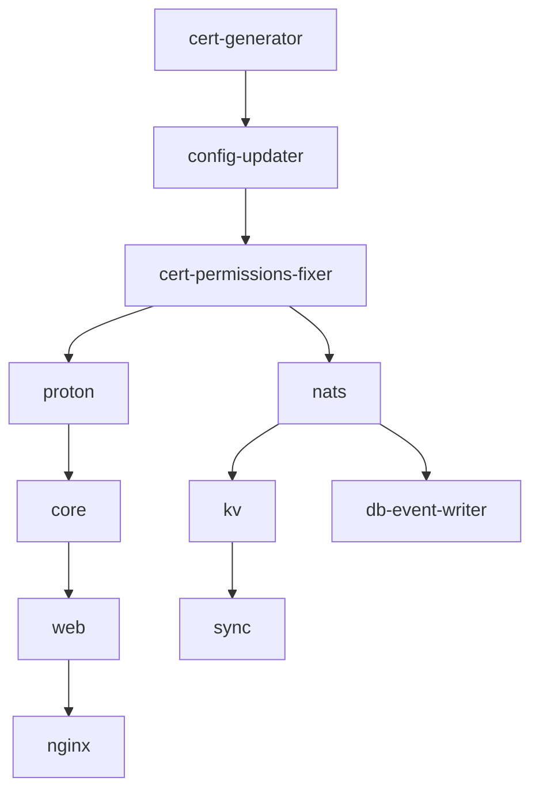

# ServiceRadar Docker Setup Guide

This guide walks you through setting up ServiceRadar using Docker Compose, including initial configuration, device setup, and troubleshooting.

## Prerequisites

- Docker Engine 20.10+
- Docker Compose 2.0+
- 8GB+ RAM recommended
- 50GB+ available disk space

## Quick Start

### 1. Initial Setup

Clone the repository and navigate to the ServiceRadar directory:

```bash
git clone https://github.com/carverauto/serviceradar.git
cd serviceradar
```

### 2. First-Time Startup

Start the ServiceRadar stack for the first time:

```bash
SERVICERADAR_VERSION=latest docker-compose up -d
```

**Important**: On first startup, ServiceRadar will:
- Generate mTLS certificates for secure communication
- Create random passwords and API keys
- Generate a bcrypt hash for the admin user
- Display the admin credentials in the `config-updater` service logs

### 3. Retrieve Admin Credentials

To see your admin credentials, check the config-updater logs:

```bash
docker-compose logs config-updater
```

Look for output like:
```
🔐 IMPORTANT: ServiceRadar Admin Credentials
=============================================
Username: admin
Password: AbC123xYz789
```

**Save this password immediately!** You'll need it to log into the ServiceRadar web interface.

### 4. Access ServiceRadar

Once all services are running, access ServiceRadar at:
- **Web Interface**: http://localhost
- **API Endpoint**: http://localhost/api
- **Direct Core API**: http://localhost:8090

Login with:
- Username: `admin`
- Password: (from step 3)

## Architecture Overview

ServiceRadar consists of these main components:

### Core Services
- **Core**: Main API and business logic service
- **Web**: Next.js web interface
- **Nginx**: Reverse proxy and load balancer
- **Proton**: Time-series database (TimeBase fork)

### Data Collection Services
- **Poller**: Device polling and monitoring service
- **Agent**: Network discovery and ICMP monitoring
- **Flowgger**: Syslog message collector
- **Trapd**: SNMP trap collector
- **Mapper**: Network discovery via SNMP

### Supporting Services
- **NATS**: Message bus and event streaming
- **KV**: Key-value store for configuration
- **Sync**: Device discovery synchronization
- **DB Event Writer**: NATS to database bridge

### Monitoring Services
- **OTEL**: OpenTelemetry metrics collector
- **Zen**: Event processing and alerting engine

## Configuration

### Environment Variables

Create a `.env` file in the ServiceRadar directory:

```bash
# ServiceRadar Version
SERVICERADAR_VERSION=latest

# Logging Level
LOG_LEVEL=info
RUST_LOG=info

# Database Settings
PROTON_LOG_LEVEL=error
```

### Volume Mounts

ServiceRadar uses the following Docker volumes:

- `cert-data`: mTLS certificates and API keys
- `credentials`: Database passwords and secrets
- `generated-config`: Generated configuration files
- `proton-data`: Time-series database storage
- `*-data`: Service-specific data storage

### Ports

Default exposed ports:

| Service | Port | Protocol | Purpose |
|---------|------|----------|---------|
| Nginx | 80 | HTTP | Web interface and API |
| Core | 8090 | HTTP | Direct API access |
| Proton | 8123, 8463, 9440 | TCP | Database connections |
| NATS | 4222, 8222 | TCP | Message bus |
| Flowgger | 514 | UDP | Syslog collection |
| Trapd | 162 | UDP | SNMP trap collection |

### Mapper Service Configuration

Docker Compose mounts `docker/compose/mapper.docker.json` into `/etc/serviceradar/mapper.json` for the `serviceradar-mapper` container. Update this file when you need to adjust SNMP discovery:

- Set **`workers`**, **`max_active_jobs`**, and timeouts to match how many concurrent SNMP sessions your network can handle.
- Populate **`default_credentials`** for blanket SNMP access, then add **`credentials[]`** entries for per-CIDR overrides (v2c or v3). Place the most specific subnets first.
- Extend the **`oids`** blocks if you want Mapper to gather vendor-specific identifiers during `basic`, `interfaces`, or `topology` runs.
- Use **`stream_config`** to tag events and, if needed, rename the Proton streams used for devices (`device_stream`), interfaces, and topology discovery. The defaults align with the pipelines described in the [Discovery guide](./discovery.md#mapper-service-overview).
- Configure **`scheduled_jobs[]`** with `seeds`, discovery `type`, interval, concurrency, and retries. Jobs start immediately on boot and then honor their interval.
- Add optional **`unifi_apis[]`** entries to poll UniFi Network controllers as part of discovery. Provide `base_url`, `api_key`, and only set `insecure_skip_verify` for lab testing.

After saving changes, redeploy Mapper so it reloads the file:

```bash
docker-compose up -d mapper
```

### Enabling a Nested SPIRE Poller (Docker Compose)

ServiceRadar ships with optional SPIFFE support for the poller when you deploy via Docker Compose. The poller container can launch its own nested SPIRE server and agent pair and forward workloads through the upstream SPIRE control plane. To enable this mode:

1. **Prepare upstream credentials.**
   - Ensure the upstream SPIRE server is reachable from the poller host (default gRPC port `8081`).
   - Request a join token (and downstream registration) from Core using the CLI. The example below stores the full response as JSON and extracts the token for the poller init container:

     ```bash
     mkdir -p docker/compose/spire
     serviceradar spire-join-token \
       -core-url https://core.demo.serviceradar.cloud \
       -api-key "$SERVICERADAR_API_KEY" \
       -downstream-spiffe-id spiffe://carverauto.dev/ns/demo/poller-nested-spire \
       -selector unix:uid:0 \
       -selector unix:gid:0 \
       -selector unix:user:root \
       -selector unix:path:/opt/spire/bin/spire-server \
       -output docker/compose/spire/join-token.json

     jq -r '.token' docker/compose/spire/join-token.json >docker/compose/spire/upstream-join-token
     ```

     The response also includes the downstream entry ID so you can audit or rotate it later. If you are operating in a lab environment without Core API access, you can fall back to the bootstrap script shipped in the repository (`docker/compose/bootstrap-nested-spire.sh`).
   - Copy the upstream CA bundle beside the token as `docker/compose/spire/upstream-bundle.pem`.

2. **Configure environment overrides.**
   - Update your `.env` (or exported environment) with the upstream SPIRE details so the configuration updater can render SPIFFE-aware poller settings:

     ```bash
     cat >> .env <<'EOF'
     POLLERS_SECURITY_MODE=spiffe
     POLLERS_TRUST_DOMAIN=${POLLERS_TRUST_DOMAIN:-carverauto.dev}
     POLLERS_SPIRE_UPSTREAM_ADDRESS=spire-server.example.org
     POLLERS_SPIRE_UPSTREAM_PORT=8081
     EOF
     ```

3. **Apply the SPIFFE override.**
   - Use the provided override file to mount the token/bundle path and enable embedded SPIRE management for the poller:

     ```bash
     docker compose -f docker-compose.yml -f docker-compose.spiffe.yml up -d config-updater
     docker compose -f docker-compose.yml -f docker-compose.spiffe.yml up -d poller
     ```

     The override sets `MANAGE_NESTED_SPIRE=enabled`, switches the poller to SPIFFE mode, and mounts `docker/compose/spire/` into the container.

4. **Verify the workload socket.**
   - After the poller restarts, the entrypoint launches the upstream agent, nested server, and downstream agent. Confirm the workload API is available:

     ```bash
     docker exec serviceradar-poller ls /run/spire/nested/workload/agent.sock
     docker logs serviceradar-poller
     ```

     The logs should report `Downstream SPIRE workload API is ready` before the poller establishes gRPC sessions.

### Edge Poller Against the Kubernetes Core

When you need to run the poller away from the cluster (for example on an edge host) but still connect back to the demo namespace:

1. **Collect upstream credentials from the cluster.**

   ```bash
   kubectl exec -n demo spire-server-0 -- \
     /opt/spire/bin/spire-server token generate \
     -ttl 600 \
     -spiffeID spiffe://carverauto.dev/ns/edge/poller-nested-spire

   kubectl exec -n demo spire-server-0 -- \
     /opt/spire/bin/spire-server entry create \
     -parentID spiffe://carverauto.dev/spire/agent/join_token/<TOKEN> \
     -spiffeID spiffe://carverauto.dev/ns/edge/poller-nested-spire \
     -selector unix:uid:0 \
     -selector unix:gid:0 \
     -selector unix:user:root \
     -selector unix:path:/opt/spire/bin/spire-server \
     -downstream \
     -admin

   kubectl get configmap spire-bundle -n demo \
     -o jsonpath='{.data.bundle\.crt}' \
     > docker/compose/spire/upstream-bundle.pem

   printf '<TOKEN>' > docker/compose/spire/upstream-join-token
   ```

2. **Prime the Docker volumes with certs/config.**

   ```bash
   docker compose --env-file edge-poller.env \
     -f docker/compose/poller-stack.compose.yml up -d config-updater
   docker compose -f docker/compose/poller-stack.compose.yml stop config-updater
   ```

3. **Rewrite the generated poller configuration for the edge environment.**

   ```bash
   CORE_ADDRESS=23.138.124.18:50052 \
     POLLERS_AGENT_ADDRESS=agent:50051 \
     docker/compose/setup-edge-poller.sh
   ```

   The helper copies the SPIFFE template into the config volume, updates `core_address`, and stages a nested SPIRE config from `docker/compose/edge/poller-spire/`.

4. **Start the poller (and optional agent) without re-running the config-updater.**

   ```bash
   docker compose --env-file edge-poller.env \
     -f docker/compose/poller-stack.compose.yml up -d --no-deps poller agent
   ```

All generated nested SPIRE configuration lives under `generated-config/poller-spire/`. Re-run the `config-updater` container whenever you change trust domains or upstream addresses so the HCL files stay in sync.

## Device Configuration

### SNMP Device Setup

To monitor devices via SNMP, configure your network devices to:

1. **Enable SNMP v2c/v3** on the device
2. **Set community string** (default: `public` for v2c)
3. **Allow SNMP access** from ServiceRadar's IP address

Example Cisco configuration:
```
snmp-server community public RO
snmp-server location "Data Center 1"
snmp-server contact "admin@company.com"
```

### Syslog Configuration

Configure devices to send syslog messages to ServiceRadar:

1. **Point syslog to ServiceRadar IP** on port 514/UDP
2. **Set appropriate log levels** (info, warning, error)

Example Cisco configuration:
```
logging host <serviceradar-ip>
logging facility local0
logging source-interface Loopback0
```

Example Linux rsyslog configuration:
```
# /etc/rsyslog.conf
*.* @<serviceradar-ip>:514
```

### SNMP Trap Configuration

Configure devices to send SNMP traps:

Example Cisco configuration:
```
snmp-server enable traps
snmp-server host <serviceradar-ip> public
```

## Adding Devices to Monitoring

### Via Web Interface

1. **Login** to the ServiceRadar web interface
2. **Navigate** to "Devices" → "Add Device"
3. **Enter device details**:
   - IP address or hostname
   - SNMP community string
   - Device type/vendor
4. **Save** the configuration

### Via API

Use the ServiceRadar API to add devices programmatically:

```bash
curl -X POST http://localhost/api/devices \
  -H "Content-Type: application/json" \
  -H "X-API-Key: <your-api-key>" \
  -d '{
    "ip": "192.168.1.1",
    "hostname": "router-01",
    "snmp_community": "public",
    "device_type": "cisco_ios"
  }'
```

### Bulk Import

For bulk device import, use the ServiceRadar CLI:

```bash
# Create a CSV file with device information
echo "ip,hostname,snmp_community,device_type" > devices.csv
echo "192.168.1.1,router-01,public,cisco_ios" >> devices.csv
echo "192.168.1.2,switch-01,public,cisco_ios" >> devices.csv

# Import devices
docker-compose exec core serviceradar-cli import-devices --file=/path/to/devices.csv
```

## Monitoring and Maintenance

### Service Health

Check service status:
```bash
docker-compose ps
```

Check service logs:
```bash
# View all logs
docker-compose logs

# View specific service logs
docker-compose logs core
docker-compose logs proton
docker-compose logs web
```

### Database Maintenance

Access the Proton database directly:
```bash
# Connect to database
docker-compose exec proton proton-client --host localhost --port 8463

# Run queries
SELECT count() FROM devices;
SELECT * FROM events ORDER BY _tp_time DESC LIMIT 10;
```

### Backup and Restore

#### Backup

```bash
# Create backup directory
mkdir -p backups/$(date +%Y%m%d)

# Backup database
docker-compose exec proton proton-client --query "BACKUP DATABASE TO '/backups/$(date +%Y%m%d)/serviceradar.backup'"

# Backup configuration
docker cp serviceradar-core:/etc/serviceradar/config ./backups/$(date +%Y%m%d)/
docker cp serviceradar-core:/etc/serviceradar/certs ./backups/$(date +%Y%m%d)/
```

#### Restore

```bash
# Stop services
docker-compose down

# Restore volumes
docker run --rm -v serviceradar_proton-data:/data -v ./backups/20241201:/backup alpine cp -r /backup/data/* /data/

# Start services
docker-compose up -d
```

## Security Considerations

### Default Security Features

ServiceRadar implements several security features by default:

1. **mTLS Communication**: All inter-service communication uses mutual TLS
2. **API Authentication**: JWT-based authentication for API access
3. **Network Isolation**: Services run in isolated Docker networks
4. **Credential Rotation**: Automatic generation of secure passwords and keys

### Post-Installation Security

After initial setup:

1. **Change the admin password** immediately
2. **Remove the password file**: `docker-compose exec core rm /etc/serviceradar/certs/password.txt`
3. **Restrict network access** to ServiceRadar ports
4. **Enable HTTPS** for production deployments
5. **Regular backups** of configuration and data

### Changing Admin Password

```bash
# Generate new bcrypt hash
echo 'your-new-secure-password' | docker-compose exec -T core serviceradar-cli

# Update configuration (replace <new-hash> with output from above)
docker-compose exec core serviceradar-cli update-config \
  -file=/etc/serviceradar/config/core.json \
  -admin-hash='<new-hash>'

# Restart core service
docker-compose restart core
```

## Troubleshooting

### Common Issues

#### Services Won't Start

1. **Check logs**: `docker-compose logs <service-name>`
2. **Verify prerequisites**: Docker version, available resources
3. **Check port conflicts**: Ensure required ports are available

#### Can't Access Web Interface

1. **Check nginx status**: `docker-compose ps nginx`
2. **Check nginx logs**: `docker-compose logs nginx`
3. **Verify core service**: `docker-compose ps core`
4. **Test direct access**: `curl http://localhost:8090/api/status`

#### Database Connection Issues

1. **Check Proton status**: `docker-compose ps proton`
2. **Check Proton logs**: `docker-compose logs proton`
3. **Test database connection**:
   ```bash
   docker-compose exec proton proton-client --host localhost --port 8463 --query "SELECT 1"
   ```

#### Certificate Issues

If you see certificate-related errors:

1. **Regenerate certificates**:
   ```bash
   docker-compose down
   docker volume rm serviceradar_cert-data
   docker-compose up cert-generator
   ```

2. **Check certificate validity**:
   ```bash
   docker-compose exec core openssl x509 -in /etc/serviceradar/certs/core.pem -text -noout
   ```

### Log Analysis

#### Service-Specific Logs

```bash
# Core service logs
docker-compose logs core | grep ERROR

# Database logs
docker-compose logs proton | grep -E "(ERROR|FATAL)"

# Web interface logs
docker-compose logs web | grep -E "(error|Error)"

# Network logs
docker-compose logs agent poller mapper
```

#### Real-Time Monitoring

```bash
# Follow all logs
docker-compose logs -f

# Follow specific service
docker-compose logs -f core

# Follow multiple services
docker-compose logs -f core proton web
```

### Performance Tuning

#### Resource Allocation

For production deployments, consider:

```yaml
# docker-compose.override.yml
version: '3.8'
services:
  proton:
    deploy:
      resources:
        limits:
          memory: 4G
          cpus: '2.0'
  core:
    deploy:
      resources:
        limits:
          memory: 2G
          cpus: '1.0'
```

#### Database Optimization

```sql
-- Optimize Proton database settings
ALTER SETTINGS max_memory_usage = 4000000000;
ALTER SETTINGS max_threads = 8;
```

## Scaling and High Availability

### Horizontal Scaling

ServiceRadar supports horizontal scaling of certain components:

1. **Multiple Pollers**: Deploy additional poller instances for load distribution
2. **Multiple Agents**: Deploy agents across different network segments
3. **Database Clustering**: Configure Proton in cluster mode (Enterprise feature)

### Load Balancing

For high availability, deploy multiple ServiceRadar instances behind a load balancer:

```yaml
# docker-compose.ha.yml
version: '3.8'
services:
  nginx-lb:
    image: nginx:alpine
    ports:
      - "443:443"
    volumes:
      - ./nginx-lb.conf:/etc/nginx/nginx.conf
    depends_on:
      - serviceradar-1
      - serviceradar-2
```

## Migration and Upgrades

### Version Upgrades

1. **Backup current installation**
2. **Update version in environment**:
   ```bash
   export SERVICERADAR_VERSION=v1.1.0
   ```
3. **Pull new images**:
   ```bash
   docker-compose pull
   ```
4. **Restart services**:
   ```bash
   docker-compose up -d
   ```

### Data Migration

When migrating between major versions:

1. **Export existing data**
2. **Update configuration format** if needed
3. **Import data to new installation**
4. **Verify data integrity**

## Support and Resources

- **Documentation**: [ServiceRadar Docs](https://docs.serviceradar.com)
- **GitHub Issues**: [Report bugs and feature requests](https://github.com/carverauto/serviceradar/issues)
- **Community**: [Discord/Slack community links]
- **Enterprise Support**: [Contact information for enterprise customers]

## Appendix

### Default Configuration Files

Default configuration files are available in the `docker/compose/` directory:

- `core.docker.json`: Core service configuration
- `poller.docker.json`: Poller service configuration
- `web.docker.json`: Web interface configuration
- `nats.docker.conf`: NATS message bus configuration

### Service Dependencies



### API Reference

Key API endpoints:

- `GET /api/status`: Service health status
- `GET /api/devices`: List monitored devices
- `POST /api/devices`: Add new device
- `GET /api/events`: Query system events
- `POST /api/query`: Execute SRQL queries

For complete API documentation, visit `/swagger` when ServiceRadar is running.
