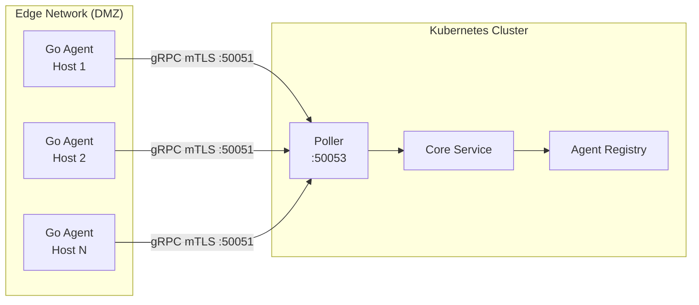
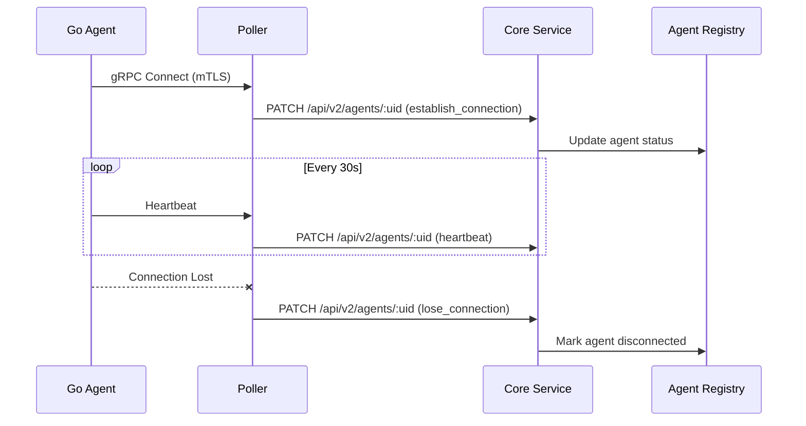

# Edge Agents

Edge agents are Go binaries that run on monitored hosts outside the Kubernetes cluster. They communicate with Pollers via gRPC with mTLS for secure, tenant-isolated monitoring.

## Architecture



## Security Model

Edge agents use a secure, isolated communication model:

| Property | Implementation |
|----------|----------------|
| **Transport** | gRPC with mTLS (TLS 1.3) |
| **Identity** | Tenant-specific X.509 certificates |
| **Isolation** | No ERTS/Erlang distribution access |
| **Authorization** | SPIFFE ID verification |

### What Edge Agents CANNOT Do

- Join the ERTS cluster (they are Go binaries, not Erlang nodes)
- Execute RPC calls on Core or Poller nodes
- Access Horde registries or enumerate other tenants' agents
- Connect to the database directly
- Access internal APIs without proper mTLS certificates

### Certificate Format

Edge agent certificates use the following format:

**Common Name (CN):**
```
<agent_id>.<partition_id>.<tenant_slug>.serviceradar
```

**SPIFFE ID (SAN URI):**
```
spiffe://serviceradar.local/agent/<tenant_slug>/<partition_id>/<agent_id>
```

## Deployment

### 1. Generate Agent Configuration

Use the onboarding API to generate configuration for a new edge agent:

```bash
curl -X POST https://core.example.com/api/v2/agents \
  -H "Authorization: Bearer $TOKEN" \
  -H "Content-Type: application/json" \
  -d '{
    "uid": "agent-edge-01",
    "name": "Edge Agent 1",
    "host": "192.168.1.100",
    "port": 50051,
    "partition_id": "us-west-2"
  }'
```

### 2. Download Agent Binary

Download the Go agent binary for your platform:

```bash
# Linux AMD64
curl -LO https://releases.serviceradar.io/agent/latest/serviceradar-agent-linux-amd64

# Linux ARM64
curl -LO https://releases.serviceradar.io/agent/latest/serviceradar-agent-linux-arm64

chmod +x serviceradar-agent-*
```

### 3. Configure Agent

Create the agent configuration file (`/etc/serviceradar/agent.json`):

```json
{
  "agent_id": "agent-edge-01",
  "listen_addr": ":50051",
  "poller_address": "poller.example.com:50053",
  "tls": {
    "cert_file": "/etc/serviceradar/certs/svid.pem",
    "key_file": "/etc/serviceradar/certs/svid-key.pem",
    "ca_file": "/etc/serviceradar/certs/bundle.pem"
  },
  "checkers": [
    {"type": "icmp", "enabled": true},
    {"type": "tcp", "enabled": true},
    {"type": "http", "enabled": true}
  ]
}
```

### 4. Install Certificates

Copy the tenant-specific certificates to the agent:

```bash
mkdir -p /etc/serviceradar/certs
# Copy svid.pem, svid-key.pem, and bundle.pem from onboarding package
```

### 5. Start Agent

```bash
# Run directly
./serviceradar-agent -config /etc/serviceradar/agent.json

# Or install as systemd service
sudo cp serviceradar-agent /usr/local/bin/
sudo cp serviceradar-agent.service /etc/systemd/system/
sudo systemctl enable --now serviceradar-agent
```

## Firewall Requirements

### Edge Network (Where Agents Run)

| Direction | Port | Protocol | Purpose |
|-----------|------|----------|---------|
| Outbound | 50051 | TCP | gRPC to Poller |
| Inbound | - | - | No inbound required |

### Core Network (Kubernetes Cluster)

| Direction | Port | Protocol | Purpose |
|-----------|------|----------|---------|
| Inbound | 50051 | TCP | gRPC from Edge Agents |

### Blocked by Design

These ports should NOT be exposed to edge networks:

| Port | Protocol | Purpose | Why Blocked |
|------|----------|---------|-------------|
| 4369 | TCP | EPMD | ERTS cluster discovery |
| 9100-9155 | TCP | ERTS Distribution | Erlang RPC |
| 5432 | TCP | PostgreSQL | Database access |
| 8090 | TCP | Core API | Internal only |

## Health Monitoring

Edge agents report health status via the gRPC connection:



### Agent States

| State | Description | is_healthy |
|-------|-------------|------------|
| `connecting` | Initial connection in progress | true |
| `connected` | Healthy, active connection | true |
| `degraded` | Connected but experiencing issues | false |
| `disconnected` | Lost connection, will retry | - |
| `unavailable` | Manually marked unavailable | false |

## Troubleshooting

### Connection Issues

```bash
# Check agent logs
journalctl -u serviceradar-agent -f

# Test gRPC connectivity
grpcurl -cert /etc/serviceradar/certs/svid.pem \
        -key /etc/serviceradar/certs/svid-key.pem \
        -cacert /etc/serviceradar/certs/bundle.pem \
        poller.example.com:50053 list
```

### Certificate Issues

```bash
# Verify certificate chain
openssl verify -CAfile bundle.pem svid.pem

# Check certificate expiry
openssl x509 -in svid.pem -noout -dates

# Verify CN format
openssl x509 -in svid.pem -noout -subject
# Should show: CN = agent-edge-01.partition-1.tenant-slug.serviceradar
```

### Registry Issues

```bash
# Check if agent is registered (from Core)
curl https://core.example.com/api/v2/agents/agent-edge-01 \
  -H "Authorization: Bearer $TOKEN"
```

## Multi-Tenant Isolation

Edge agents are strictly isolated by tenant:

1. **Certificate-based Identity**: Tenant slug embedded in certificate CN
2. **Registry Isolation**: AgentRegistry queries are scoped by tenant_id
3. **Database Isolation**: Ash multitenancy enforces tenant boundaries

An agent from Tenant A **cannot**:
- See or enumerate agents from Tenant B
- Send check results for Tenant B's services
- Access Tenant B's polling schedules or jobs

For detailed security validation, see the [Security Architecture](./security-architecture.md) documentation.
