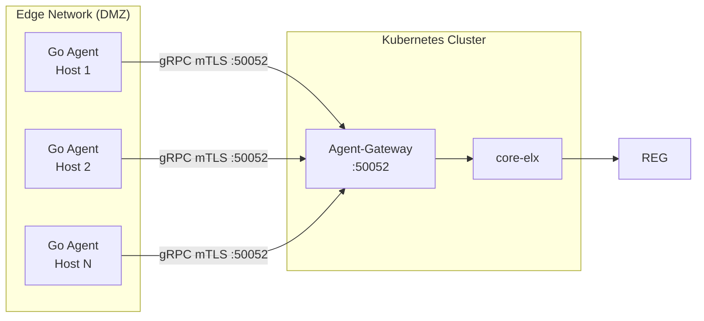

# Edge Agents

Edge agents are Go binaries that run on monitored hosts outside the Kubernetes cluster. They communicate with the Agent-Gateway via gRPC with mTLS for secure monitoring.

## Architecture


```mermaid
flowchart LR
    subgraph Edge["Edge Network (DMZ)"]
        GA1[Go Agent<br/>Host 1]
        GA2[Go Agent<br/>Host 2]
        GA3[Go Agent<br/>Host N]
    end

    subgraph Cluster["Kubernetes Cluster"]
        GW[Agent-Gateway<br/>:50052]
        CORE[core-elx]
    end

    GA1 -->|gRPC mTLS :50052| GW
    GA2 -->|gRPC mTLS :50052| GW
    GA3 -->|gRPC mTLS :50052| GW
    GW --> CORE
    CORE --> REG
```

## Security Model

Edge agents use a secure, isolated communication model:

| Property | Implementation |
|----------|----------------|
| **Transport** | gRPC with mTLS (TLS 1.3) |
| **Identity** | Workload-scoped X.509 certificates |
| **Isolation** | No ERTS/Erlang distribution access |
| **Authorization** | SPIFFE ID verification |

### What Edge Agents CANNOT Do

- Join the ERTS cluster (they are Go binaries, not Erlang nodes)
- Execute RPC calls on Core or Agent-Gateway nodes
- Access Horde registries or enumerate cluster members
- Connect to the database directly
- Access internal APIs without proper mTLS certificates

### Certificate Format

Edge agent certificates use the following format:

**Common Name (CN):**
```
<agent_id>.<partition_id>.<tenant_slug>.serviceradar
```

**SPIFFE ID (SAN URI):**
```
spiffe://serviceradar.local/agent/<tenant_slug>/<partition_id>/<agent_id>
```

## Deployment

Use the edge onboarding flow to generate an agent package and configuration. See:
- [Edge Onboarding](./edge-onboarding.md)
- [Installation Guide](./installation.md)

## Firewall Requirements

### Edge Network (Where Agents Run)

| Direction | Port | Protocol | Purpose |
|-----------|------|----------|---------|
| Outbound | 50052 | TCP | gRPC to Agent-Gateway |
| Inbound | - | - | No inbound required |

### Core Network (Kubernetes Cluster)

| Direction | Port | Protocol | Purpose |
|-----------|------|----------|---------|
| Inbound | 50052 | TCP | gRPC from Edge Agents |

### Blocked by Design

These ports should NOT be exposed to edge networks:

| Port | Protocol | Purpose | Why Blocked |
|------|----------|---------|-------------|
| 4369 | TCP | EPMD | ERTS cluster discovery |
| 9100-9155 | TCP | ERTS Distribution | Erlang RPC |
| 5432 | TCP | PostgreSQL | Database access |
| 8090 | TCP | Core API | Internal only |

## Health Monitoring

Agents report health status via the gRPC connection to the Agent-Gateway. Use core-elx and gateway logs to verify connectivity.

## Troubleshooting

### Connection Issues

```bash
# Check agent logs
journalctl -u serviceradar-agent -f

# Test gRPC connectivity
grpcurl -cert /etc/serviceradar/certs/svid.pem \
        -key /etc/serviceradar/certs/svid-key.pem \
        -cacert /etc/serviceradar/certs/bundle.pem \
        agent-gateway.example.com:50052 list
```

### Certificate Issues

```bash
# Verify certificate chain
openssl verify -CAfile bundle.pem svid.pem

# Check certificate expiry
openssl x509 -in svid.pem -noout -dates

# Verify CN format
openssl x509 -in svid.pem -noout -subject
# Should show: CN = agent-edge-01.partition-1.tenant-slug.serviceradar
```

### Registry Issues

Use core-elx API logs and the gateway logs to confirm the agent is registered and sending heartbeats.
