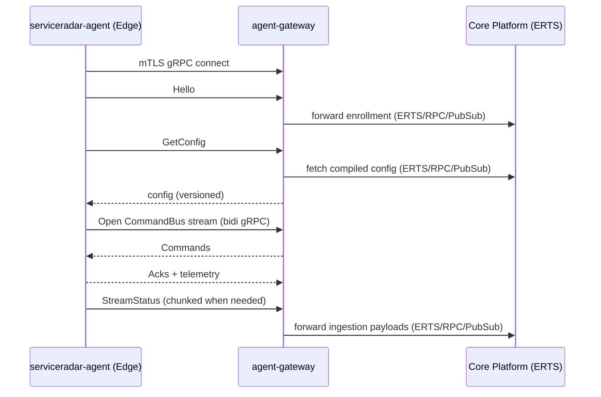

# Edge Model

ServiceRadar runs a single edge binary, `serviceradar-agent`, on monitored sites. The agent connects outbound to the control plane over mTLS gRPC and:

- runs collectors and polling engines close to the network
- executes sandboxed Wasm plugins (via `wazero`)
- streams results to the platform using unary and streaming gRPC (chunked payloads when needed)
- participates in a bidirectional command bus for control-plane signaling

## What Runs In The Agent

The agent is not just a "status pusher". It is the edge runtime for:

- Wasm plugin execution (sandboxed, capability-based host ABI)
- embedded sync integrations (inventory sources like NetBox/ArMIS)
- SNMP polling
- discovery/mapping engines (topology discovery)
- mDNS collection (where enabled)

## Connection And Config Flow

High level lifecycle:

1. Agent starts and establishes an outbound mTLS gRPC connection to `agent-gateway`.
2. Agent sends `Hello` (identity metadata; identity is derived from the certificate).
3. Agent fetches its effective config (`GetConfig`).
4. Agent opens streaming channels for large payload delivery and command bus signaling.

## Security Boundaries

- Agents do not join the ERTS cluster.
- Agents do not connect to CNPG directly.
- Plugins do not get raw filesystem or socket access; network access is proxied and allowlisted.

For plugin details, see [Wasm Plugin Checkers](./wasm-plugins.md).
