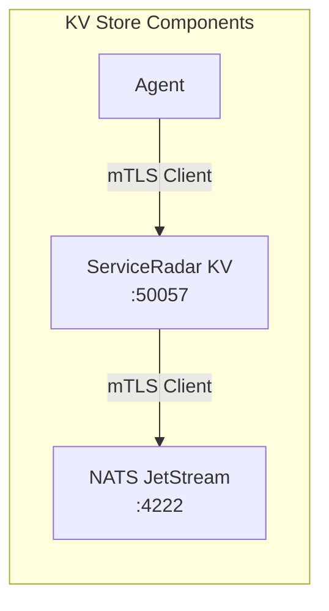

# KV Store Configuration

ServiceRadar can use NATS JetStream as a key-value (KV) store for dynamic configuration management. This guide explains how to configure and secure the KV store component, which enables real-time updates without requiring service restarts.

## Overview

The KV store in ServiceRadar:
- Provides a distributed key-value store using NATS JetStream
- Supports dynamic configuration updates
- Uses role-based access control (RBAC) for secure access
- Requires mTLS security for all communications
- Is designed for co-location with NATS by default

## Architecture



- **NATS JetStream** provides the underlying key-value storage technology
- **ServiceRadar KV** provides a gRPC service that other components interact with
- **Co-location** of NATS and KV service on the same machine is the recommended deployment model
- **mTLS** secures all communications between components

## Prerequisites

Before configuring the KV store, ensure you have:

1. Installed NATS JetStream (via the `serviceradar-nats` package)
2. Installed the KV service (via the `serviceradar-datasvc` package)
3. Generated and deployed TLS certificates for mTLS security

For installation instructions, see the [Installation Guide](./installation.md).

## KV Service Configuration

The KV service configuration is stored in `/etc/serviceradar/datasvc.json`. Here's a complete example:

```json
{
  "listen_addr": "192.168.2.23:50057",
  "nats_url": "nats://192.168.2.23:4222",
  "security": {
    "mode": "mtls",
    "cert_dir": "/etc/serviceradar/certs",
    "server_name": "192.168.2.23",
    "role": "datasvc",
    "tls": {
      "cert_file": "datasvc.pem",
      "key_file": "datasvc-key.pem",
      "ca_file": "root.pem",
      "client_ca_file": "root.pem"
    }
  },
  "rbac": {
    "roles": [
      {"identity": "CN=192.168.2.23,O=ServiceRadar", "role": "reader"}
    ]
  },
  "bucket": "serviceradar-datasvc"
}
```

### Configuration Options

| Option | Description | Default | Required |
|--------|-------------|---------|----------|
| `listen_addr` | Address and port for the KV service gRPC API | N/A | Yes |
| `nats_url` | URL for connecting to the NATS Server | N/A | Yes |
| `security.mode` | Security mode (must be "mtls") | N/A | Yes |
| `security.cert_dir` | Directory for TLS certificates | `/etc/serviceradar/certs` | Yes |
| `security.server_name` | Hostname/IP of the NATS server | N/A | Yes |
| `security.role` | Role of this component | `kv` | Yes |
| `security.tls.cert_file` | Component certificate file | N/A | Yes |
| `security.tls.key_file` | Component private key file | N/A | Yes |
| `security.tls.ca_file` | CA certificate file | N/A | Yes |
| `security.tls.client_ca_file` | Client CA certificate file | N/A | Yes |
| `rbac.roles` | List of role definitions | `[]` | No |
| `bucket` | The name of the NATS JetStream bucket | `serviceradar-datasvc` | No |

### Important Settings to Consider

1. **`listen_addr`**: Use the actual IP address of your server along with a unique port. The default port for the KV service is `50057`.

2. **`nats_url`**: This should point to where your NATS server is installed. Since NATS and the KV service are typically co-located, this is usually `nats://localhost:4222` or `nats://<your-server-ip>:4222`.

3. **`security.mode`**: Must be set to `"mtls"` as the KV service requires mutual TLS authentication.

4. **`security.server_name`**: **CRITICAL** - This must match the IP/hostname where NATS is installed. This is used for certificate validation.

5. **`rbac.roles`**: Defines which client certificates can access the KV store and with what permissions.

## Security Requirements

### mTLS Configuration

The KV service **requires** mTLS for security. The following settings are mandatory:

```json
"security": {
  "mode": "mtls",
  "cert_dir": "/etc/serviceradar/certs",
  "server_name": "your-nats-server-ip-or-hostname",
  "role": "datasvc",
  "tls": {
    "cert_file": "datasvc.pem",
    "key_file": "datasvc-key.pem",
    "ca_file": "root.pem",
    "client_ca_file": "root.pem"
  }
}
```

- The `cert_file`, `key_file`, and `ca_file` paths are relative to the `cert_dir` if not absolute
- Use absolute paths when certificates are stored outside the default directory
- The `server_name` must match the hostname/IP in the NATS server's certificate

### Role-Based Access Control (RBAC)

RBAC controls which clients can read from or write to the KV store:

```json
"rbac": {
  "roles": [
    {"identity": "CN=agent.serviceradar,O=ServiceRadar", "role": "reader"},
    {"identity": "CN=sync.serviceradar,O=ServiceRadar", "role": "writer"}
  ]
}
```

Available roles:
- `reader`: Can only read keys (Get, Watch operations)
- `writer`: Can read and modify keys (Get, Watch, Put, Delete operations)

The `identity` field must match the Subject Distinguished Name from the client's certificate. This is typically in the format `CN=<common-name>,O=<organization>`.

## NATS Server Configuration

The NATS Server configuration is located at `/etc/nats/nats-server.conf`. The default configuration provided by the `serviceradar-nats` package and includes mTLS and JetStream support:

```
# NATS Server Configuration for ServiceRadar KV Store

# Listen on the default NATS port (restricted to localhost for security)
listen: 127.0.0.1:4222

# Server identification
server_name: nats-serviceradar

# Enable JetStream for KV store
jetstream {
  # Directory to store JetStream data
  store_dir: /var/lib/nats/jetstream
  # Maximum storage size
  max_memory_store: 1G
  # Maximum disk storage
  max_file_store: 10G
}

# Enable mTLS for secure communication
tls {
  # Path to the server certificate
  cert_file: "/etc/serviceradar/certs/nats-server.pem"
  # Path to the server private key
  key_file: "/etc/serviceradar/certs/nats-server-key.pem"
  # Path to the root CA certificate for verifying clients
  ca_file: "/etc/serviceradar/certs/root.pem"

  # Require client certificates (enables mTLS)
  verify: true
  # Require and verify client certificates
  verify_and_map: true
}

# Logging settings
logfile: "/var/log/nats/nats.log"
debug: true
```

### Critical NATS Server Settings

1. **`server_name`**: Should match the CN in the server's certificate
2. **`listen`**: By default, NATS only listens on localhost (127.0.0.1) for security
3. **`cert_file`**, **`key_file`**, **`ca_file`**: Paths to TLS certificates
4. **`verify`** and **`verify_and_map`**: Enable client certificate verification for mTLS

If you need to access NATS from other hosts, change the `listen` directive to an appropriate IP address or `0.0.0.0` for all interfaces. However, ensure you have proper firewall rules in place.

## Co-location Requirements

ServiceRadar ships its own version of NATS, and by default, NATS and the KV service are designed to be co-located on the same machine. This setup offers several advantages:

1. **Security**: Communication between the KV service and NATS stays local
2. **Performance**: Local connections are faster and more reliable
3. **Simplicity**: Fewer network configuration requirements

When configuring a co-located deployment:

1. Use `localhost` or the machine's IP address in both configurations
2. Ensure the NATS Server's `server_name` matches what's in its certificate
3. Set the KV service's `security.server_name` to match the NATS server's hostname/IP

## Certificate Requirements

The KV service needs the following certificate files:

1. **`datasvc.pem`**: The KV service's certificate
2. **`datasvc-key.pem`**: The KV service's private key
3. **`root.pem`**: The root CA certificate that signed all component certificates
4. **`nats-server.pem`** and **`nats-server-key.pem`**: For the NATS server

For certificate generation instructions, see the [TLS Security](./tls-security.md) documentation.

## Configuring Components to Use the KV Store

> **Heads up:** As of this change, the demo Kubernetes manifests, Helm chart, and Docker Compose stack all export `CONFIG_SOURCE=kv` plus the appropriate `KV_*` (and `CORE_*` for services that register templates) out of the box. You only need to follow the steps below if you're managing a bare-metal/edge install or have custom systemd units; cluster deployments now seed and watch the KV store automatically.

### Agent Configuration

To enable an agent to use the KV store for dynamic configuration:

1. Edit the agent's systemd service file:

```bash
sudo systemctl edit serviceradar-agent
```

2. Add the environment variable for KV store configuration:

```ini
[Service]
Environment="CONFIG_SOURCE=kv"
Environment="KV_SERVER=192.168.2.23:50057"
```

3. Restart the agent to apply the changes:

```bash
sudo systemctl daemon-reload
sudo systemctl restart serviceradar-agent
```

4. Ensure the agent's certificate is added to the RBAC configuration in the KV service.

## Firewall Configuration

If you're using a firewall, you need to open ports for the KV service:

```bash
# For UFW (Ubuntu)
sudo ufw allow 50057/tcp  # KV service gRPC port

# For firewalld (RHEL/Oracle Linux)
sudo firewall-cmd --permanent --add-port=50057/tcp
sudo firewall-cmd --reload
```

Note that port 4222 (NATS) typically doesn't need to be opened externally when using the default co-located setup where NATS only listens on localhost.

## Verification

After configuring both the KV service and NATS:

1. Restart both services:

```bash
sudo systemctl restart nats
sudo systemctl restart serviceradar-datasvc
```

2. Check their status:

```bash
sudo systemctl status nats
sudo systemctl status serviceradar-datasvc
```

3. Verify the KV service is listening on the configured port:

```bash
sudo netstat -tulpn | grep 50057
```

4. Check the logs for any errors:

```bash
sudo journalctl -u serviceradar-datasvc --since today
sudo cat /var/log/nats/nats.log
```

## Troubleshooting

### Service Won't Start

Check the logs for detailed error information:

```bash
sudo journalctl -u serviceradar-datasvc -n 100
```

Common issues include:
- Incorrect certificate paths
- Wrong `server_name` for certificate validation
- NATS server not running or unreachable

### TLS Certificate Issues

Verify certificates are properly formatted and have correct permissions:

```bash
# Check certificate ownership and permissions
ls -la /etc/serviceradar/certs/

# Verify certificate content and expiration
openssl x509 -in /etc/serviceradar/certs/datasvc.pem -text -noout
```

### RBAC Issues

If clients can't connect, check that their certificate subject matches an entry in the RBAC roles:

```bash
# Get the subject name from a client certificate
openssl x509 -in /etc/serviceradar/certs/agent.pem -subject -noout
```

The output should match an `identity` in the RBAC configuration.

### NATS Connection Issues

If the KV service can't connect to NATS:

```bash
# Install the NATS CLI if needed
go install github.com/nats-io/natscli/nats@latest

# Test the NATS connection with mTLS
nats server check --server nats://localhost:4222 \
  --tls-cert /etc/serviceradar/certs/datasvc.pem \
  --tls-key /etc/serviceradar/certs/datasvc-key.pem \
  --tls-ca /etc/serviceradar/certs/root.pem
```

### Testing with grpcurl

You can test the KV service's gRPC API using grpcurl:

```bash
# Install grpcurl if needed
go install github.com/fullstorydev/grpcurl/cmd/grpcurl@latest

# Test the health check endpoint with mTLS
grpcurl -cacert /etc/serviceradar/certs/root.pem \
        -cert /etc/serviceradar/certs/agent.pem \
        -key /etc/serviceradar/certs/agent-key.pem \
        -servername <KV_SERVER_IP> \
        <KV_SERVER_IP>:50057 \
        grpc.health.v1.Health/Check
```

A successful response should look like:

```json
{
  "status": "SERVING"
}
```

## Best Practices

1. **Always use mTLS**: Never disable mTLS for the KV service, as it provides essential security.

2. **Restrict NATS access**: Keep NATS listening only on localhost when possible for security.

3. **Use specific RBAC roles**: Grant only the minimal permissions needed for each component.

4. **Regular certificate rotation**: Update certificates periodically for security best practices.

5. **Backup configuration**: Regularly back up your KV store data to prevent data loss.

## Next Steps

- Learn more about [Custom Checkers](./custom-checkers.md)
- Explore integrating your own services with the KV store
- Consider high availability configurations for critical deployments

For more information on securing ServiceRadar components, refer to the [TLS Security](./tls-security.md) documentation.
