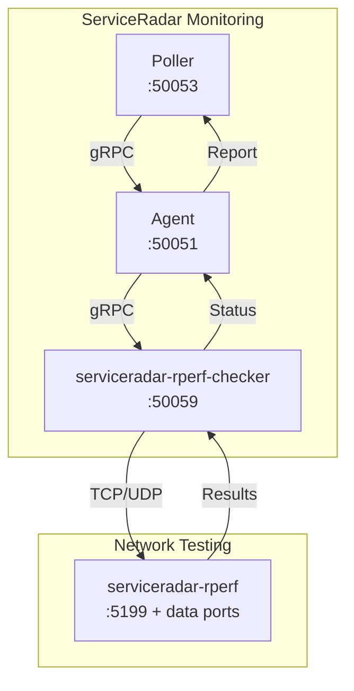

# Network Performance Monitoring with rperf

ServiceRadar supports network performance monitoring through the `rperf` system, consisting of a server (`serviceradar-rperf`) and a client (`serviceradar-rperf-checker`). 
This guide explains how to install, configure, and secure these components to monitor network throughput and reliability within your infrastructure.

## Overview

The `rperf` system provides:
- **Server (`serviceradar-rperf`)**: A continuously running reflector that listens for client connections and facilitates network tests.
- **Client (`serviceradar-rperf-checker`)**: A gRPC-based client that initiates tests against the server and reports results to ServiceRadar.
- **Features**: Measures TCP/UDP throughput, packet loss, jitter, and more, with support for parallel streams and configurable bandwidth targets.

This system integrates with ServiceRadar's Agent and Poller for automated, scheduled monitoring and alerting.

### Architecture



**serviceradar-rperf-checker**: Runs as a checker plugin on the Agent host, initiates tests, and reports results.

**serviceradar-rperf**: Runs on a separate host (or co-located), reflects test traffic back to the client.

## Prerequisites

- **Operating System**: Debian/Ubuntu or RHEL/Oracle Linux
- **ServiceRadar**: Agent and Poller installed (see [Installation Guide](./installation.md))
- **Network Access**: Client must reach the server's control port (default: 5199) and data ports.
- **Root/Sudo Access**: Required for installation and firewall configuration.

## Installation

ServiceRadar provides Debian (.deb) and RPM (.rpm) packages for both components.

### Debian/Ubuntu Installation

#### 1. Install the rperf Server (serviceradar-rperf)

On a dedicated host (or a host with minimal firewall restrictions):

```bash
curl -LO https://github.com/mfreeman451/rperf/releases/download/v1.0.31/serviceradar-rperf_1.0.31_amd64.deb
sudo dpkg -i serviceradar-rperf_1.0.31_amd64.deb
```

- Installs to `/usr/local/bin/serviceradar-rperf`
- Configures a systemd service (`serviceradar-rperf.service`)

#### 2. Install the rperf Client (serviceradar-rperf-checker)

On the Agent host:

```bash
curl -LO https://github.com/mfreeman451/rperf/releases/download/v1.0.31/serviceradar-rperf-checker-1.0.31.amd64.deb
sudo dpkg -i serviceradar-rperf-checker-1.0.31.amd64.deb
```

- Installs to `/usr/local/bin/serviceradar-rperf-checker`
- Configures a systemd service (`serviceradar-rperf-checker.service`)

### RHEL/Oracle Linux Installation

#### 1. Install the rperf Server (serviceradar-rperf)

On a dedicated host:

```bash
curl -LO https://github.com/mfreeman451/rperf/releases/download/v1.0.31/serviceradar-rperf-1.0.31-1.el9.x86_64.rpm
sudo dnf install -y ./serviceradar-rperf-1.0.31-1.el9.x86_64.rpm
```

#### 2. Install the ServiceRadar RPerf Client (serviceradar-rperf-checker)

On the Agent host:

```bash
curl -LO https://github.com/mfreeman451/rperf/releases/download/v0.1.0/serviceradar-rperf-checker-1.0.31.el9.x86_64.rpm
sudo dnf install -y ./serviceradar-rperf-checker-1.0.31.el9.x86_64.rpm
```

### Verify Installation

Check service status:

```bash
# Server
sudo systemctl status serviceradar-rperf

# Client
sudo systemctl status serviceradar-rperf-checker
```

## Configuration

### Server Configuration (serviceradar-rperf)

The server listens on a control port (default: 5199) and dynamically assigns data ports unless specified. Configure via command-line flags or environment variables.

#### Default Setup

Start with the default configuration:

```bash
sudo systemctl start serviceradar-rperf
```

- Listens on `0.0.0.0:5199`
- Uses OS-assigned data ports (e.g., 24243)

#### Custom Port Pool (Recommended for Firewalls)

Edit `/lib/systemd/system/serviceradar-rperf.service`:

```ini
[Service]
ExecStart=/usr/local/bin/serviceradar-rperf --server --port 5199 --tcp-port-pool 5200-5210
```

Reload and restart:

```bash
sudo systemctl daemon-reload
sudo systemctl restart serviceradar-rperf
```

- `--tcp-port-pool 5200-5210`: Limits data ports to a predictable range.

### Client Configuration (serviceradar-rperf-checker)

Configure the client via `/etc/serviceradar/checkers/rperf.json`:

```json
{
  "listen_addr": "0.0.0.0:50059",
  "security": {
    "tls_enabled": false,
    "cert_file": null,
    "key_file": null
  },
  "default_poll_interval": 300,
  "targets": [
    {
      "name": "Network Test",
      "address": "<server-ip>",
      "port": 5199,
      "protocol": "tcp",
      "reverse": false,
      "bandwidth": 1000000,
      "duration": 10.0,
      "parallel": 1,
      "length": 0,
      "omit": 1,
      "no_delay": true,
      "send_buffer": 0,
      "receive_buffer": 0,
      "send_interval": 0.05,
      "poll_interval": 300,
      "tcp_port_pool": "5200-5210"
    }
  ]
}
```

Replace `<server-ip>` with the server's IP (e.g., `192.168.2.22`).

- `tcp_port_pool`: Matches the server's range if specified.

Edit `/lib/systemd/system/serviceradar-rperf-checker.service`:

```ini
[Service]
ExecStart=/usr/local/bin/serviceradar-rperf-checker --config /etc/serviceradar/checkers/rperf.json
```

Restart the service:

```bash
sudo systemctl daemon-reload
sudo systemctl restart serviceradar-rperf-checker
```

### Integrate with ServiceRadar Agent

Update `/etc/serviceradar/poller.json` to include the rperf checker:

```json
{
  "agents": {
    "local-agent": {
      "address": "localhost:50051",
      "security": { "mode": "none" },
      "checks": [
        {
          "service_type": "grpc",
          "service_name": "rperf-network-test",
          "details": "localhost:50059"
        }
      ]
    }
  },
  "core_address": "localhost:50052",
  "listen_addr": ":50053",
  "poll_interval": "30s",
  "poller_id": "my-poller",
  "service_name": "PollerService",
  "service_type": "grpc",
  "security": { "mode": "none" }
}
```

Restart the Agent and Poller:

```bash
sudo systemctl restart serviceradar-agent
sudo systemctl restart serviceradar-poller
```

## Firewall Configuration

The rperf server requires both the control port and data ports to be open. In firewalled environments, use a fixed port pool.

### On the Server Host

#### UFW (Ubuntu/Debian)

```bash
sudo ufw allow from <trusted_host> to any port 5199 proto tcp
sudo ufw allow from <trusted_host> to any port 5200:5210 proto tcp
sudo ufw allow from <trusted_host> to any port 5199 proto udp
sudo ufw allow from <trusted_host> to any port 5200:5210 proto udp
```

#### Firewalld (RHEL/Oracle Linux)

```bash
sudo firewall-cmd --permanent --add-port=5199/tcp
sudo firewall-cmd --permanent --add-port=5200-5210/tcp
sudo firewall-cmd --reload
```

#### Restrict by Source IP (Enhanced Security)

```bash
sudo ufw allow from <client-ip> to any port 5199 proto tcp
sudo ufw allow from <client-ip> to any port 5200:5210 proto tcp
```

Replace `<client-ip>` with the client's IP (e.g., `192.168.1.219`).

### On the Client Host

Ensure outbound connections to the server's ports are allowed (typically open by default).

## Security Considerations

- **Firewall**: Always restrict access to trusted client IPs when possible.
- **TLS**: Enable TLS in `serviceradar-rperf-checker` for encrypted communication (see [TLS Security](./tls-security.md)).
- **Reverse Mode**: Use `--reverse` if the server is heavily firewalled, shifting data port management to the client.

### Enabling TLS (Optional)

Update `rperf.json`:

```json
{
  "security": {
    "tls_enabled": true,
    "cert_file": "/etc/serviceradar/certs/rperf-checker.pem",
    "key_file": "/etc/serviceradar/certs/rperf-checker-key.pem"
  }
}
```

Generate certificates as per [TLS Security](./tls-security.md) and restart `serviceradar-rperf-checker`.

## Verification

### Check Server Logs:

```bash
sudo journalctl -u serviceradar-rperf
```

Look for server listening on `0.0.0.0:5199`.

### Check Client Logs:

```bash
sudo journalctl -u serviceradar-rperf-checker
```

Look for test results (e.g., `Test for target 'Network Test' completed: 8.10 Mbps`).

### Test Connectivity:

```bash
telnet <server-ip> 5199  # Should connect
nc -zv <server-ip> 5200  # Should succeed if port pool is open
```

### Verify Agent Integration:

```bash
grpcurl -plaintext localhost:50051 proto.AgentService/GetStatus
```

Should include `rperf-network-test` status.

## Troubleshooting

### Connection Timeouts:
- Verify firewall rules allow both control and data ports.
- Ensure server IP and port match the client config.

### Service Won't Start:
- Check logs: `journalctl -u serviceradar-rperf` or `journalctl -u serviceradar-rperf-checker`.
- Confirm config file permissions: `chmod 644 /etc/serviceradar/checkers/rperf.json`.

### No Results in Dashboard:
- Verify Poller configuration includes the rperf check.
- Check Agent logs: `journalctl -u serviceradar-agent`.

## Best Practices

- **Dedicated Server**: Deploy serviceradar-rperf on a host with minimal firewall restrictions or in a DMZ.
- **Port Pool**: Use a fixed range (e.g., 5200-5210) for predictable firewall rules.
- **Monitoring**: Add `serviceradar-rperf-checker` as a monitored service in ServiceRadar for self-health checks.
- **Documentation**: Share firewall rules and port requirements with your team.

## Next Steps

- Explore [TLS Security](./tls-security.md) for securing `serviceradar-rperf-checker`.
- Integrate results into [Web UI](./web-ui.md) dashboards.
- Consider [Sync Service](./sync.md) for dynamic rperf target updates.