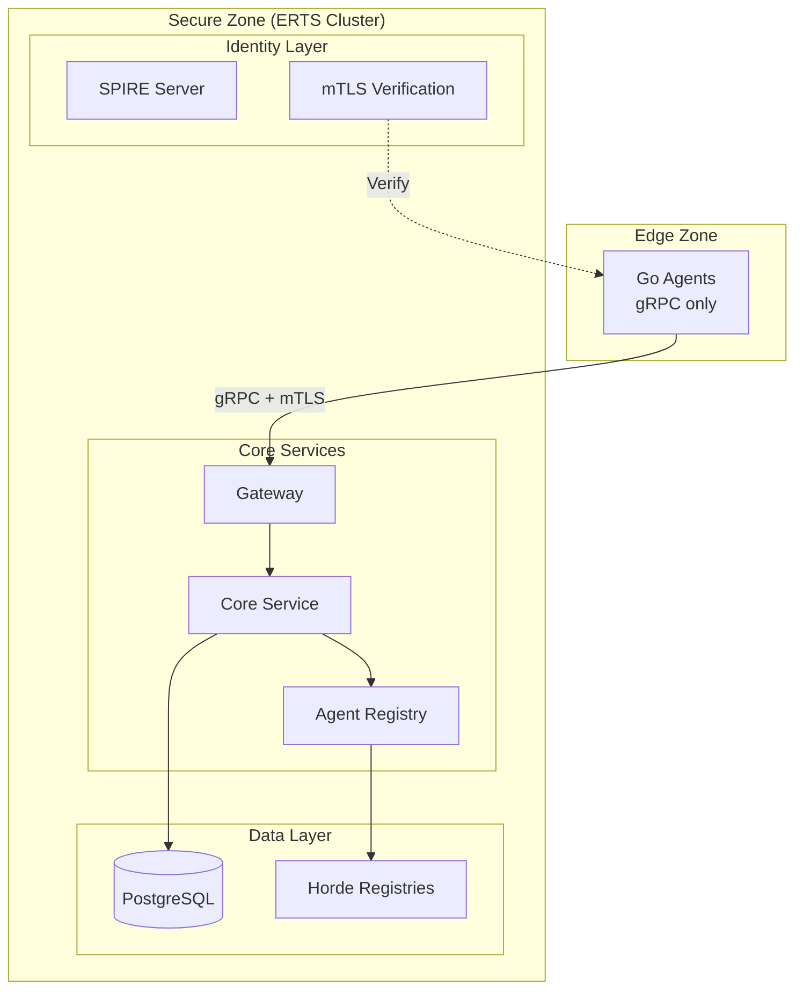
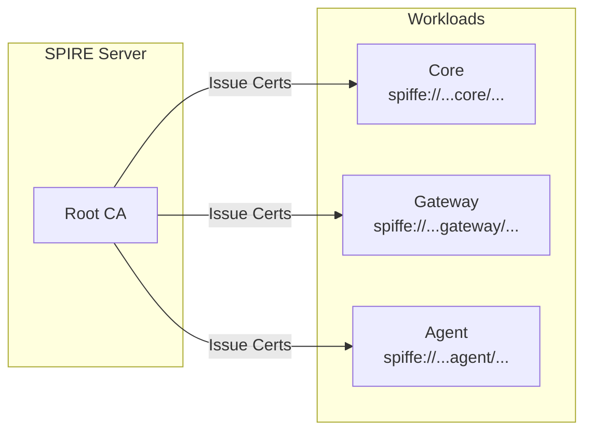

# Security Architecture

This document describes the security architecture of ServiceRadar, with a focus on edge isolation and multi-tenant security.

## Overview

ServiceRadar implements a defense-in-depth security model with multiple isolation layers:



## Security Layers

### 1. Network Isolation

| Zone | Components | Network Access |
|------|------------|----------------|
| Edge | Go Agents | gRPC to Gateway only (port 50052) |
| Internal | Core, Gateway, Web | ERTS cluster + internal services |
| Data | PostgreSQL, NATS | Internal only |

**Firewall Requirements:**

| From | To | Port | Allow |
|------|-----|------|-------|
| Edge | Gateway | 50052 | Yes (gRPC) |
| Edge | Core | 8090 | No |
| Edge | PostgreSQL | 5432 | No |
| Edge | ERTS | 4369, 9100-9155 | No |

### 2. ERTS Cluster Isolation

Edge agents (Go binaries) cannot join the ERTS cluster:

- **No ERTS Protocol**: Go agents don't implement Erlang distribution
- **No RPC Access**: Cannot call `:rpc.call/4` on cluster nodes
- **No Registry Access**: Cannot enumerate Horde registries

**Verified by**: `EdgeIsolationTest.cluster_nodes_do_not_include_edge_agent_nodes`

### 3. mTLS Identity Verification

All edge connections require valid mTLS certificates:

**Certificate Format:**
```
CN: <component_id>.<partition_id>.<tenant_slug>.serviceradar
SAN: spiffe://serviceradar.local/<type>/<tenant_slug>/<partition_id>/<id>
```

**Verification Chain:**
1. TLS handshake validates certificate signature
2. TenantResolver extracts tenant_slug from CN
3. SPIFFE ID validates component type authorization
4. Tenant context set for all subsequent operations

**Verified by**: `MTLSTenantValidationTest` (22 tests)

### 4. Multi-Tenant Isolation

Resources are isolated by tenant_id at multiple levels:

| Level | Mechanism | Enforcement |
|-------|-----------|-------------|
| Registry | Horde per-tenant registries | TenantRegistry.ensure_registry/1 |
| API | Ash multitenancy | `tenant: tenant_id` option |
| Database | tenant_id column | Ash policy checks |
| Process | TenantGuard | Process dictionary verification |

**Attack Scenarios Blocked:**

| Attack | Result | Test |
|--------|--------|------|
| Enumerate other tenant's agents | Empty result | CrossTenantAccessTest |
| Get gRPC address for other agent | `{:error, :not_found}` | CrossTenantAccessTest |
| Update other tenant's resource | Policy forbidden | CrossTenantAccessTest |
| Spoof tenant_id in request | Context overrides | CrossTenantAccessTest |

### 5. SPIFFE Identity Plane

All internal services use SPIFFE identities:



**SPIFFE ID Format:**
```
spiffe://serviceradar.local/<node_type>/<partition_id>/<node_id>
```

**Node Types:**
- `core` - Core service nodes
- `gateway` - Gateway nodes
- `agent` - Edge agents

## Security Properties

### Property 1: Edge Cannot Execute Code on Core

**Threat**: Attacker with edge access attempts RPC to core nodes

**Mitigation**:
- Go agents are not Erlang nodes
- No ERTS distribution protocol exposed
- RPC to non-cluster nodes returns `{:badrpc, :nodedown}`

**Verification**: `EdgeIsolationTest.remote_RPC_is_only_available_to_ERTS_cluster_members`

### Property 2: Edge Cannot Discover Other Tenants

**Threat**: Compromised agent tries to enumerate other tenants' agents

**Mitigation**:
- Registry queries scoped by tenant_id
- Horde registries are per-tenant
- mTLS certificate binds tenant identity

**Verification**: `CrossTenantAccessTest.Attack_Scenario_1_Registry_Enumeration`

### Property 3: Tenant Identity Cannot Be Forged

**Threat**: Attacker modifies tenant_id in request

**Mitigation**:
- Tenant_id from mTLS certificate, not request body
- TenantGuard verifies process tenant
- Ash multitenancy uses `tenant:` context option

**Verification**: `CrossTenantAccessTest.Attack_Scenario_5_Tenant_Spoofing`

### Property 4: Data Isolation at Database Level

**Threat**: SQL injection to access other tenant's data

**Mitigation**:
- Ash queries always include tenant_id filter
- No raw SQL in application code
- PostgreSQL row-level security available

**Verification**: `AgentTenantIsolationTest` (10 tests)

## Incident Response

### Suspected Cross-Tenant Access

1. Check audit logs for tenant_id anomalies
2. Review AgentRegistry for cross-tenant lookups
3. Verify mTLS certificates are tenant-specific
4. Run security test suite: `mix test test/serviceradar/security/`

### Suspected Edge Compromise

1. Revoke agent certificate via TenantCA
2. Unregister agent: `AgentRegistry.unregister_agent/2`
3. Review gRPC logs for unusual patterns
4. Verify no ERTS connection established

### Certificate Rotation

1. Generate new certificates via TenantCA
2. Distribute to edge agents
3. Agents reconnect with new certs
4. Old certificates expire per CA policy

## Security Testing

Run the full security test suite:

```bash
cd elixir/serviceradar_core
mix test test/serviceradar/security/ --trace
```

**Test Coverage:**
- `edge_isolation_test.exs` - 7 tests
- `mtls_tenant_validation_test.exs` - 22 tests
- `cross_tenant_access_test.exs` - 14 tests

**Total: 43 security validation tests**

## Configuration Checklist

- [ ] SPIFFE trust domain configured (`spire.trustDomain`)
- [ ] Tenant CAs generated for all tenants
- [ ] Agent certificates use correct CN format
- [ ] mTLS enabled on gRPC endpoints
- [ ] Firewall blocks ERTS ports from edge
- [ ] No `agent@*` nodes in ERTS cluster
- [ ] AgentRegistry only stores gRPC endpoints
- [ ] Security tests passing (43 tests, 0 failures)
