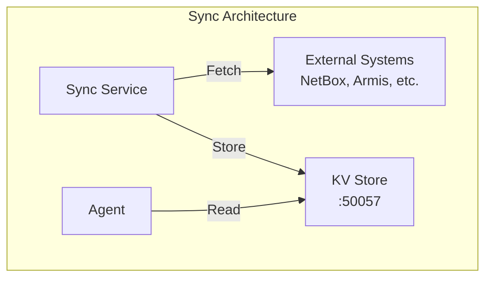

# Sync Service Configuration

The ServiceRadar Sync service integrates external data sources with ServiceRadar's monitoring capabilities. It works with the KV Store to automatically synchronize device information from external systems and generate appropriate monitoring configurations. This allows for automatic discovery and monitoring of devices from systems like NetBox, Armis, and other inventory or security platforms.

## Overview

The Sync service:
- Fetches data from external systems like CMDB, IPAM, or security tools
- Converts this data into ServiceRadar configurations
- Stores the configurations in the KV Store for automatic consumption by agents
- Runs on a configurable schedule for continuous synchronization
- Supports multiple data sources with different integration types

## Architecture



The Sync service integrates with external systems, fetches device and service information, and makes it available to ServiceRadar agents through the KV Store. This creates a seamless workflow where network inventory systems can automatically update monitoring configurations without manual intervention.

## Prerequisites

Before configuring the Sync service, ensure you have:

1. Installed the KV service (see [KV Store Configuration](./kv-configuration.md))
2. Generated and deployed TLS certificates for mTLS security
3. API access to your external data sources (credentials, endpoints, etc.)

## Configuration

The Sync service is configured via `/etc/serviceradar/sync.json`:

```json
{
  "kv_address": "192.168.2.23:50057",
  "listen_addr": "192.168.2.23:50058",
  "poll_interval": "5m",
  "nats_url": "tls://192.168.2.23:4222",
  "stream_name": "devices",
  "subject": "discovery.devices",
  "domain": "edge",
  "security": {
    "mode": "mtls",
    "cert_dir": "/etc/serviceradar/certs",
    "server_name": "192.168.2.23",
    "role": "poller",
    "tls": {
      "cert_file": "sync.pem",
      "key_file": "sync-key.pem",
      "ca_file": "root.pem",
      "client_ca_file": "root.pem"
    }
  },
  "nats_security": {
    "mode": "mtls",
    "cert_dir": "/etc/serviceradar/certs",
    "server_name": "nats-serviceradar",
    "role": "poller",
    "tls": {
      "cert_file": "sync.pem",
      "key_file": "sync-key.pem",
      "ca_file": "root.pem",
      "client_ca_file": "root.pem"
    }
  },
  "nats_security": {
    "mode": "mtls",
    "cert_dir": "/etc/serviceradar/certs",
    "server_name": "nats-serviceradar",
    "role": "poller",
    "tls": {
      "cert_file": "sync.pem",
      "key_file": "sync-key.pem",
      "ca_file": "root.pem",
      "client_ca_file": "root.pem"
    }
  },
  "sources": {
    "netbox": {
      "type": "netbox",
      "endpoint": "https://192.168.2.73",
      "prefix": "netbox/",
      "credentials": {
        "api_token": "72d72b0ddddddd3f7951051cd78cd7c"
      },
      "insecure_skip_verify": true
    }
  }
}
```

### Configuration Options

| Option | Description | Default | Required |
|--------|-------------|---------|----------|
| `sources` | Map of external data sources to fetch from | N/A | Yes |
| `kv_address` | Address and port of the KV service | N/A | Yes |
| `listen_addr` | Address and port for the Sync service to listen on | N/A | Yes |
| `poll_interval` | How often to fetch and update data | `30m` | No |
| `nats_url` | URL for connecting to the NATS Server | `nats://127.0.0.1:4222` | No |
| `stream_name` | JetStream stream for device messages | `devices` | Yes |
| `subject` | Base subject for published devices | `discovery.devices` | No |
| `domain` | JetStream domain for the NATS server | N/A | No |
| `security` | mTLS security settings for gRPC/KV | N/A | Yes |
| `nats_security` | mTLS security settings for NATS | (uses `security` if omitted) | No |

### Source Configuration

Each source in the `sources` map requires:

| Option | Description | Required |
|--------|-------------|----------|
| `type` | Integration type (e.g., "netbox", "armis") | Yes |
| `endpoint` | API endpoint URL | Yes |
| `prefix` | Key prefix in the KV store | Yes |
| `credentials` | Authentication credentials (API keys, tokens) | Yes |
| `insecure_skip_verify` | Skip TLS verification for self-signed certificates | No |

## Supported Integrations

The Sync service supports the following integration types:

### NetBox Integration

```json
"netbox": {
  "type": "netbox",
  "endpoint": "https://netbox.example.com/api",
  "prefix": "netbox/",
  "credentials": {
    "api_token": "your_netbox_token",
    "expand_subnets": "true"
  },
  "insecure_skip_verify": true
}
```

The NetBox integration:
- Retrieves IP addresses, devices, and VMs from NetBox
- Creates monitor configurations based on device types and services
- Stores the configurations in the KV store with prefix `netbox/`
- Supports subnet expansion with the `expand_subnets` option

#### NetBox-Specific Options

| Option | Description | Default | Required |
|--------|-------------|---------|----------|
| `api_token` | NetBox API token | N/A | Yes |
| `expand_subnets` | Use subnet masks from NetBox instead of /32 | `false` | No |
| `insecure_skip_verify` | Skip TLS verification | `false` | No |

### Armis Integration

```json
"armis": {
  "type": "armis",
  "endpoint": "https://api.armis.com/api/v1/devices",
  "prefix": "armis/",
  "credentials": {
    "api_key": "your_armis_api_key"
  }
}
```

The Armis integration:
- Fetches device information from Armis
- Creates device records in the KV store
- Automatically generates network sweep configurations for discovered devices
- Stores the Armis device ID in each device's metadata for later correlation

#### Armis-Specific Options

| Option | Description | Default | Required |
|--------|-------------|---------|----------|
| `api_key` | Armis API key | N/A | Yes |

## Security Requirements

### mTLS Configuration

The Sync service **requires** mTLS for security. The following settings are mandatory:

```json
"security": {
  "mode": "mtls",
  "cert_dir": "/etc/serviceradar/certs",
  "server_name": "your-kv-server-ip-or-hostname",
  "role": "poller",
  "tls": {
    "cert_file": "sync.pem",
    "key_file": "sync-key.pem",
    "ca_file": "root.pem",
    "client_ca_file": "root.pem"
  }
}
```

- The `cert_file`, `key_file`, and `ca_file` paths are relative to the `cert_dir` if not absolute
- Use absolute paths when certificates are stored outside the default directory
- The `server_name` must match the hostname/IP in the KV service's certificate

### KV Store RBAC Configuration

The Sync service requires `writer` access to the KV store. Update your KV service configuration (`/etc/serviceradar/kv.json`) to include the Sync service's certificate identity:

```json
"rbac": {
  "roles": [
    {"identity": "CN=sync.serviceradar,O=ServiceRadar", "role": "writer"},
    {"identity": "CN=agent.serviceradar,O=ServiceRadar", "role": "reader"}
  ]
}
```

## Agent Configuration for KV

To allow agents to read configurations created by the Sync service, update your agent configuration (`/etc/serviceradar/agent.json`) to include KV store access:

```json
{
  "checkers_dir": "/etc/serviceradar/checkers",
  "listen_addr": "192.168.2.23:50051",
  "service_type": "grpc",
  "service_name": "AgentService",
  "agent_id": "default-agent",
  "agent_name": "192.168.2.23",
  "security": {
    "mode": "mtls",
    "cert_dir": "/etc/serviceradar/certs",
    "server_name": "192.168.2.23",
    "role": "agent",
    "tls": {
      "cert_file": "agent.pem",
      "key_file": "agent-key.pem",
      "ca_file": "root.pem"
    }
  },
  "kv_address": "192.168.2.23:50057",
  "kv_security": {
    "mode": "mtls",
    "cert_dir": "/etc/serviceradar/certs",
    "server_name": "192.168.2.23",
    "role": "agent",
    "tls": {
      "cert_file": "kv-client.pem",
      "key_file": "kv-client-key.pem",
      "ca_file": "root.pem"
    }
  }
}
```

Note the `kv_address` and `kv_security` sections which enable the agent to connect to the KV store and retrieve dynamic configurations.

## Generated Configurations

The Sync service automatically generates configurations that agents can consume. These configurations are stored in the KV store under keys that follow this pattern:

```
agents/<hostname>/checkers/<checker-type>/<checker-name>.json
```

### Network Sweep Configuration Example

For discovered IP addresses, the Sync service creates network sweep configurations like this:

```json
{
  "networks": [
    "192.168.1.1/32",
    "192.168.1.2/32",
    "192.168.1.3/32",
    "192.168.1.4/32",
    "192.168.1.5/32"
  ],
  "ports": [22, 80, 443, 3306, 5432, 6379, 8080, 8443],
  "sweep_modes": ["icmp", "tcp"],
  "interval": "5m",
  "concurrency": 100,
  "timeout": "10s",
  "icmp_count": 1,
  "high_perf_icmp": true,
  "icmp_rate_limit": 5000
}
```

This configuration would be stored at a key like `agents/192.168.2.23/checkers/sweep/sweep.json` in the KV store.

## Installation and Usage

### 1. Install the Sync Service

The Sync service is distributed as a separate package:

```bash
# Debian/Ubuntu
curl -LO https://github.com/carverauto/serviceradar/releases/download/1.0.33/serviceradar-sync_1.0.33.deb
sudo dpkg -i serviceradar-sync_1.0.33.deb

# RHEL/Oracle Linux
curl -LO https://github.com/carverauto/serviceradar/releases/download/1.0.33/serviceradar-sync-1.0.33-1.el9.x86_64.rpm
sudo dnf install -y ./serviceradar-sync-1.0.33-1.el9.x86_64.rpm
```

### 2. Configure the Sync Service

Create or edit `/etc/serviceradar/sync.json` with your configuration.

### 3. Start the Service

```bash
sudo systemctl start serviceradar-sync
```

### 4. Verify Operation

Check that the service is running:

```bash
sudo systemctl status serviceradar-sync
```

Review logs for synchronization activity:

```bash
sudo journalctl -u serviceradar-sync --since today
```

Verify that data is being stored in the KV store:

```bash
# Verify data in the KV store using the NATS CLI
nats kv get serviceradar-kv agents/192.168.2.23/checkers/sweep/sweep.json \
  --server tls://192.168.2.23:4222 \ 
  --tlscert /etc/serviceradar/certs/client.pem \
  --tlskey /etc/serviceradar/certs/client-key.pem \
  --tlsca /etc/serviceradar/certs/root.pem --raw
```

## Under the Hood: How the Sync Service Works

The Sync service operates on a simple yet powerful principle:

1. At the configured poll interval, it connects to each configured external source
2. It fetches device information and converts it to ServiceRadar configurations
3. It writes the configurations to the KV store using the configured prefixes
4. Agents configured to use the KV store automatically pick up these configurations

### How NetBox Integration Works

The NetBox integration:
1. Connects to the NetBox API using the provided token
2. Retrieves device information including IP addresses
3. Processes the device data to extract relevant monitoring information
4. For each device with a primary IP address:
    - Stores the device data in the KV store
    - Adds the IP to a network sweep configuration
5. Writes the complete sweep configuration to the KV store

If `expand_subnets` is enabled, the integration will use the subnet masks as defined in NetBox. Otherwise, it treats all IPs as /32 (individual hosts).

## Firewall Configuration

If you're using a firewall, you need to open ports for the Sync service:

```bash
# For UFW (Ubuntu)
sudo ufw allow 50058/tcp  # Sync service gRPC port

# For firewalld (RHEL/Oracle Linux)
sudo firewall-cmd --permanent --add-port=50058/tcp
sudo firewall-cmd --reload
```

Make sure the Sync service can also reach:
- Your KV service (typically port 50057)
- Your external APIs (typically HTTPS on port 443)

## Troubleshooting

### Service Won't Start

Check the logs for detailed error information:

```bash
sudo journalctl -u serviceradar-sync -n 100
```

Common issues include:
- Incorrect certificate paths
- Invalid credentials for external systems
- KV service not running or unreachable

### Integration Issues

If an integration isn't working:

1. Check that the API endpoint is accessible from the Sync service:
   ```bash
   curl -k https://your-netbox-server/api/dcim/devices/
   ```

2. Verify the credentials are valid (try a manual API call with the token)

3. Ensure the prefix is correctly configured in both Sync and KV configurations

4. Look for specific error messages in the logs:
   ```bash
   grep "error" /var/log/serviceradar-sync.log
   ```

### Permission Issues

If the Sync service can't write to the KV store:

1. Verify the certificate's identity matches an entry in the KV service's RBAC configuration with `writer` role
2. Check that the TLS certificates are valid and readable by the Sync service
3. Ensure the `server_name` matches the KV service's certificate

## Best Practices

1. **Use Separate Prefixes**: Give each data source a unique prefix to avoid key conflicts

2. **Set Appropriate Poll Intervals**: Consider API rate limits and data freshness requirements

3. **Secure Credentials**: Use environment variables or a secure vault for sensitive credentials rather than storing them directly in the configuration file

4. **Monitor Sync Activity**: Set up monitoring for the Sync service itself to ensure it's operating correctly

5. **Backup Configurations**: Periodically backup your Sync service configuration and related certificates

## Example: Complete Sync Configuration

Here's a comprehensive example that includes multiple data sources:

```json
{
  "kv_address": "192.168.2.23:50057",
  "listen_addr": "192.168.2.23:50058",
  "poll_interval": "5m",
  "nats_url": "tls://192.168.2.23:4222",
  "security": {
    "mode": "mtls",
    "cert_dir": "/etc/serviceradar/certs",
    "server_name": "192.168.2.23",
    "role": "poller",
    "tls": {
      "cert_file": "sync.pem",
      "key_file": "sync-key.pem",
      "ca_file": "root.pem",
      "client_ca_file": "root.pem"
    }
  },
  "nats_security": {
    "mode": "mtls",
    "cert_dir": "/etc/serviceradar/certs",
    "server_name": "nats-serviceradar",
    "role": "poller",
    "tls": {
      "cert_file": "sync.pem",
      "key_file": "sync-key.pem",
      "ca_file": "root.pem",
      "client_ca_file": "root.pem"
    }
  },
  "sources": {
    "netbox": {
      "type": "netbox",
      "endpoint": "https://192.168.2.73",
      "prefix": "netbox/",
      "credentials": {
        "api_token": "72d72b0ddddddd3f7951051cd78cd7c",
        "expand_subnets": "true"
      },
      "insecure_skip_verify": true
    },
    "armis": {
      "type": "armis",
      "endpoint": "https://api.armis.internal/v1/devices",
      "prefix": "armis/",
      "credentials": {
        "api_key": "your_armis_api_key"
      }
    }
  }
}
```

With this configuration, the Sync service will connect to both NetBox and Armis, retrieve device information from both systems, and create network sweep configurations that will be automatically picked up by agents configured to use the KV store.

## Next Steps

- Set up [TLS Security](./tls-security.md) to secure communications between components
- Configure your [Agents](./configuration.md#agent-configuration) to use the KV store
- Learn more about [ServiceRadar's Architecture](./architecture.md)