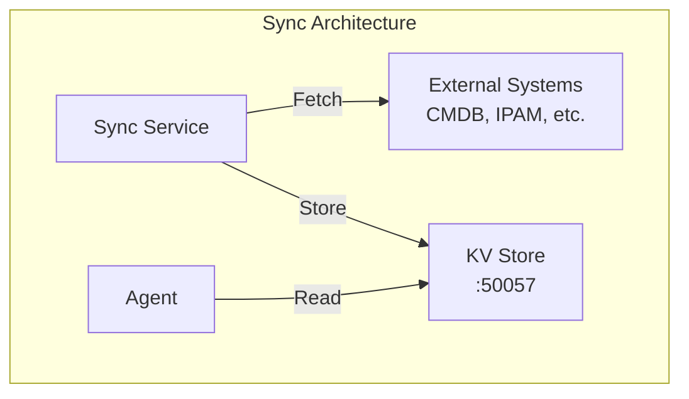

# Sync Service Configuration

The ServiceRadar Sync service integrates external data sources with ServiceRadar's monitoring capabilities. It works with the KV Store to automatically synchronize device information from external systems and generate appropriate monitoring configurations. This allows for automatic discovery and monitoring of devices from systems like Armis, NetBox, and other inventory or security platforms.

## Overview

The Sync service:
- Fetches data from external systems like CMDB, IPAM, or security tools
- Converts this data into ServiceRadar configurations
- Stores the configurations in the KV Store for automatic consumption by agents
- Runs on a configurable schedule for continuous synchronization
- Supports multiple data sources with different integration types

## Architecture



The Sync service integrates with external systems, fetches device and service information, and makes it available to ServiceRadar agents through the KV Store.

## Prerequisites

Before configuring the Sync service, ensure you have:

1. Installed the KV service (see [KV Store Configuration](./kv-configuration.md))
2. Generated and deployed TLS certificates for mTLS security
3. API access to your external data sources (credentials, endpoints, etc.)

## Configuration

The Sync service is configured via `/etc/serviceradar/sync.json`:

```json
{
  "kv_address": "192.168.2.23:50057",
  "listen_addr": "192.168.2.23:50058",
  "poll_interval": "5m",
  "security": {
    "mode": "mtls",
    "cert_dir": "/etc/serviceradar/certs",
    "server_name": "192.168.2.23",
    "role": "poller",
    "tls": {
      "cert_file": "sync.pem",
      "key_file": "sync-key.pem",
      "ca_file": "root.pem",
      "client_ca_file": "root.pem"
    }
  },
  "sources": {
    "armis": {
      "type": "armis",
      "endpoint": "http://localhost:8080/v1/devices",
      "prefix": "armis/",
      "credentials": {
        "api_key": "your-armis-api-key-here"
      }
    }
  }
}
```

### Configuration Options

| Option | Description | Default | Required |
|--------|-------------|---------|----------|
| `sources` | Map of external data sources to fetch from | N/A | Yes |
| `kv_address` | Address and port of the KV service | N/A | Yes |
| `listen_addr` | Address and port for the Sync service to listen on | N/A | Yes |
| `poll_interval` | How often to fetch and update data | `30m` | No |
| `security` | mTLS security settings | N/A | Yes |

### Source Configuration

Each source in the `sources` map requires:

| Option | Description | Required |
|--------|-------------|----------|
| `type` | Integration type (e.g., "armis", "netbox") | Yes |
| `endpoint` | API endpoint URL | Yes |
| `prefix` | Key prefix in the KV store | Yes |
| `credentials` | Authentication credentials (API keys, tokens) | Yes |

## Supported Integrations

The Sync service supports the following integration types:

### Armis Integration

```json
"armis": {
  "type": "armis",
  "endpoint": "https://api.armis.com/api/v1/devices",
  "prefix": "armis/",
  "credentials": {
    "api_key": "your_armis_api_key"
  }
}
```

The Armis integration:
- Fetches device information from Armis
- Creates device records in the KV store
- Automatically generates network sweep configurations for discovered devices

### NetBox Integration

```json
"netbox": {
  "type": "netbox",
  "endpoint": "https://netbox.example.com/api",
  "prefix": "netbox/",
  "credentials": {
    "token": "your_netbox_token"
  }
}
```

The NetBox integration:
- Retrieves IP addresses, devices, and VMs from NetBox
- Creates monitor configurations based on device types and services
- Stores the configurations in the KV store with prefix `netbox/`

## Security Requirements

### mTLS Configuration

The Sync service uses mTLS to connect to the KV Store. The following settings are required:

```json
"security": {
  "mode": "mtls",
  "cert_dir": "/etc/serviceradar/certs",
  "server_name": "192.168.2.23",
  "role": "poller",
  "tls": {
    "cert_file": "sync.pem",
    "key_file": "sync-key.pem",
    "ca_file": "root.pem",
    "client_ca_file": "root.pem"
  }
}
```

- The `server_name` must match the hostname/IP in the KV service's certificate
- The Sync service needs a valid client certificate for authentication
- The Sync certificate's identity must have appropriate permissions in the KV service's RBAC configuration

## KV Store Integration

The Sync service requires `writer` access to the KV store. Update your KV service configuration (`/etc/serviceradar/kv.json`) to include the Sync service's certificate identity:

```json
"rbac": {
  "roles": [
    {"identity": "CN=sync.serviceradar,O=ServiceRadar", "role": "writer"},
    {"identity": "CN=agent.serviceradar,O=ServiceRadar", "role": "reader"}
  ]
}
```

## Agent Configuration for KV

To allow agents to read configurations created by the Sync service, update your agent configuration (`/etc/serviceradar/agent.json`) to include KV store access:

```json
{
  "checkers_dir": "/etc/serviceradar/checkers",
  "listen_addr": "192.168.2.23:50051",
  "service_type": "grpc",
  "service_name": "AgentService",
  "agent_id": "default-agent",
  "agent_name": "192.168.2.23",
  "security": {
    "mode": "mtls",
    "cert_dir": "/etc/serviceradar/certs",
    "server_name": "192.168.2.23",
    "role": "agent",
    "tls": {
      "cert_file": "agent.pem",
      "key_file": "agent-key.pem",
      "ca_file": "root.pem"
    }
  },
  "kv_address": "192.168.2.23:50057",
  "kv_security": {
    "mode": "mtls",
    "cert_dir": "/etc/serviceradar/certs",
    "server_name": "192.168.2.23",
    "role": "agent",
    "tls": {
      "cert_file": "kv-client.pem",
      "key_file": "kv-client-key.pem",
      "ca_file": "root.pem"
    }
  }
}
```

Note the `kv_address` and `kv_security` sections which enable the agent to connect to the KV store and retrieve dynamic configurations.

## Generated Configurations

The Sync service automatically generates configurations that agents can consume:

### Network Sweep Configuration

For discovered IP addresses, the Sync service creates network sweep configurations. Here's an example of a generated configuration:

```json
{
  "networks": [
    "192.168.1.1/32",
    "192.168.1.2/32",
    "192.168.1.3/32",
    "192.168.1.4/32",
    "192.168.1.5/32",
    "192.168.1.6/32",
    "192.168.1.7/32",
    "192.168.1.8/32",
    "192.168.1.9/32",
    "192.168.1.10/32"
  ],
  "ports": [22, 80, 443, 3306, 5432, 6379, 8080, 8443],
  "sweep_modes": ["icmp", "tcp"],
  "interval": "5m",
  "concurrency": 100,
  "timeout": "10s",
  "icmp_count": 1,
  "high_perf_icmp": true,
  "icmp_rate_limit": 5000
}
```

This configuration is stored at a key like `agents/192.168.2.23/checkers/sweep/sweep.json` in the KV store for agents to consume.

## Installation and Usage

### 1. Install the Sync Service

The Sync service is distributed as a separate package:

```bash
# Debian/Ubuntu
curl -LO https://github.com/carverauto/serviceradar/releases/download/1.0.28/serviceradar-sync_1.0.28.deb
sudo dpkg -i serviceradar-sync_1.0.28.deb

# RHEL/Oracle Linux
curl -LO https://github.com/carverauto/serviceradar/releases/download/1.0.28/serviceradar-sync-1.0.28-1.el9.x86_64.rpm
sudo dnf install -y ./serviceradar-sync-1.0.28-1.el9.x86_64.rpm
```

### 2. Configure the Sync Service

Create or edit `/etc/serviceradar/sync.json` with your configuration.

### 3. Start the Service

```bash
sudo systemctl start serviceradar-sync
```

### 4. Verify Operation

Check that the service is running:

```bash
sudo systemctl status serviceradar-sync
```

Review logs for synchronization activity:

```bash
sudo journalctl -u serviceradar-sync --since today
```

Verify that data is being stored in the KV store:

```bash
# Verify data in the KV store using the NATS CLI
nats kv get serviceradar-kv agents/192.168.2.23/checkers/sweep/sweep.json \
  --server tls://192.168.2.23:4222 \ 
  --tlscert /etc/serviceradar/certs/client.pem \
  --tlskey /etc/serviceradar/certs/client-key.pem \
  --tlsca /etc/serviceradar/certs/root.pem --raw
```

## Troubleshooting

### Service Won't Start

Check the logs for detailed error information:

```bash
sudo journalctl -u serviceradar-sync -n 100
```

Common issues include:
- Incorrect certificate paths
- Invalid credentials for external systems
- KV service not running or unreachable

### Integration Issues

If an integration isn't working:

1. Check that the API endpoint is accessible from the Sync service
2. Verify the credentials are valid
3. Ensure the prefix is correctly configured
4. Look for specific error messages in the logs

### Permission Issues

If the Sync service can't write to the KV store:

1. Verify the certificate's identity matches an entry in the KV service's RBAC configuration with `writer` role
2. Check that the TLS certificates are valid and readable by the Sync service
3. Ensure the `server_name` matches the KV service's certificate

## Best Practices

1. **Use Separate Prefixes**: Give each data source a unique prefix to avoid key conflicts

2. **Set Appropriate Poll Intervals**: Consider API rate limits and data freshness requirements

3. **Secure Credentials**: Use environment variables or a secure vault for sensitive credentials rather than storing them directly in the configuration file

4. **Monitor Sync Activity**: Set up monitoring for the Sync service itself to ensure it's operating correctly

5. **Backup Configurations**: Periodically backup your Sync service configuration and related certificates