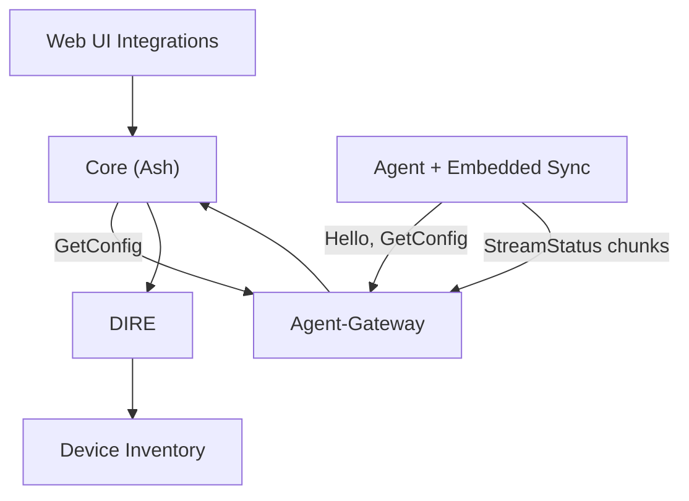

# Sync Runtime (Embedded in Agent)

ServiceRadar sync is embedded in `serviceradar-agent`. It fetches inventory from external systems and streams device updates through the agent-gateway to core-elx, where DIRE reconciles them into canonical records.

## Overview

- Configured in the Web UI under **Integrations**.
- Agents fetch config via `GetConfig`.
- Updates are streamed to agent-gateway using chunked `StreamStatus`.

## Architecture

```mermaid
graph TD
    UI["Web UI Integrations"] --> Core["Core (Ash)"]
    Core -->|GetConfig| Gateway["Agent-Gateway"]

    Agent["Agent + Embedded Sync"] -->|Hello, GetConfig| Gateway
    Agent -->|StreamStatus chunks| Gateway

    Gateway --> Core
    Core --> DIRE["DIRE"]
    DIRE --> Inventory["Device Inventory"]
```

## Troubleshooting

- **No config returned**: Verify agent-gateway connectivity and valid mTLS certs.
- **gRPC size errors**: Reduce chunk size or increase gRPC message limits.
