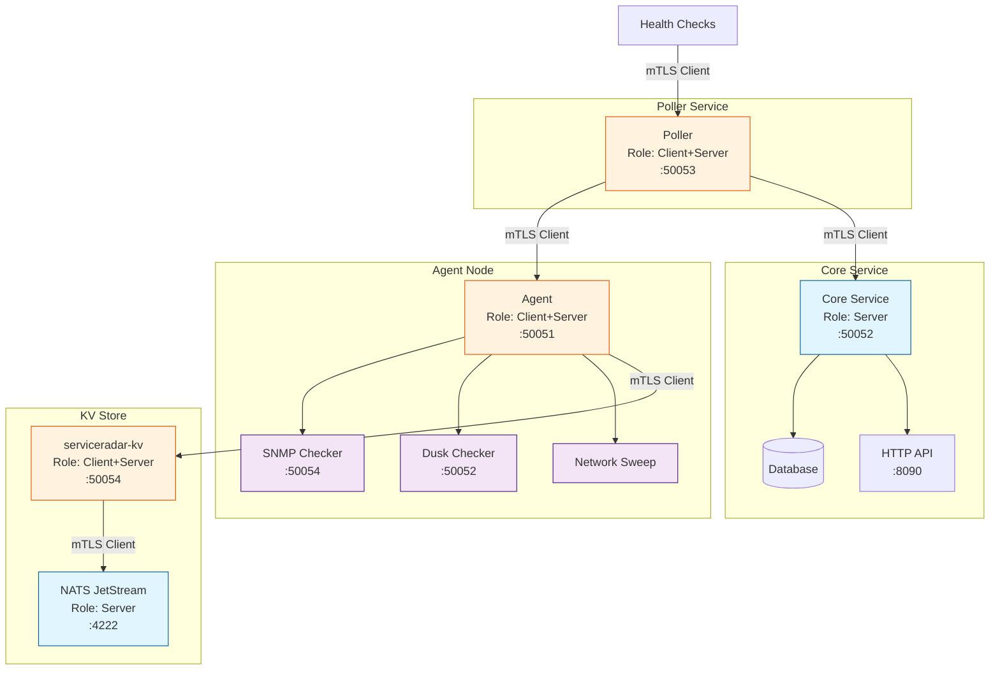

# TLS Security

ServiceRadar supports mutual TLS (mTLS) authentication to secure communications between components. 
This guide explains how to set up and configure mTLS for your ServiceRadar deployment, including the 
NATS JetStream server used for the KV store.

## Security Architecture

ServiceRadar components communicate securely using mTLS with the following roles:



## Certificate Overview

ServiceRadar uses the following certificate files:
- `root.pem`: Root CA certificate (shared across all components).
- `<component>.pem`: Component-specific certificate (e.g., `agent.pem`, `kv.pem`, `nats-server.pem`).
- `<component>-key.pem`: Component-specific private key.

## Certificate Generation

### 1. Install cfssl

First, install the CloudFlare SSL toolkit (cfssl) which we'll use for generating certificates:

```bash
go install github.com/cloudflare/cfssl/cmd/...@latest
```

### 2. Create Configuration Files

Create `cfssl.json`:
```json
{
    "signing": {
        "default": {
            "expiry": "8760h"
        },
        "profiles": {
            "rootca": {
                "usages": ["signing", "key encipherment", "server auth", "client auth"],
                "expiry": "8760h",
                "ca_constraint": {
                    "is_ca": true,
                    "max_path_len": 0
                }
            },
            "server": {
                "usages": ["signing", "key encipherment", "server auth"],
                "expiry": "8760h"
            },
            "client": {
                "usages": ["signing", "key encipherment", "client auth"],
                "expiry": "8760h"
            }
        }
    }
}
```

#### Component-Specific CSRs

Each component needs a Certificate Signing Request (CSR) with a unique `CN` and appropriate hosts. 
Replace `<ip-or-hostname>` with the actual IP or hostname of the server hosting the component.

**NATS JetStream (`nats-csr.json`)**:
```json
{
  "hosts": ["localhost", "127.0.0.1", "nats-serviceradar", "<nats-server-ip-or-hostname>"],
  "key": {"algo": "ecdsa", "size": 256},
  "names": [{"O": "ServiceRadar", "CN": "nats-serviceradar"}]
}
```

**serviceradar-kv (`kv-csr.json`)**:
```json
{
  "hosts": ["localhost", "127.0.0.1", "kv.serviceradar", "<kv-server-ip-or-hostname>"],
  "key": {"algo": "ecdsa", "size": 256},
  "names": [{"O": "ServiceRadar", "CN": "kv.serviceradar"}]
}
```

**Agent (`agent-csr.json`)**:
```json
{
  "hosts": ["localhost", "127.0.0.1", "<agent-server-ip-or-hostname>"],
  "key": {"algo": "ecdsa", "size": 256},
  "names": [{"O": "ServiceRadar", "CN": "agent.serviceradar"}]
}
```

**Poller (`poller-csr.json`)**:
```json
{
  "hosts": ["localhost", "127.0.0.1", "<poller-server-ip-or-hostname>"],
  "key": {"algo": "ecdsa", "size": 256},
  "names": [{"O": "ServiceRadar", "CN": "poller.serviceradar"}]
}
```

**Core (`core-csr.json`)**:
```json
{
  "hosts": ["localhost", "127.0.0.1", "<core-server-ip-or-hostname>"],
  "key": {"algo": "ecdsa", "size": 256},
  "names": [{"O": "ServiceRadar", "CN": "core.serviceradar"}]
}
```

:::note
Use `localhost` and `127.0.0.1` for co-located deployments; add specific IPs or hostnames (e.g., `192.168.1.100`, `agent.example.com`) for distributed setups.

The `CN` must be unique per component to enable RBAC in `serviceradar-kv`.

Modify the "hosts" array in csr.json and nats-csr.json to include the actual hostnames and IP addresses of your ServiceRadar components and NATS Server.
:::

### 3. Generate Certificates

Generate the root CA:
```bash
cfssl selfsign -config cfssl.json --profile rootca "ServiceRadar CA" csr.json | cfssljson -bare root
```

Generate and sign certificates for each component:
```bash
# NATS
cfssl genkey nats-csr.json | cfssljson -bare nats-server
cfssl sign -ca root.pem -ca-key root-key.pem -config cfssl.json -profile server nats-server.csr | cfssljson -bare nats-server

# serviceradar-kv
cfssl genkey kv-csr.json | cfssljson -bare kv
cfssl sign -ca root.pem -ca-key root-key.pem -config cfssl.json -profile client kv.csr | cfssljson -bare kv

# Agent
cfssl genkey agent-csr.json | cfssljson -bare agent
cfssl sign -ca root.pem -ca-key root-key.pem -config cfssl.json -profile client agent.csr | cfssljson -bare agent

# Poller
cfssl genkey poller-csr.json | cfssljson -bare poller
cfssl sign -ca root.pem -ca-key root-key.pem -config cfssl.json -profile client poller.csr | cfssljson -bare poller

# Core
cfssl genkey core-csr.json | cfssljson -bare core
cfssl sign -ca root.pem -ca-key root-key.pem -config cfssl.json -profile server core.csr | cfssljson -bare core
```

:::note
Use the server profile for components that only act as servers (e.g., nats-server, core).

Use the client profile for components that act as clients (e.g., agent, poller, kv when connecting to NATS).

serviceradar-kv needs client auth for NATS mTLS and server auth for its gRPC service. For simplicity, we use the client profile here since NATS requires it, and the gRPC server accepts it in practice. For strict separation, generate separate client and server certs (e.g., kv-client.pem, kv-server.pem).
:::


## Certificate Deployment

### Role-Based Requirements

Different ServiceRadar components need different certificates based on their role:

| Component | Role | Certificates Needed                                  |
|-----------|------|------------------------------------------------------|
| Poller | Client+Server | `root.pem`, `poller.pem`, `poller-key.pem`           |
| Agent | Client+Server | `root.pem`, `agent.pem`, `agent-key.pem`             |
| Core | Server only | `root.pem`, `core.pem`, `core-key.pem`               |
| Checker | Server only | `root.pem`, `<checker>.pem`, `<checker>-key.pem`     |
| NATS JetStream | Server only | `root.pem`, `nats-server.pem`, `nats-server-key.pem` |
| serviceradar-kv | Client+Server | `root.pem`, `kv.pem`, `kv-key.pem`                   |


### Installation Steps

1. Create the certificates directory:
```bash
sudo mkdir -p /etc/serviceradar/certs
sudo chown serviceradar:serviceradar /etc/serviceradar/certs
sudo chmod 700 /etc/serviceradar/certs
```

2. Deploy certificates

**serviceradar-nats**:
```bash
sudo cp root.pem nats-server.pem nats-server-key.pem /etc/serviceradar/certs/
sudo chown nats:nats /etc/serviceradar/certs/nats-server.pem /etc/serviceradar/certs/nats-server-key.pem
sudo chmod 644 /etc/serviceradar/certs/nats-server.pem
sudo chmod 600 /etc/serviceradar/certs/nats-server-key.pem
```

**serviceradar-kv**:
```bash
sudo cp root.pem kv.pem kv-key.pem /etc/serviceradar/certs/
sudo chown serviceradar:serviceradar /etc/serviceradar/certs/*
sudo chmod 644 /etc/serviceradar/certs/*.pem
sudo chmod 600 /etc/serviceradar/certs/*-key.pem
```

**serviceradar-agent**:
```bash
sudo cp root.pem agent.pem agent-key.pem /etc/serviceradar/certs/
sudo chown serviceradar:serviceradar /etc/serviceradar/certs/*
sudo chmod 644 /etc/serviceradar/certs/*.pem
sudo chmod 600 /etc/serviceradar/certs/*-key.pem
```

**serviceradar-poller**:
```bash
sudo cp root.pem poller.pem poller-key.pem /etc/serviceradar/certs/
sudo chown serviceradar:serviceradar /etc/serviceradar/certs/*
sudo chmod 644 /etc/serviceradar/certs/*.pem
sudo chmod 600 /etc/serviceradar/certs/*-key.pem
```

**serviceradar-core**:
```bash
sudo cp root.pem core.pem core-key.pem /etc/serviceradar/certs/
sudo chown serviceradar:serviceradar /etc/serviceradar/certs/*
sudo chmod 644 /etc/serviceradar/certs/*.pem
sudo chmod 600 /etc/serviceradar/certs/*-key.pem
```

**serviceradar-\<checker\>**:
```bash
sudo cp root.pem <checker>.pem <checker>-key.pem /etc/serviceradar/certs/
sudo chown serviceradar:serviceradar /etc/serviceradar/certs/*
sudo chmod 644 /etc/serviceradar/certs/*.pem
sudo chmod 600 /etc/serviceradar/certs/*-key.pem
```


3. Set permissions:
```bash
sudo chown serviceradar:serviceradar /etc/serviceradar/certs/*
sudo chmod 644 /etc/serviceradar/certs/*.pem
sudo chmod 600 /etc/serviceradar/certs/*-key.pem
```

#### Grant NATS Access (if co-located):

If NATS runs on the same server as other components, add the nats user to the serviceradar group:

```bash
# Add the nats user to the serviceradar group
sudo usermod -aG serviceradar nats
# Ensure the directory is group-readable:
sudo chmod 750 /etc/serviceradar/certs
```

### Expected Directory Structure

* NATS Server (standalone):
```
/etc/serviceradar/certs/
├── root.pem           (644, serviceradar:serviceradar)
├── nats-server.pem    (644, nats:nats)
└── nats-server-key.pem (600, nats:nats)
```

* Full Deployment (e.g., Agent + KV + NATS co-located)
```bash
/etc/serviceradar/certs/
├── root.pem           (644, serviceradar:serviceradar)
├── agent.pem          (644, serviceradar:serviceradar)
├── agent-key.pem      (600, serviceradar:serviceradar)
├── kv.pem             (644, serviceradar:serviceradar)
├── kv-key.pem         (600, serviceradar:serviceradar)
├── nats-server.pem    (644, nats:nats)
└── nats-server-key.pem (600, nats:nats)
```

Full deployment (Poller/Agent/serviceradar-kv):
```bash
/etc/serviceradar/certs/
├── root.pem           (644)
├── server.pem         (644)
├── server-key.pem     (600)
├── client.pem         (644)
└── client-key.pem     (600)
```

## Component Configuration

### Agent Configuration

Update `/etc/serviceradar/agent.json`:

```json
{
  "checkers_dir": "/etc/serviceradar/checkers",
  "listen_addr": "<agent-ip>:50051",
  "service_type": "grpc",
  "service_name": "AgentService",
  "security": {
    "mode": "mtls",
    "cert_dir": "/etc/serviceradar/certs",
    "server_name": "kv.serviceradar",
    "role": "agent",
    "tls": {
      "cert_file": "agent.pem",
      "key_file": "agent-key.pem",
      "ca_file": "root.pem"
    }
  }
}
```

- Set `mode` to `mtls`
- Set `server_name` to the hostname/IP address of the poller
- Set `role` to `agent`

### Poller Configuration

Update `/etc/serviceradar/poller.json`:

```json
{
  "agents": {
    "local-agent": {
      "address": "<agent-ip>:50051",
      "security": {
        "server_name": "agent.serviceradar",
        "mode": "mtls",
        "tls": {
          "cert_file": "poller.pem",
          "key_file": "poller-key.pem",
          "ca_file": "root.pem"
        }
      },
      "checks": []
    }
  },
  "core_address": "<core-ip>:50052",
  "listen_addr": "<poller-ip>:50053",
  "poll_interval": "30s",
  "poller_id": "my-poller",
  "service_name": "PollerService",
  "service_type": "grpc",
  "security": {
    "mode": "mtls",
    "cert_dir": "/etc/serviceradar/certs",
    "server_name": "core.serviceradar",
    "role": "poller",
    "tls": {
      "cert_file": "poller.pem",
      "key_file": "poller-key.pem",
      "ca_file": "root.pem"
    }
  }
}
```

### Core Configuration

Update `/etc/serviceradar/core.json`:

```json
{
  "listen_addr": ":8090",
  "grpc_addr": "<core-ip>:50052",
  "alert_threshold": "5m",
  "known_pollers": ["my-poller"],
  "metrics": {
    "enabled": true,
    "retention": 100,
    "max_nodes": 10000
  },
  "security": {
    "mode": "mtls",
    "cert_dir": "/etc/serviceradar/certs",
    "server_name": "core.serviceradar",
    "role": "core",
    "tls": {
      "cert_file": "core.pem",
      "key_file": "core-key.pem",
      "ca_file": "root.pem"
    }
  }
}
```

### NATS JetStream Configuration

The NATS Server configuration is already set up with mTLS in `/etc/nats/nats-server.conf`
(see the Installation Guide (./installation.md)). Ensure the certificates are correctly placed in 
`/etc/serviceradar/certs/` as described above.

### serviceradar-kv Configuration

Update `/etc/serviceradar/kv.json` to enable mTLS for both the gRPC service and the connection to NATS:

```json
{
  "listen_addr": ":50054",
  "nats_url": "nats://nats-serviceradar:4222",
  "security": {
    "mode": "mtls",
    "cert_dir": "/etc/serviceradar/certs",
    "server_name": "kv.serviceradar",
    "role": "server"
  },
  "rbac": {
    "roles": [
      {
        "identity": "CN=sync.serviceradar,O=Carver Automation",
        "role": "writer"
      },
      {
        "identity": "CN=agent.serviceradar,O=Carver Automation",
        "role": "reader"
      }
    ]
  }
}
```

* Set `nats_url` to the NATS Server address, ensuring the hostname matches the `CN` in `nats-server.pem`.
* Ensure mode is set to `mtls` to enable mTLS for the gRPC service.
* The `serviceradar-kv` service will automatically use the client certificates (`client.pem` and `client-key.pem`) to connect to NATS with mTLS.

## Verification

Verify your installation with:
```bash
ls -la /etc/serviceradar/certs/
```

Example output (Core instance with NATS):
```
total 20
drwx------ 2 serviceradar serviceradar 4096 Feb 21 20:46 .
drwxr-xr-x 3 serviceradar serviceradar 4096 Feb 21 22:35 ..
-rw-r--r-- 1 serviceradar serviceradar  920 Feb 21 04:47 root.pem
-rw------- 1 serviceradar serviceradar  227 Feb 21 20:44 server-key.pem
-rw-r--r-- 1 serviceradar serviceradar  928 Feb 21 20:45 server.pem
-rw------- 1 serviceradar serviceradar  227 Feb 21 20:44 nats-server-key.pem
-rw-r--r-- 1 serviceradar serviceradar  928 Feb 21 20:45 nats-server.pem
```

Verify the NATS Server connection:

```bash
# Install the NATS CLI if not already installed
go install github.com/nats-io/natscli/nats@latest

# Test the connection to NATS with mTLS
nats server check --server nats://nats-serviceradar:4222 \
  --tls-cert /etc/serviceradar/certs/client.pem \
  --tls-key /etc/serviceradar/certs/client-key.pem \
  --tls-ca /etc/serviceradar/certs/root.pem
 ```

## Troubleshooting

Common issues and solutions:

1. **Permission denied**
   - Verify directory permissions: `700`
   - Verify file permissions: `644` for certificates, `600` for keys
   - Check ownership: `serviceradar:serviceradar`

2. **Certificate not found**
   - Confirm all required certificates for the role are present
   - Double-check file paths in configuration

3. **Invalid certificate**
   - Ensure certificates are properly formatted PEM files
   - Verify certificates were generated with correct profiles

4. **Connection refused**
   - Verify server name in config matches certificate CN
   - Check that all required certificates are present for the role
   - Confirm service has proper read permissions

5. **Testing with grpcurl**
   - Install grpcurl: `go install github.com/fullstorydev/grpcurl/cmd/grpcurl@latest`
   - Test health check endpoint with mTLS:
     ```bash
     grpcurl -cacert root.pem \
             -cert client.pem \
             -key client-key.pem \
             -servername <SERVER_IP> \
             <SERVER_IP>:50052 \
             grpc.health.v1.Health/Check
     ```
   - Successful response should show:
     ```json
     {
       "status": "SERVING"
     }
     ```
   - If this fails but certificates are correct, verify:
      - Server is running and listening on specified port
      - Firewall rules allow the connection
      - The servername matches the certificate's Common Name (CN)

6. **NATS Connection Issues**
   - Check NATS Server logs: `sudo cat /var/log/nats/nats.log1
   - Verify the NATS URL in `/etc/serviceradar/kv.json` matches the hostname in `nats-server.pem`.
   - Ensure the client certificates are valid and trusted by the NATS Server.
   - Test the connection using the NATS CLI as shown in the Verification section.
