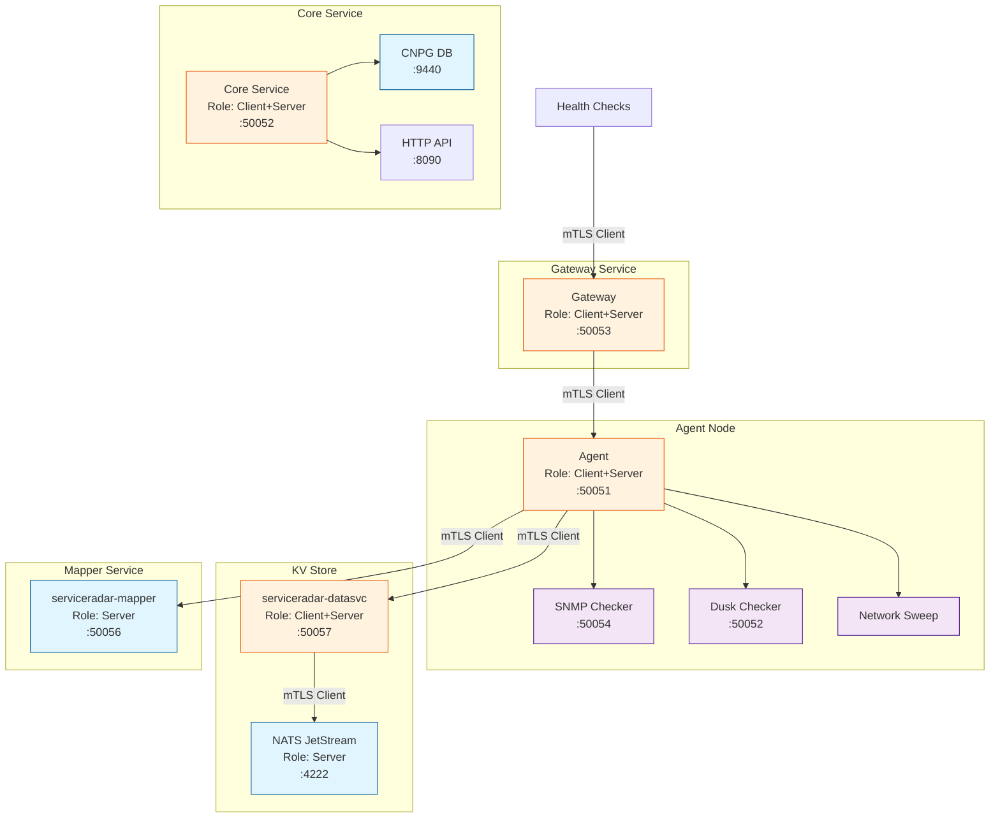

# TLS Security

ServiceRadar supports mutual TLS (mTLS) authentication to secure communications between its components, including the CNPG/Timescale server used by ServiceRadar-core for data storage. This guide provides instructions for generating and configuring mTLS certificates for all ServiceRadar components using OpenSSL, tailored for environments without DNS resolution. Certificates use IP-based Subject Alternative Names (SANs) to ensure compatibility with CNPG, ServiceRadar-core, Gateway, Agent, NATS JetStream, and serviceradar-datasvc.

## Security Architecture

ServiceRadar components communicate securely using mTLS with the following roles:



## Certificate Overview

ServiceRadar and CNPG use the following certificate files:

- **root.pem**: Root CA certificate, shared across all components.
- **\<component\>.pem**: Component-specific certificate (e.g., core.pem, gateway.pem).
- **\<component\>-key.pem**: Component-specific private key.

Certificates are stored in `/etc/serviceradar/certs/` for ServiceRadar components (root.pem, \<component\>.pem, \<component\>-key.pem).

## Prerequisites

- **OpenSSL**: Installed on the system where certificates are generated.
  ```bash
  sudo apt-get install -y openssl  # Debian/Ubuntu
  sudo dnf install -y openssl     # RHEL/Oracle Linux
  ```

- **Root or sudo access**: Required for creating directories and deploying certificates.
- **Network information**: IP addresses for each component:
    - ServiceRadar-core and CNPG: 192.168.2.23 (plus internal IPs like 192.168.2.x).
    - Gateway: \<gateway-ip\> (e.g., 192.168.2.100 for dusk01, replace with actual IP).
    - Agent, NATS, KV: Respective IPs.

- **Directory**: A working directory (e.g., `/path/to/tls/`) for generating certificates.
- **No DNS**: This guide assumes no DNS resolution, so all configurations and certificates use IP addresses.

:::note
To find the Gateway's IP address, run `ip addr show` on the Gateway host (e.g., dusk01) and note the inet address on the primary interface (e.g., 192.168.2.100). If the IP is unknown, use 192.168.2.100 as a placeholder and regenerate the Gateway certificate later with the correct IP.
:::

## Certificate Generation with OpenSSL

All certificates are generated using OpenSSL with IP-based SANs to avoid DNS dependencies. We'll generate a CA certificate and individual certificates for each component.

### 1. Set Up Working Directory

Create a directory for certificate generation:

```bash
mkdir -p /path/to/tls
cd /path/to/tls
```

### 2. Generate Root CA Certificate

Create the CA certificate and private key:

```bash
openssl ecparam -name prime256v1 -genkey -out root-key.pem
openssl req -x509 -new -nodes -key root-key.pem -sha256 -days 3650 -out root.pem -subj "/C=US/ST=Your State/L=Your Location/O=ServiceRadar/OU=Operations/CN=ServiceRadar CA"
```

Verify:

```bash
openssl x509 -in root.pem -text -noout | grep -E "Subject:|Issuer:"
```

Expected:
```
Subject: C=US, ST=Your State, L=Your Location, O=ServiceRadar, OU=Operations, CN=ServiceRadar CA
Issuer: C=US, ST=Your State, L=Your Location, O=ServiceRadar, OU=Operations, CN=ServiceRadar CA
```

### 3. Generate Component Certificates

Generate certificates for each component with IP-based SANs.

#### CNPG and ServiceRadar-core Certificate (core.pem)

CNPG (server) and ServiceRadar-core (client to CNPG, server to Gateway) share the same certificate (CN=core.serviceradar) with SANs covering all relevant IPs.

Create SAN Configuration:

```bash
cat > core-san.cnf << EOF
[req]
distinguished_name = req_distinguished_name
req_extensions = v3_req
prompt = no

[req_distinguished_name]
C = US
ST = Your State
L = Your Location
O = ServiceRadar
OU = Operations
CN = core.serviceradar

[v3_req]
basicConstraints = CA:FALSE
keyUsage = digitalSignature, keyEncipherment
extendedKeyUsage = serverAuth,clientAuth
subjectAltName = IP:192.168.2.22,IP:192.168.2.10,IP:192.168.2.11,IP:192.168.2.12,IP:192.168.2.13,IP:192.168.2.14,IP:192.168.2.18,IP:192.168.2.19,IP:192.168.2.23
EOF
```

Ensure IP:192.168.2.23 is included. Adjust other IPs based on your network.

Generate Certificate:

```bash
openssl ecparam -name prime256v1 -genkey -out core-key.pem
openssl req -new -key core-key.pem -out core.csr -config core-san.cnf
openssl x509 -req -in core.csr -CA root.pem -CAkey root-key.pem -CAcreateserial -out core.pem -days 365 -sha256 -extfile core-san.cnf -extensions v3_req
```

Verify:

```bash
openssl x509 -in core.pem -text -noout | grep -E "Subject:|Issuer:|X509v3 Subject Alternative Name:"
```

Expected:
```
Subject: C=US, ST=Your State, L=Your Location, O=ServiceRadar, OU=Operations, CN=core.serviceradar
Issuer: C=US, ST=Your State, L=Your Location, O=ServiceRadar, OU=Operations, CN=ServiceRadar CA
X509v3 Subject Alternative Name: 
    IP Address:192.168.2.22, ..., IP Address:192.168.2.23
```

```bash
openssl verify -CAfile root.pem core.pem
```

Expected: `core.pem: OK.`

#### Gateway Certificate (gateway.pem)

The Gateway acts as a client to ServiceRadar-core and a server for health checks.

Create SAN Configuration:

```bash
cat > gateway-san.cnf << EOF
[req]
distinguished_name = req_distinguished_name
req_extensions = v3_req
prompt = no

[req_distinguished_name]
C = US
ST = Your State
L = Your Location
O = ServiceRadar
OU = Operations
CN = gateway.serviceradar

[v3_req]
basicConstraints = CA:FALSE
keyUsage = digitalSignature, keyEncipherment
extendedKeyUsage = clientAuth,serverAuth
subjectAltName = IP:192.168.2.100
EOF
```

Replace 192.168.2.100 with the actual IP of dusk01. To find it, run `ip addr show` on dusk01 and note the inet address. If unknown, use 192.168.2.100 as a placeholder and regenerate later.

Generate Certificate:

```bash
openssl ecparam -name prime256v1 -genkey -out gateway-key.pem
openssl req -new -key gateway-key.pem -out gateway.csr -config gateway-san.cnf
openssl x509 -req -in gateway.csr -CA root.pem -CAkey root-key.pem -CAcreateserial -out gateway.pem -days 365 -sha256 -extfile gateway-san.cnf -extensions v3_req
```

Verify:

```bash
openssl x509 -in gateway.pem -text -noout | grep -E "Subject:|Issuer:|X509v3 Subject Alternative Name:"
```

Expected:
```
Subject: C=US, ST=Your State, L=Your Location, O=ServiceRadar, OU=Operations, CN=gateway.serviceradar
Issuer: C=US, ST=Your State, L=Your Location, O=ServiceRadar, OU=Operations, CN=ServiceRadar CA
X509v3 Subject Alternative Name: 
    IP Address:192.168.2.100
```

```bash
openssl verify -CAfile root.pem gateway.pem
```

Expected: `gateway.pem: OK.`

#### Agent Certificate (agent.pem)

The Agent acts as a client to the KV store and a server for the Gateway.

Create SAN Configuration:

```bash
cat > agent-san.cnf << EOF
[req]
distinguished_name = req_distinguished_name
req_extensions = v3_req
prompt = no

[req_distinguished_name]
C = US
ST = Your State
L = Your Location
O = ServiceRadar
OU = Operations
CN = agent.serviceradar

[v3_req]
basicConstraints = CA:FALSE
keyUsage = digitalSignature, keyEncipherment
extendedKeyUsage = clientAuth,serverAuth
subjectAltName = IP:<agent-ip>
EOF
```

Replace `<agent-ip>` with the Agent's IP (e.g., 192.168.2.x). Run `ip addr show` on the Agent host to find it.

Generate Certificate:

```bash
openssl ecparam -name prime256v1 -genkey -out agent-key.pem
openssl req -new -key agent-key.pem -out agent.csr -config agent-san.cnf
openssl x509 -req -in agent.csr -CA root.pem -CAkey root-key.pem -CAcreateserial -out agent.pem -days 365 -sha256 -extfile agent-san.cnf -extensions v3_req
```

Verify:

```bash
openssl x509 -in agent.pem -text -noout | grep -E "Subject:|Issuer:|X509v3 Subject Alternative Name:"
openssl verify -CAfile root.pem agent.pem
```

#### NATS JetStream Certificate (nats-server.pem)

NATS JetStream acts as a server for the KV store, typically co-located with ServiceRadar-core on 192.168.2.23.

Create SAN Configuration:

```bash
cat > nats-san.cnf << EOF
[req]
distinguished_name = req_distinguished_name
req_extensions = v3_req
prompt = no

[req_distinguished_name]
C = US
ST = Your State
L = Your Location
O = ServiceRadar
OU = Operations
CN = nats-serviceradar

[v3_req]
basicConstraints = CA:FALSE
keyUsage = digitalSignature, keyEncipherment
extendedKeyUsage = serverAuth
subjectAltName = IP:127.0.0.1,IP:192.168.2.23
EOF
```

Generate Certificate:

```bash
openssl ecparam -name prime256v1 -genkey -out nats-server-key.pem
openssl req -new -key nats-server-key.pem -out nats-server.csr -config nats-san.cnf
openssl x509 -req -in nats-server.csr -CA root.pem -CAkey root-key.pem -CAcreateserial -out nats-server.pem -days 365 -sha256 -extfile nats-san.cnf -extensions v3_req
```

Verify:

```bash
openssl x509 -in nats-server.pem -text -noout | grep -E "Subject:|Issuer:|X509v3 Subject Alternative Name:"
openssl verify -CAfile root.pem nats-server.pem
```

#### serviceradar-datasvc Certificate (datasvc.pem)

The KV service acts as a client to NATS and a server for Agents, co-located on 192.168.2.23.

Create SAN Configuration:

```bash
cat > datasvc-san.cnf << EOF
[req]
distinguished_name = req_distinguished_name
req_extensions = v3_req
prompt = no

[req_distinguished_name]
C = US
ST = Your State
L = Your Location
O = ServiceRadar
OU = Operations
CN = datasvc.serviceradar

[v3_req]
basicConstraints = CA:FALSE
keyUsage = digitalSignature, keyEncipherment
extendedKeyUsage = clientAuth,serverAuth
subjectAltName = IP:192.168.2.23
EOF
```

Generate Certificate:

```bash
openssl ecparam -name prime256v1 -genkey -out datasvc-key.pem
openssl req -new -key datasvc-key.pem -out datasvc.csr -config datasvc-san.cnf
openssl x509 -req -in datasvc.csr -CA root.pem -CAkey root-key.pem -CAcreateserial -out datasvc.pem -days 365 -sha256 -extfile datasvc-san.cnf -extensions v3_req
```

Verify:

```bash
openssl x509 -in datasvc.pem -text -noout | grep -E "Subject:|Issuer:|X509v3 Subject Alternative Name:"
openssl verify -CAfile root.pem datasvc.pem
```

### 4. Secure the CA Private Key

Move root-key.pem to a secure location:

```bash
sudo mv root-key.pem /path/to/secure/location/root-key.pem
sudo chmod 600 /path/to/secure/location/root-key.pem
```

## Certificate Deployment

### Role-Based Requirements

| Component | Role | Certificates Needed | Location |
|-----------|------|---------------------|----------|
| ServiceRadar-core | Client+Server | root.pem, core.pem, core-key.pem | /etc/serviceradar/certs/ |
| Gateway | Client+Server | root.pem, gateway.pem, gateway-key.pem | /etc/serviceradar/certs/ |
| Agent | Client+Server | root.pem, agent.pem, agent-key.pem | /etc/serviceradar/certs/ |
| NATS JetStream | Server | root.pem, nats-server.pem, nats-server-key.pem | /etc/serviceradar/certs/ |
| serviceradar-datasvc | Client+Server | root.pem, datasvc.pem, datasvc-key.pem | /etc/serviceradar/certs/ |

### Installation Steps

#### Create Directories:

On serviceradar-cloud (core host):
```bash
sudo mkdir -p /etc/serviceradar/certs
sudo chown serviceradar:serviceradar /etc/serviceradar/certs
sudo chmod 700 /etc/serviceradar/certs
```

On dusk01 (Gateway host):
```bash
sudo mkdir -p /etc/serviceradar/certs
sudo chown serviceradar:serviceradar /etc/serviceradar/certs
sudo chmod 700 /etc/serviceradar/certs
```

On Agent host (if separate):
```bash
sudo mkdir -p /etc/serviceradar/certs
sudo chown serviceradar:serviceradar /etc/serviceradar/certs
sudo chmod 700 /etc/serviceradar/certs
```

#### Deploy Certificates:

##### ServiceRadar-core (on serviceradar-cloud):
```bash
sudo cp /path/to/tls/root.pem /etc/serviceradar/certs/root.pem
sudo cp /path/to/tls/core.pem /etc/serviceradar/certs/core.pem
sudo cp /path/to/tls/core-key.pem /etc/serviceradar/certs/core-key.pem
sudo cp /path/to/tls/nats-server.pem /etc/serviceradar/certs/nats-server.pem
sudo cp /path/to/tls/nats-server-key.pem /etc/serviceradar/certs/nats-server-key.pem
sudo cp /path/to/tls/datasvc.pem /etc/serviceradar/certs/datasvc.pem
sudo cp /path/to/tls/datasvc-key.pem /etc/serviceradar/certs/datasvc-key.pem
sudo chown serviceradar:serviceradar /etc/serviceradar/certs/*
sudo chmod 644 /etc/serviceradar/certs/*.pem
sudo chmod 600 /etc/serviceradar/certs/*-key.pem
```

##### Gateway (on dusk01):
Transfer certificates from serviceradar-cloud:
```bash
scp /path/to/tls/root.pem /path/to/tls/gateway.pem /path/to/tls/gateway-key.pem <user>@dusk01:/tmp/
```

On dusk01:
```bash
sudo mv /tmp/root.pem /etc/serviceradar/certs/root.pem
sudo mv /tmp/gateway.pem /etc/serviceradar/certs/gateway.pem
sudo mv /tmp/gateway-key.pem /etc/serviceradar/certs/gateway-key.pem
sudo chown serviceradar:serviceradar /etc/serviceradar/certs/*
sudo chmod 644 /etc/serviceradar/certs/*.pem
sudo chmod 600 /etc/serviceradar/certs/*-key.pem
```

##### Agent (on Agent host):
Transfer certificates:
```bash
scp /path/to/tls/root.pem /path/to/tls/agent.pem /path/to/tls/agent-key.pem <user>@<agent-ip>:/tmp/
```

On Agent host:
```bash
sudo mv /tmp/root.pem /etc/serviceradar/certs/root.pem
sudo mv /tmp/agent.pem /etc/serviceradar/certs/agent.pem
sudo mv /tmp/agent-key.pem /etc/serviceradar/certs/agent-key.pem
sudo chown serviceradar:serviceradar /etc/serviceradar/certs/*
sudo chmod 644 /etc/serviceradar/certs/*.pem
sudo chmod 600 /etc/serviceradar/certs/*-key.pem
```

## Component Configuration

### ServiceRadar-core Configuration (on serviceradar-cloud)

Update `/etc/serviceradar/core.json`:

```json
{
  "listen_addr": ":8090",
  "grpc_addr": ":50052",
  "alert_threshold": "5m",
  "known_gateways": ["my-gateway"],
  "metrics": {
    "enabled": true,
    "retention": 100,
    "max_gateways": 10000
  },
  "database": {
    "addresses": ["192.168.2.23:9440"],
    "name": "default",
    "username": "default",
    "password": "",
    "max_conns": 10,
    "idle_conns": 5,
    "settings": {
      "max_execution_time": 60,
      "output_format_json_quote_64bit_int": 0,
      "allow_experimental_live_view": 0,
      "idle_connection_timeout": 600,
      "join_use_nulls": 1,
      "input_format_defaults_for_omitted_fields": 1
    }
  },
  "security": {
    "mode": "mtls",
    "cert_dir": "/etc/serviceradar/certs",
    "role": "core",
    "tls": {
      "cert_file": "core.pem",
      "key_file": "core-key.pem",
      "ca_file": "root.pem",
      "client_ca_file": "root.pem"
    }
  }
}
```

### Gateway Configuration (on dusk01)

Update `/etc/serviceradar/gateway.json`:

```json
{
  "agents": {
    "local-agent": {
      "address": "<agent-ip>:50051",
      "security": {
        "server_name": "agent.serviceradar",
        "mode": "mtls",
        "tls": {
          "cert_file": "gateway.pem",
          "key_file": "gateway-key.pem",
          "ca_file": "root.pem"
        }
      },
      "checks": []
    }
  },
  "core_address": "192.168.2.23:50052",
  "listen_addr": ":50053",
  "poll_interval": "30s",
  "gateway_id": "my-gateway",
  "service_name": "GatewayService",
  "service_type": "grpc",
  "security": {
    "mode": "mtls",
    "cert_dir": "/etc/serviceradar/certs",
    "server_name": "core.serviceradar",
    "role": "gateway",
    "tls": {
      "cert_file": "gateway.pem",
      "key_file": "gateway-key.pem",
      "ca_file": "root.pem"
    }
  }
}
```

Replace `<agent-ip>` with the Agent's IP address (e.g., 192.168.2.x).

### Agent Configuration (on Agent host)

Update `/etc/serviceradar/agent.json`:

```json
{
  "checkers_dir": "/etc/serviceradar/checkers",
  "listen_addr": "<agent-ip>:50051",
  "service_type": "grpc",
  "service_name": "AgentService",
  "agent_id": "default-agent",
  "agent_name": "<agent-ip>",
  "security": {
    "mode": "mtls",
    "cert_dir": "/etc/serviceradar/certs",
    "server_name": "gateway.serviceradar",
    "role": "agent",
    "tls": {
      "cert_file": "agent.pem",
      "key_file": "agent-key.pem",
      "ca_file": "root.pem"
    }
  }
}
```

Replace `<agent-ip>` with the Agent's IP address.

### NATS JetStream Configuration (on serviceradar-cloud)

Update `/etc/nats/nats-server.conf`:

```
listen: 127.0.0.1:4222
server_name: nats-serviceradar
jetstream {
  store_dir: /var/lib/nats/jetstream
  max_memory_store: 1G
  max_file_store: 10G
}
tls {
  cert_file: "/etc/serviceradar/certs/nats-server.pem"
  key_file: "/etc/serviceradar/certs/nats-server-key.pem"
  ca_file: "/etc/serviceradar/certs/root.pem"
  verify: true
  verify_and_map: true
}
logfile: "/var/log/nats/nats.log"
debug: true
```

### serviceradar-datasvc Configuration (on serviceradar-cloud)

Update `/etc/serviceradar/datasvc.json`:

```json
{
  "listen_addr": ":50057",
  "nats_url": "nats://127.0.0.1:4222",
  "security": {
    "mode": "mtls",
    "cert_dir": "/etc/serviceradar/certs",
    "server_name": "nats-serviceradar",
    "role": "server",
    "tls": {
      "cert_file": "datasvc.pem",
      "key_file": "datasvc-key.pem",
      "ca_file": "root.pem",
      "client_ca_file": "root.pem"
    }
  },
  "rbac": {
    "roles": [
      {"identity": "CN=agent.serviceradar,O=ServiceRadar", "role": "reader"}
    ]
  },
  "bucket": "serviceradar-datasvc"
}
```

## Verification

### Verify Certificates:

On serviceradar-cloud:
```bash
# ServiceRadar-core
openssl x509 -in /etc/serviceradar/certs/root.pem -text -noout | grep -E "Subject:|Issuer:"
openssl x509 -in /etc/serviceradar/certs/core.pem -text -noout | grep Subject
openssl verify -CAfile /etc/serviceradar/certs/root.pem /etc/serviceradar/certs/core.pem
```

On dusk01:
```bash
openssl x509 -in /etc/serviceradar/certs/root.pem -text -noout | grep -E "Subject:|Issuer:"
openssl x509 -in /etc/serviceradar/certs/gateway.pem -text -noout | grep -E "Subject:|Issuer:|X509v3 Subject Alternative Name:"
openssl verify -CAfile /etc/serviceradar/certs/root.pem /etc/serviceradar/certs/gateway.pem
```

### Restart Services:

On serviceradar-cloud:
```bash
sudo systemctl restart serviceradar-core
sudo systemctl restart nats
sudo systemctl restart serviceradar-datasvc
```

On dusk01:
```bash
sudo systemctl restart serviceradar-agent-gateway
```

On Agent host:
```bash
sudo systemctl restart serviceradar-agent
```

### Test mTLS Connections:

#### Gateway to Core (from dusk01):
```bash
openssl s_client -connect 192.168.2.23:50052 -cert /etc/serviceradar/certs/gateway.pem -key /etc/serviceradar/certs/gateway-key.pem -CAfile /etc/serviceradar/certs/root.pem
```

Verify: CN=core.serviceradar, IP:192.168.2.23 in SANs, Verify return code: 0 (ok).

#### Agent to KV (on Agent host):
Test from the Agent host if applicable.

## Troubleshooting

### Certificate Verification Failure:

- Ensure CA certificates (root.pem) are identical across all hosts:
  ```bash
  openssl verify -CAfile /etc/serviceradar/certs/root.pem /etc/serviceradar/certs/<component>.pem
  ```

### Unknown Authority Error:

- Check if `/etc/serviceradar/certs/root.pem` matches the CA used to sign all certificates.
- Regenerate certificates if signed by an old CA.

### Missing SANs:

- Verify SANs in certificates:
  ```bash
  openssl x509 -in /etc/serviceradar/certs/<component>.pem -text -noout | grep -A 1 "X509v3 Subject Alternative Name"
  ```

- Ensure IPs match the address fields in configuration files (e.g., 192.168.2.23 for core).

### Connection Errors:

- Check logs:
  ```bash
  journalctl -u serviceradar-core -f
  # On dusk01
  journalctl -u serviceradar-agent-gateway -f
  ```

- Verify network connectivity:
  ```bash
  nc -zv 192.168.2.23 50052
  ```
- Test with ssl_certificates format if parsing fails:
  ```yaml
  default:
    ssl_certificates:
      common_name:
        - "core.serviceradar"
  ```

### Gateway IP Mismatch:

- If the Gateway's IP is incorrect, regenerate gateway.pem with the correct IP:
  ```bash
  ip addr show  # On dusk01
  ```

- Update gateway-san.cnf and repeat generation steps.

## Checker Certificate Configuration

ServiceRadar checkers (such as SNMP Checker, Dusk Checker, and Network Sweep) also require TLS certificates for secure communication. Since checkers typically run on the same host as the Agent, you can configure them to use certificates in a shared manner.

### Generate Checker Certificates

For checkers, you'll need to generate client certificates with the appropriate extended key usage settings. Although you might be tempted to reuse the Agent certificates (agent.pem and agent-key.pem), checkers require certificates specifically configured for client authentication.

Based on error logs showing `certificate specifies an incompatible key usage` for dusk and sysmon checkers, we need to ensure the certificate has the proper key usage and extended key usage settings.

Create dedicated checker certificates with proper key usage settings:

```bash
cat > checker-san.cnf << EOF
[req]
distinguished_name = req_distinguished_name
req_extensions = v3_req
prompt = no

[req_distinguished_name]
C = US
ST = Your State
L = Your Location
O = ServiceRadar
OU = Operations
CN = checker.serviceradar

[v3_req]
basicConstraints = CA:FALSE
keyUsage = digitalSignature, keyEncipherment
extendedKeyUsage = clientAuth
subjectAltName = IP:<agent-ip>
EOF
```

Generate the general checker certificate:

```bash
openssl ecparam -name prime256v1 -genkey -out checker-key.pem
openssl req -new -key checker-key.pem -out checker.csr -config checker-san.cnf
openssl x509 -req -in checker.csr -CA root.pem -CAkey root-key.pem -CAcreateserial -out checker.pem -days 365 -sha256 -extfile checker-san.cnf -extensions v3_req
```

For specific checker types like dusk and sysmon that require dedicated certificates:

```bash
# For dusk checker
cat > dusk-san.cnf << EOF
[req]
distinguished_name = req_distinguished_name
req_extensions = v3_req
prompt = no

[req_distinguished_name]
C = US
ST = Your State
L = Your Location
O = ServiceRadar
OU = Operations
CN = dusk.serviceradar

[v3_req]
basicConstraints = CA:FALSE
keyUsage = digitalSignature, keyEncipherment
extendedKeyUsage = clientAuth, serverAuth
subjectAltName = IP:192.168.2.22
EOF

# Generate dusk certificate
openssl ecparam -name prime256v1 -genkey -out dusk-key.pem
openssl req -new -key dusk-key.pem -out dusk.csr -config dusk-san.cnf
openssl x509 -req -in dusk.csr -CA root.pem -CAkey root-key.pem -CAcreateserial -out dusk.pem -days 365 -sha256 -extfile dusk-san.cnf -extensions v3_req

# For sysmon checker
cat > sysmon-san.cnf << EOF
[req]
distinguished_name = req_distinguished_name
req_extensions = v3_req
prompt = no

[req_distinguished_name]
C = US
ST = Your State
L = Your Location
O = ServiceRadar
OU = Operations
CN = sysmon.serviceradar

[v3_req]
basicConstraints = CA:FALSE
keyUsage = digitalSignature, keyEncipherment
extendedKeyUsage = clientAuth, serverAuth
subjectAltName = IP:192.168.2.22
EOF

# Generate sysmon certificate
openssl ecparam -name prime256v1 -genkey -out sysmon-key.pem
openssl req -new -key sysmon-key.pem -out sysmon.csr -config sysmon-san.cnf
openssl x509 -req -in sysmon.csr -CA root.pem -CAkey root-key.pem -CAcreateserial -out sysmon.pem -days 365 -sha256 -extfile sysmon-san.cnf -extensions v3_req
```

Note that we've included both `clientAuth` and `serverAuth` in the extendedKeyUsage for dusk and sysmon since the error suggests they might be acting as both clients and servers.

### Deploy Checker Certificates

Deploy the certificates to the Agent host where checkers run:

```bash
# Deploy generic checker certificates
sudo cp checker.pem /etc/serviceradar/certs/checker.pem
sudo cp checker-key.pem /etc/serviceradar/certs/checker-key.pem
sudo chown serviceradar:serviceradar /etc/serviceradar/certs/checker*.pem
sudo chmod 644 /etc/serviceradar/certs/checker.pem
sudo chmod 600 /etc/serviceradar/certs/checker-key.pem

# Deploy specific certificates for dusk and sysmon
sudo cp dusk.pem /etc/serviceradar/certs/dusk.pem
sudo cp dusk-key.pem /etc/serviceradar/certs/dusk-key.pem
sudo cp sysmon.pem /etc/serviceradar/certs/sysmon.pem
sudo cp sysmon-key.pem /etc/serviceradar/certs/sysmon-key.pem
sudo chown serviceradar:serviceradar /etc/serviceradar/certs/{dusk,sysmon}*.pem
sudo chmod 644 /etc/serviceradar/certs/{dusk,sysmon}.pem
sudo chmod 600 /etc/serviceradar/certs/{dusk,sysmon}-key.pem
```

### Configure Checkers to Use TLS

Each checker configuration file (located in `/etc/serviceradar/checkers/`) should include a security section. Here's how to configure different types of checkers:

#### Generic Checker Configuration

For most checkers:

```json
{
  "name": "example-checker",
  "type": "snmp|network-sweep",
  "interval": "30s",
  "timeout": "5s",
  "security": {
    "mode": "mtls",
    "cert_dir": "/etc/serviceradar/certs",
    "server_name": "core.serviceradar",
    "role": "client",
    "tls": {
      "cert_file": "checker.pem",
      "key_file": "checker-key.pem",
      "ca_file": "root.pem"
    }
  },
  "settings": {
    // Checker-specific settings here
  }
}
```

#### Dusk Checker Configuration

For dusk checker specifically (which needs dual client/server capabilities):

```json
{
  "name": "dusk",
  "type": "external",
  "interval": "30s",
  "timeout": "5s",
  "security": {
    "mode": "mtls",
    "cert_dir": "/etc/serviceradar/certs",
    "server_name": "core.serviceradar",
    "role": "dual",
    "tls": {
      "cert_file": "dusk.pem",
      "key_file": "dusk-key.pem",
      "ca_file": "root.pem"
    }
  },
  "settings": {
    "address": "192.168.2.22:50082",
    "service": "dusk"
  }
}
```

#### SysMon Checker Configuration

For sysmon checker:

```json
{
  "name": "sysmon",
  "type": "external",
  "interval": "30s",
  "timeout": "5s",
  "security": {
    "mode": "mtls",
    "cert_dir": "/etc/serviceradar/certs",
    "server_name": "core.serviceradar",
    "role": "dual",
    "tls": {
      "cert_file": "sysmon.pem",
      "key_file": "sysmon-key.pem",
      "ca_file": "root.pem"
    }
  },
  "settings": {
    "address": "192.168.2.22:50083",
    "service": "sysmon"
  }
}
```

Note that for dusk and sysmon, we're:
1. Setting the role to "dual" (not just "client")
2. Using dedicated certificate files (dusk.pem/sysmon.pem)
3. Specifying the exact IP and port in the settings

### Using Shared Certificates for Multiple Checkers

While you can use the same certificate for multiple similar checkers to simplify certificate management, the log errors suggest that some checkers have specific requirements:

1. **Standard checkers** (like SNMP, network-sweep): Can use a shared certificate with `clientAuth` extension:
   ```json
   "security": {
     "mode": "mtls",
     "cert_dir": "/etc/serviceradar/certs",
     "server_name": "core.serviceradar",
     "role": "client",
     "tls": {
       "cert_file": "checker.pem",
       "key_file": "checker-key.pem",
       "ca_file": "root.pem"
     }
   }
   ```

2. **Dual-role checkers** (like dusk and sysmon): Need dedicated certificates with both `clientAuth` and `serverAuth` extensions:
   ```json
   "security": {
     "mode": "mtls",
     "cert_dir": "/etc/serviceradar/certs",
     "server_name": "core.serviceradar",
     "role": "dual",
     "tls": {
       "cert_file": "dusk.pem",  // or sysmon.pem
       "key_file": "dusk-key.pem",  // or sysmon-key.pem
       "ca_file": "root.pem"
     }
   }
   ```

3. Based on the observed error logs, `dusk` and `sysmon` checkers specifically require dual-role certificates because they are functioning in both client and server capacities. Using a certificate with only `clientAuth` causes the "incompatible key usage" error.

### Troubleshooting Checker Certificate Issues

If you encounter certificate issues with checkers (like the "certificate specifies an incompatible key usage" error):

1. **Check key usage settings**:
   ```bash
   openssl x509 -in /etc/serviceradar/certs/checker.pem -text -noout | grep -E "Key Usage|Extended Key Usage"
   ```
    - For standard checkers: Should include `TLS Web Client Authentication`
    - For dual-role checkers (dusk/sysmon): Should include both `TLS Web Client Authentication` and `TLS Web Server Authentication`

2. **Examine agent logs** for specific TLS errors:
   ```bash
   journalctl -u serviceradar-agent -f | grep -i "certificate\|tls\|handshake"
   ```

3. **Verify certificate for the right IP and port**:
   ```bash
   # Check which IP/port is failing
   journalctl -u serviceradar-agent -f | grep "connection error"
   
   # Verify certificate has the right IP in SANs
   openssl x509 -in /etc/serviceradar/certs/dusk.pem -text -noout | grep -A 1 "Subject Alternative Name"
   ```

4. **Regenerate certificates with proper usage**: If you see "incompatible key usage" errors like:
   ```
   transport: authentication handshake failed: tls: failed to verify certificate: x509: certificate specifies an incompatible key usage
   ```
   This indicates the certificate doesn't have the necessary key usage extensions for its role. For dusk and sysmon specifically, ensure:
    - `keyUsage = digitalSignature, keyEncipherment`
    - `extendedKeyUsage = clientAuth, serverAuth` (both!)
    - Correct IP in `subjectAltName`
    - Role set to `"role": "dual"` in the configuration

5. **Verify checker service configuration**: For external checkers running as separate services, check both sides of the connection:
   ```bash
   # Check dusk service configuration
   cat /etc/serviceradar/services/dusk.json
   
   # Check sysmon service configuration
   cat /etc/serviceradar/services/sysmon.json
   ```

6. **Test certificate compatibility**:
   ```bash
   # Try connecting to the service directly with the certificate
   openssl s_client -connect 192.168.2.22:50082 -cert /etc/serviceradar/certs/dusk.pem -key /etc/serviceradar/certs/dusk-key.pem -CAfile /etc/serviceradar/certs/root.pem
   ```

## Best Practices

- **Use IP Addresses**: Always specify IPs in SANs and configuration files to avoid DNS issues.
- **Secure CA Key**: Store root-key.pem in a secure, offline location.
- **Consistent CA**: Ensure all components use the same root.pem.
- **Firewall Rules**: Allow necessary ports (50051, 50052, 50053, 50057, 4222, 9440):
  ```bash
  sudo ufw allow 50051/tcp  # Agent
  sudo ufw allow 50052/tcp  # Core
  sudo ufw allow 50053/tcp  # Gateway
  sudo ufw allow 50057/tcp  # KV
  sudo ufw allow 9440/tcp   # CNPG
  ```
- **Backup Certificates**: Store a copy of `/path/to/tls/` in a secure location.
