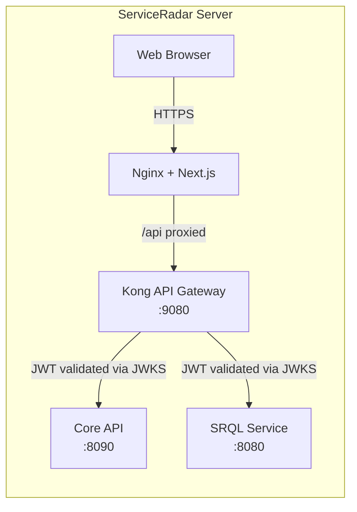

# Web UI Configuration

ServiceRadar includes a modern web interface built with Next.js that provides a dashboard for monitoring your infrastructure. This guide explains how to install, configure, and secure the web UI component.

## Overview

The ServiceRadar web interface:
- Provides a visual dashboard for monitoring your infrastructure
- Communicates securely with the ServiceRadar API through the Kong gateway
- Uses Nginx as a reverse proxy to handle HTTP requests
- Issues and refreshes JSON Web Tokens (JWTs) that Kong validates against the Core JWKS endpoint
- Executes SRQL queries through a dedicated microservice reachable at `/api/query`

## Architecture



- **Nginx** runs on port 80 and acts as the main entry point
- **Next.js** provides the web UI on port 3000 and manages user sessions
- **Kong** enforces JWT validation, rate limiting, and header policies before forwarding to the Core API
- **Core API** service runs on port 8090 and exposes `/auth/jwks.json` for Kong JWKS lookups
- **SRQL service** runs on port 8080 and handles `/api/query` and `/api/stream` endpoints for SRQL execution
- API requests from the UI are signed with short-lived JWTs issued by the Core service

## Installation

The web UI is installed via the `serviceradar-web` package:

```bash
curl -LO https://github.com/carverauto/serviceradar/releases/download/1.0.21/serviceradar-web_1.0.21.deb
sudo dpkg -i serviceradar-web_1.0.21.deb
```

:::note
It's recommended to install the `serviceradar-core` package first, as the web UI depends on it.
:::

## Configuration

### Web UI Configuration

Edit `/etc/serviceradar/web.json`:

```json
{
  "port": 3000,
  "host": "0.0.0.0",
  "api_url": "http://localhost:8090"
}
```

- `port`: The port for the Next.js application (default: 3000)
- `host`: The host address to bind to
- `api_url`: The URL for the core API service

### Nginx Configuration

The web package automatically configures Nginx. The main configuration file is located at `/etc/nginx/conf.d/serviceradar-web.conf`:

```nginx
# ServiceRadar Web Interface - Nginx Configuration
server {
    listen 80;
    server_name _; # Catch-all server name (use your domain if you have one)

    # Static assets
    location /_next/ {
        proxy_pass http://127.0.0.1:3000; # Note: using IPv4 address
        proxy_set_header Host $host;
        proxy_set_header X-Real-IP $remote_addr;
        proxy_set_header X-Forwarded-For $proxy_add_x_forwarded_for;
        proxy_set_header X-Forwarded-Proto $scheme;
    }

    # API routes handled by Next.js
    location ~ ^/api/(auth|pollers|status) {
        proxy_pass http://127.0.0.1:3000; # Note: using IPv4 address
        proxy_set_header Host $host;
        proxy_set_header X-Real-IP $remote_addr;
        proxy_set_header X-Forwarded-For $proxy_add_x_forwarded_for;
        proxy_set_header X-Forwarded-Proto $scheme;
    }

    # Backend API routes (protected by Kong)
    location /api/ {
        proxy_pass http://127.0.0.1:9080;
        proxy_set_header Host $host;
        proxy_set_header X-Real-IP $remote_addr;
        proxy_set_header X-Forwarded-For $proxy_add_x_forwarded_for;
        proxy_set_header X-Forwarded-Proto $scheme;
    }

    # Auth API routes
    location /auth/ {
        proxy_pass http://localhost:8090;
        proxy_set_header Host $host;
        proxy_set_header X-Real-IP $remote_addr;
        proxy_set_header X-Forwarded-For $proxy_add_x_forwarded_for;
        proxy_set_header X-Forwarded-Proto $scheme;
        add_header Access-Control-Allow-Methods "GET, POST, OPTIONS" always;
        add_header Access-Control-Allow-Headers "Content-Type, Authorization, X-API-Key" always;
    }

    # Main app
    location / {
        proxy_pass http://127.0.0.1:3000; # Note: using IPv4 address
        proxy_set_header Host $host;
        proxy_set_header X-Real-IP $remote_addr;
        proxy_set_header X-Forwarded-For $proxy_add_x_forwarded_for;
        proxy_set_header X-Forwarded-Proto $scheme;
    }
}
```

You can customize this file for your specific domain or add SSL configuration.

### Kong Configuration

The Web UI expects Kong to sit in front of the Core API on port 9080 (or 9443 for TLS). After deploying Kong, enable the JWT plugin and point it at the Core JWKS endpoint:

```bash
# Configure the ServiceRadar upstream
kong config apply -s '
_format_version: "3.0"
services:
- name: serviceradar-core
  url: http://127.0.0.1:8090
  routes:
  - name: serviceradar-api
    paths:
    - /api
    strip_path: false
- name: serviceradar-srql
  url: http://127.0.0.1:8080
  routes:
  - name: serviceradar-query
    paths:
    - /api/query
    - /api/stream
    strip_path: false
plugins:
- name: jwt
  config:
    key_claim_name: kid
    secret_is_base64: false
    claims_to_verify:
    - exp
    uri_param_names:
    - token
    header_names:
    - Authorization
    run_on_preflight: true
    jwks_uri: https://serviceradar-core.local/auth/jwks.json
'
```

Adjust hostnames, upstream URLs, and plugin settings to match your deployment. Kong will automatically cache JWKS responses and only re-fetch keys when the `kid` changes. Register additional SRQL routes (for example, `/api/query`, `/api/stream`) so analytics features reach the OCaml backend.

## JWT & Kong Gateway

ServiceRadar issues RS256-signed JSON Web Tokens (JWTs) for every authenticated user session. Kong validates those tokens before forwarding requests to the Core API.

1. **Login flow** – The Web UI posts credentials to `/api/auth/login` (proxied through Kong). The Core responds with a short-lived access token and a refresh token.
2. **Token storage** – Next.js stores the refresh token in an HttpOnly cookie and keeps the access token server-side. Browser requests never see the raw bearer token.
3. **Gateway enforcement** – Kong’s JWT plugin fetches the signing keys from `https://<core-host>/auth/jwks.json`, caches them, and rejects any request with an invalid signature, issuer, or audience.
4. **Automatic rotation** – When the Core rotates its signing key (new `kid`), Kong automatically refreshes the JWKS cache and continues validating new tokens.

To enable RS256 + JWKS, update the core `auth` block as described in the [Authentication Configuration](./auth-configuration.md) guide. Kong should be configured with the `jwt` (or `openid-connect`) plugin pointing at that JWKS URL and the expected issuer (`iss`) claim.

:::caution
Protect the refresh token cookies with the `Secure` and `HttpOnly` flags and only expose Kong over HTTPS. Never surface the RS256 private key outside the Core service.
:::

SRQL endpoints exposed at `/api/query` and `/api/stream` reuse the exact same JWT validation path, so no additional secrets or API keys are required.

## Security Features

The web UI includes several security features:

1. **Server-side rendering**: The Next.js application runs in SSR mode, which keeps sensitive code on the server
2. **JWT-aware middleware**: Server-side handlers attach validated access tokens to upstream API requests
3. **Gateway enforcement**: Kong validates JWTs, rate limits traffic, and strips untrusted headers before the Core sees any request
4. **Isolation**: The web UI runs as a separate service with limited permissions

## Custom Domain and SSL

To configure a custom domain with SSL:

1. Update the Nginx configuration with your domain name
2. Add SSL certificate configuration
3. Restart Nginx

Example configuration with SSL:

```nginx
server {
    listen 80;
    server_name your-domain.com;
    return 301 https://$host$request_uri;
}

server {
    listen 443 ssl;
    server_name your-domain.com;

    ssl_certificate /path/to/your/certificate.crt;
    ssl_certificate_key /path/to/your/private.key;
    
    # ... rest of the configuration
}
```

## Troubleshooting

Common issues and solutions:

1. **Web UI not accessible**
    - Check if Nginx is running: `systemctl status nginx`
    - Verify the Next.js application is running: `systemctl status serviceradar-web`
    - Check ports: `netstat -tulpn | grep -E '3000|80'`

2. **API connection errors**
    - Verify the Core API is running: `systemctl status serviceradar-core`
    - Confirm Kong is running and can reach the Core upstream
    - Confirm the SRQL service is healthy: `systemctl status serviceradar-srql` (or the relevant deployment)
    - Inspect Kong logs for JWT validation failures or stale JWKS caches
    - Verify API URL in web.json is correct

3. **Permission issues**
    - Check ownership of files: `ls -la /etc/serviceradar/`
    - Ensure the serviceradar user has appropriate permissions

4. **Nginx configuration errors**
    - Test configuration: `nginx -t`
    - Check logs: `tail -f /var/log/nginx/error.log`
