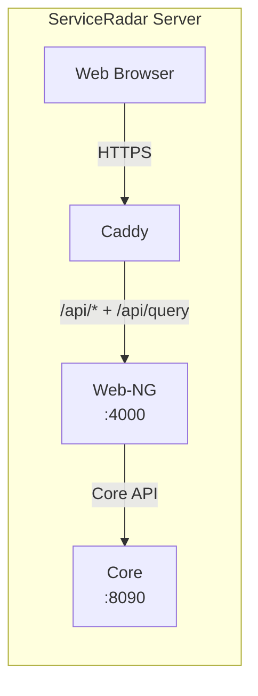

# Web UI Configuration

ServiceRadar includes a Phoenix LiveView web interface (web-ng) that provides dashboards, configuration, and SRQL access. Web-NG runs on port 4000 and is served through Caddy (Compose) or your ingress controller (Kubernetes). Route `/`, `/api/*`, `/api/query`, and `/api/stream` to web-ng.

## Settings > Networks

The Settings > Networks screen is the admin control plane for network sweep jobs.
It includes two main building blocks:

- **Scanner Profiles**: reusable scan settings (ports, sweep modes, timeouts).
- **Sweep Groups**: schedules + target rules that define what to scan and when.

Use sweep groups to:
- Target devices by tags or other device fields
- Add explicit targets (IP, CIDR, or IP ranges)
- Choose a schedule (interval or cron)
- Override profile settings for a specific group

For detailed configuration options and targeting syntax, see
[Network Sweeps](./network-sweeps.md).

## Architecture


```mermaid
graph LR
    subgraph "ServiceRadar Server"
        A[Web Browser] -->|HTTPS| B[Caddy]
        B -->|/api/* + /api/query| D[Web-NG<br/>:4000]
        D -->|Core API| E[Core<br/>:8090]
    end
```

- **Caddy** runs on ports 80/443 and acts as the main entry point
- **Web-NG** runs on port 4000 and handles `/api/*`, `/api/query`, and `/api/stream` endpoints
- API requests from the UI are signed with short-lived JWTs issued by Web-NG

## Configuration

### Caddy Configuration

The recommended reverse proxy is Caddy. For Docker Compose, use `docker/compose/Caddyfile`. For Kubernetes, use your ingress controller and ensure WebSocket support.

```caddy
:80 {
  reverse_proxy 127.0.0.1:4000
}

:443 {
  tls /etc/serviceradar/certs/web.pem /etc/serviceradar/certs/web-key.pem
  reverse_proxy 127.0.0.1:4000
}
```

You can customize this file for your specific domain or enable automatic HTTPS.

## Auth and Sessions

Web-NG issues JWTs and validates them on `/api/*`. SRQL endpoints (`/api/query`, `/api/stream`) reuse the same auth path. For RS256 + JWKS configuration, see [Authentication Configuration](./auth-configuration.md).

## Custom Domain and SSL

To configure a custom domain with SSL:

1. Update the Caddyfile with your domain name
2. Restart Caddy

Example configuration with SSL:

```caddy
https://your-domain.com {
  reverse_proxy 127.0.0.1:4000
}
```

## Troubleshooting

- **Web UI not accessible**: Check Caddy/Ingress logs and ensure port 4000 is reachable from the proxy.
- **API connection errors**: Verify core-elx is reachable and `PHX_HOST`/API settings are correct.
