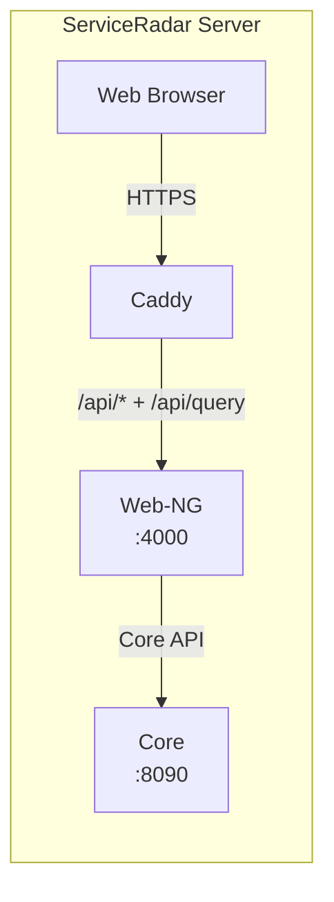

# Web UI Configuration

ServiceRadar includes a Phoenix LiveView web interface (web-ng) that provides a dashboard for monitoring your infrastructure. This guide includes legacy Next.js details for reference only.

> Note: The legacy Next.js UI (`serviceradar-web`) is deprecated. The supported UI is `serviceradar-web-ng`.

## Web-NG (Current)

The Phoenix `web-ng` UI runs on port 4000 and is configured via `/etc/serviceradar/web-ng.env`.

```bash
curl -LO https://github.com/carverauto/serviceradar/releases/download/1.0.21/serviceradar-web-ng_1.0.21.deb
sudo dpkg -i serviceradar-web-ng_1.0.21.deb
```

Use Caddy (default for Docker Compose) or your ingress proxy to terminate TLS and forward traffic to `http://127.0.0.1:4000`. Route `/api/*`, `/api/query`, and `/api/stream` to Web-NG.
The remaining sections document the deprecated Next.js stack for reference.

## Overview

The ServiceRadar web interface:
- Provides a visual dashboard for monitoring your infrastructure
- Communicates securely with the ServiceRadar API through the edge proxy
- Uses an edge proxy (Caddy/Ingress) to handle HTTP requests
- Issues and refreshes JSON Web Tokens (JWTs) that the Core validates
- Executes SRQL queries through a dedicated microservice reachable at `/api/query`

## Architecture



- **Caddy** runs on ports 80/443 and acts as the main entry point
- **Web-NG** runs on port 4000 and handles `/api/*`, `/api/query`, and `/api/stream` endpoints
- API requests from the UI are signed with short-lived JWTs issued by Web-NG

## Installation

The web UI is installed via the `serviceradar-web` package:

```bash
curl -LO https://github.com/carverauto/serviceradar/releases/download/1.0.21/serviceradar-web_1.0.21.deb
sudo dpkg -i serviceradar-web_1.0.21.deb
```

:::note
It's recommended to install the `serviceradar-core` package first, as the web UI depends on it.
:::

## Configuration

### Web UI Configuration

Edit `/etc/serviceradar/web.json`:

```json
{
  "port": 3000,
  "host": "0.0.0.0",
  "api_url": "http://localhost:8090"
}
```

- `port`: The port for the Next.js application (default: 3000)
- `host`: The host address to bind to
- `api_url`: The URL for the core API service

### Caddy Configuration

The recommended reverse proxy is Caddy. For package installs, place a Caddyfile at `/etc/caddy/Caddyfile`. For Docker Compose, use `docker/compose/Caddyfile`.

```caddy
:80 {
  reverse_proxy 127.0.0.1:4000
}

:443 {
  tls /etc/serviceradar/certs/web.pem /etc/serviceradar/certs/web-key.pem
  reverse_proxy 127.0.0.1:4000
}
```

You can customize this file for your specific domain or enable automatic HTTPS.

## JWT Sessions

ServiceRadar issues RS256-signed JSON Web Tokens (JWTs) for every authenticated user session. Web-NG validates those tokens on every `/api/*` request.

1. **Login flow** – The Web UI posts credentials to `/api/auth/login`. Web-NG responds with a short-lived access token and a refresh token.
2. **Token storage** – Next.js stores the refresh token in an HttpOnly cookie and keeps the access token server-side. Browser requests never see the raw bearer token.
3. **Validation** – Web-NG validates JWTs directly using its signing keys. The JWKS endpoint (`/auth/jwks.json`) is available for external validators.
4. **Automatic rotation** – When the Core rotates its signing key (new `kid`), the JWKS feed updates immediately.

To enable RS256 + JWKS, update the core `auth` block as described in the [Authentication Configuration](./auth-configuration.md) guide.

:::caution
Protect the refresh token cookies with the `Secure` and `HttpOnly` flags and only expose the edge proxy over HTTPS. Never surface the RS256 private key outside the Core service.
:::

SRQL endpoints exposed at `/api/query` and `/api/stream` reuse the same JWT validation path, so no additional secrets or API keys are required.

## Security Features

The web UI includes several security features:

1. **Server-side rendering**: The Next.js application runs in SSR mode, which keeps sensitive code on the server
2. **JWT-aware middleware**: Server-side handlers attach validated access tokens to upstream API requests
3. **Web-NG enforcement**: Web-NG validates JWTs, rate limits traffic, and strips untrusted headers before processing requests
4. **Isolation**: The web UI runs as a separate service with limited permissions

## Custom Domain and SSL

To configure a custom domain with SSL:

1. Update the Caddyfile with your domain name
2. Restart Caddy

Example configuration with SSL:

```caddy
https://your-domain.com {
  reverse_proxy 127.0.0.1:4000
}
```

## Troubleshooting

Common issues and solutions:

1. **Web UI not accessible**
    - Check if Caddy is running: `systemctl status caddy`
    - Verify the Web-NG service is running: `systemctl status serviceradar-web-ng`
    - Check ports: `netstat -tulpn | rg -e '4000|80|443'`

2. **API connection errors**
    - Verify Web-NG is running: `systemctl status serviceradar-web-ng`
    - Inspect edge proxy logs for routing errors or TLS failures
    - Verify API URL in web.json is correct

3. **Permission issues**
    - Check ownership of files: `ls -la /etc/serviceradar/`
    - Ensure the serviceradar user has appropriate permissions

4. **Caddy configuration errors**
    - Test configuration: `caddy validate --config /etc/caddy/Caddyfile`
    - Check logs: `journalctl -xeu caddy`
