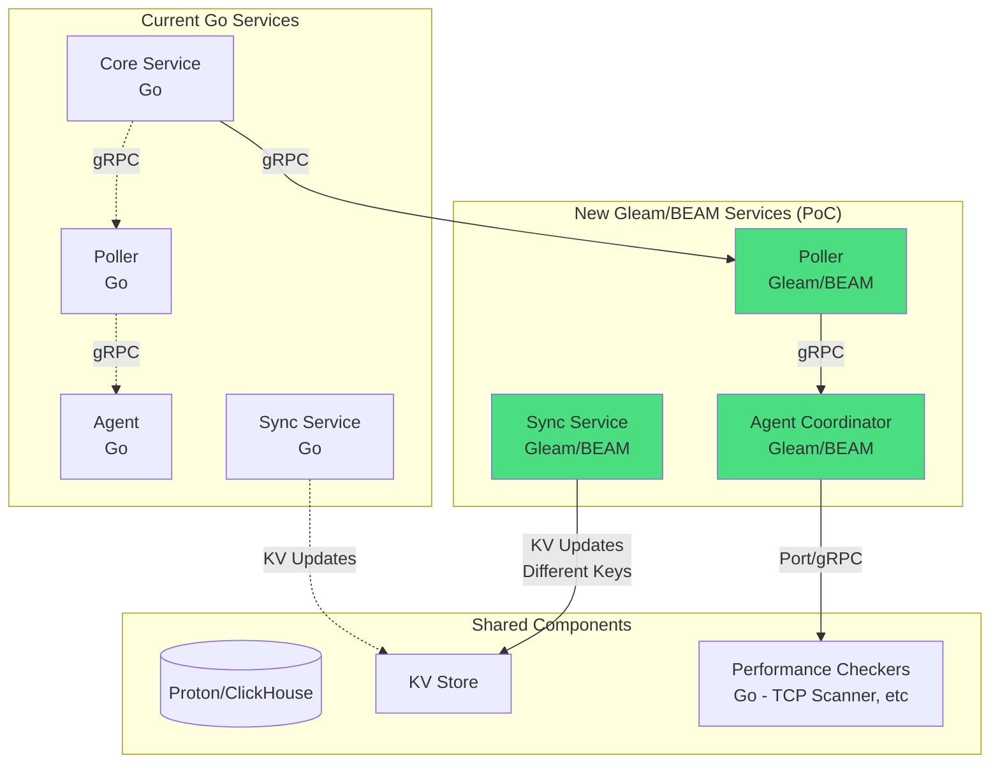

# Product Requirements Document: Gleam/BEAM Migration for ServiceRadar

## Executive Summary

This document outlines the migration of three ServiceRadar services (Poller, Agent, and Sync) from Go to Gleam/BEAM. The migration will run as a Proof of Concept (PoC) alongside existing Go services, allowing for A/B testing and gradual adoption based on measured improvements in fault tolerance, scalability, and operational efficiency.

## 1. Problem Statement

### Current Challenges with Go Implementation

#### 1.1 Poller Service
- **Manual concurrency coordination** using WaitGroups and channels
- **No fault isolation** - one failed agent check can affect others
- **Limited hot reload** capabilities - only simple configs, no logic updates
- **Complex streaming logic** with manual chunking for large payloads
- **No built-in backpressure** handling

#### 1.2 Agent Service
- **Cascade failures** - one bad checker can crash or degrade the entire agent
- **Shared memory concerns** requiring extensive mutex usage
- **Difficult debugging** of race conditions and goroutine leaks
- **All-or-nothing operation** - no partial service degradation

#### 1.3 Sync Service
- **Memory spikes** when loading large datasets (Armis/NetBox)
- **Manual chunking** calculations for gRPC message limits
- **Sequential processing** of multiple sources
- **Complex error handling** for partial failures

### Why BEAM/Gleam?

The Erlang/BEAM virtual machine was designed specifically for:
- **Fault-tolerant distributed systems** (99.9999% uptime in telecom)
- **Massive concurrency** (millions of lightweight processes)
- **Hot code swapping** without downtime
- **Built-in supervision trees** for self-healing systems
- **Actor model** eliminating shared state problems

Gleam adds:
- **Type safety** to prevent runtime errors
- **Modern syntax** familiar to developers
- **Excellent interop** with existing Erlang/Elixir libraries

## 2. Proposed Solution Architecture

### 2.1 High-Level Architecture



### 2.2 Service-Specific Architectures

#### 2.2.1 Gleam Poller Architecture

```gleam
// Supervision tree structure
pub type PollerSupervisor {
  PollerSup(
    config_watcher: Subject(ConfigMsg),
    core_reporter: Subject(CoreReporterMsg),
    agent_supervisor: Subject(AgentSupervisorMsg),
    metrics_collector: Subject(MetricsMsg),
  )
}

pub fn init() {
  children = [
    // Config watcher for hot reloading
    worker(config_watcher, restart: Permanent),

    // Core reporting service
    worker(core_reporter, restart: Permanent, shutdown: 10000),

    // Supervisor for all agent connections
    supervisor(agent_supervisor, [
      strategy: OneForOne,  // Agent failures don't affect others
      max_restarts: 10,
      max_seconds: 60,
    ]),

    // Metrics and telemetry
    worker(metrics_collector, restart: Permanent),
  ]

  supervise(children, strategy: OneForAll)
}

// Each agent connection is its own GenServer
pub fn agent_poller(agent_name: String, config: AgentConfig) {
  use state <- gen_server.init()

  let state = AgentState(
    name: agent_name,
    config: config,
    connection: None,
    health_check_failures: 0,
    circuit_breaker: Closed,
    last_poll: None,
  )

  // Schedule first poll
  erlang.send_after(config.poll_interval, self(), Poll)

  Ready(state, hibernate_after: 5000)
}

// Automatic backpressure handling
pub fn handle_poll(state: AgentState) {
  case state.circuit_breaker {
    Open -> {
      // Skip polling, wait for circuit to close
      schedule_next_poll(state)
    }

    _ -> {
      // Use Task.async for concurrent, supervised execution
      task = Task.async(fn() {
        poll_agent_services(state.config)
      })

      case Task.await(task, timeout: 30000) {
        Ok(results) -> {
          send_to_core_reporter(results)
          Reply(ok, reset_circuit_breaker(state))
        }

        Error(reason) -> {
          let new_state = increment_failures(state)
          case new_state.health_check_failures > 5 {
            True -> Reply(error, open_circuit_breaker(new_state))
            False -> Reply(error, new_state)
          }
        }
      }
    }
  }
}
```

#### 2.2.2 Gleam Agent Architecture

```gleam
// Agent coordinator with process-per-checker design
pub type AgentSupervisor {
  AgentSup(
    tcp_scanner_port: Port,  // Go service via Port
    snmp_checker: Subject(SnmpMsg),
    port_checker: Subject(PortMsg),
    process_checker: Subject(ProcessMsg),
    sync_results: Subject(SyncResultsMsg),
    health_monitor: Subject(HealthMsg),
  )
}

// Each checker is isolated
pub fn init_agent() {
  children = [
    // High-performance Go TCP scanner via Port
    port_program(
      name: tcp_scanner,
      command: "./tcp-scanner-service",
      args: ["--grpc-port", "50055"],
      restart: Permanent,
    ),

    // Native Gleam checkers
    worker(snmp_checker, restart: Permanent, shutdown: 5000),
    worker(port_checker, restart: Temporary),  // Don't restart on failure
    worker(process_checker, restart: Transient),  // Restart on abnormal exit

    // Sync results handler with streaming
    worker(sync_results_handler, restart: Permanent),

    // Health monitoring
    worker(health_monitor, restart: Permanent),
  ]

  supervise(children, strategy: RestForOne)
}

// Streaming check results with automatic chunking
pub fn stream_check_results(request: CheckRequest, stream: GrpcStream) {
  // Create a GenStage pipeline for streaming
  {:ok, producer} = CheckProducer.start_link(request)
  {:ok, consumer} = StreamConsumer.start_link(stream)

  GenStage.sync_subscribe(consumer, to: producer,
    min_demand: 10,
    max_demand: 100,
    partition: request.partition
  )

  // Producer will automatically handle backpressure
  producer
  |> GenStage.filter(&is_valid_result/1)
  |> GenStage.buffer(size: 1000)
  |> GenStage.chunk_every(calculate_chunk_size())
  |> GenStage.each(&send_chunk_to_stream/2)
}

// Fault-tolerant service checker
pub fn check_service(service_name: String, check_type: CheckType) {
  // Each check runs in its own process
  Task.Supervisor.async_nolink(CheckerTaskSup, fn() {
    case check_type {
      Port(port) -> check_port_availability(port)
      Process(name) -> check_process_running(name)
      Grpc(endpoint) -> check_grpc_health(endpoint)
      Http(url) -> check_http_endpoint(url)
    }
  })
  |> Task.await(timeout: 30000)
  |> Result.unwrap_or(ServiceStatus(available: False, reason: "timeout"))
}
```

#### 2.2.3 Gleam Sync Service Architecture

```gleam
// Sync service with automatic streaming and backpressure
pub type SyncSupervisor {
  SyncSup(
    armis_integration: Subject(ArmisMsg),
    netbox_integration: Subject(NetBoxMsg),
    kv_writer: Subject(KVWriterMsg),
    results_aggregator: Subject(AggregatorMsg),
    dedup_cache: Subject(DedupMsg),
  )
}

// Lazy streaming from sources
pub fn stream_devices_from_source(source: Integration) -> Stream(DeviceUpdate) {
  Stream.resource(
    start: fn() {
      initialize_source_connection(source)
    },

    next: fn(state) {
      case fetch_next_page(state) {
        {:ok, devices, next_state} ->
          {devices, next_state}
        {:done} ->
          {:halt, state}
        {:error, reason} ->
          // Log error and try next page
          logger.error("Failed to fetch page: #{reason}")
          {[], state}  // Skip this page, continue
      }
    },

    stop: fn(state) {
      close_source_connection(state)
    }
  )
}

// Parallel processing with automatic merging
pub fn sync_all_sources() {
  // Create a Flow for parallel processing
  Flow.from_specs([
    {ArmisProducer, [source: armis_config]},
    {NetBoxProducer, [source: netbox_config]},
  ])
  |> Flow.flat_map(&enrich_device_data/1)
  |> Flow.partition(
    stages: 4,
    key: {:elem, 0},  // Partition by source
    window: Flow.Window.global()
  )
  |> Flow.reduce(fn() -> %{} end, &deduplicate_devices/2)
  |> Flow.emit(:state)
  |> Flow.chunk_every(1000)  // Auto-chunk for KV storage
  |> Flow.each(&write_to_kv/1)
  |> Flow.run()
}

// Streaming gRPC responses with automatic chunking
pub fn stream_results(request: ResultsRequest, stream: GrpcStream) {
  // Broadway-style pipeline for streaming
  Broadway.start_link(__MODULE__,
    name: SyncResultsStreamer,
    producer: [
      module: {DeviceProducer, [request: request]},
      concurrency: 1,
      transformer: {ExponentialBackoff, retries: 3},
    ],
    processors: [
      default: [
        concurrency: 10,
        min_demand: 5,
        max_demand: 10,
      ],
    ],
    batchers: [
      grpc: [
        batch_size: calculate_optimal_batch_size(),
        batch_timeout: 1000,
        concurrency: 3,
      ],
    ]
  )
}

// Automatic chunking for large configs
pub fn write_sweep_config(config: SweepConfig) {
  config
  |> SweepConfigStream.from_config()
  |> Stream.chunk_by(&calculate_chunk_boundary/1)
  |> Stream.with_index()
  |> Stream.each(fn {chunk, index} ->
    key = "agents/#{agent_id}/checkers/sweep/chunk_#{index}.json"
    kv_store.put(key, encode_chunk(chunk))
  end)
  |> Stream.run()

  // Write metadata
  write_chunk_metadata(Stream.count(), config.id)
}

// Built-in circuit breaker for source failures
pub fn armis_integration() {
  use state <- gen_server.init()

  let state = ArmisState(
    circuit_breaker: CircuitBreaker.new(
      threshold: 5,
      timeout: 60000,
      handler: &handle_circuit_state_change/1
    ),
    last_sync: None,
    retry_count: 0,
  )

  Ready(state)
}
```

## 3. Implementation Phases

### Phase 1: Proof of Concept (Month 1-2)

#### 3.1.1 Gleam Poller PoC
- Implement basic poller in Gleam
- Support 10-20 agents initially
- Run parallel to Go poller
- Metrics collection for comparison

**Success Criteria:**
- Successfully polls same agents as Go poller
- Handles agent failures gracefully
- Achieves similar or better latency

#### 3.1.2 Initial Metrics Setup
- Implement telemetry in both Go and Gleam services
- Track: latency, error rates, memory usage, recovery time
- Set up Grafana dashboards for A/B comparison

### Phase 2: Extended PoC (Month 2-3)

#### 3.2.1 Gleam Agent Coordinator
- Implement agent shell in Gleam
- Keep TCP scanner and specialized checkers in Go
- Connect via Port or gRPC microservices
- Test fault isolation with deliberate failures

**Success Criteria:**
- Individual checker failures don't affect others
- Hot reload of checker configurations works
- Memory usage stable under load

#### 3.2.2 Gleam Sync Service
- Implement streaming sync service
- Focus on Armis integration first (largest dataset)
- Write to different KV keys for A/B testing
- Implement lazy loading and pagination

**Success Criteria:**
- Handles 100k+ devices without memory spike
- Automatic chunking works correctly
- Faster sync times than Go implementation

### Phase 3: Production Readiness (Month 3-4)

#### 3.3.1 Feature Parity
- Implement remaining integrations (NetBox, etc.)
- Add all checker types to agent
- Complete gRPC API compatibility
- Security features (mTLS, authentication)

#### 3.3.2 Operational Readiness
- Hot code deployment procedures
- Monitoring and alerting setup
- Runbooks and documentation
- Team training on BEAM/OTP concepts

### Phase 4: Gradual Migration (Month 4-6)

#### 3.4.1 Staged Rollout
- 10% traffic to Gleam services
- Monitor for 2 weeks
- Increase to 50% if metrics are positive
- Full migration based on success metrics

#### 3.4.2 Go Service Deprecation Plan
- Keep Go services as fallback
- Gradual feature freeze on Go implementations
- Final cutover after 3 months of stable operation

## 4. Technical Requirements

### 4.1 Development Environment
- Gleam 1.0+
- Erlang/OTP 26+
- rebar3 for Erlang dependencies
- Docker for testing

### 4.2 Dependencies
```toml
# gleam.toml
[dependencies]
gleam_stdlib = "~> 0.34"
gleam_otp = "~> 0.7"
gleam_erlang = "~> 0.23"
gleam_json = "~> 0.6"
mist = "~> 0.14"  # HTTP server
grpc = "~> 0.1"  # gRPC support (via Erlang)
```

### 4.3 Integration Requirements
- Maintain gRPC compatibility with existing services
- Support existing configuration formats
- Compatible with current deployment methods
- Preserve API contracts

## 5. Success Metrics

### 5.1 Performance Metrics

| Metric | Current (Go) | Target (Gleam) | Measurement Method |
|--------|--------------|----------------|-------------------|
| Memory per 1000 agents | ~2GB | <500MB | Process monitoring |
| Polling latency (p99) | 100ms | <100ms | Distributed tracing |
| Recovery from agent failure | 30s | <5s | Automated testing |
| Concurrent agent capacity | 500 | 2000+ | Load testing |
| Sync service memory (100k devices) | 4GB spike | <1GB constant | Memory profiling |
| gRPC chunking overhead | 15% | <5% | Network analysis |

### 5.2 Operational Metrics

| Metric | Current (Go) | Target (Gleam) |
|--------|--------------|----------------|
| Hot reload capability | Config only | Full logic updates |
| MTTR after crash | 2-5 minutes | <30 seconds |
| Cascading failure rate | ~10% | <1% |
| Debug time for concurrency issues | Hours | Minutes |
| Deployment downtime | 30-60s | 0s (hot deploy) |

### 5.3 Developer Experience Metrics

- Time to add new checker type
- Time to debug production issues
- Code complexity (cyclomatic complexity)
- Test coverage and reliability
- Onboarding time for new developers

## 6. Risk Assessment

### 6.1 Technical Risks

| Risk | Likelihood | Impact | Mitigation |
|------|------------|---------|------------|
| gRPC library immaturity | Medium | High | Build abstraction layer, contribute to library |
| Learning curve for team | High | Medium | Training, pair programming, gradual adoption |
| Performance regression | Low | High | Extensive benchmarking, gradual rollout |
| Integration complexity | Medium | Medium | Maintain Go fallback, careful API design |

### 6.2 Operational Risks

| Risk | Likelihood | Impact | Mitigation |
|------|------------|---------|------------|
| Debugging BEAM systems | Medium | Medium | Invest in tooling, training |
| Library ecosystem gaps | Medium | Low | Use Erlang/Elixir libraries via FFI |
| Hiring Gleam developers | High | Low | Train existing team, Erlang/Elixir experience transfers |

## 7. Resource Requirements

### 7.1 Team
- 2 senior engineers (1 with BEAM experience preferred)
- 1 DevOps engineer for deployment/monitoring
- Part-time: Security review, performance testing

### 7.2 Infrastructure
- Development: Existing
- Testing: Additional load testing infrastructure
- Production: No additional requirements (BEAM is more efficient)

### 7.3 Timeline
- Total duration: 6 months
- Phase 1-2 (PoC): 3 months
- Phase 3-4 (Production): 3 months

## 8. Decision Points

### Month 1 Review
- Is Gleam poller meeting latency requirements?
- Are supervision trees providing expected fault isolation?
- Continue or pivot?

### Month 3 Review
- Are all PoC success criteria met?
- Is team comfortable with Gleam/BEAM?
- Proceed to production readiness?

### Month 5 Review
- Are production metrics meeting targets?
- Is operational readiness complete?
- Begin migration or extend PoC?

## 9. Conclusion

The migration to Gleam/BEAM offers significant advantages for ServiceRadar's monitoring infrastructure:

1. **Superior fault tolerance** through supervision trees
2. **Better resource efficiency** via lightweight processes
3. **Operational flexibility** with hot code updates
4. **Simplified concurrency** with actor model
5. **Automatic flow control** for large data streams

By running as a parallel PoC, we can validate these benefits with minimal risk while maintaining full fallback capability to the existing Go services.

## Appendix A: Code Examples

### A.1 Comparison: Polling with Fault Tolerance

**Current Go Implementation:**
```go
func (p *Poller) poll(ctx context.Context) error {
    var wg sync.WaitGroup
    statusChan := make(chan *proto.ServiceStatus, 100)

    for agentName := range p.config.Agents {
        wg.Add(1)
        go func(name string, ap *AgentPoller) {
            defer wg.Done()
            // If this panics, entire poller might crash
            statuses := ap.ExecuteChecks(ctx)
            for _, s := range statuses {
                statusChan <- s
            }
        }(agentName, agentPoller)
    }

    go func() {
        wg.Wait()
        close(statusChan)
    }()

    // Manual aggregation
    allStatuses := make([]*proto.ServiceStatus, 0, 100)
    for serviceStatus := range statusChan {
        allStatuses = append(allStatuses, serviceStatus)
    }

    return p.reportToCore(ctx, allStatuses)
}
```

**Gleam Implementation:**
```gleam
pub fn poll_all_agents(agents: List(AgentConfig)) -> Result(List(ServiceStatus), Error) {
  agents
  |> list.map(fn(agent) {
    // Each runs in isolated process
    Task.async(fn() { poll_single_agent(agent) })
  })
  |> Task.await_many(timeout: 30000)
  |> result.values()  // Filters out errors automatically
  |> list.flatten()
  |> report_to_core()
}

// If one agent crashes, others continue
pub fn poll_single_agent(agent: AgentConfig) -> Result(List(ServiceStatus), Error) {
  use <- trap_exit()  // Trap crashes

  try {
    connect_to_agent(agent)
    |> execute_checks()
    |> Ok()
  } catch {
    Exit(reason) -> Error(AgentCrashed(agent.name, reason))
    Error(e) -> Error(e)
  }
}
```

### A.2 Comparison: Streaming Large Datasets

**Current Go Implementation:**
```go
func (s *SimpleSyncService) sendDeviceChunks(devices []*models.DeviceUpdate, stream proto.AgentService_StreamResultsServer) error {
    const maxChunkSize = 1024 * 1024  // 1MB
    const avgDeviceSize = 768

    chunkDeviceCount := maxChunkSize / avgDeviceSize
    totalChunks := (len(devices) + chunkDeviceCount - 1) / chunkDeviceCount

    for chunkIndex := 0; chunkIndex < totalChunks; chunkIndex++ {
        start := chunkIndex * chunkDeviceCount
        end := start + chunkDeviceCount
        if end > len(devices) {
            end = len(devices)
        }

        chunkDevices := devices[start:end]
        chunkData, err := json.Marshal(chunkDevices)
        if err != nil {
            return err
        }

        chunk := &proto.ResultsChunk{
            Data:        chunkData,
            IsFinal:     chunkIndex == totalChunks-1,
            ChunkIndex:  int32(chunkIndex),
            TotalChunks: int32(totalChunks),
        }

        if err := stream.Send(chunk); err != nil {
            return err
        }
    }

    return nil
}
```

**Gleam Implementation:**
```gleam
pub fn stream_devices(devices: Stream(DeviceUpdate), stream: GrpcStream) -> Result(Nil, Error) {
  devices
  |> stream.chunk_by_size(max_bytes: 1_000_000)  // Automatic optimal chunking
  |> stream.with_index()
  |> stream.map(fn(chunk, index) {
    ResultsChunk(
      data: encode_devices(chunk),
      chunk_index: index,
      is_final: stream.is_last(chunk),
    )
  })
  |> stream.each(grpc.send(stream, _))
  |> stream.run()
}

// Or using GenStage for backpressure
pub fn stream_with_backpressure(source: DeviceSource, stream: GrpcStream) {
  producer = DeviceProducer.start_link(source)
  consumer = GrpcConsumer.start_link(stream)

  GenStage.sync_subscribe(consumer,
    to: producer,
    min_demand: 10,   // Only request 10-100 at a time
    max_demand: 100,  // Automatic flow control
  )

  # Consumer pulls at its own pace, producer automatically adjusts
}
```

## Appendix B: Training Resources

1. **Learn Gleam**: https://gleam.run/book/
2. **OTP Principles**: "Designing for Scalability with Erlang/OTP"
3. **Actor Model**: "Programming Erlang" by Joe Armstrong
4. **GenStage/Flow**: https://hexdocs.pm/gen_stage/GenStage.html
5. **Supervision Trees**: https://learnyousomeerlang.com/supervisors

## Appendix C: Development Setup

```bash
# Install Gleam
brew install gleam  # macOS
# or
curl -sSL https://gleam.run/install.sh | sh

# Create new Gleam project
gleam new serviceradar_gleam
cd serviceradar_gleam

# Add dependencies
cat << EOF > gleam.toml
name = "serviceradar_gleam"
version = "0.1.0"

[dependencies]
gleam_stdlib = "~> 0.34"
gleam_otp = "~> 0.7"
gleam_erlang = "~> 0.23"
gleam_json = "~> 0.6"
mist = "~> 0.14"

[dev-dependencies]
gleeunit = "~> 1.0"
EOF

# Run tests
gleam test

# Build
gleam build

# Run
gleam run
```