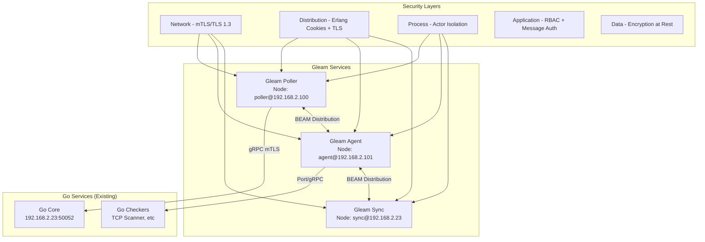

# Gleam/BEAM Security Architecture for ServiceRadar PoC

## Overview

This document outlines the security architecture for the Gleam/BEAM migration PoC, leveraging both BEAM's native security features and ServiceRadar's existing mTLS infrastructure.

## Security Architecture Principles

### Defense in Depth with BEAM

BEAM provides multiple security layers that complement traditional network security:

1. **Process Isolation** - Each connection/service runs in its own process
2. **Supervision Trees** - Failed processes restart without affecting others
3. **Native Distribution** - Secure node-to-node communication with built-in auth
4. **No Shared Memory** - Eliminates race conditions and memory corruption
5. **Hot Code Updates** - Security patches without downtime

## Multi-Layer Security Model



## Certificate Management

### Certificate Types Required

| Service | Certificate | Usage | Common Name |
|---------|-------------|-------|-------------|
| Gleam Poller | gleam-poller.pem | gRPC client/server + BEAM distribution | poller.serviceradar |
| Gleam Agent | gleam-agent.pem | gRPC client/server + BEAM distribution | agent.serviceradar |
| Gleam Sync | gleam-sync.pem | gRPC client/server + BEAM distribution | sync.serviceradar |
| BEAM Cluster | beam-cluster.pem | Inter-node distribution only | cluster.serviceradar |

### Generate Gleam Service Certificates

```bash
# Gleam Poller Certificate (dual usage: gRPC + BEAM distribution)
cat > gleam-poller-san.cnf << EOF
[req]
distinguished_name = req_distinguished_name
req_extensions = v3_req
prompt = no

[req_distinguished_name]
C = US
ST = Your State
L = Your Location
O = ServiceRadar
OU = Operations
CN = poller.serviceradar

[v3_req]
basicConstraints = CA:FALSE
keyUsage = digitalSignature, keyEncipherment
extendedKeyUsage = serverAuth, clientAuth
subjectAltName = DNS:poller.serviceradar,IP:192.168.2.100
EOF

openssl ecparam -name prime256v1 -genkey -out gleam-poller-key.pem
openssl req -new -key gleam-poller-key.pem -out gleam-poller.csr -config gleam-poller-san.cnf
openssl x509 -req -in gleam-poller.csr -CA root.pem -CAkey root-key.pem -CAcreateserial \
  -out gleam-poller.pem -days 365 -sha256 -extfile gleam-poller-san.cnf -extensions v3_req

# Gleam Agent Certificate
cat > gleam-agent-san.cnf << EOF
[req]
distinguished_name = req_distinguished_name
req_extensions = v3_req
prompt = no

[req_distinguished_name]
C = US
ST = Your State
L = Your Location
O = ServiceRadar
OU = Operations
CN = agent.serviceradar

[v3_req]
basicConstraints = CA:FALSE
keyUsage = digitalSignature, keyEncipherment
extendedKeyUsage = serverAuth, clientAuth
subjectAltName = DNS:agent.serviceradar,IP:192.168.2.101
EOF

openssl ecparam -name prime256v1 -genkey -out gleam-agent-key.pem
openssl req -new -key gleam-agent-key.pem -out gleam-agent.csr -config gleam-agent-san.cnf
openssl x509 -req -in gleam-agent.csr -CA root.pem -CAkey root-key.pem -CAcreateserial \
  -out gleam-agent.pem -days 365 -sha256 -extfile gleam-agent-san.cnf -extensions v3_req

# Gleam Sync Certificate
cat > gleam-sync-san.cnf << EOF
[req]
distinguished_name = req_distinguished_name
req_extensions = v3_req
prompt = no

[req_distinguished_name]
C = US
ST = Your State
L = Your Location
O = ServiceRadar
OU = Operations
CN = sync.serviceradar

[v3_req]
basicConstraints = CA:FALSE
keyUsage = digitalSignature, keyEncipherment
extendedKeyUsage = serverAuth, clientAuth
subjectAltName = DNS:sync.serviceradar,IP:192.168.2.23
EOF

openssl ecparam -name prime256v1 -genkey -out gleam-sync-key.pem
openssl req -new -key gleam-sync-key.pem -out gleam-sync.csr -config gleam-sync-san.cnf
openssl x509 -req -in gleam-sync.csr -CA root.pem -CAkey root-key.pem -CAcreateserial \
  -out gleam-sync.pem -days 365 -sha256 -extfile gleam-sync-san.cnf -extensions v3_req
```

### Deploy Certificates

```bash
# Create Gleam certificate directory
sudo mkdir -p /etc/serviceradar/gleam/certs
sudo chown serviceradar:serviceradar /etc/serviceradar/gleam/certs
sudo chmod 700 /etc/serviceradar/gleam/certs

# Deploy certificates
sudo cp root.pem /etc/serviceradar/gleam/certs/
sudo cp gleam-poller.pem gleam-poller-key.pem /etc/serviceradar/gleam/certs/
sudo cp gleam-agent.pem gleam-agent-key.pem /etc/serviceradar/gleam/certs/
sudo cp gleam-sync.pem gleam-sync-key.pem /etc/serviceradar/gleam/certs/

# Set permissions
sudo chown serviceradar:serviceradar /etc/serviceradar/gleam/certs/*
sudo chmod 644 /etc/serviceradar/gleam/certs/*.pem
sudo chmod 600 /etc/serviceradar/gleam/certs/*-key.pem
```

## Gleam Security Implementation

### 1. Security Configuration Module

```gleam
// src/security/config.gleam
pub type SecurityConfig {
  SecurityConfig(
    mode: SecurityMode,
    distribution: DistributionSecurity,
    grpc: GrpcSecurity,
    rbac: RbacConfig,
  )
}

pub type SecurityMode {
  Development  // No TLS, cookies only
  Production   // Full mTLS + distribution security
  Hybrid       // mTLS for external, cookies for internal
}

pub type DistributionSecurity {
  DistributionSecurity(
    cookie: String,
    enable_tls: Bool,
    cert_file: String,
    key_file: String,
    ca_file: String,
    verify_mode: VerifyMode,
    allowed_nodes: List(String),
  )
}

pub type GrpcSecurity {
  GrpcSecurity(
    cert_file: String,
    key_file: String,
    ca_file: String,
    server_name: String,
    require_client_cert: Bool,
    allowed_common_names: List(String),
  )
}

pub fn load_security_config() -> Result(SecurityConfig, ConfigError) {
  use mode <- result.try(determine_security_mode())
  use distribution <- result.try(load_distribution_config())
  use grpc <- result.try(load_grpc_config())
  use rbac <- result.try(load_rbac_config())

  Ok(SecurityConfig(
    mode: mode,
    distribution: distribution,
    grpc: grpc,
    rbac: rbac,
  ))
}

pub fn determine_security_mode() -> Result(SecurityMode, ConfigError) {
  case env.get("SERVICERADAR_SECURITY_MODE") {
    Ok("development") -> Ok(Development)
    Ok("production") -> Ok(Production)
    Ok("hybrid") -> Ok(Hybrid)
    Ok(_) -> Error(InvalidSecurityMode)
    Error(_) -> Ok(Production)  // Default to production
  }
}
```

### 2. Secure BEAM Distribution

```gleam
// src/security/distribution.gleam
import gleam/erlang/node
import gleam/erlang/atom

pub fn setup_secure_distribution(config: DistributionSecurity) -> Result(Nil, SecurityError) {
  // Set distribution cookie
  use _ <- result.try(node.set_cookie(atom.create_from_string(config.cookie)))

  // Configure TLS for distribution
  case config.enable_tls {
    True -> setup_distribution_tls(config)
    False -> {
      logger.warn("TLS disabled for distribution - only for development!")
      Ok(Nil)
    }
  }
}

pub fn setup_distribution_tls(config: DistributionSecurity) -> Result(Nil, SecurityError) {
  // Configure kernel SSL distribution options
  let ssl_dist_opts = [
    #("server", [
      #("certfile", config.cert_file),
      #("keyfile", config.key_file),
      #("cacertfile", config.ca_file),
      #("verify", config.verify_mode),
      #("fail_if_no_peer_cert", True),
      #("secure_renegotiate", True),
      #("honor_cipher_order", True),
      #("versions", ["tlsv1.3", "tlsv1.2"]),
    ]),
    #("client", [
      #("certfile", config.cert_file),
      #("keyfile", config.key_file),
      #("cacertfile", config.ca_file),
      #("verify", config.verify_mode),
      #("secure_renegotiate", True),
      #("honor_cipher_order", True),
      #("versions", ["tlsv1.3", "tlsv1.2"]),
    ]),
  ]

  application.set_env("kernel", "ssl_dist_opt", ssl_dist_opts)

  // Set distribution port range
  application.set_env("kernel", "inet_dist_listen_min", 9100)
  application.set_env("kernel", "inet_dist_listen_max", 9155)

  Ok(Nil)
}

pub fn connect_to_cluster_nodes(allowed_nodes: List(String)) -> Result(List(Node), SecurityError) {
  allowed_nodes
  |> list.map(fn(node_name) {
    case node.connect(atom.create_from_string(node_name)) {
      True -> Ok(atom.create_from_string(node_name))
      False -> Error(NodeConnectionFailed(node_name))
    }
  })
  |> result.all()
}

// Monitor node security
pub fn start_node_monitor() {
  use state <- gen_server.init()

  // Monitor for new nodes joining
  node.monitor_nodes(True)

  let state = NodeMonitorState(
    allowed_nodes: load_allowed_nodes(),
    connected_nodes: node.list(),
  )

  Ready(state)
}

pub fn handle_info(msg: InfoMessage, state: NodeMonitorState) {
  case msg {
    NodeUp(node) -> {
      case list.contains(state.allowed_nodes, node) {
        True -> {
          logger.info("Authorized node connected: " <> atom.to_string(node))
          Continue(state)
        }
        False -> {
          logger.error("Unauthorized node attempted connection: " <> atom.to_string(node))
          // Disconnect unauthorized node
          node.disconnect(node)
          Continue(state)
        }
      }
    }

    NodeDown(node) -> {
      logger.info("Node disconnected: " <> atom.to_string(node))
      Continue(state)
    }

    _ -> Continue(state)
  }
}
```

### 3. Secure gRPC Communication

```gleam
// src/security/grpc.gleam
import grpc/client
import grpc/server

pub fn create_secure_grpc_server(config: GrpcSecurity, port: Int) -> Result(Server, SecurityError) {
  use credentials <- result.try(load_server_credentials(config))

  server.new()
  |> server.with_credentials(credentials)
  |> server.with_options([
    #("grpc.keepalive_time_ms", 30000),
    #("grpc.keepalive_timeout_ms", 5000),
    #("grpc.keepalive_permit_without_calls", True),
    #("grpc.http2.max_pings_without_data", 0),
    #("grpc.http2.min_time_between_pings_ms", 10000),
    #("grpc.http2.min_ping_interval_without_data_ms", 300000),
  ])
  |> server.bind("0.0.0.0:" <> int.to_string(port))
  |> server.start()
}

pub fn create_secure_grpc_client(config: GrpcSecurity, target: String) -> Result(Channel, SecurityError) {
  use credentials <- result.try(load_client_credentials(config))

  client.connect(target)
  |> client.with_credentials(credentials)
  |> client.with_options([
    #("grpc.keepalive_time_ms", 30000),
    #("grpc.keepalive_timeout_ms", 5000),
    #("grpc.http2.adaptive_window", True),
    #("grpc.http2.bdp_probe", True),
  ])
}

fn load_server_credentials(config: GrpcSecurity) -> Result(ServerCredentials, SecurityError) {
  use ca_cert <- result.try(file.read(config.ca_file))
  use server_cert <- result.try(file.read(config.cert_file))
  use server_key <- result.try(file.read(config.key_file))

  let credentials = server.SslCredentials(
    root_certificates: ca_cert,
    cert_chain: server_cert,
    private_key: server_key,
    require_client_auth: config.require_client_cert,
  )

  Ok(credentials)
}

fn load_client_credentials(config: GrpcSecurity) -> Result(ChannelCredentials, SecurityError) {
  use ca_cert <- result.try(file.read(config.ca_file))
  use client_cert <- result.try(file.read(config.cert_file))
  use client_key <- result.try(file.read(config.key_file))

  let credentials = client.SslCredentials(
    root_certificates: ca_cert,
    cert_chain: client_cert,
    private_key: client_key,
  )

  Ok(credentials)
}
```

### 4. Message Authentication & Authorization

```gleam
// src/security/auth.gleam
pub type AuthenticatedMessage(a) {
  AuthenticatedMessage(
    sender: Node,
    sender_cert_cn: String,
    payload: a,
    timestamp: Int,
    nonce: BitString,
    signature: BitString,
  )
}

pub type Permission {
  Read
  Write
  Poll
  Sync
  Admin
}

pub type Role {
  Role(
    common_name: String,
    permissions: List(Permission),
    rate_limit: Option(RateLimit),
  )
}

pub fn authenticate_message(msg: AuthenticatedMessage(a), roles: List(Role)) -> Result(a, AuthError) {
  // 1. Verify timestamp (prevent replay attacks)
  use _ <- result.try(verify_timestamp(msg.timestamp))

  // 2. Verify signature
  use sender_cert <- result.try(get_node_certificate(msg.sender))
  use _ <- result.try(verify_signature(msg, sender_cert))

  // 3. Check authorization
  use role <- result.try(find_role_by_cn(msg.sender_cert_cn, roles))
  use _ <- result.try(check_rate_limit(role, msg.sender))

  Ok(msg.payload)
}

pub fn sign_message(payload: a, cert_file: String, key_file: String) -> Result(AuthenticatedMessage(a), AuthError) {
  use cert <- result.try(load_certificate(cert_file))
  use key <- result.try(load_private_key(key_file))

  let timestamp = time.now_unix()
  let nonce = crypto.strong_rand_bytes(16)

  let message_bytes = encode_for_signing(payload, timestamp, nonce)
  use signature <- result.try(crypto.sign(key, message_bytes))

  Ok(AuthenticatedMessage(
    sender: node.self(),
    sender_cert_cn: extract_common_name(cert),
    payload: payload,
    timestamp: timestamp,
    nonce: nonce,
    signature: signature,
  ))
}

fn verify_signature(msg: AuthenticatedMessage(a), cert: Certificate) -> Result(Nil, AuthError) {
  let message_bytes = encode_for_signing(msg.payload, msg.timestamp, msg.nonce)

  case crypto.verify(cert.public_key, message_bytes, msg.signature) {
    True -> Ok(Nil)
    False -> Error(InvalidSignature)
  }
}

fn verify_timestamp(timestamp: Int) -> Result(Nil, AuthError) {
  let now = time.now_unix()
  let age = now - timestamp

  case age {
    age if age < 0 -> Error(FutureTimestamp)
    age if age > 300 -> Error(ExpiredMessage)  // 5 minutes max
    _ -> Ok(Nil)
  }
}
```

### 5. Circuit Breaker with Security Context

```gleam
// src/security/circuit_breaker.gleam
pub type SecureCircuitBreaker {
  SecureCircuitBreaker(
    name: String,
    state: CircuitState,
    failure_count: Int,
    last_failure_time: Int,
    config: CircuitConfig,
    security_context: SecurityContext,
  )
}

pub type SecurityContext {
  SecurityContext(
    peer_cert_cn: String,
    peer_node: Node,
    permissions: List(Permission),
    rate_limiter: TokenBucket,
  )
}

pub fn secure_call(breaker: SecureCircuitBreaker, request: Request) -> Result(Response, CircuitError) {
  // 1. Check rate limit first
  use _ <- result.try(check_rate_limit(breaker.security_context.rate_limiter))

  // 2. Check circuit breaker state
  use _ <- result.try(check_circuit_state(breaker))

  // 3. Verify permissions for this request type
  use _ <- result.try(verify_permissions(request, breaker.security_context.permissions))

  // 4. Execute request with timeout
  case execute_with_timeout(request, breaker.config.timeout) {
    Ok(response) -> {
      record_success(breaker)
      Ok(response)
    }

    Error(error) -> {
      record_failure(breaker, error)
      Error(CallFailed(error))
    }
  }
}

fn verify_permissions(request: Request, permissions: List(Permission)) -> Result(Nil, PermissionError) {
  let required_permission = case request {
    PollRequest(_) -> Poll
    SyncRequest(_) -> Sync
    ReadRequest(_) -> Read
    WriteRequest(_) -> Write
    AdminRequest(_) -> Admin
  }

  case list.contains(permissions, required_permission) {
    True -> Ok(Nil)
    False -> Error(InsufficientPermissions(required_permission))
  }
}
```

### 6. Hot Certificate Rotation

```gleam
// src/security/cert_manager.gleam
pub type CertificateManager {
  CertificateManager(
    cert_file: String,
    key_file: String,
    ca_file: String,
    current_cert: Certificate,
    current_key: PrivateKey,
    ca_cert: Certificate,
    reload_timer: TimerRef,
    watchers: List(Pid),
  )
}

pub fn start_certificate_manager(cert_file: String, key_file: String, ca_file: String) -> Result(Pid, SecurityError) {
  use state <- gen_server.start_link()

  use cert <- result.try(load_certificate(cert_file))
  use key <- result.try(load_private_key(key_file))
  use ca <- result.try(load_certificate(ca_file))

  // Watch for file changes
  use timer <- result.try(timer.send_interval(60_000, self(), CheckCertificates))

  let state = CertificateManager(
    cert_file: cert_file,
    key_file: key_file,
    ca_file: ca_file,
    current_cert: cert,
    current_key: key,
    ca_cert: ca,
    reload_timer: timer,
    watchers: [],
  )

  Ready(state)
}

pub fn register_watcher(manager: Pid, watcher: Pid) {
  gen_server.cast(manager, RegisterWatcher(watcher))
}

pub fn handle_info(msg: InfoMessage, state: CertificateManager) -> GenServerHandleInfo(CertificateManager) {
  case msg {
    CheckCertificates -> {
      case check_for_certificate_changes(state) {
        Ok(new_state) -> Continue(new_state)
        Error(error) -> {
          logger.error("Certificate check failed: " <> string.inspect(error))
          Continue(state)
        }
      }
    }

    _ -> Continue(state)
  }
}

fn check_for_certificate_changes(state: CertificateManager) -> Result(CertificateManager, SecurityError) {
  use cert_modified <- result.try(file.stat(state.cert_file))
  use key_modified <- result.try(file.stat(state.key_file))
  use ca_modified <- result.try(file.stat(state.ca_file))

  let needs_reload =
    cert_modified.mtime > state.current_cert.loaded_at ||
    key_modified.mtime > state.current_key.loaded_at ||
    ca_modified.mtime > state.ca_cert.loaded_at

  case needs_reload {
    True -> reload_certificates(state)
    False -> Ok(state)
  }
}

fn reload_certificates(state: CertificateManager) -> Result(CertificateManager, SecurityError) {
  logger.info("Reloading certificates...")

  use new_cert <- result.try(load_certificate(state.cert_file))
  use new_key <- result.try(load_private_key(state.key_file))
  use new_ca <- result.try(load_certificate(state.ca_file))

  // Notify all watchers
  state.watchers
  |> list.each(fn(watcher) {
    process.send(watcher, CertificatesReloaded(new_cert, new_key, new_ca))
  })

  logger.info("Certificates reloaded successfully")

  Ok(CertificateManager(
    ..state,
    current_cert: new_cert,
    current_key: new_key,
    ca_cert: new_ca,
  ))
}
```

## Configuration Files

### 1. Gleam Security Configuration

```toml
# /etc/serviceradar/gleam/security.toml

[security]
mode = "production"  # development | production | hybrid

[security.distribution]
cookie = "${ERLANG_COOKIE}"  # From environment variable
enable_tls = true
cert_file = "/etc/serviceradar/gleam/certs/gleam-poller.pem"
key_file = "/etc/serviceradar/gleam/certs/gleam-poller-key.pem"
ca_file = "/etc/serviceradar/gleam/certs/root.pem"
verify_mode = "verify_peer"
allowed_nodes = [
  "poller@192.168.2.100",
  "agent@192.168.2.101",
  "sync@192.168.2.23"
]

[security.grpc]
cert_file = "/etc/serviceradar/gleam/certs/gleam-poller.pem"
key_file = "/etc/serviceradar/gleam/certs/gleam-poller-key.pem"
ca_file = "/etc/serviceradar/gleam/certs/root.pem"
server_name_override = "core.serviceradar"
require_client_cert = true
allowed_common_names = [
  "core.serviceradar",
  "poller.serviceradar",
  "agent.serviceradar",
  "sync.serviceradar"
]

[security.rbac]
enabled = true

[[security.rbac.roles]]
identity = "CN=poller.serviceradar,O=ServiceRadar"
permissions = ["read", "write", "poll"]
rate_limit = { requests_per_second = 100, burst = 1000 }

[[security.rbac.roles]]
identity = "CN=agent.serviceradar,O=ServiceRadar"
permissions = ["read", "report"]
rate_limit = { requests_per_second = 50, burst = 500 }

[[security.rbac.roles]]
identity = "CN=sync.serviceradar,O=ServiceRadar"
permissions = ["read", "write", "sync"]
rate_limit = { requests_per_second = 10, burst = 100 }

[[security.rbac.roles]]
identity = "CN=core.serviceradar,O=ServiceRadar"
permissions = ["read", "write", "poll", "sync", "admin"]
rate_limit = { requests_per_second = 1000, burst = 10000 }

[security.features]
enable_message_signing = true
enable_timestamp_validation = true
max_message_age_seconds = 300
enable_nonce_tracking = true
nonce_cache_size = 10000
```

### 2. Systemd Service Configuration

```ini
# /etc/systemd/system/serviceradar-gleam-poller.service
[Unit]
Description=ServiceRadar Gleam Poller
After=network.target

[Service]
Type=notify
User=serviceradar
Group=serviceradar
Environment=ERLANG_COOKIE=your-secure-cookie-here
Environment=SERVICERADAR_SECURITY_MODE=production
Environment=GLEAM_NODE_NAME=poller@192.168.2.100
ExecStart=/usr/local/bin/serviceradar-gleam-poller start
ExecReload=/bin/kill -HUP $MAINPID
Restart=always
RestartSec=5
StandardOutput=journal
StandardError=journal

# Security hardening
NoNewPrivileges=true
PrivateTmp=true
ProtectSystem=strict
ProtectHome=true
ReadWritePaths=/var/lib/serviceradar /var/log/serviceradar
CapabilityBoundingSet=CAP_NET_BIND_SERVICE

[Install]
WantedBy=multi-user.target
```

### 3. SSL Distribution Configuration

```erlang
%% /etc/serviceradar/gleam/ssl_dist.conf
[
  {server, [
    {certfile, "/etc/serviceradar/gleam/certs/gleam-poller.pem"},
    {keyfile, "/etc/serviceradar/gleam/certs/gleam-poller-key.pem"},
    {cacertfile, "/etc/serviceradar/gleam/certs/root.pem"},
    {verify, verify_peer},
    {fail_if_no_peer_cert, true},
    {secure_renegotiate, true},
    {honor_cipher_order, true},
    {versions, ['tlsv1.3', 'tlsv1.2']},
    {ciphers, [
      "ECDHE-RSA-AES256-GCM-SHA384",
      "ECDHE-RSA-AES128-GCM-SHA256",
      "ECDHE-RSA-CHACHA20-POLY1305"
    ]}
  ]},

  {client, [
    {certfile, "/etc/serviceradar/gleam/certs/gleam-poller.pem"},
    {keyfile, "/etc/serviceradar/gleam/certs/gleam-poller-key.pem"},
    {cacertfile, "/etc/serviceradar/gleam/certs/root.pem"},
    {verify, verify_peer},
    {secure_renegotiate, true},
    {honor_cipher_order, true},
    {versions, ['tlsv1.3', 'tlsv1.2']},
    {server_name_indication, disable}
  ]}
].
```

## Security Testing & Validation

### 1. Certificate Validation

```bash
#!/bin/bash
# scripts/validate_gleam_security.sh

echo "=== Validating Gleam Security Setup ==="

# Check certificate validity
for cert in gleam-poller gleam-agent gleam-sync; do
  echo "Checking $cert certificate..."

  # Verify certificate
  openssl verify -CAfile /etc/serviceradar/gleam/certs/root.pem \
    /etc/serviceradar/gleam/certs/${cert}.pem

  # Check expiration
  openssl x509 -in /etc/serviceradar/gleam/certs/${cert}.pem \
    -noout -dates

  # Verify key usage
  openssl x509 -in /etc/serviceradar/gleam/certs/${cert}.pem \
    -noout -text | grep -A 2 "Key Usage"
done

# Test gRPC TLS connection
echo "Testing gRPC TLS connection..."
timeout 5 openssl s_client -connect 192.168.2.23:50052 \
  -cert /etc/serviceradar/gleam/certs/gleam-poller.pem \
  -key /etc/serviceradar/gleam/certs/gleam-poller-key.pem \
  -CAfile /etc/serviceradar/gleam/certs/root.pem \
  -verify_return_error < /dev/null

echo "=== Security validation complete ==="
```

### 2. Distribution Security Test

```gleam
// test/security_test.gleam
import gleam/erlang/node
import gleam/erlang/atom

pub fn test_secure_distribution() {
  // Test node connection with proper authentication
  let target_node = atom.create_from_string("agent@192.168.2.101")

  case node.connect(target_node) {
    True -> {
      io.println("✓ Successfully connected to secure node")

      // Test message authentication
      test_authenticated_message_exchange(target_node)
    }

    False -> {
      io.println("✗ Failed to connect to secure node")
      panic as "Distribution security test failed"
    }
  }
}

pub fn test_authenticated_message_exchange(remote_node: Node) {
  let test_payload = TestMessage("Hello from secure poller")

  use signed_message <- result.try(
    sign_message(test_payload,
      "/etc/serviceradar/gleam/certs/gleam-poller.pem",
      "/etc/serviceradar/gleam/certs/gleam-poller-key.pem"
    )
  )

  // Send to remote node
  process.send({remote_node, atom.create_from_string("test_handler")}, signed_message)

  // Wait for authenticated response
  case receive_timeout(5000) {
    Ok(AuthenticatedMessage(_, _, response, _, _, _)) -> {
      io.println("✓ Received authenticated response: " <> string.inspect(response))
      Ok(Nil)
    }

    Error(Timeout) -> {
      io.println("✗ Timeout waiting for authenticated response")
      Error(TestTimeout)
    }
  }
}
```

## Security Monitoring & Alerting

### 1. Security Event Logging

```gleam
// src/security/monitoring.gleam
pub type SecurityEvent {
  NodeConnectionAttempt(node: Node, success: Bool, reason: String)
  CertificateValidationFailed(cert_cn: String, reason: String)
  UnauthorizedAccess(peer: String, requested_action: String)
  RateLimitExceeded(peer: String, current_rate: Int)
  MessageSignatureInvalid(sender: Node, reason: String)
  CertificateRotated(cert_cn: String)
}

pub fn log_security_event(event: SecurityEvent) {
  let event_data = security_event_to_json(event)

  // Log to structured logs
  logger.info(event_data)

  // Send to security monitoring system
  case event {
    NodeConnectionAttempt(_, False, _) |
    CertificateValidationFailed(_, _) |
    UnauthorizedAccess(_, _) |
    RateLimitExceeded(_, _) |
    MessageSignatureInvalid(_, _) -> {
      // Send alert for security violations
      send_security_alert(event)
    }

    _ -> Nil  // Normal events, just log
  }
}

fn send_security_alert(event: SecurityEvent) {
  let alert = SecurityAlert(
    timestamp: time.now_unix(),
    severity: determine_severity(event),
    event: event,
    node: node.self(),
  )

  // Send to monitoring system via HTTP webhook
  http_client.post("https://monitoring.serviceradar.cloud/alerts/security",
    json.encode(alert))
}
```

### 2. Security Metrics Collection

```gleam
// src/security/metrics.gleam
pub fn init_security_metrics() {
  telemetry.attach("security.connection.attempt",
    ["gleam", "security", "connection", "attempt"],
    fn(measurements, metadata, _config) {
      prometheus.counter_inc("security_connection_attempts_total", [
        #("result", case measurements.success { True -> "success"; False -> "failure" }),
        #("peer", metadata.peer_node),
      ])
    })

  telemetry.attach("security.auth.check",
    ["gleam", "security", "auth", "check"],
    fn(measurements, metadata, _config) {
      prometheus.histogram_observe("security_auth_check_duration_seconds",
        measurements.duration)

      prometheus.counter_inc("security_auth_checks_total", [
        #("result", case measurements.success { True -> "success"; False -> "failure" }),
        #("action", metadata.requested_action),
      ])
    })

  telemetry.attach("security.cert.rotation",
    ["gleam", "security", "cert", "rotation"],
    fn(_measurements, metadata, _config) {
      prometheus.counter_inc("security_cert_rotations_total", [
        #("cert_cn", metadata.cert_cn),
      ])
    })
}
```

## Best Practices Summary

### 1. **Defense in Depth**
- Network layer: mTLS for all external communication
- Distribution layer: TLS + cookies for BEAM cluster
- Process layer: Supervision trees isolate security failures
- Application layer: RBAC + message signing

### 2. **Certificate Management**
- Separate certificates per service for principle of least privilege
- Hot rotation without service interruption
- Automatic monitoring of certificate expiration
- Proper key usage extensions (clientAuth + serverAuth)

### 3. **Monitoring & Alerting**
- Log all security events with structured data
- Real-time alerts for security violations
- Metrics for security performance monitoring
- Regular security testing and validation

### 4. **Development vs Production**
- Development mode: Cookies only for internal communication
- Production mode: Full mTLS + distribution security
- Environment-specific configuration management
- Secure secret management (environment variables, not config files)

This architecture provides multiple layers of security while leveraging BEAM's inherent advantages for building secure, fault-tolerant distributed systems.