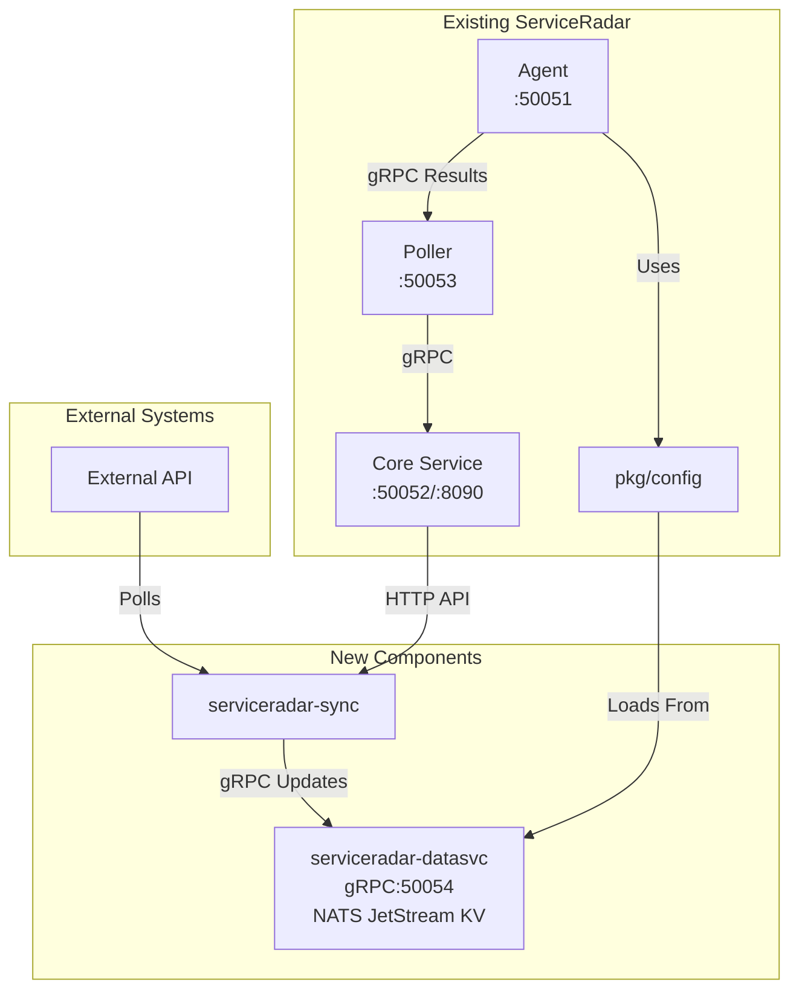

# ADR: ServiceRadar KV Integration with NATS JetStream

## Status

Proposed

## Context

ServiceRadar agents currently rely on static JSON configuration files, which presents significant limitations for operational flexibility and scalability. This static approach creates several challenges:

- Configuration changes require service restarts, causing disruption to monitoring
- Performance bottlenecks when parsing large JSON files, especially with growing device inventories
- Difficulties in maintaining synchronized configurations across distributed components
- No mechanism for dynamic updates or real-time configuration changes
- Limited ability to integrate with external systems that manage large inventories
- Operational overhead when managing configuration across multiple agents and checkers

This impacts all agent plugins (checkers), not just the sweep service, as each relies on static configuration files that cannot be updated without service disruption.

We need a solution that enables dynamic, scalable configuration management while maintaining ServiceRadar's existing architecture patterns and data flow, with zero changes to existing agent components.

## Decision

We will implement a key-value (KV) store using NATS JetStream as the backend, wrapped in a dedicated service called `serviceradar-datasvc`. To ensure zero modifications to the agent, we will enhance `pkg/config` to transparently support both file-based and KV-based configuration sources.

### Architecture

The solution will consist of:

1. A `serviceradar-datasvc` service providing a gRPC interface on port 50054 for KV operations
2. NATS JetStream as an embedded KV store for simplicity and performance
3. Extending `pkg/config` with a `ConfigLoader` interface that supports multiple sources
4. Implementing both file-based and KV-based loaders that implement this interface
5. Updating `config.LoadAndValidate` to use a configurable loader (defaulting to file, with KV override via environment variable or configuration)
6. Implementing automatic fallback to file-based configuration when the KV is unavailable

The agent will continue using `config.LoadAndValidate("/path/to/sweep.json", &config)` without modification, with `pkg/config` handling whether data comes from the file or the KV Daemon.

Additionally, we will create synchronization services that will:
1. Poll external APIs at configurable intervals
2. Update the KV store with device information
3. Push status updates back to external systems via the ServiceRadar core API

## Consequences

### Positive

- Enables dynamic updating of configurations for all agent plugins without service restarts
- Improves operational efficiency by eliminating restart-related downtime
- Scales to support large configurations and device inventories
- Supports real-time configuration updates for any agent checker
- Maintains the existing one-way data flow: agent → poller → core
- Provides a path for integration with external systems via the KV abstraction
- Uses consistent technology (gRPC) for all service communications
- Embedded NATS JetStream simplifies deployment with no external dependencies
- **Requires zero changes to agent, poller, and core components**
- **Configuration source is fully abstracted within pkg/config**
- **All agent plugins remain completely agnostic of configuration source**
- **Creates a foundation for future dynamic configuration features**

### Negative

- Introduces new services that must be deployed and maintained
- Adds complexity to the overall architecture
- No synchronization between KV and JSON fallback configurations
- External API polling must handle pagination properly for large device sets

### Neutral

- The KVStore interface allows for future replacement of NATS JetStream with alternatives (MQTT, Kafka, etcd, Redis)
- Configuration will be split across multiple files
- The `ConfigLoader` interface provides flexibility for adding other configuration sources in the future

## Implementation Details

### KV Daemon (serviceradar-datasvc)

- **Interface**: Create a generic KVStore interface in `pkg/kv/interfaces.go`
- **Backend**: Implement NATS JetStream backend in `pkg/kv/nats.go`
- **API**: Define and implement gRPC service in `proto/kv.proto` and `pkg/kv/server.go`
- **Configuration**: Load from `/etc/serviceradar/datasvc.json`
- **Systemd**: Provide `serviceradar-datasvc.service` file

### Config Package Enhancements

- **Interface**: Add a `ConfigLoader` interface to `pkg/config/loader.go`
- **File Loader**: Implement `FileConfigLoader` that wraps existing functionality
- **KV Loader**: Implement `KVConfigLoader` that fetches from KV store via gRPC
- **Update LoadAndValidate**: Modify to select appropriate loader based on configuration or environment variables
- **Default Behavior**: Default to file loading for backward compatibility
- **Fallback Logic**: Implement automatic fallback to file-based configuration when KV is unavailable
- **Environment Variables**: Add support for `CONFIG_SOURCE=kv` or similar to override the default

### Integration Sync Services

- **Sync Logic**: Implement in dedicated service packages
- **External API Integration**: Create in appropriate integration packages
- **Configuration**: Load from configuration files in `/etc/serviceradar/`
- **Systemd**: Provide service files for each sync service

### Agent Impact

- **No Changes Required**: All agent plugins continue to call `config.LoadAndValidate("/path/to/config.json", &config)` as before
- **Transparent Source Selection**: `pkg/config` handles whether data comes from file or KV
- **Backward Compatibility**: Existing deployments continue to work without modification
- **Universal Benefit**: All checkers (sweep, HTTP, DNS, etc.) gain dynamic configuration capabilities
- **Operational Improvement**: Configuration can be updated in production without service disruption

## Testing Approach

- Unit tests for KVStore interface and NATS implementation
- Unit tests for both ConfigLoader implementations and the enhanced LoadAndValidate function
- Integration tests for the full flow with simulated load
- Validation of fallback mechanism when KV is unavailable
- Verification that existing agent behavior is unchanged when using file-based config

## Security Considerations

- External API credentials must be securely stored
- Consider adding authentication to the KV gRPC service
- Evaluate data sensitivity and apply appropriate access controls

## Documentation Requirements

- Update `docs/docs/configuration.md` with new KV configuration options and environment variables
- Revise `docs/docs/architecture.md` to include new components
- Update `docs/docs/installation.md` with installation instructions
- Add developer documentation for the `ConfigLoader` interface and how to implement new loaders
- Clarify that no agent changes are required to use the new KV-based configuration