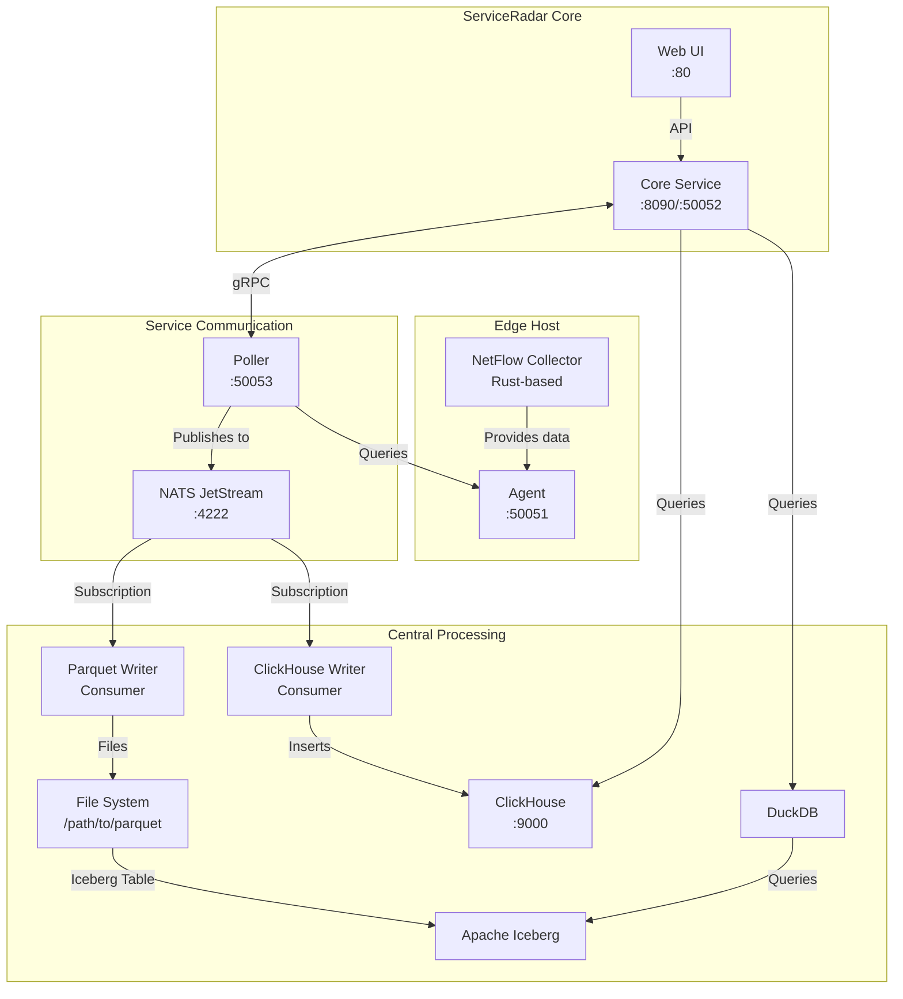

# Product Requirements Document (PRD): NetFlow Integration with ClickHouse, Parquet, Iceberg, and DuckDB

## 1. Overview

### 1.1 Purpose
This PRD defines the requirements for integrating NetFlow collection and analytics into ServiceRadar, enhancing its network monitoring capabilities. The solution will collect NetFlow data at edge hosts, process it centrally, and provide real-time (1-2 days) and historical analytics through a unified UI and API. The system leverages ClickHouse for real-time queries, Parquet for archival storage, Apache Iceberg for table management, and DuckDB for querying historical data, integrated with ServiceRadar's existing agent/poller architecture and NATS JetStream for data transport.

### 1.2 Goals
- Enable NetFlow-based network traffic monitoring (e.g., source/destination IPs, ports, protocols, bytes).
- Support real-time dashboards (1-2 days) and long-term historical analysis (30-90 days or more).
- Minimize resource usage on agent hosts by offloading storage and processing.
- Provide a seamless user experience via a unified API and Web UI.
- Integrate with ServiceRadar's agent/poller model and NATS JetStream for scalability.
- Ensure compatibility with constrained environments (e.g., edge deployments).

### 1.3 Non-Goals
- Support for non-NetFlow protocols (e.g., sFlow, IPFIX) in this phase.
- Real-time anomaly detection or machine learning (future enhancement).
- Direct Parquet/Iceberg storage on agent hosts.

## 2. User Experience

### 2.1 Top-Down Workflow
The user interacts with ServiceRadar's Web UI to monitor network traffic, with analytics served from different backends (ClickHouse for recent data, DuckDB/Iceberg for historical) but exposed through a unified API.

#### 2.1.1 Accessing the Web UI
- User Action: Log into the Web UI (http://<server-ip>/) using credentials configured in /etc/serviceradar/core.json.
- Outcome: The dashboard displays a "Network Traffic" section alongside existing metrics (e.g., rperf, SNMP).

#### 2.1.2 Real-Time Dashboard (1-2 Days)
- User Action: Select a "Real-Time Traffic" view, filtering by time range (e.g., last hour, today), IPs, or protocols.
- System Behavior:
  - The UI sends a request to the Core Service API (/api/netflow/realtime).
  - The Core Service queries ClickHouse for data within the last 1-2 days.
  - Results (e.g., top talkers, bandwidth usage) are displayed as charts/tables.
- Example Metrics:
  - Total bytes per source IP.
  - Top 5 destination ports.
  - Traffic volume over time (line chart).
- Performance: Sub-second query response for aggregations.

#### 2.1.3 Historical Analysis (30-90+ Days)
- User Action: Select a "Historical Traffic" view, choosing a date range (e.g., last month) or specific IPs.
- System Behavior:
  - The UI sends a request to the Core Service API (/api/netflow/historical).
  - The Core Service uses DuckDB to query Parquet files managed by Iceberg.
  - Results are displayed as aggregated reports or downloadable CSVs.
- Example Metrics:
  - Monthly traffic trends by protocol.
  - Historical anomalies (e.g., traffic spikes).
- Performance: Queries complete in 1-5 seconds for large datasets.

#### 2.1.4 Unified API
- Design: A single API endpoint (/api/netflow) handles both real-time and historical queries, abstracting the backend.
- Query parameter time_range determines the backend:
  - < 2 days: ClickHouse.
  - >= 2 days: DuckDB/Iceberg.
- Example: GET /api/netflow?time_range=last_24h&group_by=src_ip.
- Benefit: Users don't need to know the underlying storage; the UI remains consistent.

### 2.2 User Stories
- As a network admin, I want to see real-time traffic stats (e.g., top IPs) in the dashboard so I can detect issues quickly.
- As a security analyst, I want to query traffic from last month to investigate an incident, without switching tools.
- As a sysadmin, I want NetFlow data to integrate seamlessly with ServiceRadar's existing UI and alerts, minimizing setup effort.

## 3. System Architecture

### 3.1 Overview
The NetFlow integration extends ServiceRadar's agent/poller model, using NATS JetStream to transport data from edge hosts to a central processing system. Data is stored in ClickHouse for real-time queries and Parquet/Iceberg for historical analysis, with DuckDB as the query engine for historical data.



### 3.2 Components

#### 3.2.1 NetFlow Collector (Edge)
- Description: A Rust-based binary running on agent hosts, collecting NetFlow packets (e.g., UDP port 2055).
- Function:
  - Parses NetFlow v5/v9 packets into structured records.
  - Provides the data to the Agent via a defined interface.
  - Data is maintained in-memory with configurable retention.
- Configuration: /etc/serviceradar/checkers/netflow.json (e.g., listen port, retention).
- Constraints:
  - No local storage (Parquet/ClickHouse) to minimize resource usage.
  - Lightweight processing (parsing only, no aggregation).

#### 3.2.2 Agent
- Description: Existing ServiceRadar component that runs on edge hosts.
- Function:
  - Acts as an intermediary between the NetFlow Collector and Poller.
  - Exposes NetFlow data via its gRPC interface when queried.
  - No direct interaction with NATS JetStream (Poller handles this).
- Configuration: Updated to include NetFlow checker in agent configuration.

#### 3.2.3 Poller
- Description: Existing ServiceRadar component that pulls data from agents.
- Function:
  - Periodically queries agents for NetFlow data.
  - Batches and publishes NetFlow records to NATS JetStream.
  - Ensures reliable transport from agents to central processing.
- Configuration: Update poller.json to include NetFlow checks.

#### 3.2.4 NATS JetStream
- Description: Message broker component for reliable data transport.
- Function:
  - Receives NetFlow records from Pollers (netflow.raw stream).
  - Supports queue groups for load-balanced consumption.
- Configured in /etc/nats/nats-server.conf (localhost:4222, mTLS).
- Stream Configuration:
  - Stream: NETFLOW
  - Subjects: netflow.raw
  - Retention: WorkQueuePolicy (delete after processing).
  - Max size: 1GB (temporary buffer).

#### 3.2.5 Parquet Writer (Central)
- Description: A consumer service subscribed to NATS JetStream.
- Function:
  - Pulls NetFlow records from netflow.raw.
  - Batches records (e.g., 10k records or 5 minutes).
  - Writes to Parquet files (/path/to/parquet/netflow_<date>.parquet).
  - Registers files in Iceberg table (netflow).
- Implementation: Rust service using parquet-rs and iceberg-rust.
- Configuration: /etc/serviceradar/netflow-parquet.json (e.g., batch size, output path).

#### 3.2.6 ClickHouse Writer (Central)
- Description: A separate consumer service for real-time storage.
- Function:
  - Pulls records from netflow.raw.
  - Inserts into ClickHouse (netflow table).
  - Retention: 2 days (TTL policy).
- Implementation: Rust service using clickhouse-rs.
- Configuration: /etc/serviceradar/netflow-clickhouse.json (e.g., ClickHouse URL, batch size).
- Schema:
```sql
CREATE TABLE netflow (
    timestamp DateTime,
    src_ip String,
    dst_ip String,
    src_port UInt16,
    dst_port UInt16,
    protocol UInt8,
    bytes UInt64
) ENGINE = MergeTree()
ORDER BY (timestamp, src_ip, dst_ip)
PARTITION BY toDate(timestamp)
TTL timestamp + INTERVAL 2 DAY;
```

#### 3.2.7 Apache Iceberg
- Description: Table format managing Parquet files.
- Function:
  - Organizes Parquet files into a netflow table.
  - Partitions by date (toDate(timestamp)).
  - Supports time travel and retention (e.g., expire snapshots > 90 days).
- Catalog: REST catalog (lightweight, runs on central host).
- Location: /path/to/parquet (local or S3 for future scalability).
- Schema:
```json
{
  "timestamp": "timestamp",
  "src_ip": "string",
  "dst_ip": "string",
  "src_port": "int",
  "dst_port": "int",
  "protocol": "int",
  "bytes": "long"
}
```

#### 3.2.8 DuckDB
- Description: Embedded query engine for historical data.
- Function:
  - Queries Iceberg table (netflow) for historical analysis.
  - Integrated with Core Service for API requests.
- Implementation: Rust bindings (duckdb-rs) or Python (pyduckdb).
- Configuration: None (in-memory, loads Iceberg metadata).

#### 3.2.9 Core Service
- Description: Existing ServiceRadar component (serviceradar-core).
- Function:
  - Handles API requests (/api/netflow).
  - Routes queries to ClickHouse (< 2 days) or DuckDB/Iceberg (>= 2 days).
  - Aggregates results for Web UI.
- Configuration: Update /etc/serviceradar/core.json:
```json
{
  "netflow": {
    "clickhouse_url": "tcp://localhost:9000",
    "iceberg_catalog": "http://localhost:8080",
    "iceberg_table": "default.netflow",
    "realtime_threshold": "2d"
  }
}
```

#### 3.2.10 Web UI
- Description: Existing Next.js UI (serviceradar-web).
- Function:
  - Displays real-time and historical NetFlow dashboards.
  - Sends requests to Core Service API.
- Configuration: Update /etc/serviceradar/web.json to enable NetFlow routes.

## 4. Integration with Agent/Poller Model

### 4.1 Problem Statement
ServiceRadar's agent/poller model assumes lightweight agents on edge hosts, with pollers coordinating checks and core processing centrally. Storing Parquet files or running ClickHouse on agents is impractical due to resource constraints and complexity.

### 4.2 Solution
- Edge Processing:
  - NetFlow Collector parses packets and provides records to the Agent.
  - Agent exposes this data via gRPC for the Poller to query.
  - No local storage or heavy processing on edge hosts.
- Poller Responsibilities:
  - Queries Agents for NetFlow data on a scheduled basis.
  - Batches data and publishes to NATS JetStream.
  - Acts as the bridge between edge hosts and central processing.
- Central Processing:
  - Dedicated consumers (Parquet Writer, ClickHouse Writer) run on a central host.
  - NATS JetStream ensures reliable transport from pollers to consumers.
- Security Advantages:
  - Single connection from Poller to Agent (simplifies firewall rules).
  - Consistent with existing ServiceRadar architecture.
  - Centralized control of data collection via Poller configuration.

### 4.3 Protobuf Schema
To standardize data transport, define a Protobuf message for NetFlow records:
```proto
message NetFlowRecord {
  int64 timestamp = 1;
  string src_ip = 2;
  string dst_ip = 3;
  uint32 src_port = 4;
  uint32 dst_port = 5;
  uint32 protocol = 6;
  uint64 bytes = 7;
}
```
- Generated Code: Use prost or tonic in Rust to encode/decode messages.
- Publishing: Poller sends NetFlowRecord to the NATS JetStream netflow.raw subject.

## 5. Requirements

### 5.1 Functional Requirements
- NetFlow Collection:
  - Collect NetFlow v5/v9 packets on agent hosts (UDP port 2055).
  - Parse into structured records accessible via Agent's gRPC interface.
  - Poller queries and publishes to NATS JetStream (netflow.raw).
- Real-Time Storage:
  - Write records to ClickHouse (2-day retention).
  - Support queries for top IPs, ports, and traffic volume.
- Historical Storage:
  - Write records to Parquet files (batched, e.g., hourly).
  - Register files in Iceberg table (netflow).
  - Support queries for 30-90+ days.
- Unified API:
  - Endpoint: /api/netflow?time_range=<range>&group_by=<field>.
  - Backend routing based on time_range.
- Web UI:
  - Real-time dashboard with charts (e.g., line, bar).
  - Historical reports with filtering and CSV export.
- Agent/Poller:
  - NetFlow checker plugin for agents.
  - Poller checks for NetFlow data and publishes to NATS.

### 5.2 Non-Functional Requirements
- Performance:
  - ClickHouse queries: < 1s for aggregations on 2 days.
  - DuckDB/Iceberg queries: < 5s for 30 days.
  - Collector: Handle 10k flows/second per agent.
- Scalability:
  - Support 100 agents, each sending 1k flows/second.
  - NATS JetStream scales to 1M messages/second.
- Reliability:
  - NATS JetStream ensures no message loss.
  - Parquet/Iceberg supports data recovery.
  - Poller implements retry logic for agent connections.
- Security:
  - mTLS for agent-poller and NATS communications.
  - Restrict ClickHouse/DuckDB access to Core Service.
- Storage:
  - ClickHouse: ~10GB/day for 2 days (20GB total).
  - Parquet/Iceberg: ~1GB/day compressed (90GB for 90 days).

## 6. Implementation Plan

### 6.1 Phase 1: NetFlow Collector and Agent Integration
- Tasks:
  - Develop serviceradar-netflow-checker in Rust.
  - Parse NetFlow packets using pnet or similar.
  - Implement interface for Agent integration.
  - Configure checker in /etc/serviceradar/checkers/netflow.json.
- Duration: 2 weeks.
- Deliverable: NetFlow data available via Agent's gRPC interface.

### 6.2 Phase 2: Poller Integration and NATS
- Tasks:
  - Update Poller to query NetFlow data from Agents.
  - Configure NATS JetStream for NetFlow data.
  - Implement batching and publishing logic in Poller.
  - Test end-to-end data flow from Agent to NATS.
- Duration: 2 weeks.
- Deliverable: NetFlow data flowing through NATS JetStream.

### 6.3 Phase 3: ClickHouse and Real-Time Queries
- Tasks:
  - Install ClickHouse on central host.
  - Create netflow table with 2-day TTL.
  - Develop ClickHouse Writer consumer (clickhouse-rs).
  - Update Core Service to query ClickHouse.
  - Add /api/netflow/realtime endpoint.
- Duration: 2 weeks.
- Deliverable: Real-time dashboard in Web UI.

### 6.4 Phase 4: Parquet and Iceberg
- Tasks:
  - Develop Parquet Writer consumer (parquet-rs).
  - Set up Iceberg REST catalog.
  - Create netflow table in Iceberg.
  - Write Parquet files hourly, register in Iceberg.
- Duration: 3 weeks.
- Deliverable: Historical data stored in Parquet/Iceberg.

### 6.5 Phase 5: DuckDB and Historical Queries
- Tasks:
  - Integrate DuckDB with Core Service (duckdb-rs).
  - Add /api/netflow/historical endpoint.
  - Update Web UI for historical reports.
  - Test unified API routing.
- Duration: 2 weeks.
- Deliverable: Historical analysis in Web UI.

### 6.6 Phase 6: Testing and Optimization
- Tasks:
  - End-to-end testing of complete flow.
  - Performance testing and optimization.
  - Security auditing.
  - Documentation and deployment guides.
- Duration: 1 week.
- Deliverable: Production-ready integrated system.

Total Duration: ~12 weeks.

## 7. Technical Specifications

### 7.1 NetFlow Checker Configuration
/etc/serviceradar/checkers/netflow.json:
```json
{
  "listen_addr": ":2055",
  "retention_time": "1h",
  "max_records": 100000,
  "security": {
    "mode": "mtls",
    "cert_dir": "/etc/serviceradar/certs",
    "server_name": "netflow-checker",
    "role": "checker",
    "tls": {
      "cert_file": "netflow.pem",
      "key_file": "netflow-key.pem",
      "ca_file": "root.pem"
    }
  }
}
```

### 7.2 Poller Configuration for NetFlow
/etc/serviceradar/poller.json:
```json
{
  "checks": [
    {
      "service_type": "netflow",
      "service_name": "netflow_metrics",
      "details": "netflow://local"
    }
  ],
  "nats_config": {
    "url": "nats://localhost:4222",
    "security": {
      "mode": "mtls",
      "cert_dir": "/etc/serviceradar/certs"
    },
    "batch_size": 1000,
    "batch_interval": "10s"
  }
}
```

### 7.3 ClickHouse Writer Configuration
/etc/serviceradar/netflow-clickhouse.json:
```json
{
  "nats_url": "nats://localhost:4222",
  "clickhouse_url": "tcp://localhost:9000",
  "batch_size": 10000,
  "security": {
    "mode": "mtls",
    "cert_dir": "/etc/serviceradar/certs",
    "server_name": "nats-serviceradar"
  }
}
```

### 7.4 Parquet Writer Configuration
/etc/serviceradar/netflow-parquet.json:
```json
{
  "nats_url": "nats://localhost:4222",
  "output_path": "/path/to/parquet",
  "iceberg_catalog": "http://localhost:8080",
  "iceberg_table": "default.netflow",
  "batch_size": 10000,
  "batch_interval": "5m",
  "security": {
    "mode": "mtls",
    "cert_dir": "/etc/serviceradar/certs",
    "server_name": "nats-serviceradar"
  }
}
```

### 7.5 API Endpoints
GET /api/netflow:
- Parameters: time_range, group_by, filter (e.g., src_ip=192.168.1.1).
- Response:
```json
{
  "results": [
    {"src_ip": "192.168.1.1", "bytes": 1000000, "timestamp": "2025-04-14T12:00:00Z"},
    ...
  ]
}
```

### 7.6 Firewall Rules
```bash
sudo ufw allow 2055/udp  # NetFlow collector
sudo ufw allow 9000/tcp  # ClickHouse native
sudo ufw allow 8123/tcp  # ClickHouse HTTP
sudo ufw allow 8080/tcp  # Iceberg REST catalog
```

## 8. Alternatives Considered
- ClickHouse Only:
  - Pros: Simpler setup, fast queries.
  - Cons: Expensive for long-term storage, less flexible for big data tools.
- Parquet Only:
  - Pros: Lightweight, cost-effective.
  - Cons: Slow for real-time queries, manual file management.
- Direct Agent to NATS Publishing:
  - Pros: Reduced latency, simpler flow.
  - Cons: Additional security exposure, violates existing architecture pattern.
- Local Storage on Agents:
  - Pros: Distributed processing.
  - Cons: Resource-intensive, violates agent lightweight design.

Chosen Approach: Maintain agent/poller pattern with poller as the NATS publisher, balancing consistency with existing architecture, security considerations, and performance needs.

## 9. Risks and Mitigations
- Risk: NATS JetStream overload.
  - Mitigation: Configure max message size, use queue groups, monitor backlog.
- Risk: ClickHouse query latency.
  - Mitigation: Optimize schema (e.g., Materialized Views), cache results in Core Service.
- Risk: Iceberg catalog setup complexity.
  - Mitigation: Use REST catalog, provide setup scripts.
- Risk: Agent resource usage.
  - Mitigation: Benchmark collector, cap parsing rate if needed.
- Risk: Poller becomes bottleneck.
  - Mitigation: Multiple pollers, optimized batch sizes, priority queuing.

## 10. Success Metrics
- User Adoption: 80% of ServiceRadar users enable NetFlow monitoring within 6 months.
- Performance: Real-time queries < 1s, historical queries < 5s.
- Reliability: 99.9% uptime for NetFlow pipeline.
- Storage Efficiency: < 100GB for 90 days of data.
- Operational Simplicity: Single firewall rule needed between agent and poller.

## 11. Future Considerations
- Add support for IPFIX or sFlow.
- Implement anomaly detection (e.g., traffic spikes).
- Support cloud storage (S3) for Parquet/Iceberg.
- Integrate with external analytics tools (e.g., Grafana).
- Implement sampling for high-traffic environments.

## 12. Appendix

### 12.1 Example Agent NetFlow Check Handler
```rust
use proto::status_response::StatusResponse;

// Inside Agent's request handler
fn handle_netflow_check(ctx: Context) -> Result<StatusResponse, Error> {
    // Get data from NetFlow collector
    let records = netflow_collector.get_recent_records(100);
    
    // Convert to protobuf
    let mut proto_records = Vec::with_capacity(records.len());
    for record in records {
        proto_records.push(NetFlowRecord {
            timestamp: record.timestamp.unix_timestamp(),
            src_ip: record.src_ip.to_string(),
            dst_ip: record.dst_ip.to_string(),
            src_port: record.src_port as u32,
            dst_port: record.dst_port as u32,
            protocol: record.protocol as u32,
            bytes: record.bytes,
        });
    }
    
    // Serialize to JSON for response
    let json = serde_json::to_string(&proto_records)?;
    
    Ok(StatusResponse {
        available: !records.is_empty(),
        message: json,
        service_name: "netflow".to_string(),
        service_type: "netflow".to_string(),
        response_time: 0, // Metadata only
    })
}
```

### 12.2 Example Poller NetFlow Handler
```rust
use nats::jetstream::JetStream;
use prost::Message;

// Inside Poller's poll method
async fn poll_netflow(agent: &Agent, js: &JetStream) -> Result<(), Error> {
    let req = StatusRequest {
        service_name: "netflow_metrics".to_string(),
        service_type: "netflow".to_string(),
        details: "netflow://local".to_string(),
    };
    
    let status = agent.client.get_status(req).await?;
    
    // Parse NetFlow records from response
    let records: Vec<NetFlowRecord> = serde_json::from_str(&status.message)?;
    
    // Publish to NATS JetStream with batching
    for batch in records.chunks(100) {
        for record in batch {
            let mut buf = Vec::new();
            record.encode(&mut buf)?;
            js.publish("netflow.raw", buf).await?;
        }
    }
    
    Ok(())
}
```

### 12.3 Example ClickHouse Query
```sql
SELECT src_ip, SUM(bytes) AS total_bytes
FROM netflow
WHERE timestamp >= now() - INTERVAL 1 HOUR
GROUP BY src_ip
ORDER BY total_bytes DESC
LIMIT 10;
```

### 12.4 Example DuckDB Query
```sql
INSTALL iceberg;
LOAD iceberg;
SELECT src_ip, SUM(bytes) AS total_bytes
FROM iceberg_scan('/path/to/iceberg/netflow')
WHERE timestamp >= '2025-03-01'
GROUP BY src_ip
ORDER BY total_bytes DESC
LIMIT 10;
```