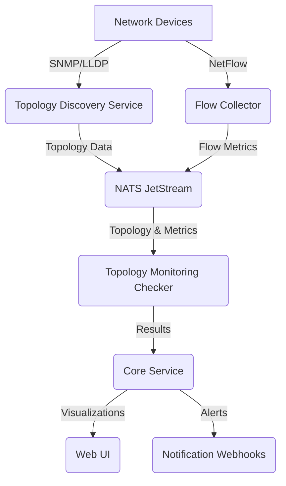

# Product Requirements Document (PRD): Topology-Aware Monitoring for ServiceRadar

## 1. Overview

### 1.1 Purpose
This PRD outlines the requirements for a new Topology-Aware Monitoring feature in ServiceRadar, an open-source network
monitoring tool. The feature aims to enhance ServiceRadar's ability to monitor complex network environments, 
particularly data center CLOS fabrics, by providing dynamic discovery and monitoring of network topologies. 
This will enable advanced use cases such as Equal-Cost Multi-Path (ECMP) monitoring, backbone and transit 
path analysis, and error detection across interconnected devices, without relying on integrations with external 
tools. All functionality will be built net-new or leverage existing open-source libraries where appropriate.

### 1.2 Background
ServiceRadar currently supports network performance monitoring (via rperf), SNMP-based device monitoring, and custom checkers for application and host metrics. However, users have expressed the need for:
- Dynamic Topology Discovery: Automatically identifying network devices, interfaces, and connections (e.g., leaf-spine links in a CLOS fabric).
- ECMP Monitoring: Detecting errors (e.g., packet loss, latency) and imbalances across equal-cost paths.
- Backbone and Transit Path Monitoring: Tracking performance and health of core internal links and external connections.
- Topology-Aware Insights: Correlating monitoring data with network topology to pinpoint issues (e.g., congested links, failed interfaces).
- NetFlow Support: Analyzing traffic patterns for traffic engineering (TE) and transit optimization, without external dependencies.

The Topology-Aware Monitoring feature will address these needs by introducing a new module that discovers and models network topologies, monitors topology-specific metrics, and visualizes results in ServiceRadar's Web UI, enhancing its value for data center operators and network engineers.

### 1.3 Goals
- Enable ServiceRadar to automatically discover and model network topologies, focusing on CLOS fabrics.
- Provide comprehensive monitoring of ECMP paths, backbone links, and transit connections with topology context.
- Support traffic engineering through flow-based analysis (NetFlow-like) without external tool integrations.
- Deliver actionable insights through topology visualizations and correlated alerts.
- Maintain ServiceRadar's lightweight, open-source ethos by building net-new or using established libraries (e.g., gRPC, NATS, SNMP).

### 1.4 Non-Goals
- Integration with third-party monitoring platforms (e.g., Zabbix, SolarWinds).
- Support for proprietary protocols or hardware-specific APIs not accessible via standard protocols (e.g., SNMP, LLDP).
- Comprehensive application-layer monitoring beyond basic health checks (covered by separate features).
- Real-time packet capture or deep packet inspection (out of scope for this feature).

## 2. User Personas

- **Network Engineer**: Responsible for designing and maintaining data center networks. Needs visibility into ECMP paths, link errors, and traffic patterns to optimize performance.
- **Data Center Operator**: Manages infrastructure uptime and reliability. Requires topology-aware alerts to quickly identify and resolve issues in CLOS fabrics.
- **SRE (Site Reliability Engineer)**: Focuses on service availability. Wants to correlate network issues with application performance using topology context.
- **IT Manager**: Oversees network operations. Seeks high-level dashboards to understand network health and plan capacity upgrades.

## 3. Requirements

### 3.1 Functional Requirements

#### 3.1.1 Topology Discovery
- Dynamic Discovery: Automatically discover network devices, interfaces, and connections using standard protocols (e.g., LLDP, CDP, SNMP).
- CLOS Fabric Support: Model multi-stage CLOS topologies (leaf-spine architecture), identifying roles (e.g., leaf, spine) and interconnections.
- Routing Table Awareness: Extract ECMP paths and next-hops from routing tables (via SNMP or CLI parsing) to map traffic flows.
- Periodic Updates: Refresh topology data at configurable intervals (e.g., every 5 minutes) to reflect network changes.
- Configuration Parsing: Parse device configurations (e.g., show ip route, interface settings) to enrich topology data when APIs are unavailable.

#### 3.1.2 ECMP Monitoring
- Path Health Monitoring: Monitor each ECMP path for latency, packet loss, jitter, and errors (e.g., CRC, drops).
- Imbalance Detection: Identify uneven traffic distribution across ECMP paths based on flow metrics or interface counters.
- Error Correlation: Correlate errors (e.g., high packet loss) with specific topology elements (e.g., leaf-to-spine link).
- Alerting: Generate alerts for ECMP path issues, including thresholds for latency (>50ms), packet loss (>1%), or imbalances (>20% deviation).

#### 3.1.3 Backbone and Transit Path Monitoring
- Backbone Monitoring: Track performance metrics (latency, throughput, errors) for core internal links in the CLOS fabric or between data centers.
- Transit Monitoring: Monitor external connections (e.g., ISP peering points) for reachability, BGP session stability, and performance.
- Path Tracing: Provide visibility into end-to-end paths (e.g., leaf-to-leaf, edge-to-ISP) using topology data.
- Topology Context: Associate path metrics with specific devices and interfaces in the topology.

#### 3.1.4 Flow-Based Analysis
- NetFlow-Like Collection: Implement a lightweight flow collector to capture traffic data (e.g., source/destination IPs, ports, bytes) from devices supporting NetFlow v5/v9 or IPFIX.
- Traffic Engineering: Analyze flow data to optimize ECMP and backbone link utilization, supporting decisions to shift traffic (e.g., from transit to peering).
- Transit Analysis: Quantify transit link usage to guide migration strategies, identifying high-traffic destinations.
- Topology Mapping: Correlate flows with topology elements (e.g., flows traversing specific spine switches).

#### 3.1.5 Visualization and Dashboards
- Topology Map: Display an interactive topology map in the Web UI, showing devices, links, and real-time health (e.g., green for healthy, red for errors).
- ECMP Dashboard: Visualize ECMP path metrics (e.g., latency, loss) with drill-down to specific paths.
- Path Analysis View: Show backbone and transit path performance, highlighting bottlenecks or failures.
- Flow Insights: Present flow data summaries (e.g., top talkers, path utilization) tied to topology elements.
- Alert Dashboard: Aggregate topology-aware alerts with context (e.g., "Spine1 interface down affecting ECMP path").

#### 3.1.6 Alerting and Notifications
- Topology-Aware Alerts: Generate alerts tied to specific topology elements (e.g., "Leaf2-Spine1 link high latency").
- Configurable Thresholds: Allow users to set thresholds for metrics (e.g., packet loss, flow imbalances).
- Notification Integration: Support existing ServiceRadar webhooks (e.g., Discord) for topology alerts.
- Alert Suppression: Suppress redundant alerts during topology changes (e.g., planned maintenance).

#### 3.1.7 Configuration and Management
- User Configuration: Allow users to define topology discovery parameters (e.g., SNMP communities, IP ranges) via topology.json.
- Role-Based Access: Restrict topology views and configurations to authorized users (e.g., Network Engineers vs. IT Managers).
- Scalability: Support topologies with up to 1,000 devices and 10,000 interfaces without performance degradation.
- Extensibility: Enable custom topology metrics via ServiceRadar's checker framework.

### 3.2 Non-Functional Requirements

#### Performance
- Topology discovery completes within 60 seconds for a 1,000-device network.
- Real-time metrics update every 30 seconds (configurable).
- Flow analysis processes 10,000 flows per second on standard hardware (e.g., 16-core CPU, 32GB RAM).

#### Reliability
- Handle device failures gracefully (e.g., mark unreachable devices as "unknown").
- Ensure 99.9% uptime for topology monitoring services.

#### Security
- Secure all topology data with mTLS (consistent with ServiceRadar's security model).
- Encrypt sensitive configuration data (e.g., SNMP credentials) at rest.
- Restrict topology access based on user roles.

#### Compatibility
- Support common network devices (e.g., Cisco, Arista, Juniper) via SNMP v2c/v3.
- Run on Debian/Ubuntu and RHEL/Oracle Linux, consistent with ServiceRadar.

#### Usability
- Provide intuitive Web UI controls for topology navigation (e.g., zoom, filter).
- Include CLI tools for debugging topology discovery (serviceradar-topology debug).

#### Extensibility
- Allow developers to extend topology metrics using ServiceRadar's checker API.
- Support future protocols (e.g., gNMI) via modular discovery plugins.

### 3.3 Out-of-Scope
- Monitoring non-network devices (e.g., servers) beyond basic health checks.
- Advanced application performance monitoring (e.g., tracing, log analysis).
- Hardware-specific telemetry requiring proprietary APIs.
- Automated remediation (e.g., rerouting traffic), though alerts can inform manual actions.

## 4. User Stories

- As a Network Engineer, I want to see a real-time topology map of my CLOS fabric, so I can quickly identify failed links or devices.
- As a Data Center Operator, I want alerts when an ECMP path has high packet loss, with details on the affected leaf-spine link, so I can troubleshoot efficiently.
- As an SRE, I want to correlate application latency with backbone path issues, so I can pinpoint network-related outages.
- As a Network Engineer, I want to analyze flow data across ECMP paths, so I can balance traffic for optimal performance.
- As an IT Manager, I want a dashboard showing transit link usage, so I can plan migration to direct peering.
- As a Network Engineer, I want topology discovery to update automatically, so I don't need to manually configure device connections.
- As a Data Center Operator, I want to filter topology views by device role (e.g., spine only), so I can focus on critical components.

## 5. Success Metrics

- Adoption: 80% of ServiceRadar users with CLOS fabrics enable Topology-Aware Monitoring within 6 months of release.
- Performance: Topology discovery latency <60 seconds for 1,000 devices in 95% of test cases.
- Reliability: <1% false positives in ECMP path alerts during beta testing.
- User Satisfaction: Achieve a Net Promoter Score (NPS) of +50 from beta users.
- Alert Effectiveness: 90% of topology-related alerts lead to actionable outcomes (e.g., issue resolution) in customer feedback.
- Flow Analysis: Support traffic engineering decisions in 75% of surveyed use cases (e.g., reduced transit costs).

## 6. High-Level Architecture

### 6.1 Components

#### Topology Discovery Service
- Runs as a new systemd service (serviceradar-topology).
- Uses SNMP, LLDP, and configuration parsing to build topology models.
- Stores topology data in ServiceRadar's KV store (serviceradar-kv).

#### Topology Monitoring Checker
- Extends ServiceRadar's checker framework.
- Collects ECMP, backbone, and transit metrics tied to topology elements.
- Supports flow-based analysis via a NetFlow-like collector.

#### Flow Collector
- Lightweight daemon to process NetFlow v5/v9 or IPFIX data.
- Integrates with topology data to map flows to paths.

#### Web UI Enhancements
- Adds topology map, ECMP dashboards, and flow visualizations.
- Leverages existing Next.js framework for rendering.

#### Alerting Module
- Extends core alerting to include topology context.
- Uses existing webhook infrastructure for notifications.

### 6.2 Data Flow



### 6.3 Libraries
- SNMP: gosnmp for device queries.
- LLDP Parsing: Custom library or gopacket for protocol decoding.
- NetFlow: go-flows or similar for flow processing.
- Visualization: vis.js or d3.js for topology maps in Next.js.
- gRPC/NATS: Reuse ServiceRadar's existing stack for communication.

## 7. Risks and Mitigations

- Risk: Topology discovery fails for complex networks.
  - Mitigation: Support fallback to manual configuration; test with diverse topologies (e.g., Cisco, Arista).
- Risk: Flow collector performance impacts system resources.
  - Mitigation: Implement sampling and optimize for 10,000 flows/second; provide configuration to disable flow collection.
- Risk: Users find topology UI confusing.
  - Mitigation: Conduct usability testing during beta; include tooltips and documentation.
- Risk: Security vulnerabilities in topology data handling.
  - Mitigation: Enforce mTLS and role-based access; audit code for OWASP vulnerabilities.
- Risk: Inaccurate ECMP path detection.
  - Mitigation: Validate with real-world CLOS fabrics; support user overrides for path configurations.

## 8. Timeline and Milestones

### Q2 2025
- Requirements finalization and architecture design.
- Prototype topology discovery service.

### Q3 2025
- Develop topology monitoring checker and flow collector.
- Implement basic Web UI visualizations.

### Q4 2025
- Beta release with ECMP and backbone monitoring.
- User testing and feedback collection.

### Q1 2026
- Full release with transit monitoring and flow analysis.
- Documentation and community outreach.

## 9. Dependencies

### Internal
- ServiceRadar's existing KV store, checker framework, and Web UI.
- mTLS security infrastructure for topology data.

### External
- Open-source libraries (e.g., gosnmp, vis.js) under permissive licenses (MIT, Apache 2.0).
- Community contributions for testing diverse network environments.

## 10. Open Questions

- What is the maximum topology size (devices/interfaces) to support in v1?
- Should flow collection support sFlow alongside NetFlow/IPFIX?
- How granular should topology role assignments be (e.g., leaf vs. super-spine)?
- What are the preferred visualization formats for flow data (e.g., heatmaps, graphs)?

## 11. Appendix

### 11.1 Glossary
- CLOS Fabric: A multi-stage, non-blocking network topology used in data centers.
- ECMP: Equal-Cost Multi-Path routing for load balancing across multiple paths.
- NetFlow: A protocol for collecting IP traffic information.
- Traffic Engineering: Optimizing network traffic distribution for performance and cost.

### 11.2 References
- ServiceRadar Documentation: rperf-monitoring.md, configuration.md, sync.md.
- User Feedback: Requirements for ECMP, backbone/transit, and NetFlow use cases.

### 11.3 Configuration Examples

#### Topology Discovery Configuration

```json
{
  "topology": {
    "discovery": {
      "method": ["lldp", "snmp", "config_parse"],
      "interval": "5m",
      "snmp": {
        "communities": ["public", "serviceradar"],
        "version": "v2c",
        "retries": 3,
        "timeout": "2s"
      },
      "ip_ranges": [
        "10.0.0.0/8",
        "192.168.0.0/16"
      ]
    },
    "roles": {
      "detect_method": "auto",
      "custom_rules": {
        "spine": "hostname matches 'spine*'",
        "leaf": "hostname matches 'leaf*'"
      }
    }
  }
}
```

#### Flow Collector Configuration

```json
{
  "flow_collector": {
    "listen_addr": ":9995",
    "protocols": ["netflow_v9", "ipfix"],
    "sampling_rate": 1000,
    "max_flows_per_sec": 10000,
    "storage": {
      "type": "clickhouse",
      "retention": "14d",
      "batch_size": 5000
    }
  }
}
```

### 11.4 Example API Endpoints

#### Topology API

```
GET /api/topology/devices - List all devices in the topology
GET /api/topology/devices/{id} - Get details for a specific device
GET /api/topology/links - List all links in the topology
GET /api/topology/paths?source={id}&target={id} - Get all paths between source and target
GET /api/topology/ecmp?source={id}&target={id} - Get ECMP paths between source and target
```

#### Flow API

```
GET /api/flows/top-talkers?timeframe=1h&limit=10 - Get top traffic sources
GET /api/flows/path-utilization?path_id={id}&timeframe=24h - Get utilization for a specific path
GET /api/flows/ecmp-balance?source={id}&target={id} - Get ECMP balance metrics
```
