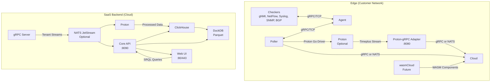

# Product Requirements Document: ServiceRadar Real-Time Monitoring with NATS JetStream, Timeplus Proton, and gRPC

## 1. Executive Summary

ServiceRadar is a distributed network monitoring system optimized for constrained environments, delivering real-time monitoring and cloud-based alerting for network engineering, IoT, WAN, cybersecurity, and OT audiences. This PRD outlines an enhanced architecture integrating Timeplus Proton for real-time stream processing of gNMI, NetFlow, syslog, SNMP traps, and BGP data (via OpenBMP replacement). It relies on gRPC for local and edge-to-cloud communication, with optional NATS JetStream integration for scalable, multi-tenant message brokering if needed.

The solution enhances SRQL (ServiceRadar Query Language) with streaming constructs and uses a Proton-gRPC Adapter to bridge Proton's streams to the cloud. It enforces a one-way data flow (edge to cloud), leverages ClickHouse for historical storage, and ensures zero-trust security with SPIFFE/SPIRE mTLS and JWT RBAC. Future integration with wasmCloud, a CNCF Incubating project built on Wasmtime, will enable automatic upgrades, flexible edge deployments, and customer-defined WASM components. This positions ServiceRadar as a competitive NMS, blending SolarWinds' enterprise features with Nagios' lightweight, open-source ethos.

## 2. Objectives

- Enable real-time stream processing for gNMI, NetFlow, syslog, SNMP traps, and BGP using Proton.
- Use gRPC for local (TCP) and edge-to-cloud communication, with optional NATS JetStream for enhanced scalability.
- Enhance SRQL for streaming queries with time windows, aggregations, and JOINs.
- Maintain a lightweight edge using Proton or future wasmCloud components.
- Ensure one-way data flow (no cloud-to-edge communication).
- Provide zero-trust security with SPIFFE/SPIRE mTLS and JWT RBAC.
- Support historical analytics via ClickHouse and Parquet (DuckDB).
- Plan for wasmCloud to enable automatic upgrades, distributed orchestration, and customer extensibility.
- Build a scalable SaaS for multi-tenant enterprise deployments.
- Differentiate from SolarWinds (cost, flexibility) and Nagios (real-time, usability).

## 3. Target Audience

- **Network Engineers**: Need real-time gNMI/BGP analytics (e.g., latency, route flaps) and SNMP trap correlation.
- **IoT/OT Teams**: Require lightweight edge processing for telemetry and anomaly detection.
- **Cybersecurity Teams**: Demand real-time threat detection (e.g., BGP hijacks, syslog attacks).
- **WAN Operators**: Seek traffic optimization (e.g., NetFlow, ECMP) and topology-aware monitoring.
- **SaaS Customers**: Expect secure, isolated data handling.

## 4. Current State

### Architecture (architecture.md, service-port-map.md):
- **Agent**: Collects data via checkers (SNMP, rperf, Dusk), gRPC (:50051).
- **Poller**: Queries agents, reports to core (:50053, gRPC).
- **Core Service**: Processes reports, API (:8090, :50052), alerting.
- **Web UI**: Next.js (:3000, Nginx :80/443), API key-secured.
- **KV Store**: NATS JetStream (:4222), mTLS-secured.
- **Sync Service**: Integrates NetBox/Armis (:50058).

### Security (tls-security.md, auth-configuration.md):
- mTLS with SPIFFE/SPIRE, JWT-based UI authentication (admin, operator, readonly).
- Planned one-way gRPC tunnels.

### Data Sources (intro.md, rperf-monitoring.md):
- SNMP, ICMP, rperf, sysinfo; planned: gNMI, NetFlow, syslog, SNMP traps, BGP.

### SRQL (pkg/srql):
- ANTLR-based DSL, supports SHOW/FIND/COUNT for devices, flows, traps, logs, connections.
- Translates to ClickHouse/ArangoDB, lacks streaming support (e.g., WINDOW, HAVING).

### Limitations:
- No edge stream processing for gNMI/BGP.
- SRQL lacks streaming constructs.
- gRPC requires open ports, complicating far-reaching networks.
- Limited tenant isolation in SaaS.
- NATS JetStream's BUSL license raises concerns.

## 5. Requirements

### 5.1 Functional Requirements

#### gRPC-Based Communication:
- Use gRPC over TCP for local checker-to-agent and agent-to-poller communication, preserving the pull model.
- Use gRPC over TLS for edge-to-cloud communication (poller-to-core, Proton-to-core), optionally tunneling through a single port (:443).
- Optionally integrate NATS JetStream for edge-to-cloud communication if gRPC port requirements are restrictive, using tenant-specific subjects.
- Define gRPC proto interfaces for checkers, Proton, and core, with potential custom schema implementation for type safety (inspired by bindgen).

Example Proto (checker.proto):
```proto
syntax = "proto3";

message CheckerResult {
  string device = 1;
  string metric = 2;
  float value = 3;
  google.protobuf.Timestamp timestamp = 4;
}

service Checker {
  rpc GetStatus (google.protobuf.Empty) returns (CheckerResult);
  rpc Publish (PublishRequest) returns (google.protobuf.Empty);
}

message PublishRequest {
  string subject = 1;
  CheckerResult data = 2;
}
```

Example gRPC Call (Rust):
```rust
use tonic::Request;
use checker::{CheckerClient, PublishRequest, CheckerResult};

async fn send_to_core(client: &mut CheckerClient<tonic::transport::Channel>, tenant_id: &str, data: CheckerResult) -> Result<(), tonic::Status> {
  let subject = format!("serviceradar.{}.checker.results", tenant_id);
  client.publish(Request::new(PublishRequest { subject, data })).await?;
  Ok(())
}
```

#### Edge Processing with Proton:
- Deploy Proton (~500MB, optional) on agents for gNMI, NetFlow, syslog, SNMP traps, BGP.
- Ingest data via Proton Go driver (github.com/timeplus-io/proton-go-driver).
- Support streaming SQL with tumbling windows, materialized views, and JOINs.
- Push results to Proton-gRPC Adapter via Timeplus external stream.

Example:
```sql
CREATE STREAM gnmi_stream (
  timestamp DateTime,
  device String,
  metric String,
  value Float32
) SETTINGS type='grpc';

CREATE MATERIALIZED VIEW gnmi_anomalies AS
SELECT window_start, device, metric, avg(value) AS avg_value
FROM tumble(gnmi_stream, 1m, watermark=10s)
WHERE metric = 'latency'
GROUP BY window_start, device, metric
HAVING avg_value > 100;

CREATE EXTERNAL STREAM cloud_sink
SETTINGS type='timeplus', hosts='localhost:8080', stream='gnmi_anomalies';

INSERT INTO cloud_sink
SELECT window_start, device, metric, avg_value
FROM gnmi_anomalies;
```

#### Proton-gRPC Adapter:
- Develop a lightweight (~5MB) Rust service to proxy Timeplus external streams to gRPC or NATS JetStream.
- Listen on localhost:8080 for Timeplus streams.
- Translate stream data to gRPC calls or NATS messages, using tenant-specific subjects.

Example (Rust Pseudocode):
```rust
use tonic::{Request, Response, Status};
use timeplus::external_stream_server::{ExternalStream, ExternalStreamServer};
use checker::{CheckerClient, PublishRequest};

struct ProtonAdapter {
  grpc_client: CheckerClient<tonic::transport::Channel>,
  tenant_id: String
}

#[tonic::async_trait]
impl ExternalStream for ProtonAdapter {
  async fn stream_data(&self, request: Request<tonic::Streaming<Data>>) -> Result<Response<()>, Status> {
    let mut stream = request.into_inner();
    while let Some(data) = stream.message().await? {
      let subject = format!("serviceradar.{}.proton.gnmi", self.tenant_id);
      self.grpc_client.publish(Request::new(PublishRequest { subject, data: data.payload.into() })).await?;
    }
    Ok(Response::new(()))
  }
}
```

#### NATS JetStream (Optional, Cloud-Only):
- Deploy a multi-tenant NATS JetStream cluster in the cloud (AWS EC2) for edge-to-cloud communication and persistence if gRPC is insufficient.
- Use NATS accounts for tenant isolation (e.g., serviceradar.pepsico.*).
- Support store-and-forward for reliable data delivery.

Example Cloud NATS Config:
```
listen: 0.0.0.0:4222
jetstream {
  store_dir: /var/lib/nats/jetstream
  max_memory_store: 8G
  max_file_store: 100G
}
accounts {
  pepsico {
    users: [{user: pepsico_user, password: "<secret>"}]
    jetstream: enabled
    exports: [{stream: "serviceradar.pepsico.>"}]
  }
}
cluster {
  name: "cloud-cluster"
  listen: 0.0.0.0:6222
  routes: ["nats://cloud-node1:6222", "nats://cloud-node2:6222", "nats://cloud-node3:6222"]
}
```

#### SRQL Enhancements:
- Add WINDOW <duration> [TUMBLE|HOP|SESSION], HAVING, STREAM, and JOIN clauses.
- Translate to Proton SQL (real-time) or ClickHouse SQL (historical).

Example:
```
SRQL: STREAM flows JOIN logs ON src_ip = device WHERE logs.message CONTAINS 'blocked' GROUP BY flows.src_ip WINDOW 1m HAVING port_count > 50

Proton SQL: SELECT n.window_start, n.src_ip, count(DISTINCT n.dst_port) AS port_count, any(s.message)
            FROM tumble(netflow_stream, 1m, watermark=5s) n
            JOIN syslog_stream s
            ON n.src_ip = s.device AND s.timestamp >= n.window_start AND s.timestamp < n.window_start + INTERVAL '1 minute'
            WHERE s.message LIKE '%blocked%'
            GROUP BY n.window_start, n.src_ip
            HAVING port_count > 50;
```

#### SaaS Backend:
- **gRPC Server**: Receive edge data, write to NATS JetStream (if used) or ClickHouse.
- **NATS JetStream (Optional)**: Cloud-hosted, multi-tenant message broker and KV store.
- **Proton (Cloud)**: Process streams for cross-customer queries.
- **ClickHouse**: Historical storage (90-day retention).
- **DuckDB**: Parquet archival.
- **Core API**: HTTP (:8090), SRQL translation.
- **Web UI**: Next.js (:3000, Nginx :80/443).

#### One-Way Data Flow:
- Edge agents initiate gRPC calls to cloud, no cloud-to-edge communication.

Example gRPC Call:
```rust
client.publish(Request::new(PublishRequest { subject: "serviceradar.pepsico.checker.results".into(), data })).await?;
```

#### Tenant Isolation:
- NATS JetStream streams (if used) and ClickHouse tables segregated by tenant ID (e.g., customer123_gnmi).
- gRPC services scoped to tenant-specific endpoints or subjects.

#### Data Sources:
- Support gNMI, NetFlow, syslog, SNMP traps, BGP (OpenBMP).
- Ingest via gRPC locally, forward to cloud via gRPC or NATS JetStream.

Example (BGP):
```sql
CREATE STREAM bgp_updates (
  timestamp DateTime,
  peer String,
  prefix String,
  action String
) SETTINGS type='grpc';
```

#### Historical Storage:
- ClickHouse for 90-day retention, direct writes from gRPC server.
- Parquet via DuckDB for archival.
- NATS JetStream (if used) for recent data and real-time query support.

Example:
```sql
CREATE EXTERNAL TABLE ch_bgp_flaps
SETTINGS type='clickhouse', address='clickhouse:9000', table='bgp_flaps';

INSERT INTO ch_bgp_flaps
SELECT window_start, prefix, count(*) AS flap_count
FROM tumble(bgp_updates, 5m)
GROUP BY window_start, prefix
HAVING flap_count > 10;
```

#### Use Cases:
- **gNMI Aggregation**: Aggregate 1-second metrics (STREAM devices WHERE metric = 'latency' GROUP BY device, metric WINDOW 1m HAVING avg_value > 100).
- **Interface Utilization**: Monitor usage (>80%) (STREAM gnmi WHERE metric = 'interface_utilization' AND value > 80 GROUP BY device, interface WINDOW 1m).
- **NetFlow Traffic Analysis**: Top applications (STREAM netflow WHERE bytes > 0 GROUP BY application WINDOW 5m ORDER BY sum(bytes) DESC LIMIT 10).
- **Syslog Threat Detection**: Detect 5+ failed SSH logins (STREAM logs WHERE message CONTAINS 'Failed password for root' GROUP BY device WINDOW 5m HAVING login_attempts >= 5).
- **NetFlow/Syslog Correlation**: Detect port scans with firewall blocks (STREAM flows JOIN logs ON src_ip = device WHERE logs.message CONTAINS 'blocked' GROUP BY flows.src_ip WINDOW 1m HAVING port_count > 50).
- **BGP Flap Detection**: Detect >10 route flaps (STREAM flows WHERE action IN ('announce', 'withdraw') GROUP BY prefix WINDOW 5m HAVING flap_count > 10).
- **BGP Hijack Detection**: Identify unauthorized prefixes (STREAM flows WHERE action = 'announce' AND prefix NOT IN (SELECT prefix FROM trusted_prefixes) WINDOW 1m).
- **BGP Misconfiguration**: Flag private ASNs (STREAM flows WHERE action = 'announce' AND as_number BETWEEN 64512 AND 65535 WINDOW 1m).
- **ECMP Imbalance**: Detect unequal traffic (STREAM flows JOIN netflow ON next_hop = next_hop WHERE flows.action = 'announce' GROUP BY flows.prefix, flows.next_hop WINDOW 5m HAVING max(total_bytes) / min(total_bytes) > 2).
- **Topology-Aware Monitoring**: Correlate BGP peer states (STREAM flows JOIN gnmi ON peer = device WHERE flows.state = 'down' AND gnmi.metric = 'link_status' AND gnmi.value = 0 WINDOW 1m).

### 5.2 Non-Functional Requirements

#### Performance:
- Process 1M gNMI events/sec on edge (1 vCPU, 0.5GB RAM).
- <1s SRQL query latency.
- Support 10,000 nodes/customer.

#### Scalability:
- Multi-tenant NATS JetStream (if used) and ClickHouse for 1,000+ customers.
- Horizontal scaling for Proton, gRPC servers, core API.

#### Reliability:
- 99.9% SaaS uptime.
- Buffer edge data (Proton WAL, gRPC retry).

#### Security:
- SPIFFE/SPIRE mTLS for gRPC, Proton, and core API.
- JWT-based RBAC (admin, operator, readonly).
- One-way data flow.
- Tenant isolation via gRPC endpoints or NATS JetStream accounts and ClickHouse tables.

#### Usability:
- 90% SRQL queries without support.
- Responsive UI on mobile/desktop.

#### Compatibility:
- Debian/Ubuntu, RHEL/Oracle Linux.
- Preserve local pull model with gRPC.

## 6. Architecture

### 6.1 Edge (Customer Network)

#### Components:
- **Checkers**: Collect gNMI, NetFlow, syslog, SNMP traps, BGP via gRPC over TCP.
- **Agent**: Responds to poller queries, manages checkers via gRPC over TCP.
- **Poller**: Polls agents via gRPC over TCP, forwards to cloud via gRPC or NATS JetStream.
- **Proton (optional)**: Processes streams, stores in materialized views.
- **Proton-gRPC Adapter**: Proxies Timeplus streams to gRPC or NATS JetStream (~5MB).
- **Future wasmCloud**: Runs WASM components for customer logic and upgrades.

#### Installation:
```bash
curl -LO https://install.timeplus.com/oss -O serviceradar-agent.deb
sudo dpkg -i serviceradar-agent.deb
sudo ./install-oss.sh
```

#### Resources:
- ~100MB without Proton (checkers, agent, poller, adapter).
- ~600MB with Proton (500MB Proton, 1 vCPU, 0.5GB RAM).
- wasmCloud: ~MBs for components, minimal runtime overhead.

#### Data Flow:
Checkers ↔ Agent (gRPC/TCP) ↔ Poller (gRPC/TCP) → Proton → Adapter (Timeplus stream) → Cloud (gRPC or NATS JetStream).

#### Security:
mTLS (SPIFFE/SPIRE), no cloud-to-edge connections.

### 6.2 SaaS Backend (Cloud)

#### Components:
- **gRPC Server**: Receives edge data, writes to NATS JetStream (if used) or ClickHouse.
- **NATS JetStream (Optional)**: Multi-tenant, cloud-hosted message broker and KV store.
- **Proton**: Processes streams for cross-customer queries.
- **ClickHouse**: Historical storage.
- **DuckDB**: Parquet archival.
- **Core API**: HTTP (:8090), SRQL translation.
- **Web UI**: Next.js (:3000, Nginx :80/443).

#### Data Flow:
gRPC Server → NATS JetStream (if used) → Proton → ClickHouse → Core API → Web UI.

#### Security:
mTLS, JWT RBAC, NATS JetStream account isolation (if used), ClickHouse table isolation.

### 6.3 Diagram



## 7. Enhanced SRQL Syntax

| Clause | Syntax | Description | Example |
|--------|--------|-------------|---------|
| STREAM | STREAM \<entity\> | Real-time query | STREAM logs ... |
| FROM | FROM \<entity\> | Entity (devices, flows, logs, traps) | FROM netflow |
| WHERE | WHERE \<condition\> | Filters (e.g., CONTAINS, IN) | WHERE message CONTAINS 'Failed password' |
| JOIN | JOIN \<entity\> ON \<condition\> | Correlates streams | JOIN logs ON src_ip = device |
| GROUP BY | GROUP BY \<field\>[, \<field\>] | Aggregates | GROUP BY device, metric |
| WINDOW | WINDOW \<duration\> [TUMBLE\|HOP\|SESSION] | Time-based windows | WINDOW 5m TUMBLE |
| HAVING | HAVING \<aggregate_condition\> | Filters aggregates | HAVING login_attempts >= 5 |
| ORDER BY | ORDER BY \<field\> [ASC\|DESC] | Sorts | ORDER BY sum(bytes) DESC |
| LIMIT | LIMIT \<n\> | Limits rows | LIMIT 10 |

## 8. Security Data Flow Considerations

- **Unidirectional Communication**: Edge-to-cloud only, no cloud-initiated connections.
- **TLS/mTLS Encryption**: All communications use TLS 1.3 with SPIFFE/SPIRE mTLS.
- **Certificate Validation**: Certificates validated via SPIFFE/SPIRE for gRPC, Proton, and core API.
- **Tenant Isolation**:
  - NATS JetStream subjects (if used) and ClickHouse tables segregated by tenant ID (e.g., customer123_gnmi).
  - gRPC services scoped to tenant-specific endpoints.

- **Edge Security**:
  - gRPC over TCP with mTLS for checker-agent-poller communication.
  - Proton-gRPC Adapter communicates via localhost Timeplus stream.

- **Cloud Security**:
  - NATS JetStream account-level isolation (if used) for tenant-specific access.
  - ClickHouse table-level isolation.
  - DuckDB file-level encryption.
  - JWT-based UI authentication (admin, operator, readonly).

- **Auditing and Compliance**:
  - Log all gRPC and API access.
  - Track data lineage from edge to cloud.
  - Use cryptographic signatures for data integrity.
  - Configurable retention policies in ClickHouse/DuckDB.

## 9. User Experience

### Setup:
- Install agent:
  ```bash
  curl https://install.serviceradar.com/agent | sh
  ```
- Configure mTLS certs (SPIFFE/SPIRE) and gRPC/NATS credentials via UI/CLI.

### Operation:
- Checkers respond to agent polls (gRPC/TCP).
- Pollers pull data (gRPC/TCP), forward to cloud (gRPC or NATS JetStream).
- Proton processes streams, pushes via Adapter (gRPC or NATS JetStream).
- Ultra-constrained devices skip Proton (~100MB).

### Interaction:
- Log into web UI (JWT, admin/operator/readonly).
- Run SRQL queries (e.g., STREAM logs WHERE message CONTAINS 'Failed password' GROUP BY device WINDOW 5m HAVING login_attempts >= 5).
- View dashboards (gNMI latency, BGP hijacks, interface utilization).
- Configure alerts (e.g., "notify on 5 failed logins").
- Query historical trends (30-day NetFlow, 90-day BGP).

### Configuration:
- Enable/disable Proton via UI.
- Define SRQL alerts, dashboards.
- Manage mTLS certs, gRPC endpoints, NATS subjects (if used), RBAC roles.

## 10. Success Metrics

### Performance:
- 1M gNMI events/sec on edge.
- <1s SRQL query latency.
- 10,000 nodes/customer.

### Adoption:
- 80% customers enable Proton by Q2 2026.
- 50% adopt wasmCloud for custom logic by Q4 2026.
- 1,000 SaaS tenants by Q2 2027.

### Usability:
- 90% SRQL queries without support.
- 95% UI satisfaction.

### Security:
- Zero mTLS breaches.
- 100% tenant isolation compliance.

### Revenue:
- $10M ARR by Q2 2027.

## 11. Risks and Mitigations

| Risk | Mitigation |
|------|------------|
| gRPC port requirements in far-reaching networks | Use gRPC over single-port TLS tunnel (:443), or integrate NATS JetStream for WebSocket-based communication. |
| Proton's 500MB footprint too heavy | Optional Proton, fallback to checkers (~100MB) or wasmCloud components. |
| Proton-gRPC Adapter complexity | Develop lightweight adapter, test with simplified protocol. |
| gRPC scalability in multi-tenant SaaS | Optimize gRPC server performance, use NATS JetStream for message brokering if needed. |
| wasmCloud adoption complexity | Provide pre-built WASM components, UI-driven deployment tools. |

## 12. Implementation Plan

### Month 1: SRQL and gRPC Development (Jul 2025)
- Extend SRQL grammar with WINDOW, HAVING, STREAM, JOIN.
- Implement gRPC for checker-agent-poller communication over TCP.

### Month 2: Edge Prototype (Aug 2025)
- Deploy edge Proton, test gNMI/BGP ingestion via Proton Go driver.
- Develop Proton-gRPC Adapter, test gRPC or NATS JetStream integration.
- Secure with SPIFFE/SPIRE mTLS.

### Month 3-4: Edge Optimization (Sep–Oct 2025)
- Validate Proton on edge devices (IoT gateways, OT servers).
- Enhance UI for SRQL queries, dashboards, alerts.
- Test one-way data flow.

### Month 5-7: SaaS Rollout (Nov 2025–Jan 2026)
- Deploy cloud NATS JetStream (if needed), Proton, ClickHouse for multi-tenancy.
- Implement use cases (gNMI, NetFlow, syslog, BGP).
- Harden security with RBAC, NATS JetStream account isolation (if used), ClickHouse isolation.

### Month 8: Beta Launch (Feb 2026)
- Onboard 50 customers, gather feedback on SRQL, Proton, UI.

### Month 9-12: wasmCloud Prototype (Mar–Jun 2026)
- Deploy wasmCloud on edge agents, test WASM components for data enrichment.
- Integrate with lattice for automatic upgrades, observability (OpenTelemetry).

## 13. Future Considerations

### wasmCloud Integration:
- Deploy wasmCloud on edge agents to run WASM components for customer-defined logic (e.g., anonymizing NetFlow IPs, custom gNMI filters).
- Use hot-swappable providers for automatic upgrades (e.g., update syslog parsers without downtime).
- Leverage lattice networking (NATS-based) for distributed orchestration across edge and cloud, with load balancing and failover.
- Integrate with Kubernetes via wasmCloud-operator for hybrid deployments.
- Enable OpenTelemetry observability for WASM components, enhancing monitoring.
- Monitor WASI sockets proposal (https://github.com/WebAssembly/wasi-sockets) for raw socket support, enabling WASM-based checkers.

### Proton Enterprise:
- Explore advanced sinks (e.g., Slack, Redpanda Connect).

### AI/ML:
- Predictive anomaly detection for gNMI, BGP, syslog.

### Additional Sources:
- sFlow, IPFIX, custom protocols.

### Custom Schema Implementation:
- Explore custom bindgen-like schema for gRPC proto definitions to enforce type safety and modularity, if needed.

## 14. Appendix

### 14.1 SRQL Examples

#### gNMI Aggregation:
```
STREAM devices WHERE metric = 'latency' GROUP BY device, metric WINDOW 1m HAVING avg_value > 100
```

#### Interface Utilization:
```
STREAM gnmi WHERE metric = 'interface_utilization' AND value > 80 GROUP BY device, interface WINDOW 1m
```

#### NetFlow Traffic Analysis:
```
STREAM netflow WHERE bytes > 0 GROUP BY application WINDOW 5m ORDER BY sum(bytes) DESC LIMIT 10
```

#### Syslog Threat Detection:
```
STREAM logs WHERE message CONTAINS 'Failed password for root' GROUP BY device WINDOW 5m HAVING login_attempts >= 5
```

#### NetFlow/Syslog Correlation:
```
STREAM flows JOIN logs ON src_ip = device WHERE logs.message CONTAINS 'blocked' GROUP BY flows.src_ip WINDOW 1m HAVING port_count > 50
```

#### BGP Flap Detection:
```
STREAM flows WHERE action IN ('announce', 'withdraw') GROUP BY prefix WINDOW 5m HAVING flap_count > 10
```

### 14.2 Security Configuration

#### SPIFFE/SPIRE mTLS:
- Edge: /etc/serviceradar/certs/agent.pem, agent-key.pem.
- SaaS: /etc/serviceradar/certs/core.pem, core-key.pem.
- Proton: /etc/serviceradar/certs/proton.pem, proton-key.pem.
- wasmCloud: /etc/serviceradar/certs/wasmcloud.pem, wasmcloud-key.pem (future).

#### JWT RBAC:
- Roles: admin (full access), operator (configure alerts), readonly (view dashboards).
- Configured in /etc/serviceradar/core.json.

### 14.3 References

- Timeplus Proton: docs.timeplus.com
- gRPC: grpc.io
- NATS JetStream: nats.io
- SPIFFE/SPIRE: spiffe.io
- wasmCloud: wasmcloud.com
- WASI Sockets: github.com/WebAssembly/wasi-sockets