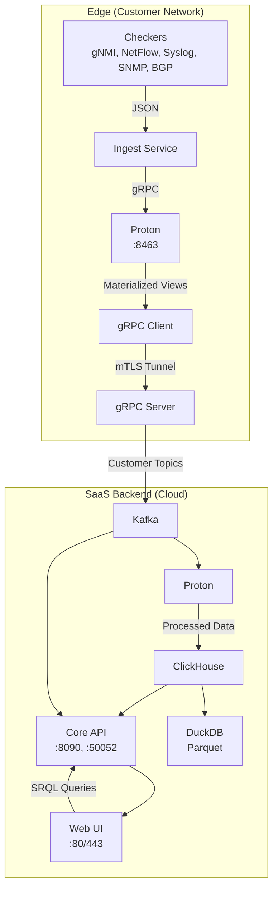

# ServiceRadar with Timeplus Proton Integration - PRD

## 1. Executive Summary

ServiceRadar is a distributed network monitoring system optimized for constrained environments, delivering real-time monitoring and cloud-based alerting. To empower network engineering, IoT, WAN, cybersecurity, and OT audiences, this PRD outlines the integration of Timeplus Proton, a lightweight streaming SQL engine, for real-time processing of gNMI, NetFlow, syslog, SNMP traps, and BGP data (via OpenBMP replacement). 

The solution enhances SRQL (ServiceRadar Query Language) with streaming capabilities, replaces NATS JetStream (which is changing to BUSL license) with a Kafka-free edge architecture, and uses gRPC for secure data ingestion. It enforces a one-way data flow (edge to cloud), leverages ClickHouse for historical storage, and ensures zero-trust security with SPIFFE/SPIRE mTLS.

This positions ServiceRadar as a competitive NMS, blending SolarWinds' enterprise features with Nagios' lightweight, open-source ethos.

## 2. Objectives

- **Real-Time Stream Processing**: Enable processing for high-volume telemetry (gNMI, BGP)
- **Enhanced SRQL**: Support streaming queries with time windows, aggregations, and JOINs
- **Lightweight Edge**: Maintain edge processing without Kafka, using Proton for local processing
- **One-Way Data Flow**: Ensure edge-to-cloud data transfer without cloud-initiated communication
- **Zero-Trust Security**: Use SPIFFE/SPIRE mTLS for all communications, aligning with existing security architecture
- **Historical Analytics**: Store processed data in ClickHouse for trend analysis and compliance, with Parquet/DuckDB for archival
- **Scalable SaaS**: Build a multi-tenant cloud backend for enterprise customers
- **Competitive Positioning**: Differentiate from SolarWinds (cost, flexibility) and Nagios (real-time, usability)

## 3. Target Audience

- **Network Engineers**: Need real-time gNMI/BGP analytics (e.g., latency, route flaps) and SNMP trap correlation
- **IoT/OT Teams**: Require lightweight edge processing for device telemetry and anomaly detection
- **Cybersecurity Teams**: Demand real-time threat detection (e.g., BGP hijacks, syslog attacks)
- **WAN Operators**: Seek traffic optimization (e.g., NetFlow, ECMP) and topology-aware monitoring

## 4. Current State

### Architecture (per architecture.md, service-port-map.md)
- **Agent**: Collects data via checkers (SNMP, rperf, Dusk), gRPC (:50051)
- **Poller**: Queries agents, reports to core (:50053)
- **Core Service**: Processes reports, API (:8090, :50052), alerting
- **Web UI**: Next.js (:3000, Nginx :80/443), API key-secured
- **KV Store**: NATS JetStream (:4222), mTLS-secured
- **Sync Service**: Integrates NetBox/Armis (:50058)

### Security (per tls-security.md, auth-configuration.md)
- mTLS with SPIFFE/SPIRE, JWT-based UI authentication (admin, operator, readonly)
- Planned one-way gRPC tunnels

### Data Sources (per intro.md, rperf-monitoring.md)
- SNMP, ICMP, rperf, sysinfo; planned: NetFlow, syslog, SNMP traps, BGP, gNMI

### SRQL (per pkg/srql)
- ANTLR-based DSL, supports SHOW/FIND/COUNT for devices, flows, traps, logs, connections
- Translates to ClickHouse/ArangoDB, lacks streaming support (e.g., time windows)

### Limitations
- NATS JetStream's BUSL license raises concerns
- No real-time streaming for gNMI/BGP
- SRQL lacks streaming constructs (WINDOW, HAVING)
- No edge processing or robust historical storage

## 5. Requirements

### 5.1 Functional Requirements

#### Edge Processing with Proton
- Deploy Proton (~500MB) optionally on agents for gNMI, NetFlow, syslog, SNMP traps, BGP
- Ingest via gRPC (:8463, mTLS-secured)
- Support streaming SQL with tumbling windows, materialized views, and JOINs
- Push results to SaaS via gRPC tunnel

Example:
```sql
CREATE STREAM gnmi_stream (
  timestamp DateTime,
  device String,
  metric String,
  value Float32
) SETTINGS type='grpc';

CREATE MATERIALIZED VIEW gnmi_anomalies AS
SELECT window_start, device, metric, avg(value) AS avg_value
FROM tumble(gnmi_stream, 1m, watermark=10s)
WHERE metric = 'latency'
GROUP BY window_start, device, metric
HAVING avg_value > 100;

CREATE EXTERNAL STREAM cloud_sink
SETTINGS type='grpc', address='saas.serviceradar.com:443';

INSERT INTO cloud_sink
SELECT window_start, device, metric, avg_value
FROM gnmi_anomalies;
```

#### SRQL Enhancements
- Add `WINDOW <duration> [TUMBLE|HOP|SESSION]`, `HAVING`, `STREAM` keywords
- Support JOINs for multi-stream correlation (e.g., NetFlow + syslog)
- Translate to Proton SQL (real-time) or ClickHouse SQL (historical)

Example Translation:
```
SRQL: STREAM logs WHERE message CONTAINS 'Failed password for root' GROUP BY device WINDOW 5m HAVING login_attempts >= 5

Proton SQL: 
SELECT window_start, device, count(*) AS login_attempts
FROM tumble(syslog_stream, 5m, watermark=5s)
WHERE message LIKE '%Failed password for root%'
GROUP BY window_start, device
HAVING login_attempts >= 5;
```

#### SaaS Backend
- **gRPC Server**: Receive edge data, write to Kafka/ClickHouse
- **Kafka**: Cloud-hosted (e.g., AWS MSK), multi-tenant, with topics per customer (e.g., customer123_gnmi)
- **Proton (Cloud)**: Process Kafka streams for cross-customer analytics or non-edge queries
- **ClickHouse**: Historical storage, analytical queries
- **DuckDB**: Parquet queries for offline analysis
- **Core API**: gRPC-based, translate SRQL, query Proton/ClickHouse
- **Web UI**: Next.js, display dashboards, accept SRQL queries

#### One-Way Data Flow
- Edge Proton pushes materialized view results to SaaS via gRPC (mTLS, SPIFFE/SPIRE)
- No cloud-to-edge communication

Example:
```sql
INSERT INTO cloud_sink
SELECT window_start, device, login_attempts
FROM ssh_alerts;
```

#### Data Sources
- Support gNMI, NetFlow, syslog, SNMP traps, and BGP (OpenBMP replacement)
- Ingest via gRPC, normalize to JSON by ingest service

Example (BGP):
```sql
CREATE STREAM bgp_updates (
  timestamp DateTime,
  peer String,
  prefix String,
  action String
) SETTINGS type='grpc';
```

#### Historical Storage
- ClickHouse for 90-day retention
- Parquet exports via DuckDB for archival

Example:
```sql
CREATE EXTERNAL TABLE ch_bgp_flaps
SETTINGS type='clickhouse', address='clickhouse:9000', table='bgp_flaps';

INSERT INTO ch_bgp_flaps
SELECT window_start, prefix, count(*) AS flap_count
FROM tumble(bgp_updates, 5m)
GROUP BY window_start, prefix
HAVING flap_count > 10;
```

#### Use Cases
- **gNMI Aggregation**: 
  ```
  STREAM devices WHERE metric = 'latency' GROUP BY device, metric WINDOW 1m HAVING avg_value > 100
  ```
- **Interface Utilization**: 
  ```
  STREAM gnmi WHERE metric = 'interface_utilization' AND value > 80 GROUP BY device, interface WINDOW 1m
  ```
- **NetFlow Traffic Analysis**: 
  ```
  STREAM netflow WHERE bytes > 0 GROUP BY application WINDOW 5m ORDER BY sum(bytes) DESC LIMIT 10
  ```
- **Syslog Threat Detection**: 
  ```
  STREAM logs WHERE message CONTAINS 'Failed password for root' GROUP BY device WINDOW 5m HAVING login_attempts >= 5
  ```
- **NetFlow/Syslog Correlation**: 
  ```
  STREAM flows JOIN logs ON src_ip = device WHERE logs.message CONTAINS 'blocked' GROUP BY flows.src_ip WINDOW 1m HAVING port_count > 50
  ```
- **BGP Flap Detection**: 
  ```
  STREAM flows WHERE action IN ('announce', 'withdraw') GROUP BY prefix WINDOW 5m HAVING flap_count > 10
  ```
- **BGP Hijack Detection**: 
  ```
  STREAM flows WHERE action = 'announce' AND prefix NOT IN (SELECT prefix FROM trusted_prefixes) WINDOW 1m
  ```
- **BGP Misconfiguration**: 
  ```
  STREAM flows WHERE action = 'announce' AND as_number BETWEEN 64512 AND 65535 WINDOW 1m
  ```
- **ECMP Imbalance**: 
  ```
  STREAM flows JOIN netflow ON next_hop = next_hop WHERE flows.action = 'announce' GROUP BY flows.prefix, flows.next_hop WINDOW 5m HAVING max(total_bytes) / min(total_bytes) > 2
  ```
- **Topology-Aware Monitoring**: 
  ```
  STREAM flows JOIN gnmi ON peer = device WHERE flows.state = 'down' AND gnmi.metric = 'link_status' AND gnmi.value = 0 WINDOW 1m
  ```

### 5.2 Non-Functional Requirements

#### Performance
- Process 1M gNMI events/sec on edge (1 vCPU, 0.5GB RAM)
- <1s SRQL query latency
- Support 10,000 nodes per customer

#### Scalability
- Multi-tenant Kafka and ClickHouse for 1,000+ customers
- Horizontal scaling for Proton and core API

#### Reliability
- 99.9% SaaS uptime
- Buffer edge data during network disruptions (Proton WAL, gRPC retry)

#### Security
- SPIFFE/SPIRE mTLS for all communications
- JWT-based RBAC in web UI (admin, operator, readonly)
- One-way data flow compliance
- Kafka ACLs for tenant isolation

#### Usability
- 90% SRQL queries without support
- Web UI responsive on mobile/desktop

#### Compatibility
- Support Debian/Ubuntu, RHEL/Oracle Linux
- Integrate with existing gRPC-based agent/poller architecture

## 6. Architecture

### 6.1 Edge (Customer Network)

#### Components
- **Checkers**: Collect gNMI, NetFlow, syslog, SNMP traps, BGP (OpenBMP)
- **Ingest Service**: Normalize to JSON, send to Proton via gRPC
- **Proton (optional)**: Process streams, store in materialized views, push to SaaS
- **gRPC Client**: Send data via mTLS-secured tunnel

#### Installation
```bash
curl -LO https://install.timeplus.com/oss -O serviceradar-agent.deb
sudo dpkg -i serviceradar-agent.deb
sudo ./install-oss.sh
```

#### Resources
- <100MB without Proton (ultra-constrained devices)
- ~500MB with Proton (1 vCPU, 0.5GB RAM, e.g., IoT gateways)

#### Data Flow
Checkers → Ingest → Proton (gRPC) → Materialized Views → gRPC Tunnel → SaaS

#### Security
mTLS with SPIFFE/SPIRE for gRPC ingestion and push, no inbound connections from cloud

### 6.2 SaaS Backend (Cloud)

#### Components
- **gRPC Server**: Receive edge data, write to Kafka/ClickHouse
- **Kafka**: Multi-tenant, cloud-hosted (e.g., AWS MSK)
- **Proton**: Process Kafka streams for cross-customer analytics
- **ClickHouse**: Historical storage, analytical queries
- **DuckDB**: Parquet queries for archival
- **Core API**: gRPC-based, translate SRQL, query Proton/ClickHouse
- **Web UI**: Next.js, display dashboards, accept SRQL queries

#### Data Flow
gRPC Server → Kafka → Proton → ClickHouse → Core API → Web UI

#### Security
mTLS for inter-service communication, JWT-based RBAC for UI/API access, Kafka ACLs for tenant isolation

### 6.3 Diagram


## 7. Enhanced SRQL Syntax

SRQL is extended to support streaming queries, aligning with Proton's capabilities. Below is the updated syntax:

| Clause | Syntax | Description | Example |
|--------|--------|-------------|---------|
| STREAM | STREAM \<entity\> | Indicates real-time query (optional) | STREAM logs ... |
| FROM | FROM \<entity\> | Specifies entity (devices, flows, logs, traps, connections) | FROM netflow |
| WHERE | WHERE \<condition\> | Filters data (e.g., equality, CONTAINS, IN) | WHERE message CONTAINS 'Failed password' |
| JOIN | JOIN \<entity\> ON \<condition\> | Correlates streams (time-based) | JOIN logs ON src_ip = device |
| GROUP BY | GROUP BY \<field\>[, \<field\>] | Aggregates data by fields | GROUP BY device, metric |
| WINDOW | WINDOW \<duration\> [TUMBLE\|HOP\|SESSION] | Time-based windows | WINDOW 5m |
| HAVING | HAVING \<aggregate_condition\> | Filters aggregated results | HAVING login_attempts >= 5 |
| ORDER BY | ORDER BY \<field\> [ASC\|DESC] | Sorts results | ORDER BY bytes DESC |
| LIMIT | LIMIT \<n\> | Limits result rows | LIMIT 10 |

## 8. User Experience

### Setup
- Install agent: `curl https://install.serviceradar.com/agent | sh`
- Configure mTLS certs (SPIFFE/SPIRE) and SaaS endpoint via UI or CLI

### Operation
- Agents collect data, process with Proton (optional), push to SaaS via gRPC
- Ultra-constrained devices skip Proton, send raw data
- No edge Kafka, minimal footprint

### Interaction
- Log into web UI (JWT-authenticated, roles: admin, operator, readonly)
- Enter SRQL queries (e.g., `STREAM flows WHERE action IN ('announce', 'withdraw') GROUP BY prefix WINDOW 5m HAVING flap_count > 10`)
- View real-time dashboards (e.g., gNMI latency, BGP hijacks, interface utilization)
- Configure alerts (e.g., "notify on 5 failed logins")
- Query historical trends (e.g., 30-day NetFlow, 90-day BGP flaps)

### Configuration
- Enable/disable edge Proton via UI
- Define SRQL-based alerts and dashboards
- Manage mTLS certs and RBAC roles

## 9. Success Metrics

- **Performance**:
  - 1M gNMI events/sec on edge
  - <1s SRQL query latency
  - Support 10,000 nodes/customer
- **Adoption**:
  - 80% of customers enable edge Proton for gNMI/BGP
  - 1,000 active SaaS tenants within 12 months
- **Usability**:
  - 90% SRQL queries executed without support
  - 95% customer satisfaction with UI
- **Security**:
  - Zero mTLS breaches
  - 100% RBAC compliance
- **Revenue**:
  - $10M ARR within 24 months via SaaS subscriptions

## 10. Risks and Mitigations

- **Risk**: Proton's 500MB binary too heavy for ultra-constrained devices.
  **Mitigation**: Optional Proton, fallback to lightweight checkers sending raw data.

- **Risk**: SRQL translation errors for streaming queries.
  **Mitigation**: Rigorous ANTLR parser testing, manual SQL fallback.

- **Risk**: Kafka scalability in multi-tenant SaaS.
  **Mitigation**: Use managed Kafka (e.g., Confluent Cloud), monitor topic performance.

- **Risk**: gRPC tunnel latency impacts real-time performance.
  **Mitigation**: Optimize retry logic, buffer data in Proton WAL.

## 11. Timeline

- **Month 1: SRQL Parser Development (Jul 2025)**
  - Extend SRQL grammar with WINDOW, HAVING, STREAM, JOIN
  - Implement Proton SQL translator

- **Month 2: Edge Prototype (Aug 2025)**
  - Deploy edge Proton, test gNMI/BGP ingestion via gRPC
  - Secure with SPIFFE/SPIRE mTLS

- **Month 3-4: Edge Optimization (Sep–Oct 2025)**
  - Validate Proton on edge devices (e.g., IoT gateways, OT servers)
  - Enhance UI for SRQL queries, dashboards, and alert configuration
  - Test one-way data flow compliance

- **Month 5-7: SaaS Rollout (Nov 2025–Jan 2026)**
  - Deploy cloud Kafka, Proton, ClickHouse for multi-tenancy
  - Implement use cases (gNMI, NetFlow, syslog, BGP)
  - Harden zero-trust model with RBAC and Kafka ACLs

- **Month 8: Beta Launch (Feb 2026)**
  - Onboard 50 early customers
  - Gather feedback on SRQL, Proton performance, and UI

## 12. Future Considerations

- **WASMCloud**: Customer-defined edge consumers for data enrichment/anonymization
- **Proton Enterprise**: Advanced sinks (e.g., Slack, Redpanda Connect)
- **AI/ML**: Predictive anomaly detection for gNMI, BGP, and syslog
- **Additional Sources**: sFlow, IPFIX, custom protocols

## 13. Appendix

### 13.1 SRQL Examples

- **gNMI Aggregation**:
  ```
  STREAM devices WHERE metric = 'latency' GROUP BY device, metric WINDOW 1m HAVING avg_value > 100
  ```

- **Interface Utilization**:
  ```
  STREAM gnmi WHERE metric = 'interface_utilization' AND value > 80 GROUP BY device, interface WINDOW 1m
  ```

- **NetFlow Traffic Analysis**:
  ```
  STREAM netflow WHERE bytes > 0 GROUP BY application WINDOW 5m ORDER BY sum(bytes) DESC LIMIT 10
  ```

- **Syslog Threat Detection**:
  ```
  STREAM logs WHERE message CONTAINS 'Failed password for root' GROUP BY device WINDOW 5m HAVING login_attempts >= 5
  ```

- **NetFlow/Syslog Correlation**:
  ```
  STREAM flows JOIN logs ON src_ip = device WHERE logs.message CONTAINS 'blocked' GROUP BY flows.src_ip WINDOW 1m HAVING port_count > 50
  ```

- **BGP Flap Detection**:
  ```
  STREAM flows WHERE action IN ('announce', 'withdraw') GROUP BY prefix WINDOW 5m HAVING flap_count > 10
  ```

- **BGP Hijack Detection**:
  ```
  STREAM flows WHERE action = 'announce' AND prefix NOT IN (SELECT prefix FROM trusted_prefixes) WINDOW 1m
  ```

### 13.2 Security Configuration

- **SPIFFE/SPIRE mTLS**:
  - Edge: `/etc/serviceradar/certs/agent.pem`, `agent-key.pem`
  - SaaS: `/etc/serviceradar/certs/core.pem`, `core-key.pem`
  - Proton: `/etc/serviceradar/certs/proton.pem`, `proton-key.pem`

- **JWT RBAC**:
  - Roles: admin (full access), operator (configure alerts), readonly (view dashboards)
  - Configured in `/etc/serviceradar/core.json`

### 13.3 References

- Timeplus Proton: [docs.timeplus.com](https://docs.timeplus.com)
- ServiceRadar Documentation: Provided Files
- SPIFFE/SPIRE: [spiffe.io](https://spiffe.io)
