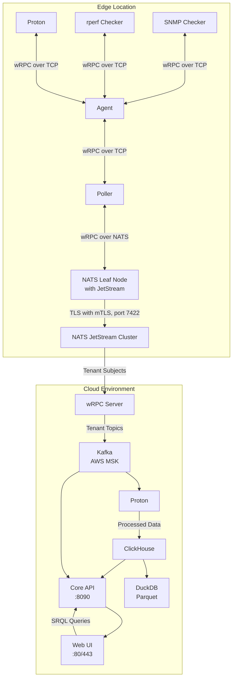

# ServiceRadar with Multi-Transport wRPC, NATS JetStream, and Timeplus Proton Integration

## 1. Executive Summary

ServiceRadar is a distributed network monitoring system optimized for constrained environments, delivering real-time monitoring and cloud-based alerting for network engineering, IoT, WAN, cybersecurity, and OT audiences. This document outlines a new architecture that integrates wRPC (WebAssembly Interface Types RPC) with multiple transport options, NATS JetStream with leaf nodes, and Timeplus Proton to enhance ServiceRadar's capabilities.

Key enhancements include:

- **Transport-Agnostic wRPC**: Leverages WebAssembly Interface Types (WIT) for structured communication with multiple transport options:
    - **TCP Transport**: For local component communication (checker-to-agent, agent-to-poller), maintaining the existing pull model
    - **NATS Transport**: For edge-to-cloud communication (poller-to-core), enabling tenant isolation and firewall traversal

- **NATS JetStream Leaf Nodes**: Provides local NATS instances at edge locations that connect to the cloud NATS cluster, enabling:
    - Local messaging even during cloud disconnections
    - Store-and-forward capabilities with local JetStream
    - Single account connection to the cloud cluster
    - Mirroring of streams between edge and cloud

- **Proton Stream Processing**: Processes telemetry at the edge with Timeplus Proton.

- **Enhanced SRQL**: Extends ServiceRadar Query Language (SRQL) with streaming constructs (e.g., time windows, JOINs).

- **Multi-Tenant SaaS**: Ensures strict data isolation (e.g., PepsiCo vs. Coca-Cola) using NATS accounts and Kafka topics.

- **Zero-Trust Security**: Uses SPIFFE/SPIRE mTLS for all communications, with one-way edge-to-cloud data flow.

- **Lightweight Edge**: Minimizes footprint (~111MB without Proton, ~611MB with Proton).

This positions ServiceRadar as a competitive Network Monitoring System (NMS), blending SolarWinds' enterprise features with Nagios' lightweight, open-source ethos.

## 2. Objectives

- **Transport-Agnostic wRPC**: Implement wRPC with multiple transport options (TCP, NATS) to maintain pull model locally while enabling better edge-to-cloud communication.

- **Real-Time Stream Processing**: Enable edge processing of gNMI, NetFlow, syslog, SNMP traps, and BGP using Proton.

- **NATS JetStream Messaging**: Handle edge-to-cloud wRPC calls with tenant isolation via NATS accounts.

- **Enhanced SRQL**: Support streaming queries with time windows, aggregations, and JOINs.

- **Lightweight Edge**: Maintain minimal footprint for constrained devices.

- **One-Way Data Flow**: Enforce edge-to-cloud communication without cloud-initiated connections.

- **Zero-Trust Security**: Use SPIFFE/SPIRE mTLS and JWT-based UI authentication.

- **Historical Analytics**: Store data in ClickHouse (90-day retention) with Parquet/DuckDB for archival.

- **Scalable SaaS**: Support 1,000+ tenants and 10,000 nodes per customer.

- **Competitive Positioning**: Differentiate from SolarWinds (cost, flexibility) and Nagios (real-time, usability).

## 3. Target Audience

- **Network Engineers**: Need real-time gNMI/BGP analytics (e.g., latency, route flaps) and SNMP trap correlation.
- **IoT/OT Teams**: Require lightweight edge processing for device telemetry and anomaly detection.
- **Cybersecurity Teams**: Demand real-time threat detection (e.g., BGP hijacks, syslog attacks).
- **WAN Operators**: Seek traffic optimization (e.g., NetFlow, ECMP) and topology-aware monitoring.
- **SaaS Customers**: Expect secure, isolated data handling.

## 4. Current State

### Architecture

- **Agent**: Runs on monitored hosts (:50051, gRPC), collects data via checkers (SNMP, rperf, Dusk), reports to pollers.
- **Poller**: Queries agents (:50053, gRPC), aggregates data, communicates with core (:50052, gRPC).
- **Core Service**: Processes reports, provides API (:8090, HTTP; :50052, gRPC), triggers alerts.
- **Web UI**: Next.js (:3000, proxied via Nginx :80/443), secured with API key and JWT.
- **KV Store**: NATS JetStream (:4222, mTLS-secured), accessed via serviceradar-kv (:50057, gRPC).
- **Sync Service**: Integrates NetBox/Armis (:50058, gRPC), updates KV store.
- **Checkers**: SNMP (:50080), rperf (:50081), Dusk (:50082), SysMon (:50083), gRPC-based.

### Security

- **mTLS**: SPIFFE/SPIRE secures gRPC and NATS, certificates in /etc/serviceradar/certs/.
- **JWT Authentication**: Web UI uses JWTs (admin, operator, readonly roles).
- **API Key**: Secures Web UI-to-Core API.
- **NATS Security**: mTLS and RBAC for JetStream buckets.

### Data Sources

- **Supported**: SNMP, ICMP, rperf, sysinfo, Dusk.
- **Planned**: gNMI, NetFlow, syslog, SNMP traps, BGP (OpenBMP replacement).

### SRQL

- ANTLR-based DSL (SHOW/FIND/COUNT for devices, flows, traps, logs, connections).
- Translates to ClickHouse/ArangoDB, lacks streaming support.

### Limitations

- No edge stream processing for gNMI, NetFlow, BGP.
- SRQL lacks streaming constructs (WINDOW, HAVING).
- gRPC poller-to-core requires open ports, complicating far-reaching networks.
- Limited tenant isolation in SaaS.

## 5. Requirements

### 5.1 Functional Requirements

#### Transport-Agnostic wRPC

- Implement wRPC with multiple transport options:
    - **TCP Transport**: For local communications (checker-to-agent, agent-to-poller)
    - **NATS Transport**: For edge-to-cloud communication (poller-to-core)

- Define WIT interfaces for component communication
- Maintain the pull model for local data collection

Example WIT (checker.wit):
```wit
interface checker {
    record result {
        device: string,
        metric: string,
        value: f32,
        timestamp: datetime,
    }
    get-status: func() -> result<result, string>;
}
```

Example wRPC call (Rust) with TCP transport:
```rust
use wrpc_runtime_wasmtime::Client;
use wrpc_transport_tcp::TcpTransport;

async fn get_checker_status(address: &str) -> Result<CheckerResult, String> {
    let transport = TcpTransport::connect(address).await?;
    let client = Client::new(transport);
    client.invoke("checker", "get-status", ()).await
}
```

Example wRPC call (Rust) with NATS transport:
```rust
use wrpc_runtime_wasmtime::Client;
use wrpc_transport_nats::NatsTransport;

async fn send_to_core(nats: &NatsTransport, tenant_id: &str, data: CheckerResult) -> Result<(), String> {
    let client = Client::new(nats.clone());
    let subject = format!("serviceradar.{}.checker.results", tenant_id);
    client.invoke("core", "publish", (subject, data)).await
}
```

#### Edge Processing with Proton

- Deploy Proton (~500MB, optional) on agents for gNMI, NetFlow, syslog, SNMP traps, BGP
- Ingest data via wRPC over TCP (local) or gRPC (:8463, mTLS-secured)
- Support streaming SQL with tumbling windows, materialized views, JOINs
- Push results to core via wRPC over NATS

Example:
```sql
CREATE STREAM gnmi_stream (
  timestamp DateTime,
  device String,
  metric String,
  value Float32
) SETTINGS type='grpc';

CREATE MATERIALIZED VIEW gnmi_anomalies AS
SELECT window_start, device, metric, avg(value) AS avg_value
FROM tumble(gnmi_stream, 1m, watermark=10s)
WHERE metric = 'latency'
GROUP BY window_start, device, metric
HAVING avg_value > 100;

CREATE EXTERNAL STREAM cloud_sink
SETTINGS type='grpc';

INSERT INTO cloud_sink
SELECT window_start, device, metric, avg_value
FROM gnmi_anomalies;
```

#### NATS JetStream Leaf Nodes

- Use NATS JetStream leaf nodes for edge-to-cloud communication
- Edge runs local NATS leaf node (~5MB) connecting to cloud NATS cluster via TLS with mTLS
- Local JetStream enabled for store-and-forward capability during cloud disconnections
- Stream mirroring between edge and cloud
- Subjects: serviceradar.<tenant_id>.checker.results, serviceradar.<tenant_id>.proton.<stream_name>

Example NATS Leaf Node config:
```
listen: 127.0.0.1:4222  # Local only for security
leafnodes {
  remotes = [
    {
      url: "tls://nats.serviceradar.cloud:7422"
      credentials: "/etc/serviceradar/certs/tenant123.creds"
    }
  ]
}
jetstream {
  store_dir: /var/lib/nats/jetstream
  max_memory_store: 256M
  max_file_store: 2G
}
```

Example Cloud NATS config:
```
listen: 0.0.0.0:4222
leafnodes {
  port: 7422
  tls {
    cert_file: "/etc/serviceradar/certs/nats.pem"
    key_file: "/etc/serviceradar/certs/nats-key.pem"
    ca_file: "/etc/serviceradar/certs/root.pem"
    verify: true
  }
}
jetstream {
  store_dir: /var/lib/nats/jetstream
  max_memory_store: 8G
  max_file_store: 100G
}
accounts {
  pepsico {
    users: [{user: pepsico_user, password: "<secret>"}]
    jetstream: enabled
    exports: [{stream: "serviceradar.pepsico.>"}]
    imports: [{stream: {account: pepsico, subject: "serviceradar.pepsico.>"}}]
  }
}
```

#### SRQL Enhancements

- Add WINDOW <duration> [TUMBLE|HOP|SESSION], HAVING, STREAM, JOIN
- Translate to Proton SQL (real-time) or ClickHouse SQL (historical)

Example:
```
SRQL: STREAM logs WHERE message CONTAINS 'Failed password for root' GROUP BY device WINDOW 5m HAVING login_attempts >= 5

Proton SQL:
SELECT window_start, device, count(*) AS login_attempts
FROM tumble(syslog_stream, 5m, watermark=5s)
WHERE message LIKE '%Failed password for root%'
GROUP BY window_start, device
HAVING login_attempts >= 5;
```

#### SaaS Backend

- **NATS JetStream Cluster**: Multi-tenant, cloud-hosted (AWS EC2)
- **wRPC Server**: Handles wRPC calls, writes to Kafka/ClickHouse
- **Kafka**: Multi-tenant (AWS MSK), tenant-specific topics (e.g., pepsico_gnmi)
- **Proton (Cloud)**: Processes Kafka streams for analytics
- **ClickHouse**: Historical storage (90-day retention)
- **DuckDB**: Parquet archival
- **Core API**: HTTP (:8090), SRQL translation
- **Web UI**: Next.js (:3000, proxied via Nginx :80/443)

#### One-Way Data Flow

- Edge components initiate connections to cloud NATS JetStream
- No cloud-to-edge communication

#### Tenant Isolation

- NATS accounts segregate tenant data (e.g., serviceradar.pepsico.*)
- Tenant-specific Kafka topics and ClickHouse tables

Example NATS account:
```
accounts {
    pepsico {
        users: [{user: pepsico_user, password: "<secret>"}]
        jetstream: enabled
        exports: [{stream: "serviceradar.pepsico.>"}]
    }
}
```

#### Data Sources

- gNMI, NetFlow, syslog, SNMP traps, BGP (OpenBMP replacement)
- Ingest via wRPC over TCP locally, forward via wRPC over NATS to cloud

#### Historical Storage

- ClickHouse: 90-day retention
- Parquet via DuckDB for archival

Example:
```sql
CREATE EXTERNAL TABLE ch_bgp_flaps
SETTINGS type='clickhouse', address='clickhouse:9000', table='bgp_flaps';

INSERT INTO ch_bgp_flaps
SELECT window_start, prefix, count(*) AS flap_count
FROM tumble(bgp_updates, 5m)
GROUP BY window_start, prefix
HAVING flap_count > 10;
```

#### Use Cases

- **gNMI Aggregation**:
  ```
  STREAM devices WHERE metric = 'latency' GROUP BY device, metric WINDOW 1m HAVING avg_value > 100
  ```
- **NetFlow Traffic Analysis**:
  ```
  STREAM netflow WHERE bytes > 0 GROUP BY application WINDOW 5m ORDER BY sum(bytes) DESC LIMIT 10
  ```
- **Syslog Threat Detection**:
  ```
  STREAM logs WHERE message CONTAINS 'Failed password for root' GROUP BY device WINDOW 5m HAVING login_attempts >= 5
  ```
- **BGP Flap Detection**:
  ```
  STREAM flows WHERE action IN ('announce', 'withdraw') GROUP BY prefix WINDOW 5m HAVING flap_count > 10
  ```

### 5.2 Non-Functional Requirements

#### Performance
- Process 1M gNMI events/sec on edge (1 vCPU, 0.5GB RAM)
- <1s SRQL query latency
- Support 10,000 nodes/customer

#### Scalability
- Multi-tenant NATS JetStream and Kafka for 1,000+ customers
- Horizontal scaling for Proton, NATS, wRPC servers

#### Reliability
- 99.9% SaaS uptime
- Buffer edge data (Proton WAL, NATS JetStream persistence)
- Local operation continues during cloud connectivity disruptions

#### Security
- SPIFFE/SPIRE mTLS for wRPC, NATS, local TCP connections
- JWT-based RBAC (admin, operator, readonly)
- One-way data flow
- NATS accounts and Kafka ACLs for tenant isolation

#### Usability
- 90% SRQL queries without support
- Responsive Web UI on mobile/desktop

#### Compatibility
- Debian/Ubuntu, RHEL/Oracle Linux
- Preserves pull model for local monitoring

## 6. Architecture

### 6.1 Edge (Customer Network)

#### Components
- **Checkers**: Collect gNMI, NetFlow, syslog, SNMP traps, BGP
- **Agent**: Queries checkers using wRPC over TCP, forwards to poller
- **Proton (Optional)**: Processes streams
- **Poller**: Collects data from agents using wRPC over TCP, forwards to cloud using wRPC over NATS
- **NATS Leaf Node**: Runs locally at the edge, connects to cloud NATS cluster using TLS with mTLS security (~5MB)
    - Provides local JetStream persistence for store-and-forward capability
    - Operates even during temporary cloud disconnections
    - Acts as a single account connection to the cloud cluster
    - Supports mirroring of streams between edge and cloud

#### Installation
```bash
curl -LO https://install.timeplus.com/oss -O serviceradar-agent.deb
sudo dpkg -i serviceradar-agent.deb
sudo ./install-oss.sh
```

#### Resources
- Without Proton: ~111MB (Agent ~100MB, NATS Leaf Node ~5MB, wRPC Plugins ~6MB)
- With Proton: ~611MB (Proton ~500MB)
- Minimum: 1 vCPU, 0.5GB RAM

#### Data Flow
- Checkers ←→ Agent (wRPC over TCP) ←→ Poller (wRPC over TCP) → NATS Leaf Node (wRPC over NATS) → Cloud NATS JetStream
- Proton ←→ Agent (wRPC over TCP) → Poller (wRPC over TCP) → NATS Leaf Node (wRPC over NATS) → Cloud NATS JetStream

#### Security
- mTLS (SPIFFE/SPIRE) for wRPC (both TCP and NATS transports)
- mTLS for NATS Leaf Node to Cloud NATS connection
- No cloud-to-edge connections
- Certificates: /etc/serviceradar/certs/

### 6.2 SaaS Backend (Cloud)

#### Components
- **NATS JetStream Cluster**: Multi-tenant, receives wRPC calls from edge (:4222, :443 WebSocket)
- **wRPC Server**: Processes wRPC calls, writes to Kafka/ClickHouse
- **Kafka**: Multi-tenant (AWS MSK), tenant-specific topics
- **Proton (Cloud)**: Processes Kafka streams
- **ClickHouse**: Historical storage
- **DuckDB**: Parquet archival
- **Core API**: HTTP (:8090)
- **Web UI**: Next.js (:3000, proxied via Nginx :80/443)

#### Data Flow
NATS JetStream → wRPC Server → Kafka → Proton (cloud) → ClickHouse → Core API → Web UI

#### Security
- mTLS for NATS, local wRPC communications
- JWT-based RBAC
- NATS accounts and Kafka ACLs

### 6.3 Diagram


## 7. Enhanced SRQL Syntax

| Clause | Syntax | Description | Example |
|--------|--------|-------------|---------|
| STREAM | STREAM <entity> | Real-time query | STREAM logs ... |
| FROM | FROM <entity> | Entity (devices, flows, logs, traps) | FROM netflow |
| WHERE | WHERE <condition> | Filters (e.g., CONTAINS, IN) | WHERE message CONTAINS 'Failed password' |
| JOIN | JOIN <entity> ON <condition> | Correlates streams | JOIN logs ON src_ip = device |
| GROUP BY | GROUP BY <field>[, <field>] | Aggregates | GROUP BY device, metric |
| WINDOW | WINDOW <duration> [TUMBLE\|HOP\|SESSION] | Time windows | WINDOW 5m |
| HAVING | HAVING <aggregate_condition> | Filters aggregates | HAVING login_attempts >= 5 |
| ORDER BY | ORDER BY <field> [ASC\|DESC] | Sorts | ORDER BY bytes DESC |
| LIMIT | LIMIT <n> | Limits rows | LIMIT 10 |

### 8. User Experience

### Setup
- Install: `curl https://install.serviceradar.com/agent | sh`
- Configure mTLS, NATS credentials via UI/CLI
- Local NATS leaf node automatically established

### Operation
- Checkers respond to polls from agents using wRPC over TCP (maintaining pull model)
- Agents respond to polls from pollers using wRPC over TCP (maintaining pull model)
- Pollers forward data to cloud using wRPC over NATS leaf node
- Local NATS JetStream buffers during cloud connectivity disruptions
- Ultra-constrained devices use lightweight components

### Interaction
- Log into Web UI (JWT, admin/operator/readonly)
- Run SRQL queries (e.g., `STREAM flows WHERE action IN ('announce', 'withdraw') GROUP BY prefix WINDOW 5m HAVING flap_count > 10`)
- View dashboards (gNMI latency, BGP hijacks)
- Configure alerts (e.g., "notify on 5 failed logins")
- Query historical trends (30-day NetFlow, 90-day BGP)

### Configuration
- Enable/disable Proton via UI
- Define SRQL alerts, dashboards
- Manage mTLS, NATS accounts, RBAC
- Configure NATS leaf node parameters (store limits, mirror options)

## 9. Success Metrics

- **Performance**:
    - 1M gNMI events/sec on edge
    - <1s SRQL query latency
    - 10,000 nodes/customer
- **Adoption**:
    - 80% customers enable Proton
    - 1,000 SaaS tenants in 12 months
- **Usability**:
    - 90% SRQL queries without support
    - 95% UI satisfaction
- **Security**:
    - Zero mTLS breaches
    - 100% tenant isolation compliance
- **Revenue**:
    - $10M ARR in 24 months

## 10. Risks and Mitigations

- **Risk**: wRPC transport plugins complexity.  
  **Mitigation**: Implement TCP transport first, add NATS later, unit test both.

- **Risk**: Proton's 500MB footprint too heavy.  
  **Mitigation**: Optional Proton, fallback to checkers (~111MB).

- **Risk**: NATS leaf node disconnection periods.  
  **Mitigation**: Enable local JetStream for persistence, implement mirroring for store-and-forward capability.

- **Risk**: wRPC learning curve.  
  **Mitigation**: Use Rust bindings, leverage wRPC examples.

- **Risk**: NATS account misconfiguration.  
  **Mitigation**: Automate account creation, audit access.

- **Risk**: Increased edge resource usage with NATS leaf nodes.  
  **Mitigation**: Minimal configuration with bounded memory/storage limits.

## 11. Implementation Plan

1. **Phase 1: NATS Infrastructure** (1 month)
    - Deploy NATS cluster in cloud environment with necessary accounts and security
    - Deploy and test NATS leaf nodes in edge environments
    - Test stream mirroring and store-and-forward capabilities
    - Verify performance and resilience during disconnections

2. **Phase 2: wRPC Integration** (2 months)
    - Implement wRPC with TCP transport for local components
    - Convert agent-checker and poller-agent communications to wRPC over TCP
    - Develop and test wRPC-NATS integration for poller-to-core communication
    - Test end-to-end data flow

3. **Phase 3: SRQL and Proton Integration** (2 months)
    - Extend SRQL grammar with streaming constructs
    - Integrate Proton with wRPC
    - Implement the data flow pipeline

4. **Phase 4: Multi-Tenant SaaS** (1 month)
    - Finalize tenant isolation in all components
    - Security hardening and testing
    - Performance optimization

5. **Phase 5: Beta and Deployment** (2 months)
    - Onboard beta customers
    - Documentation and training
    - Production rollout

## 12. Future Considerations

- **WASMCloud**: Customer-defined edge processing
- **Proton Enterprise**: Advanced sinks (Slack, Redpanda)
- **AI/ML**: Predictive anomaly detection
- **Additional Sources**: sFlow, IPFIX

## 13. Appendix

### 13.1 SRQL Examples

- **gNMI Aggregation**:
  ```
  STREAM devices WHERE metric = 'latency' GROUP BY device, metric WINDOW 1m HAVING avg_value > 100
  ```

- **Syslog Threat Detection**:
  ```
  STREAM logs WHERE message CONTAINS 'Failed password for root' GROUP BY device WINDOW 5m HAVING login_attempts >= 5
  ```

### 13.2 Security Configuration

- **mTLS**: `/etc/serviceradar/certs/{agent,proton,nats}.pem`
- **JWT RBAC**: Roles (admin, operator, readonly) in `/etc/serviceradar/core.json`

### 13.3 References

- wRPC: [github.com/bytecodealliance/wrpc](https://github.com/bytecodealliance/wrpc)
- NATS JetStream: [nats.io](https://nats.io)
- Timeplus Proton: [docs.timeplus.com](https://docs.timeplus.com)
- SPIFFE/SPIRE: [spiffe.io](https://spiffe.io)