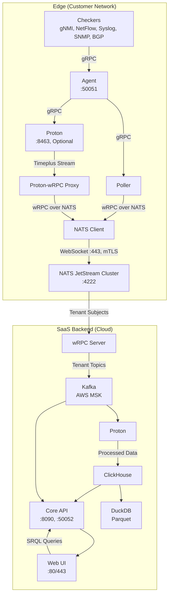

# ServiceRadar with wRPC, NATS JetStream, and Timeplus Proton Integration

## 1. Executive Summary

ServiceRadar is a distributed network monitoring system optimized for constrained environments, delivering real-time monitoring and cloud-based alerting for network engineering, IoT, WAN, cybersecurity, and OT audiences. This document outlines a new architecture that integrates wRPC (WIT-RPC), NATS JetStream, and Timeplus Proton to enhance ServiceRadar's capabilities. The architecture retains the gRPC-based checker/poller model for edge data collection, adopts wRPC over NATS JetStream for structured edge-to-cloud communication, and uses Proton for real-time stream processing of high-volume telemetry.

Key enhancements include:

- **wRPC Integration**: Leverages WebAssembly Interface Types (WIT) for transport-agnostic RPC, enabling structured communication (e.g., checker results, poller-to-core) over NATS JetStream with multiplexing.
- **NATS JetStream Transport**: Provides messaging for wRPC calls and Proton streams, with WebSocket tunneling to minimize firewall changes.
- **Proton Stream Processing**: Processes telemetry at the edge, using a custom proxy to bridge Timeplus external streams to wRPC over NATS.
- **Enhanced SRQL**: Extends ServiceRadar Query Language (SRQL) with streaming constructs (e.g., time windows, JOINs).
- **Multi-Tenant SaaS**: Ensures strict data isolation (e.g., PepsiCo vs. Coca-Cola) using NATS accounts and Kafka topics.
- **Zero-Trust Security**: Uses SPIFFE/SPIRE mTLS for all communications, with one-way edge-to-cloud data flow.
- **Lightweight Edge**: Minimizes footprint (~111MB without Proton, ~611MB with Proton).

This positions ServiceRadar as a competitive Network Monitoring System (NMS), blending SolarWinds' enterprise features with Nagios' lightweight, open-source ethos.

## 2. Objectives

- **Real-Time Stream Processing**: Enable edge processing of gNMI, NetFlow, syslog, SNMP traps, and BGP using Proton.
- **wRPC Communication**: Use wRPC over NATS JetStream for structured RPC (checker results, poller-to-core), leveraging WIT for flexibility.
- **NATS JetStream Messaging**: Handle wRPC calls, Proton streams, and KV storage, with tenant isolation via NATS accounts.
- **Proton Integration**: Bridge Proton's Timeplus external stream to wRPC over NATS using a custom proxy.
- **Enhanced SRQL**: Support streaming queries with time windows, aggregations, and JOINs.
- **Lightweight Edge**: Maintain minimal footprint for constrained devices.
- **One-Way Data Flow**: Enforce edge-to-cloud communication without cloud-initiated connections.
- **Zero-Trust Security**: Use SPIFFE/SPIRE mTLS and JWT-based UI authentication.
- **Historical Analytics**: Store data in ClickHouse (90-day retention) with Parquet/DuckDB for archival.
- **Scalable SaaS**: Support 1,000+ tenants and 10,000 nodes per customer.
- **Competitive Positioning**: Differentiate from SolarWinds (cost, flexibility) and Nagios (real-time, usability).

## 3. Target Audience

- **Network Engineers**: Need real-time gNMI/BGP analytics (e.g., latency, route flaps) and SNMP trap correlation.
- **IoT/OT Teams**: Require lightweight edge processing for device telemetry and anomaly detection.
- **Cybersecurity Teams**: Demand real-time threat detection (e.g., BGP hijacks, syslog attacks).
- **WAN Operators**: Seek traffic optimization (e.g., NetFlow, ECMP) and topology-aware monitoring.
- **SaaS Customers**: Expect secure, isolated data handling.

## 4. Current State

### Architecture

- **Agent**: Runs on monitored hosts (:50051, gRPC), collects data via checkers (SNMP, rperf, Dusk), reports to pollers.
- **Poller**: Queries agents (:50053, gRPC), aggregates data, communicates with core (:50052, gRPC).
- **Core Service**: Processes reports, provides API (:8090, HTTP; :50052, gRPC), triggers alerts.
- **Web UI**: Next.js (:3000, proxied via Nginx :80/443), secured with API key and JWT.
- **KV Store**: NATS JetStream (:4222, mTLS-secured), accessed via serviceradar-kv (:50057, gRPC).
- **Sync Service**: Integrates NetBox/Armis (:50058, gRPC), updates KV store.
- **Checkers**: SNMP (:50080), rperf (:50081), Dusk (:50082), SysMon (:50083), gRPC-based.

### Security

- **mTLS**: SPIFFE/SPIRE secures gRPC and NATS, certificates in /etc/serviceradar/certs/.
- **JWT Authentication**: Web UI uses JWTs (admin, operator, readonly roles).
- **API Key**: Secures Web UI-to-Core API.
- **NATS Security**: mTLS and RBAC for JetStream buckets.

### Data Sources

- **Supported**: SNMP, ICMP, rperf, sysinfo, Dusk.
- **Planned**: gNMI, NetFlow, syslog, SNMP traps, BGP (OpenBMP replacement).

### SRQL

- ANTLR-based DSL (SHOW/FIND/COUNT for devices, flows, traps, logs, connections).
- Translates to ClickHouse/ArangoDB, lacks streaming support.

### Limitations

- No edge stream processing for gNMI, NetFlow, BGP.
- SRQL lacks streaming constructs (WINDOW, HAVING).
- gRPC poller-to-core requires open ports, complicating far-reaching networks.
- Limited tenant isolation in SaaS.
- Proton's Timeplus external stream only supports Timeplus-to-Timeplus communication, not generic gRPC or NATS.

## 5. Requirements

### 5.1 Functional Requirements

#### Edge Processing with Proton

- Deploy Proton (~500MB, optional) on agents for gNMI, NetFlow, syslog, SNMP traps, BGP.
- Ingest data via gRPC (:8463, mTLS-secured).
- Support streaming SQL with tumbling windows, materialized views, JOINs.
- Push results to Proton-wRPC Proxy via Timeplus external stream.

Example:
```sql
CREATE STREAM gnmi_stream (
  timestamp DateTime,
  device String,
  metric String,
  value Float32
) SETTINGS type='grpc';

CREATE MATERIALIZED VIEW gnmi_anomalies AS
SELECT window_start, device, metric, avg(value) AS avg_value
FROM tumble(gnmi_stream, 1m, watermark=10s)
WHERE metric = 'latency'
GROUP BY window_start, device, metric
HAVING avg_value > 100;

CREATE EXTERNAL STREAM cloud_sink
SETTINGS type='timeplus', hosts='localhost:8463', stream='gnmi_anomalies', secure=false;

INSERT INTO cloud_sink
SELECT window_start, device, metric, avg_value
FROM gnmi_anomalies;
```

#### Proton-wRPC Proxy

- Develop a lightweight (~10MB) Rust service acting as a Timeplus server to receive Proton's external stream and invoke wRPC over NATS JetStream.
- Listen on localhost:8463 (no mTLS needed locally).
- Use wRPC Rust bindings to publish to tenant-specific subjects (e.g., serviceradar.<tenant_id>.proton.gnmi).

Example (Rust pseudocode):
```rust
use wrpc_runtime_wasmtime::Client;
use tonic::{Request, Response, Status};
use timeplus::external_stream_server::{ExternalStream, ExternalStreamServer};

struct Proxy {
    wrpc: Client,
    tenant_id: String,
}

#[tonic::async_trait]
impl ExternalStream for Proxy {
    async fn stream_data(
        &self,
        request: Request<tonic::Streaming<Data>>,
    ) -> Result<Response<()>, Status> {
        let mut stream = request.into_inner();
        while let Some(data) = stream.message().await? {
            self.wrpc.invoke(
                "proton",
                "publish",
                format!("serviceradar.{}.proton.gnmi", self.tenant_id),
                data.payload,
            ).await?;
        }
        Ok(Response::new(()))
    }
}
```

#### wRPC Communication

- Use wRPC over NATS JetStream for:
    - Poller-to-core checker results (replacing gRPC).
    - Proton-to-core streams (via Proton-wRPC Proxy).
- Implement wRPC Rust bindings (per wRPC docs) for structured RPC calls.
- Define WIT interfaces for checker and Proton data.

Example WIT (checker.wit):
```wit
interface checker {
    record result {
        device: string,
        metric: string,
        value: f32,
        timestamp: datetime,
    }
    publish: func(subject: string, data: result) -> result<unit, string>;
}
```

Example wRPC call (Rust):
```rust
use wrpc_runtime_wasmtime::Client;

async fn publish_checker_result(client: &Client, result: CheckerResult) {
    client.invoke("checker", "publish", result).await.unwrap();
}
```

#### NATS JetStream Transport

- Use NATS JetStream for wRPC calls, Proton streams, and KV store.
- Edge NATS clients (~1MB) connect to cloud NATS JetStream via WebSocket (:443, mTLS-secured).
- Subjects: serviceradar.<tenant_id>.checker.results, serviceradar.<tenant_id>.proton.<stream_name>.

Example NATS config:
```
listen: 0.0.0.0:4222
websocket {
    port: 443
    tls {
        cert_file: "/etc/serviceradar/certs/nats.pem"
        key_file: "/etc/serviceradar/certs/nats-key.pem"
    }
}
jetstream {
    store_dir: /var/lib/nats/jetstream
    max_memory_store: 1G
    max_file_store: 10G
}
accounts {
    pepsico {
        users: [{user: pepsico_user, password: "<secret>"}]
        jetstream: enabled
        exports: [{stream: "serviceradar.pepsico.>"}]
        imports: [{stream: {account: pepsico, subject: "serviceradar.pepsico.>"}}]
    }
}
```

#### SRQL Enhancements

- Add WINDOW <duration> [TUMBLE|HOP|SESSION], HAVING, STREAM, JOIN.
- Translate to Proton SQL (real-time) or ClickHouse SQL (historical).

Example:
```
SRQL: STREAM logs WHERE message CONTAINS 'Failed password for root' GROUP BY device WINDOW 5m HAVING login_attempts >= 5

Proton SQL:
SELECT window_start, device, count(*) AS login_attempts
FROM tumble(syslog_stream, 5m, watermark=5s)
WHERE message LIKE '%Failed password for root%'
GROUP BY window_start, device
HAVING login_attempts >= 5;
```

#### SaaS Backend

- **NATS JetStream Cluster**: Multi-tenant, cloud-hosted (AWS EC2).
- **wRPC Server**: Handles wRPC calls, writes to Kafka/ClickHouse.
- **Kafka**: Multi-tenant (AWS MSK), tenant-specific topics (e.g., pepsico_gnmi).
- **Proton (Cloud)**: Processes Kafka streams for analytics.
- **ClickHouse**: Historical storage (90-day retention).
- **DuckDB**: Parquet archival.
- **Core API**: gRPC (:50052), HTTP (:8090), SRQL translation.
- **Web UI**: Next.js (:3000, proxied via Nginx :80/443).

#### One-Way Data Flow

- Edge NATS clients push wRPC calls and Proton streams to cloud NATS JetStream.
- No cloud-to-edge communication.

Example wRPC call:
```rust
client.invoke("checker", "publish", "serviceradar.pepsico.checker.results", data).await?;
```

#### Tenant Isolation

- NATS accounts segregate tenant data (e.g., serviceradar.pepsico.*).
- Tenant-specific Kafka topics and ClickHouse tables.

Example NATS account:
```
accounts {
    pepsico {
        users: [{user: pepsico_user, password: "<secret>"}]
        jetstream: enabled
        exports: [{stream: "serviceradar.pepsico.>"}]
    }
}
```

#### Data Sources

- gNMI, NetFlow, syslog, SNMP traps, BGP (OpenBMP replacement).
- Ingest via gRPC, normalize to JSON.

Example (BGP):
```sql
CREATE STREAM bgp_updates (
  timestamp DateTime,
  peer String,
  prefix String,
  action String
) SETTINGS type='grpc';
```

#### Historical Storage

- ClickHouse: 90-day retention.
- Parquet via DuckDB for archival.

Example:
```sql
CREATE EXTERNAL TABLE ch_bgp_flaps
SETTINGS type='clickhouse', address='clickhouse:9000', table='bgp_flaps';

INSERT INTO ch_bgp_flaps
SELECT window_start, prefix, count(*) AS flap_count
FROM tumble(bgp_updates, 5m)
GROUP BY window_start, prefix
HAVING flap_count > 10;
```

#### Use Cases

- **gNMI Aggregation**:
  ```
  STREAM devices WHERE metric = 'latency' GROUP BY device, metric WINDOW 1m HAVING avg_value > 100
  ```
- **NetFlow Traffic Analysis**:
  ```
  STREAM netflow WHERE bytes > 0 GROUP BY application WINDOW 5m ORDER BY sum(bytes) DESC LIMIT 10
  ```
- **Syslog Threat Detection**:
  ```
  STREAM logs WHERE message CONTAINS 'Failed password for root' GROUP BY device WINDOW 5m HAVING login_attempts >= 5
  ```
- **BGP Flap Detection**:
  ```
  STREAM flows WHERE action IN ('announce', 'withdraw') GROUP BY prefix WINDOW 5m HAVING flap_count > 10
  ```

### 5.2 Non-Functional Requirements

#### Performance
- Process 1M gNMI events/sec on edge (1 vCPU, 0.5GB RAM).
- <1s SRQL query latency.
- Support 10,000 nodes/customer.

#### Scalability
- Multi-tenant NATS JetStream and Kafka for 1,000+ customers.
- Horizontal scaling for Proton, NATS, wRPC servers.

#### Reliability
- 99.9% SaaS uptime.
- Buffer edge data (Proton WAL, NATS JetStream persistence).

#### Security
- SPIFFE/SPIRE mTLS for wRPC, NATS, gRPC.
- JWT-based RBAC (admin, operator, readonly).
- One-way data flow.
- NATS accounts and Kafka ACLs for tenant isolation.

#### Usability
- 90% SRQL queries without support.
- Responsive Web UI on mobile/desktop.

#### Compatibility
- Debian/Ubuntu, RHEL/Oracle Linux.
- Integrates with gRPC checker/poller model.

## 6. Architecture

### 6.1 Edge (Customer Network)

#### Components
- **Checkers**: Collect gNMI, NetFlow, syslog, SNMP traps, BGP (:50080–:50083, gRPC).
- **Agent**: Queries checkers (:50051, gRPC), forwards to poller.
- **Proton (Optional)**: Processes streams, pushes to Proton-wRPC Proxy (:8463).
- **Proton-wRPC Proxy**: Bridges Timeplus external stream to wRPC over NATS (~10MB).
- **Poller**: Collects checker results, invokes wRPC over NATS (:50053, gRPC internally).
- **NATS Client**: Handles wRPC calls and Proton streams (~1MB).

#### Installation
```bash
curl -LO https://install.timeplus.com/oss -O serviceradar-agent.deb
sudo dpkg -i serviceradar-agent.deb
sudo ./install-oss.sh
```

#### Resources
- Without Proton: ~111MB (Agent ~100MB, Proxy ~10MB, NATS Client ~1MB).
- With Proton: ~611MB (Proton ~500MB).
- Minimum: 1 vCPU, 0.5GB RAM.

#### Data Flow
- Checkers → Agent (gRPC) → Poller (gRPC) → NATS Client (wRPC over NATS) → Cloud NATS JetStream.
- Checkers → Agent → Proton (gRPC) → Proton-wRPC Proxy (Timeplus stream) → NATS Client (wRPC over NATS) → Cloud NATS JetStream.

#### Security
- mTLS (SPIFFE/SPIRE) for gRPC, wRPC, NATS.
- No cloud-to-edge connections.
- Certificates: /etc/serviceradar/certs/.

### 6.2 SaaS Backend (Cloud)

#### Components
- **NATS JetStream Cluster**: Multi-tenant, receives wRPC calls and streams (:4222, :443 WebSocket).
- **wRPC Server**: Processes wRPC calls, writes to Kafka/ClickHouse.
- **Kafka**: Multi-tenant (AWS MSK), tenant-specific topics.
- **Proton (Cloud)**: Processes Kafka streams.
- **ClickHouse**: Historical storage.
- **DuckDB**: Parquet archival.
- **Core API**: gRPC (:50052), HTTP (:8090).
- **Web UI**: Next.js (:3000, proxied via Nginx :80/443).

#### Data Flow
NATS JetStream → wRPC Server → Kafka → Proton (cloud) → ClickHouse → Core API → Web UI.

#### Security
- mTLS for wRPC, NATS, gRPC.
- JWT-based RBAC.
- NATS accounts and Kafka ACLs.

### 6.3 Diagram


## 7. Enhanced SRQL Syntax

| Clause | Syntax | Description | Example |
|--------|--------|-------------|---------|
| STREAM | STREAM <entity> | Real-time query | STREAM logs ... |
| FROM | FROM <entity> | Entity (devices, flows, logs, traps) | FROM netflow |
| WHERE | WHERE <condition> | Filters (e.g., CONTAINS, IN) | WHERE message CONTAINS 'Failed password' |
| JOIN | JOIN <entity> ON <condition> | Correlates streams | JOIN logs ON src_ip = device |
| GROUP BY | GROUP BY <field>[, <field>] | Aggregates | GROUP BY device, metric |
| WINDOW | WINDOW <duration> [TUMBLE\|HOP\|SESSION] | Time windows | WINDOW 5m |
| HAVING | HAVING <aggregate_condition> | Filters aggregates | HAVING login_attempts >= 5 |
| ORDER BY | ORDER BY <field> [ASC\|DESC] | Sorts | ORDER BY bytes DESC |
| LIMIT | LIMIT <n> | Limits rows | LIMIT 10 |

## 8. User Experience

### Setup
- Install: `curl https://install.serviceradar.com/agent | sh`.
- Configure mTLS, NATS credentials via UI/CLI.

### Operation
- Checkers collect data, agents forward to pollers (gRPC).
- Optional Proton processes streams, pushes to Proton-wRPC Proxy.
- Pollers and Proxy use wRPC over NATS JetStream.
- Ultra-constrained devices skip Proton.

### Interaction
- Log into Web UI (JWT, admin/operator/readonly).
- Run SRQL queries (e.g., `STREAM flows WHERE action IN ('announce', 'withdraw') GROUP BY prefix WINDOW 5m HAVING flap_count > 10`).
- View dashboards (gNMI latency, BGP hijacks).
- Configure alerts (e.g., "notify on 5 failed logins").
- Query historical trends (30-day NetFlow, 90-day BGP).

### Configuration
- Enable/disable Proton via UI.
- Define SRQL alerts, dashboards.
- Manage mTLS, NATS accounts, RBAC.

## 9. Success Metrics

- **Performance**:
    - 1M gNMI events/sec on edge.
    - <1s SRQL query latency.
    - 10,000 nodes/customer.
- **Adoption**:
    - 80% customers enable Proton.
    - 1,000 SaaS tenants in 12 months.
- **Usability**:
    - 90% SRQL queries without support.
    - 95% UI satisfaction.
- **Security**:
    - Zero mTLS breaches.
    - 100% tenant isolation compliance.
- **Revenue**:
    - $10M ARR in 24 months.

## 10. Risks and Mitigations

- **Risk**: Proton's 500MB footprint too heavy.  
  **Mitigation**: Optional Proton, fallback to checkers (~111MB).

- **Risk**: Proton-wRPC Proxy complexity.  
  **Mitigation**: Lightweight (~10MB) proxy, test with gNMI/NetFlow.

- **Risk**: wRPC learning curve.  
  **Mitigation**: Use Rust bindings, leverage wRPC examples (e.g., hello example).

- **Risk**: WebSocket latency.  
  **Mitigation**: Benchmark Nginx proxy, fallback to NATS port (:4222).

- **Risk**: NATS account misconfiguration.  
  **Mitigation**: Automate account creation, audit access.

## 11. Timeline

- **Month 1: SRQL and Proxy (Jun 2025)**:
    - Extend SRQL grammar.
    - Develop Proton-wRPC Proxy.

- **Month 2: wRPC Integration (Jul 2025)**:
    - Implement wRPC for poller-to-core.
    - Test gNMI/BGP with Proxy.

- **Month 3-4: NATS and SaaS (Aug–Sep 2025)**:
    - Deploy NATS JetStream with tenant accounts.
    - Enhance UI for SRQL and dashboards.

- **Month 5-7: Optimization (Oct–Dec 2025)**:
    - Validate Proton performance (1M events/sec).
    - Harden mTLS and NATS accounts.

- **Month 8: Beta (Jan 2026)**:
    - Onboard 50 customers.
    - Gather feedback on SRQL, UI.

## 12. Future Considerations

- **WASMCloud**: Customer-defined edge processing.
- **Proton Enterprise**: Advanced sinks (Slack, Redpanda).
- **AI/ML**: Predictive anomaly detection.
- **Additional Sources**: sFlow, IPFIX.

## 13. Appendix

### 13.1 SRQL Examples

- **gNMI Aggregation**:
  ```
  STREAM devices WHERE metric = 'latency' GROUP BY device, metric WINDOW 1m HAVING avg_value > 100
  ```

- **Syslog Threat Detection**:
  ```
  STREAM logs WHERE message CONTAINS 'Failed password for root' GROUP BY device WINDOW 5m HAVING login_attempts >= 5
  ```

### 13.2 Security Configuration

- **mTLS**: `/etc/serviceradar/certs/{agent,proton,nats}.pem`.
- **JWT RBAC**: Roles (admin, operator, readonly) in `/etc/serviceradar/core.json`.

### 13.3 References

- wRPC: [github.com/bytecodealliance/wrpc](https://github.com/bytecodealliance/wrpc)
- NATS JetStream: [nats.io](https://nats.io)
- Timeplus Proton: [docs.timeplus.com](https://docs.timeplus.com)
- SPIFFE/SPIRE: [spiffe.io](https://spiffe.io)