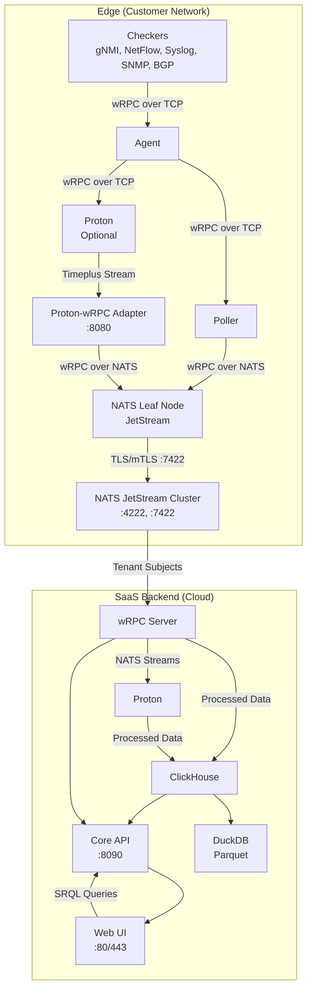

# ServiceRadar with Multi-Transport wRPC, NATS JetStream, and Timeplus Proton Integration

## 1. Executive Summary

ServiceRadar is a distributed network monitoring system optimized for constrained environments, delivering real-time monitoring and cloud-based alerting for network engineering, IoT, WAN, cybersecurity, and OT audiences. This PRD outlines a new architecture that integrates wRPC (WebAssembly Interface Types RPC) with multiple transport options, NATS JetStream with leaf nodes, and Timeplus Proton to enhance ServiceRadar's capabilities.

The architecture:
- Retains the pull-based gRPC checker-agent-poller model locally
- Adopts wRPC over TCP for local communication
- Uses wRPC over NATS for edge-to-cloud communication
- Leverages Proton for real-time edge stream processing

### Key Enhancements

#### Transport-Agnostic wRPC
- Leverages WebAssembly Interface Types (WIT) for structured, type-safe RPC with:
    - **TCP Transport**: For local checker-to-agent and agent-to-poller communication, preserving the pull model
    - **NATS Transport**: For edge-to-cloud communication (poller-to-core, Proton-to-core), enabling tenant isolation and firewall traversal via a single WebSocket tunnel

#### NATS JetStream Leaf Nodes
- Local NATS instances at the edge connect to the cloud NATS cluster, providing:
    - Local messaging and persistence during cloud disconnections
    - Store-and-forward capabilities with JetStream
    - Single-account connection for tenant isolation
    - Stream mirroring between edge and cloud

#### Proton Stream Processing
- Processes high-volume telemetry (gNMI, NetFlow, syslog, SNMP traps, BGP) at the edge
- **Proton-wRPC Adapter**: Lightweight (~5MB) adapter bridging Proton's Timeplus external streams to wRPC over NATS, sharing the same tunnel as other components
- **Enhanced SRQL**: Extends ServiceRadar Query Language (SRQL) with streaming constructs (e.g., time windows, JOINs)

#### Future WebAssembly Considerations
- **Current Limitations**: WebAssembly System Interface (WASI) currently lacks raw socket support, which is required by many ServiceRadar checkers
- **Implementation Status**: The WASI sockets proposal (https://github.com/WebAssembly/wasi-sockets) focuses on TCP/UDP sockets but doesn't yet support raw sockets
- **Future Potential**: Once WASI adds raw socket support, we can revisit WebAssembly-based orchestration and deployment options

#### Additional Features
- **Multi-Tenant SaaS**: Ensures strict data isolation (e.g., PepsiCo vs. Coca-Cola) using NATS accounts and tenant-specific streams
- **Zero-Trust Security**: Uses SPIFFE/SPIRE mTLS for all communications, with one-way edge-to-cloud data flow
- **Lightweight Edge**: Minimizes footprint (~116MB without Proton, ~616MB with Proton)

This architecture positions ServiceRadar as a competitive Network Monitoring System (NMS), blending SolarWinds' enterprise features with Nagios' lightweight, open-source ethos, while setting the stage for innovative WebAssembly-driven capabilities.

## 2. Objectives

- **Transport-Agnostic wRPC**: Implement wRPC with TCP for local pull-based communication and NATS for edge-to-cloud communication, leveraging WIT for modularity, type safety, and WebAssembly compatibility
- **Real-Time Stream Processing**: Enable edge processing of gNMI, NetFlow, syslog, SNMP traps, and BGP using Proton
- **NATS JetStream Messaging**: Use leaf nodes for local persistence and edge-to-cloud communication, with tenant isolation via NATS accounts
- **Proton Integration**: Bridge Proton's Timeplus external streams to wRPC over NATS using a lightweight adapter
- **Enhanced SRQL**: Support streaming queries with time windows, aggregations, and JOINs
- **Lightweight Edge**: Maintain minimal footprint (~116MB without Proton) for constrained devices
- **One-Way Data Flow**: Enforce edge-to-cloud communication without cloud-initiated connections
- **Zero-Trust Security**: Use SPIFFE/SPIRE mTLS and JWT-based UI authentication
- **Historical Analytics**: Store data in ClickHouse (90-day retention) with Parquet/DuckDB for archival
- **Scalable SaaS**: Support 1,000+ tenants and 10,000 nodes per customer
- **Future WebAssembly Readiness**: Monitor WASI sockets proposal development for eventual raw socket support, which would enable WebAssembly-based checkers
- **Competitive Positioning**: Differentiate from SolarWinds (cost, flexibility) and Nagios (real-time, usability)

## 3. Target Audience

- **Network Engineers**: Need real-time gNMI/BGP analytics (e.g., latency, route flaps) and SNMP trap correlation
- **IoT/OT Teams**: Require lightweight edge processing for device telemetry and anomaly detection
- **Cybersecurity Teams**: Demand real-time threat detection (e.g., BGP hijacks, syslog attacks)
- **WAN Operators**: Seek traffic optimization (e.g., NetFlow, ECMP) and topology-aware monitoring
- **SaaS Customers**: Expect secure, isolated data handling

## 4. Current State

### Architecture

- **Agent**: Runs on monitored hosts (:50051, gRPC), collects data via checkers (SNMP, rperf, Dusk), reports to pollers
- **Poller**: Queries agents (:50053, gRPC), aggregates data, communicates with core (:50052, gRPC)
- **Core Service**: Processes reports, provides API (:8090, HTTP; :50052, gRPC), triggers alerts
- **Web UI**: Next.js (:3000, proxied via Nginx :80/443), secured with API key and JWT
- **KV Store**: NATS JetStream (:4222, mTLS-secured), accessed via serviceradar-kv (:50057, gRPC)
- **Sync Service**: Integrates NetBox/Armis (:50058, gRPC), updates KV store
- **Checkers**: SNMP (:50080), rperf (:50081), Dusk (:50082), SysMon (:50083), gRPC-based

### Security

- **mTLS**: SPIFFE/SPIRE secures gRPC and NATS, certificates in /etc/serviceradar/certs/
- **JWT Authentication**: Web UI uses JWTs (admin, operator, readonly roles)
- **API Key**: Secures Web UI-to-Core API
- **NATS Security**: mTLS and RBAC for JetStream buckets

### Data Sources

- **Supported**: SNMP, ICMP, rperf, sysinfo, Dusk
- **Planned**: gNMI, NetFlow, syslog, SNMP traps, BGP (OpenBMP replacement)

### SRQL

- ANTLR-based DSL (SHOW/FIND/COUNT for devices, flows, traps, logs, connections)
- Translates to ClickHouse/ArangoDB, lacks streaming support

### Limitations

- No edge stream processing for gNMI, NetFlow, BGP
- SRQL lacks streaming constructs (WINDOW, HAVING)
- gRPC poller-to-core requires open ports, complicating far-reaching networks
- Limited tenant isolation in SaaS
- Proton's Timeplus external stream only supports Timeplus-to-Timeplus communication, requiring a custom adapter

## 5. Requirements

### 5.1 Functional Requirements

#### Transport-Agnostic wRPC

- Implement wRPC with:
    - **TCP Transport**: For local checker-to-agent and agent-to-poller communication, preserving the pull model
    - **NATS Transport**: For edge-to-cloud poller-to-core and Proton-to-core communication, using a single WebSocket tunnel (:443)

- Define WIT interfaces for checker, Proton, and core interactions, enabling type-safe, modular RPC.

**Example WIT (checker.wit)**:
```
interface checker {
  record result {
    device: string,
    metric: string,
    value: f32,
    timestamp: datetime,
  }
  get-status: func() -> result<result, string>;
  publish: func(subject: string, data: result) -> result<unit, string>;
}
```

**Example wRPC call (Rust, TCP)**:
```rust
use wrpc_runtime_wasmcloud::Client;
use wrpc_transport_tcp::TcpTransport;

async fn get_checker_status(address: &str) -> Result<CheckerResult, String> {
  let transport = TcpTransport::connect(address).await?;
  let client = Client::new(transport);
  client.invoke("checker", "get-status", ()).await
}
```

**Example wRPC call (Rust, NATS)**:
```rust
use wrpc_runtime_wasmcloud::Client;
use wrpc_transport_nats::NatsTransport;

async fn send_to_core(nats: &NatsTransport, tenant_id: &str, data: CheckerResult) -> Result<(), String> {
  let client = Client::new(nats.clone());
  let subject = format!("serviceradar.{}.checker.results", tenant_id);
  client.invoke("checker", "publish", (subject, data)).await
}
```

#### Edge Processing with Proton

- Deploy Proton (~500MB, optional) on agents for gNMI, NetFlow, syslog, SNMP traps, BGP
- Ingest data via wRPC over TCP (local) or gRPC (:8463, mTLS-secured)
- Support streaming SQL with tumbling windows, materialized views, JOINs
- Push results to Proton-wRPC Adapter via Timeplus external stream

**Example**:
```sql
CREATE STREAM gnmi_stream (
  timestamp DateTime,
  device String,
  metric String,
  value Float32
) SETTINGS type='grpc';

CREATE MATERIALIZED VIEW gnmi_anomalies AS
SELECT window_start, device, metric, avg(value) AS avg_value
FROM tumble(gnmi_stream, 1m, watermark=10s)
WHERE metric = 'latency'
GROUP BY window_start, device, metric
HAVING avg_value > 100;

CREATE EXTERNAL STREAM cloud_sink
SETTINGS type='timeplus', hosts='localhost:8080', stream='gnmi_anomalies', secure=false;

INSERT INTO cloud_sink
SELECT window_start, device, metric, avg_value
FROM gnmi_anomalies;
```

#### Proton-wRPC Adapter

- Develop a lightweight (~5MB) Rust service acting as a Timeplus server
- Listen on localhost:8080 (no mTLS needed locally)
- Translate Timeplus external streams to wRPC calls over NATS, using the same NATS Leaf Node as pollers
- Integrate with WasmCloud for automated deployment and scaling

**Example (Rust pseudocode)**:
```rust
use wrpc_runtime_wasmcloud::Client;
use tonic::{Request, Response, Status};
use timeplus::external_stream_server::{ExternalStream, ExternalStreamServer};

struct ProtonAdapter {
  wrpc: Client,
  tenant_id: String,
}

#[tonic::async_trait]
impl ExternalStream for ProtonAdapter {
  async fn stream_data(
    &self,
    request: Request<tonic::Streaming<Data>>,
  ) -> Result<Response<()>, Status> {
    let mut stream = request.into_inner();
    while let Some(data) = stream.message().await? {
      self.wrpc.invoke(
        "proton",
        "publish",
        format!("serviceradar.{}.proton.gnmi", self.tenant_id),
        data.payload,
      ).await?;
    }
    Ok(Response::new(()))
  }
}
```

#### NATS JetStream Leaf Nodes

- Deploy NATS Leaf Nodes (~5MB) on edge devices, connecting to the cloud NATS cluster via TLS/mTLS (:7422)
- Enable local JetStream for store-and-forward during cloud disconnections
- Support stream mirroring between edge and cloud
- Use tenant-specific subjects: serviceradar.<tenant_id>.checker.results, serviceradar.<tenant_id>.proton.<stream_name>

**Example Edge NATS Leaf Node Config**:
```
listen: 127.0.0.1:4222
leafnodes {
  remotes = [
    {
      url: "tls://nats.serviceradar.cloud:7422"
      credentials: "/etc/serviceradar/certs/tenant123.creds"
    }
  ]
}
jetstream {
  store_dir: /var/lib/nats/jetstream
  max_memory_store: 256M
  max_file_store: 2G
}
```

**Example Cloud NATS Config**:
```
listen: 0.0.0.0:4222
leafnodes {
  port: 7422
  tls {
    cert_file: "/etc/serviceradar/certs/nats.pem"
    key_file: "/etc/serviceradar/certs/nats-key.pem"
    ca_file: "/etc/serviceradar/certs/root.pem"
    verify: true
  }
}
jetstream {
  store_dir: /var/lib/nats/jetstream
  max_memory_store: 8G
  max_file_store: 100G
}
accounts {
  pepsico {
    users: [{user: pepsico_user, password: "<secret>"}]
    jetstream: enabled
    exports: [{stream: "serviceradar.pepsico.>"}]
    imports: [{stream: {account: pepsico, subject: "serviceradar.pepsico.>"}}]
  }
}
```

#### SRQL Enhancements

- Add WINDOW <duration> [TUMBLE|HOP|SESSION], HAVING, STREAM, JOIN
- Translate to Proton SQL (real-time) or ClickHouse SQL (historical)

**Example**:
```
SRQL: STREAM logs WHERE message CONTAINS 'Failed password for root' GROUP BY device WINDOW 5m HAVING login_attempts >= 5

Proton SQL:
SELECT window_start, device, count(*) AS login_attempts
FROM tumble(syslog_stream, 5m, watermark=5s)
WHERE message LIKE '%Failed password for root%'
GROUP BY window_start, device
HAVING login_attempts >= 5;
```

#### SaaS Backend

- **NATS JetStream Cluster**: Multi-tenant, cloud-hosted (AWS EC2)
- **wRPC Server**: Processes wRPC calls, writes to ClickHouse or NATS streams
- **Proton (Cloud)**: Processes NATS streams for cross-customer analytics
- **ClickHouse**: Historical storage (90-day retention)
- **DuckDB**: Parquet archival
- **Core API**: HTTP (:8090), SRQL translation
- **Web UI**: Next.js (:3000, proxied via Nginx :80/443)

#### One-Way Data Flow

- Edge NATS Leaf Nodes initiate connections to cloud NATS JetStream (:7422)
- No cloud-to-edge communication

**Example wRPC call**:
```
client.invoke("checker", "publish", "serviceradar.pepsico.checker.results", data).await?;
```

#### Tenant Isolation

- NATS accounts segregate tenant data (e.g., serviceradar.pepsico.*)
- Tenant-specific NATS streams and ClickHouse tables

**Example NATS account**:
```
accounts {
  pepsico {
    users: [{user: pepsico_user, password: "<secret>"}]
    jetstream: enabled
    exports: [{stream: "serviceradar.pepsico.>"}]
  }
}
```

#### Data Sources

- gNMI, NetFlow, syslog, SNMP traps, BGP (OpenBMP replacement)
- Ingest via wRPC over TCP locally, forward via wRPC over NATS to cloud

**Example (BGP)**:
```sql
CREATE STREAM bgp_updates (
  timestamp DateTime,
  peer String,
  prefix String,
  action String
) SETTINGS type='grpc';
```

#### Historical Storage

- **ClickHouse**: 90-day retention, direct writes from wRPC server
- **Parquet via DuckDB** for archival

**Example**:
```sql
CREATE EXTERNAL TABLE ch_bgp_flaps
SETTINGS type='clickhouse', address='clickhouse:9000', table='bgp_flaps';

INSERT INTO ch_bgp_flaps
SELECT window_start, prefix, count(*) AS flap_count
FROM tumble(bgp_updates, 5m)
GROUP BY window_start, prefix
HAVING flap_count > 10;
```

#### Use Cases

**gNMI Aggregation**:
```
STREAM devices WHERE metric = 'latency' GROUP BY device, metric WINDOW 1m HAVING avg_value > 100
```

**NetFlow Traffic Analysis**:
```
STREAM netflow WHERE bytes > 0 GROUP BY application WINDOW 5m ORDER BY sum(bytes) DESC LIMIT 10
```

**Syslog Threat Detection**:
```
STREAM logs WHERE message CONTAINS 'Failed password for root' GROUP BY device WINDOW 5m HAVING login_attempts >= 5
```

**BGP Flap Detection**:
```
STREAM flows WHERE action IN ('announce', 'withdraw') GROUP BY prefix WINDOW 5m HAVING flap_count > 10
```

### 5.2 Non-Functional Requirements

#### Performance

- Process 1M gNMI events/sec on edge (1 vCPU, 0.5GB RAM)
- <1s SRQL query latency
- Support 10,000 nodes/customer

#### Scalability

- Multi-tenant NATS JetStream for 1,000+ customers
- Horizontal scaling for Proton, NATS, wRPC servers

#### Reliability

- 99.9% SaaS uptime
- Buffer edge data with NATS JetStream persistence
- Local operation during cloud disconnections via NATS Leaf Nodes

#### Security

- SPIFFE/SPIRE mTLS for wRPC (TCP/NATS), NATS Leaf Nodes
- JWT-based RBAC (admin, operator, readonly)
- One-way data flow
- NATS accounts for tenant isolation

#### Usability

- 90% SRQL queries without support
- Responsive Web UI on mobile/desktop

#### Compatibility

- Debian/Ubuntu, RHEL/Oracle Linux
- Preserves local pull model

## 6. Architecture

### 6.1 Edge (Customer Network)

#### Components

- **Checkers**: Collect gNMI, NetFlow, syslog, SNMP traps, BGP
- **Agent**: Queries checkers using wRPC over TCP, forwards to poller
- **Proton (Optional)**: Processes streams, pushes to Proton-wRPC Adapter
- **Proton-wRPC Adapter**: Lightweight (~5MB) service acting as a Timeplus server, translating streams to wRPC over NATS
- **Poller**: Collects data from agents using wRPC over TCP, forwards to cloud using wRPC over NATS
- **NATS Leaf Node**: Local NATS instance (~5MB) with JetStream for persistence, connecting to cloud NATS cluster

#### Installation

```bash
curl -LO https://install.serviceradar.com/agent | sh
sudo dpkg -i serviceradar-agent.deb
sudo ./install-oss.sh
```

#### Resources

- **Without Proton**: ~116MB (Agent ~100MB, NATS Leaf Node ~5MB, wRPC Plugins ~6MB, Proton-wRPC Adapter ~5MB)
- **With Proton**: ~616MB (Proton ~500MB)
- **Minimum**: 1 vCPU, 0.5GB RAM

#### Data Flow

- Checkers ↔ Agent (wRPC over TCP) ↔ Poller (wRPC over TCP) → NATS Leaf Node (wRPC over NATS) → Cloud NATS JetStream
- Proton → Proton-wRPC Adapter (Timeplus stream, localhost) → NATS Leaf Node (wRPC over NATS) → Cloud NATS JetStream

#### Security

- mTLS (SPIFFE/SPIRE) for wRPC (TCP/NATS), NATS Leaf Node
- No cloud-to-edge connections
- Certificates: /etc/serviceradar/certs/

### 6.2 SaaS Backend (Cloud)

#### Components

- **NATS JetStream Cluster**: Multi-tenant, receives wRPC calls (:4222, :7422 for leaf nodes)
- **wRPC Server**: Processes wRPC calls, writes to NATS streams/ClickHouse
- **Proton (Cloud)**: Processes NATS streams for analytics
- **ClickHouse**: Historical storage
- **DuckDB**: Parquet archival
- **Core API**: HTTP (:8090)
- **Web UI**: Next.js (:3000, proxied via Nginx :80/443)

#### Data Flow

NATS JetStream → wRPC Server → NATS Streams → Proton (cloud) → ClickHouse → Core API → Web UI

#### Security

- mTLS for NATS, wRPC
- JWT-based RBAC
- NATS accounts for tenant isolation

### 6.3 Diagram



## 7. Enhanced SRQL Syntax

| Clause | Syntax | Description | Example |
|--------|--------|-------------|---------|
| STREAM | STREAM \<entity\> | Real-time query | STREAM logs ... |
| FROM | FROM \<entity\> | Entity (devices, flows, logs, traps) | FROM netflow |
| WHERE | WHERE \<condition\> | Filters (e.g., CONTAINS, IN) | WHERE message CONTAINS 'Failed password' |
| JOIN | JOIN \<entity\> ON \<condition\> | Correlates streams | JOIN logs ON src_ip = device |
| GROUP BY | GROUP BY \<field\>[, \<field\>] | Aggregates | GROUP BY device, metric |
| WINDOW | WINDOW \<duration\> [TUMBLE\|HOP\|SESSION] | Time windows | WINDOW 5m |
| HAVING | HAVING \<aggregate_condition\> | Filters aggregates | HAVING login_attempts >= 5 |
| ORDER BY | ORDER BY \<field\> [ASC\|DESC] | Sorts | ORDER BY bytes DESC |
| LIMIT | LIMIT \<n\> | Limits rows | LIMIT 10 |

## 8. User Experience

### Setup

- **Install**: `curl https://install.serviceradar.com/agent | sh`
- **Configure**: mTLS, NATS credentials via UI/CLI
- **Auto-configure**: NATS Leaf Node for edge persistence

### Operation

- Checkers respond to agent polls (wRPC over TCP)
- Agents respond to poller polls (wRPC over TCP)
- Pollers and Proton-wRPC Adapter forward data via wRPC over NATS Leaf Node
- NATS JetStream buffers data during cloud disconnections
- Ultra-constrained devices skip Proton, use lightweight components (~116MB)

### Deployment and Scaling

- Configure component instances via configuration files
- Manual scaling through the UI or API
- Rolling updates for service components
- Deployment across multiple environments with identical configurations
- Service discovery and health monitoring for high availability

### Interaction

- Log into Web UI (JWT, admin/operator/readonly)
- Run SRQL queries (e.g., `STREAM flows WHERE action IN ('announce', 'withdraw') GROUP BY prefix WINDOW 5m HAVING flap_count > 10`)
- View dashboards (gNMI latency, BGP hijacks)
- Configure alerts (e.g., "notify on 5 failed logins")
- Query historical trends (30-day NetFlow, 90-day BGP)

### Configuration

- Enable/disable Proton via UI
- Define SRQL alerts, dashboards
- Manage mTLS, NATS accounts, RBAC
- Configure NATS Leaf Node (store limits, mirroring)

## 9. Success Metrics

### Performance
- 1M gNMI events/sec on edge
- <1s SRQL query latency
- 10,000 nodes/customer

### Adoption
- 80% customers enable Proton
- 1,000 SaaS tenants in 12 months

### Usability
- 90% SRQL queries without support
- 95% UI satisfaction

### Security
- Zero mTLS breaches
- 100% tenant isolation compliance

### Revenue
- $10M ARR in 24 months

## 10. Risks and Mitigations

| Risk | Mitigation |
|------|------------|
| wRPC multi-transport complexity | Implement TCP transport first, add NATS incrementally, unit test both |
| Proton's 500MB footprint too heavy | Optional Proton, fallback to checkers (~116MB) |
| NATS Leaf Node disconnections | Enable JetStream persistence, implement stream mirroring |
| Proton-wRPC Adapter complexity | Develop lightweight adapter, test with simplified protocol |
| wRPC learning curve | Use Rust bindings, leverage wRPC examples |
| NATS account misconfiguration | Automate account creation, audit access |
| Edge resource usage with NATS Leaf Nodes | Minimal configuration with bounded memory/storage (~5MB) |
| WebAssembly raw socket limitations | Monitor WASI sockets proposal (https://github.com/WebAssembly/wasi-sockets), revisit when raw socket support is added |

## 11. Future Considerations

The adoption of wRPC, NATS JetStream, and the WebAssembly Component Model positions ServiceRadar for innovative features that enhance performance, security, and flexibility. These future capabilities align with the evolving needs of IoT, OT, and enterprise customers, enabling lightweight, portable, and customer-extensible monitoring solutions.

### WebAssembly Integration (Pending WASI Sockets Development)

Currently, ServiceRadar checkers require raw socket access, which is not supported by WebAssembly System Interface (WASI). The WASI sockets proposal (https://github.com/WebAssembly/wasi-sockets) currently only addresses TCP and UDP sockets, not raw sockets needed for many network monitoring protocols. We will monitor the development of WASI and incorporate WebAssembly technologies when raw socket support becomes available.

Potential future capabilities once raw socket support is available:

### WebAssembly-Based Checkers

- Compile checkers (e.g., SNMP, rperf) to WebAssembly, providing smaller footprint and enhanced security
- Enable dynamic updates of checkers over NATS without service restarts

### Edge Data Processing

- Deploy WebAssembly components for lightweight data processing on constrained devices, complementing Proton
- Filter or pre-process telemetry data before transmission to reduce bandwidth and cloud processing needs

### Customer-Defined Components

- Allow customers to write WebAssembly components (e.g., proprietary analytics) using WIT interfaces
- Enable secure execution of customer code within ServiceRadar's environment

### Browser-Based Analytics

- Run WebAssembly components in the Web UI for client-side SRQL query processing or real-time visualizations
- Improve UI responsiveness and reduce server load for common queries

### WebAssembly-Based AI/ML

- Deploy WebAssembly-based AI/ML models for predictive analytics on edge or cloud
- Enable anomaly detection and predictive maintenance with minimal resource usage

These potential WebAssembly-driven features would reduce edge footprints, enhance security through sandboxing, enable customer extensibility, and support scalable, distributed architectures, aligning with ServiceRadar's long-term vision for IoT, OT, and enterprise monitoring.

In the meantime, we will proceed with native implementations that provide the necessary raw socket functionality while designing our architecture to facilitate WebAssembly integration when the technology matures.

## 12. Implementation Plan

### Phase 1: NATS Infrastructure (1 month)

- Deploy cloud NATS JetStream cluster with tenant accounts and mTLS
- Deploy and test NATS Leaf Nodes on edge devices
- Test stream mirroring and store-and-forward capabilities
- Verify resilience during cloud disconnections

### Phase 2: wRPC Integration (2 months)

- Implement wRPC with TCP transport for checker-to-agent and agent-to-poller communication
- Convert existing gRPC-based communications to wRPC over TCP
- Develop wRPC over NATS for poller-to-core communication
- Test end-to-end data flow with WIT interfaces

### Phase 3: Proton and Adapter Integration (2 months)

- Extend SRQL grammar with streaming constructs
- Develop Proton-wRPC Adapter for Timeplus external streams
- Integrate Proton with adapter, test data flow via NATS Leaf Node
- Validate full pipeline with gNMI/NetFlow workloads

### Phase 4: Multi-Tenant Isolation (1 month)

- Finalize tenant isolation with NATS accounts and streams
- Harden security with mTLS and RBAC
- Optimize performance for 1M events/sec

### Phase 5: Deployment and Management Framework (1.5 months)

- Develop deployment automation scripts
- Implement configuration management system
- Create administrative interfaces for component lifecycle management
- Test scaling and failover mechanisms

### Phase 6: Beta and Deployment (2 months)

- Onboard 50 beta customers
- Provide documentation and training
- Roll out to production

## 13. Appendix

### 13.1 SRQL Examples

**gNMI Aggregation**:
```
STREAM devices WHERE metric = 'latency' GROUP BY device, metric WINDOW 1m HAVING avg_value > 100
```

**Syslog Threat Detection**:
```
STREAM logs WHERE message CONTAINS 'Failed password for root' GROUP BY device WINDOW 5m HAVING login_attempts >= 5
```

### 13.2 Security Configuration

- mTLS: /etc/serviceradar/certs/{agent,proton,nats}.pem
- JWT RBAC: Roles (admin, operator, readonly) in /etc/serviceradar/core.json

### 13.3 References

- wRPC: github.com/bytecodealliance/wrpc
- NATS JetStream: nats.io
- Timeplus Proton: docs.timeplus.com
- SPIFFE/SPIRE: spiffe.io
- WebAssembly Component Model: component-model.bytecodealliance.org
- WASI Sockets Proposal: github.com/WebAssembly/wasi-sockets
