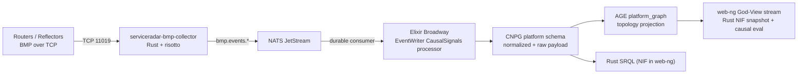

# Product Requirements Document (PRD): BGP/BMP Routing Intelligence Pipeline (Risotto + Broadway)

| Metadata | Value |
|----------|-------|
| Date     | 2026-02-18 |
| Author   | @mfreeman451 |
| Status   | Draft |
| Links    | https://github.com/carverauto/serviceradar/issues/2183, https://github.com/carverauto/serviceradar/issues/859, https://github.com/nxthdr/risotto |

## 1. Summary

ServiceRadar will implement a **Rust BMP collector** (risotto-based) that ingests BGP/BMP telemetry and publishes routing events to **NATS JetStream**. Normalization and persistence will be handled by an **Elixir Broadway consumer** in the core event pipeline, not by Zen.

The pipeline goal is not "force everything into a single schema at ingest time," but to preserve routing fidelity while producing a normalized causal envelope that is directly usable by:
- the **topology system** (AGE `platform_graph` + God-View projection), and
- the **causality system** (Rust NIF with `deep_causality*` crates used by `web-ng`).

OCSF alignment remains useful where it helps interoperability, but `OCSF_Activity` is **optional** for BMP routing data. The canonical requirement is: data is queryable, replay-safe, and structurally useful for topology and causal reasoning.

## 2. Problem Statement

ServiceRadar currently lacks a first-class routing-intelligence pipeline for control-plane events (BGP peer state, route churn, path changes). Without this pipeline we cannot reliably:
- correlate route changes with topology changes,
- explain blast radius in God-View with routing-aware evidence,
- separate physical failure from routing-policy/provider failure in causal analysis.

## 3. Goals

- Ingest BMP/BGP events via Rust risotto collector and publish to JetStream.
- Consume BMP events via Elixir Broadway in `serviceradar_core`.
- Normalize events into a causal envelope with replay-safe identity and provenance.
- Persist data in a model that supports SRQL, topology overlay updates, and causality evaluation.
- Integrate with AGE-authoritative topology and God-View atmosphere overlays.

## 4. Non-Goals

- Reintroducing Zen consumer/rule DSL for BMP normalization.
- Building a full BGP policy simulator in this phase.
- Requiring every routing signal to fit a single strict OCSF class if that harms fidelity.

## 5. High-Level Architecture

## 6. Functional Requirements

### 6.1 Collector and Transport

#### FR-1: BMP ingest
- Collector SHALL accept BMP sessions and decode common BMP message types (Peer Up/Down, Route Monitoring, Stats).
- Collector SHOULD use `nxthdr/risotto` as primary parser.

#### FR-2: Broker publication
- Collector SHALL publish decoded routing events to JetStream subjects under `bmp.events.*`.
- Message identity fields SHALL be stable enough for idempotent downstream processing.

#### FR-3: Reliability and security
- Collector SHALL support bounded buffering and clear drop/backpressure metrics.
- Collector-to-broker communication SHALL support mTLS consistent with ServiceRadar deployment patterns.

### 6.2 Elixir Broadway Normalization and Persistence

#### FR-4: Canonical ingestion path
- BMP routing events SHALL be consumed by Elixir Broadway (`serviceradar_core` EventWriter pipeline).
- Zen consumer SHALL NOT be used for BMP routing normalization.

#### FR-5: Normalized causal envelope
- Broadway processing SHALL normalize BMP events into a causal envelope including:
  - event identity (stable/replay-safe),
  - source provenance,
  - severity,
  - routing context (peer, ASN, prefix group where available),
  - event timestamp normalization.

#### FR-6: Storage strategy
- The database model SHALL preserve:
  - raw routing payload (for future remapping/replay),
  - normalized causal fields (for fast queries and overlays),
  - optional OCSF-compatible projection fields where useful.
- If `OCSF_Activity` is suitable for specific views, it MAY be used; it is not a hard coupling requirement.

### 6.3 Topology and Causality Integration

#### FR-7: AGE-authoritative topology join
- Causal overlay generation SHALL join against AGE-authoritative topology (`platform_graph`) instead of ad hoc UI identity heuristics.
- Topology adjacency SHALL remain relationship evidence, not identity equivalence proof.

#### FR-8: Deep causality evaluation path
- God-View causal classification SHALL continue to execute through the Rust NIF path (`deep_causality`, `deep_causality_sparse`, `deep_causality_tensor`, `deep_causality_topology`).
- High-rate BMP bursts SHALL update overlay state without forcing full coordinate/layout recomputation when topology revision is unchanged.

#### FR-9: Atmosphere layer behavior
- God-View atmosphere overlays SHALL expose routing-aware visual state transitions (root cause, affected, healthy, unknown) driven by causal bitmaps and explainability metadata.
- Overlay updates SHALL maintain stable topology coordinates across causal-only revision changes.

### 6.4 SRQL and Product UX

#### FR-10: Query support
- SRQL and backend APIs SHALL support queries for:
  - peer/session transitions over time,
  - route churn and update/withdraw trends,
  - routing-correlated causal events by node/prefix/peer context.

#### FR-11: Routing intelligence UX
- UI SHALL support operator workflows to inspect:
  - routing signal timelines,
  - affected topology regions,
  - causal reasoning details tied to routing events.

## 7. Data Model Requirements

- Every normalized routing event SHALL include correlation keys sufficient to map into topology/causal contexts (examples: device/peer identifiers, IPs, ASN context, prefix or prefix-group hints, source collector metadata).
- Ingestion SHALL remain idempotent under replay.
- Schema evolution SHALL permit adding richer routing context without destructive rewrites.

## 8. Milestones

1. Collector path: risotto collector publishes BMP events to JetStream (`bmp.events.*`).
2. Broadway path: causal processor consumes BMP subjects with durable replay/idempotency.
3. Persistence path: normalized + raw routing payload written to CNPG in queryable shape.
4. Integration path: causal overlays in God-View use AGE topology + NIF causal evaluation.
5. UX path: routing-intelligence panels and SRQL-backed workflows.

## 9. Risks and Mitigations

- **Schema overfitting risk**: forcing strict OCSF mapping can drop routing nuance.
  - Mitigation: keep raw payload + normalized causal envelope; project to OCSF where it adds value.
- **Burst load risk**: route storms can overwhelm overlay updates.
  - Mitigation: Broadway batching, bounded concurrency, coalescing windows, replay-safe ids.
- **Topology/correlation drift risk**: inconsistent ids degrade attribution.
  - Mitigation: AGE-authoritative topology, deterministic identity anchors, explicit correlation keys.

## 10. Open Questions

- Final subject taxonomy for BMP domains (`bmp.events.*` variants and partitioning).
- Which routing context fields should be mandatory at v1 vs optional enrichment.
- Which views should use strict OCSF projection vs native causal envelope fields.
